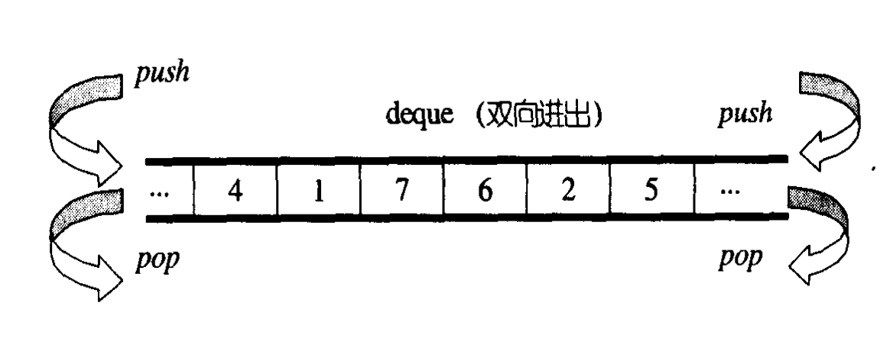
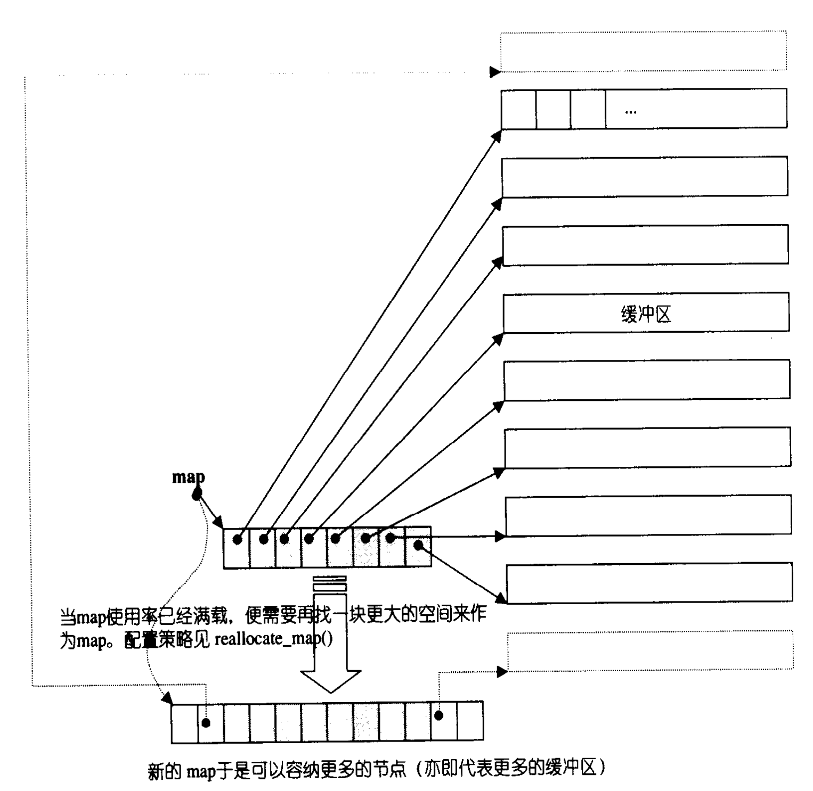

主要内容

1. deque 概述
2. deque中控器
3. deque的迭代器
4. deque的数据结构
5. deque的构造与内存管理
6. deque的元素操作

<!--more-->

## deque 概述

vector是单向开口的连续性空间，deque则是一种双向开口的连续性空间，所谓双向开口，意思是头尾两端分别做元素的插入和删除操作.



deque和vector的最大差异，一、在于deque允许常数时间内对起始头端进行元素的插入或移除操作。二、deque没有容量的概念，因为他是动态的以分段连续空间组合而成，随时可以增加一段空间并连接起来。换句话说，像vector那样“因旧空间不足而重新分配一块更大空间，然后复制元素，再释放旧空间”这样的事情在deque是不会发生的。也因此，deque没有必要提供所谓的空间保留功能。

虽然，deque也提供了random access iterator，但他的迭代器并不是普通指针。其复杂度和vector不可以道里计，这当然影响了各个运算层面，因此，除非必要，我们应该尽可能选择vector而非deque。对deque进行的排序操作，为了最高效率，可将deque先完整的复制到一个vector身上，将vector排序后，再复制回deque。

## deque中控器

deque是连续空间（至少逻辑上看如此），连续线性空间总令我们联想到array和vector。array无法生长，vector虽可以生长，却只能向尾端成长。而且其所为成长是个假象，事实上是：

1. 另觅更大空间
2. 将原数据赋值过去
3. 释放原空间

如果不是vector每次配置新空间时留下一些富裕，其成长假象所带来的代价相当昂贵。

deque系由一段一段的定量连续空间构成。一旦有必要在前端或者尾端增加新空间，便配置一段定量连续空间，串接在整个deque的头端或尾端。deque的最大任务，便是在这些分段的定量空间上，维护其整体连续的假象，并提供随机存取的接口。避开了“重新配置、复制、释放”的轮回，代价则是复制的带带器框架。

收到分段连续性空间的字面影响，我们可能以为，deque的实现复杂度和vector相比，虽不中亦不远矣，其实不然。主要以为，即曰分段连续线性空间，就必须有中央控制，为了维持整体连续的假象，数据结构的设计及迭代器前进后退操作都颇为繁琐。deque的实现代码分量远比vector或list多得多。

deque采用一块所谓map作为主控。这里所谓map是一小块连续空间，其中每个元素（此处层位一个节点，node）都是指针，指向另一段较大的连续线性空间，称为缓冲区。缓冲区才是deque的存储空间主体。SGI STL 允许我们制定缓存区的大小，默认是0，表示将使用512bytes缓存区。

```
template<class T, class Alloc=alloc, size_t BufSize = 0>
class deque
{
	public:
		typedef T value_type;
		typedef value_type* pointer;
		...
	protected:
		///元素的指针的指针
		typedef pointer* map_pointer;
		
	protected:
	
		map_poiner map;//指向map，map是快连续空间，其内的每个元素都是一个指针，指向一块缓存区
		size_type map_size; //map内可容纳多少指针
}
```

令人头皮发麻的各种类型整理下，我们可发现，map其实是一个T**，也就是说他是一个指针，所指之物又是一个指针，指向类型为T的空间，如下图所示：



## deque的迭代器

deque的分段连续空间，维持其“整体连续”假象的任务，落在了迭代器operator++、 operator-- 两个运算子身上。


