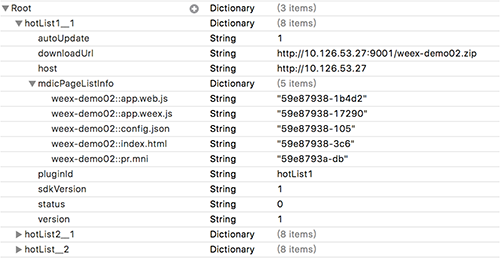

Gome weex 使用教程 

# 1. 搭建Weex环境

### 1.1安装Node.js

weex 需要依赖Node.js 和 Weex CLi，首先需要安装Node.js ，可以使用 Homebrew 进行安装：

	brew install node

安装完Node.js 安装 weex-toolkit

	npm install -g weex-toolkit
	weex -v //查看当前weex版本

### 1.2 集成到项目 

通过cocoaPods 集成 Weex iOS SDK到你的项目，在Podfile文件中添加： 
	
	pod 'WeexSDK', '0.9.5'   ## 建议使用WeexSDK新版本 
	
# 2. Gome weex 使用方法 

GWeex分为两个流程:

1.  初始化
2.  加载Gweex页面 
每个流程 暴露一个API。，分别是initWeexEnvironment、loadWeexPageResourceForUrl。
	
### 2.1 GWeex 初始化
	
	-(void) initWeex
	{ 
	    //初始化SDK环境,最新版本的方法名改为：initSDKEnviroment
	    [WXSDKEngine initSDKEnvironment];
	    //registerModule是注册模块，如果没有，你点击weex的渲染的view中的按钮将找不到事件。
	    [WXSDKEngine registerModule:@"event" withClass:[WXEventModule class]];
	    
	    ////PageManagerModule
	    [WXSDKEngine registerModule:@"PageManagerModule" withClass:[GWXSchemeModule class]];
	    
	    //注册Handler
	    [WXSDKEngine registerHandler:[WXImageDownloader new] withProtocol:@protocol(WXImgLoaderProtocol)];
	
	    ///初始化国美weex 
	    GWXEngine *wxEngine = [GWXEngine shareInstance];
	    [wxEngine initWeexEnvironment];
	}
初始化 过程包含两个任务： 初始化weex ，初始化GWXEngine。

### 2.2加载Gome weex页面 
加载weex页面，就是将给定的URL 使用weex渲染出来。加载的代码如下：
	
	GWXEngine *wxEngine = [GWXEngine shareInstance];
    [wxEngine loadWeexPageResourceForUrl:GWX_URL finishBlock:^(NSString *strWeexUrl) {
        
        if ([strWeexUrl hasPrefix:@"http"])
        {
            jumpToScheme(self, strWeexUrl);
        }
        else
        {
            GMFWeexVC *weexVC = [GMFWeexVC new];
            weexVC.url = strWeexUrl;
            [self.navigationController pushViewController:weexVC animated:YES];
        }
    }];
如果给定的URL能在本地插件表中找到 ，会被使用weex渲染 ，否则会调转到对应的H5页面 。

# 3. 内部初始化原理 

Gome Weex内部实现按照功能分，分为两部分，初始化（包括初始化清单流程、下载插件流程）、加载weex页面。下面分析初始化流程。初始化的流程下图（图1）

### 3.1 初始化清单流程

图1

初始化流程一般在App启动的时候触发，初始化有四个状态、分别是未初始化、初始化中、初始化OK、初始化失败。使用状态控制的目的是防止多次初始化功能 ，只有初始化失败，才可以再次初始化，如果初始化成功，不能再次初始化。

第一步：当进入初始化流程，首先读取weex/info目录下的weexConfig.plist配置信息到内存 。weexConfig.plist存储着本地多有可用插件的信息。以key value的形式存储。key：是插件ID__版本，value：是插件的信息 。包括 插件下载地址、host、 插件下所有的页面Etag、插件版本、插件支持的SDK版本。如下图所示

第二步：请求插件清单接口，获取服务器的插件列表。如果请求OK，进入第三步，否则进入第五步。

第三步：根据服务器返回的插件列表和本地已有的插件列表 计算出需要新下载的插件列表，添加到下载列表中 。如果  

第四步： 启动下载流程   

第五步：如果前面的流程没有出错，将初始化状态设置为OK ，否则设置为失败。

### 3.2 下载插件流程

下载流程是在初始化清单接口完成后，自动触发的 。也包含在初始化流程中。

下载多个插件是使用operation queue管理的，每个插件抽象为一个operation， 然后将所有的operation添加到下载队列中，下载队列管理所有的插件下载 ，并且，队列中同时只有两个插件下载 ，这样防止内存的峰值太高 。队列中的每个插件operation 执行完成后，回调给GWXEngine，这样 GWXEngine会根据下载的结果，做对应的处理 ，下载成功，添加到本地插件列表中，下载失败，添加到失败列表中。在失败列表中的插件在加载weex也的时候会触发重新下载 。

operation queque管理插件下载的示意图 ：

每个插件的下载任务流程如下图所示：

主要分为以下几个过程：

1. 启动插件下载网络请求 。
2. 如果请求状态为200 ，插件的zip会保存到download目录下 。
3. 解压插件zip到unzip目录 
4. 根据解压出来的文件，构架插件的信息。插件包下的所有页面的ETag值 （文件的修改时间+文件长度）
5. 将解压出来的插件复制到plugins目录的对应版本下面 。
6. 如果复制成功 ，将插件的信息保存在本地配置文件weexConfig.plist中，同时保存到内存中 。，同时将整个下载任务状态置为成功
7. 如果上面的任何一步失败，都将下载任务状态置为失败。

其中这个过程设计到插件不同状态在不同文件夹下流转的过程如下：

### 3.3 加载weex 页面流程 

加载页面的流程如下图所示 ：

完了 。 回头慢慢优化啊 。

    

