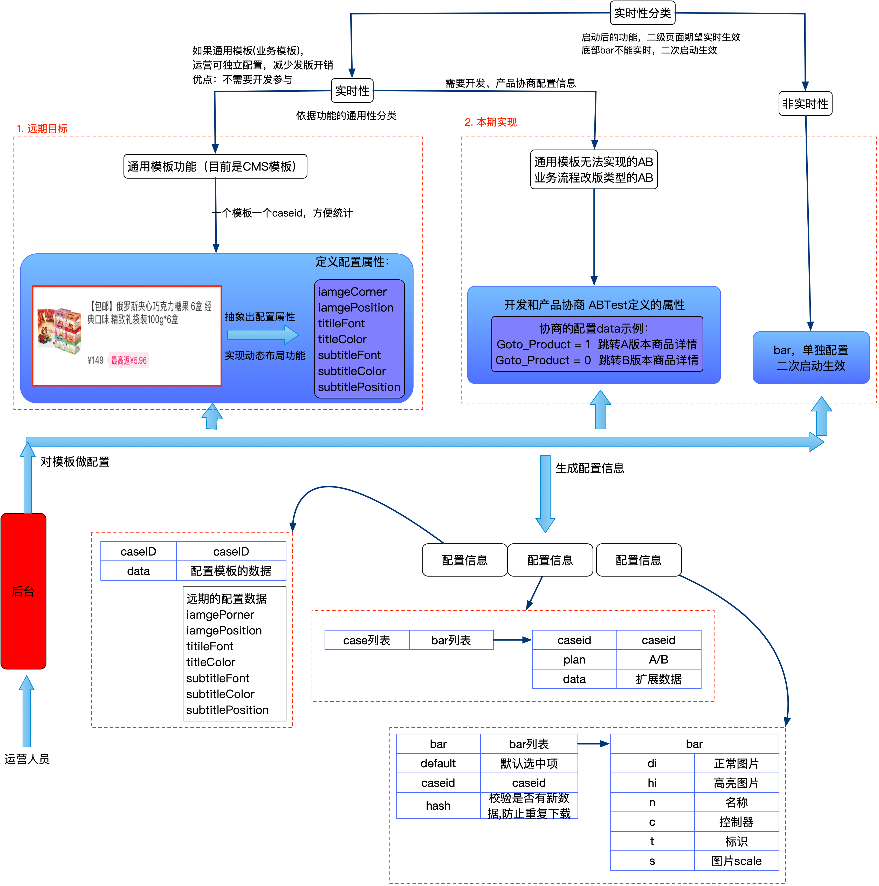
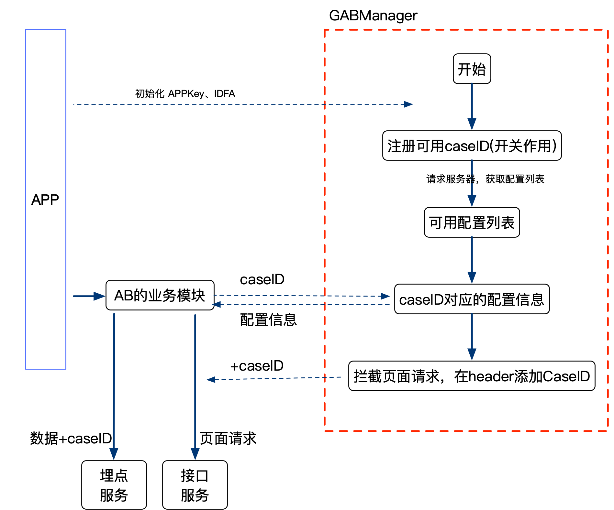

阅读目录：

1. [ABTest使用场景分析](#design)
2. [SDK设计图](#sdk)
3. [附录：XX App AB效果](#jd)

## 
ABTest使用场景分析

下图说明ABTest使用场景的分析。

依据上图的分析，设计出下面的SDK流程。

## 
SDK设计图

下图说明SDK的设计图。

## 
附录：XX App AB效果

经过反编译XX APP，分析XX客户端的AB实现原理，然后修改XX的代码，对比底部Bar的AB效果。

