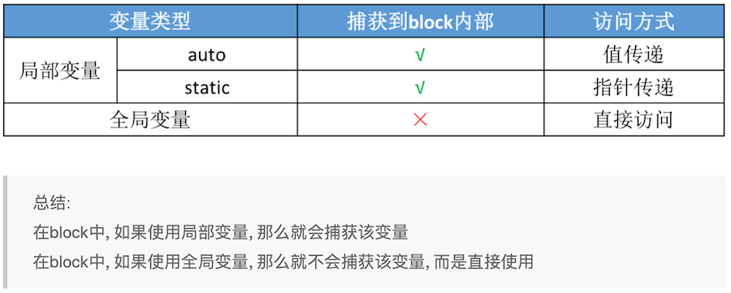

本文理解block的本质

<!--more-->


## block的底层实现

源码

```
void (^block)(void) = ^{
    NSLog(@"this is a block");
    NSLog(@"this is a block");
    NSLog(@"this is a block");
};
block();
```

翻译为CPP代码

```
void (*block)(void) = &__main_block_impl_0(__main_block_func_0, &__main_block_desc_0_DATA);
block->FuncPtr(block);
```

所以，block 的本质是`__main_block_impl_0`结构体，构造一个`__main_block_impl_0`结构，将`__main_block_impl_0`的地址赋值给block,执行block的过程是通过block找到函数指针FuncPtr，调用。  `__main_block_impl_0`的结构如下（这几个结构体名字不好记，牢记impl是整体实现，实现里面有函数指针func）：


```
struct __main_block_impl_0 {
    struct __block_impl impl;
    struct __main_block_desc_0* Desc;
    //构造函数
    __main_block_impl_0(void *fp, struct __main_block_desc_0 *desc, int flags=0) {
        impl.isa = &_NSConcreteStackBlock;
        impl.Flags = flags;
        impl.FuncPtr = fp;
        Desc = desc;
    }
};
```

`__main_block_impl_0`包含两个成员，如下：

```
struct __block_impl {
    void *isa;   //isa，说明是OC对象
    int Flags;
    int Reserved;
    void *FuncPtr;  //block内的代码封装为函数指针
};

static struct __main_block_desc_0 {
    size_t reserved;
    size_t Block_size;
} __main_block_desc_0_DATA = { 0, sizeof(struct __main_block_impl_0)};
```

其中，函数指针 `__main_block_func_0`的定义

```
static void __main_block_func_0(struct __main_block_impl_0 *__cself) {
    NSLog((NSString *)&__NSConstantStringImpl__var_folders_hs_21g8l7ps1p9cmwpn1nbnfn700000gn_T_main_77e4e1_mi_0);
    NSLog((NSString *)&__NSConstantStringImpl__var_folders_hs_21g8l7ps1p9cmwpn1nbnfn700000gn_T_main_77e4e1_mi_1);
    NSLog((NSString *)&__NSConstantStringImpl__var_folders_hs_21g8l7ps1p9cmwpn1nbnfn700000gn_T_main_77e4e1_mi_2);
}
//常量字符串定义在数据区
static __NSConstantStringImpl __NSConstantStringImpl__var_folders_hs_21g8l7ps1p9cmwpn1nbnfn700000gn_T_main_77e4e1_mi_0 __attribute__ ((section ("__DATA, __cfstring"))) = {__CFConstantStringClassReference,0x000007c8,"this is a block",15};
static __NSConstantStringImpl __NSConstantStringImpl__var_folders_hs_21g8l7ps1p9cmwpn1nbnfn700000gn_T_main_77e4e1_mi_1 __attribute__ ((section ("__DATA, __cfstring"))) = {__CFConstantStringClassReference,0x000007c8,"this is a block",15};
static __NSConstantStringImpl __NSConstantStringImpl__var_folders_hs_21g8l7ps1p9cmwpn1nbnfn700000gn_T_main_77e4e1_mi_2 __attribute__ ((section ("__DATA, __cfstring"))) = {__CFConstantStringClassReference,0x000007c8,"this is a block",15};
```

整体捋下思路，block的结构简单理解为：

```
Block是一个impl结构  ->__block_impl     -> isa，表明是OC对象
                   |                  -> func函数指针,封装block的代码
                   |
                   -> 描述
```

> 总结: block的本质就是封装了函数调用以及函数调用环境的OC对象


## 带参数的block

```
void (^block)(int, int) = ^(int a, int b){
    NSLog(@"%d,%d",a,b);
};
int c= 20, d = 10;
block(c, d);
```

翻译为CPP代码:

```
//初始化block对象
void (*block)(int, int) =
&__main_block_impl_0(__main_block_func_0, &__main_block_desc_0_DATA));
int c= 20, d = 10;
//执行block
block->FuncPtr(block, c, d);
```

各个结构的定义如下：

```
//block的底层结构
struct __main_block_impl_0 {
    struct __block_impl impl;
    struct __main_block_desc_0* Desc;
    __main_block_impl_0(void *fp, struct __main_block_desc_0 *desc, int flags=0) {
        impl.isa = &_NSConcreteStackBlock;
        impl.Flags = flags;
        impl.FuncPtr = fp;
        Desc = desc;
    }
};
//block内的函数指针
static void __main_block_func_0(struct __main_block_impl_0 *__cself, int a, int b) {
    
    NSLog((NSString *)&__NSConstantStringImpl__var_folders_hs_21g8l7ps1p9cmwpn1nbnfn700000gn_T_main_3e8a17_mi_0,a,b);
}

static struct __main_block_desc_0 {
    size_t reserved;
    size_t Block_size;
} __main_block_desc_0_DATA = { 0, sizeof(struct __main_block_impl_0)};

```

## block变量捕获

1. 在OC中变量的类型主要使用三种, 分别是auto、static、全局变量, 其中auto和static修饰的是局部变量
2. 对这三种类型的变量, block在使用使用时, 会有不同的捕获方式


### auto变量捕获(值捕获)


示例代码：

```
int age = 20;
void (^block)(void) = ^{
    NSLog(@"%d",age);
};
block();
```


翻译为CPP代码

```
int age = 20;
void (*block)(void) = &__main_block_impl_0(__main_block_func_0, &__main_block_desc_0_DATA, age));
block->FuncPtr(block);
```

各个结构体的定义

```
struct __main_block_impl_0 {
    struct __block_impl impl;
    struct __main_block_desc_0* Desc;
    int age;  //多了一个成员变量
    __main_block_impl_0(void *fp, struct __main_block_desc_0 *desc, int _age, int flags=0) : age(_age) {  //age的赋值是通过构造函数初始化列表完成的
        impl.isa = &_NSConcreteStackBlock;
        impl.Flags = flags;
        impl.FuncPtr = fp;
        Desc = desc;
    }
};
static void __main_block_func_0(struct __main_block_impl_0 *__cself) {
    int age = __cself->age; // bound by copy 取出block结构内的age
    
    NSLog((NSString *)&__NSConstantStringImpl__var_folders_hs_21g8l7ps1p9cmwpn1nbnfn700000gn_T_main_82fbf9_mi_0,age);
}

static struct __main_block_desc_0 {
    size_t reserved;
    size_t Block_size;
} __main_block_desc_0_DATA = { 0, sizeof(struct __main_block_impl_0)};
```

可以看出，block对于auto变量会值不会，通过在block底层结构中增加捕获的变量定义。


### static变量捕获(指针捕获)

示例代码：

```
static int age = 20;
void (^block)(void) = ^{
    NSLog(@"%d",age);  //输出25
};
age = 25;
block();
```


翻译为CPP代码

```
static int age = 20;
//将age的地址传入block的构造函数中
void (*block)(void) = &__main_block_impl_0(__main_block_func_0, &__main_block_desc_0_DATA, &age);
age = 25;
block->FuncPtr(__block_impl *)block);
```


各个结构体的定义如下：

```
struct __main_block_impl_0 {
  struct __block_impl impl;
  struct __main_block_desc_0* Desc;
  int *age;   //定义为指针类型
  __main_block_impl_0(void *fp, struct __main_block_desc_0 *desc, int *_age, int flags=0) : age(_age) {  //构造列表是初始化age指针
    impl.isa = &_NSConcreteStackBlock;
    impl.Flags = flags;
    impl.FuncPtr = fp;
    Desc = desc;
  }
};
static void __main_block_func_0(struct __main_block_impl_0 *__cself) {
  int *age = __cself->age; // bound by copy

        NSLog((NSString *)&__NSConstantStringImpl__var_folders_hs_21g8l7ps1p9cmwpn1nbnfn700000gn_T_main_1d503d_mi_0,(*age));
    }
```


### block中使用全局变量(不会捕获)

全局变量不捕获

### 总结




## 点点滴滴

```
xcrun -sdk iphoneos clang -arch arm64 -rewrite-objc main.m
```