Mach-O是mac系统中文件的存储格式。熟悉Mach-O 文件结构可以：

1. 有助于理解崩溃日志解析的原理。理解KSCrash源码；
2. 有助于理解开源代码fishhook的原理；
3. 有助于理解腾讯OOMDetector开源库源码；
4. 好处应该不止这些。

<!-- more -->

## 总体结构

它的组成结构如下图所示，包括了Header、Load commands、Data（包含Segement的具体数据）。

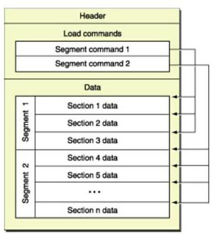


这张图片说明了几点：

1. mach-o由三部分构成，header、Load Commands、Data区域。
2. commond指定了各种数据在Data区域的位置。 可以将header比喻为文章的摘要，Load Commands为文章的目录、Data是文章的正文。 目录的特点是可以定位内容在文章的位置。Load Commands其实就是这个作用。
3. 每个segment下面可以有一个或多个section。 可以理解为一级目录下的子二级目录~~。

也可以从另外角度认识Mach-O结构，如图所示。

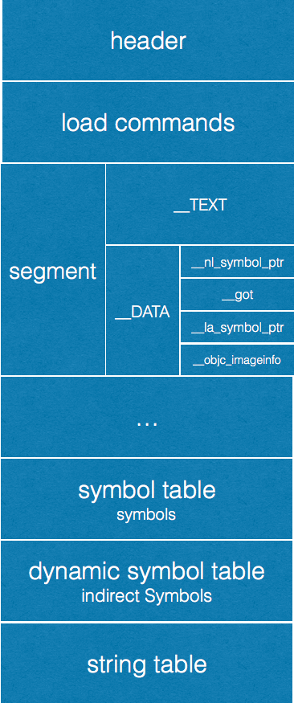

这张图表达了更多的细节信息：

1. segment 的类型有\_\_TEXT(程序的代码区域，只读) 、\_\_DATA(程序的数据区域，可读写)
2. \_\_DATA segment 后面跟随着多个section，包括\_\_nl\_\_symbol\_ptr （not layz符号）\_\_la\_\_symbol\_ptr

下面来聊聊Header部分

## mach-header

mach-header 的定义如下：

```
///<mach-o/loader.h>
struct mach_header_64 {
	uint32_t	magic;		/* mach magic number identifier */
	cpu_type_t	cputype;	/* cpu specifier */
	cpu_subtype_t	cpusubtype;	/* machine specifier */
	uint32_t	filetype;	/* type of file */
	uint32_t	ncmds;		/* number of load commands */
	uint32_t	sizeofcmds;	/* the size of all the load commands */
	uint32_t	flags;		/* flags */
	uint32_t	reserved;	/* reserved */
};
```

* magic：魔数，用于快速确认该文件的种类（用于64位还是32位）。可取值（部分）如下：

```
#define MH_MAGIC_64 0xfeedfacf /* the 64-bit mach magic number */
#define MH_CIGAM_64 0xcffaedfe /* NXSwapInt(MH_MAGIC_64) */
```
* cputype：CPU类型，可取值（部分）如下：

```
#define CPU_TYPE_I386		CPU_TYPE_X86  /* compatibility */
#define	CPU_TYPE_X86_64		(CPU_TYPE_X86 | CPU_ARCH_ABI64)
#define CPU_TYPE_ARM		((cpu_type_t) 12)
#define CPU_TYPE_ARM64          (CPU_TYPE_ARM | CPU_ARCH_ABI64)
```

* cpusubtype：对应的具体类型，比如arm64、armv7，可取值（部分）如下：

```
#define CPU_SUBTYPE_X86_ALL		((cpu_subtype_t)3)
#define CPU_SUBTYPE_X86_64_ALL		((cpu_subtype_t)3)
#define CPU_SUBTYPE_ARM_V7		((cpu_subtype_t) 9)
#define CPU_SUBTYPE_ARM_V7S		((cpu_subtype_t) 11) /* Swift */
```


* filetype：文件类型，比如可执行文件、库文件、Dsym文件，例如：MH_EXECUTE值是2，代表可执行文件，可取值如下：

```
 * Constants for the filetype field of the mach_header
 */
#define MH_OBJECT   0x1     /* relocatable object file */
#define MH_EXECUTE  0x2     /* demand paged executable file */
#define MH_FVMLIB   0x3     /* fixed VM shared library file */
#define MH_CORE     0x4     /* core file */
#define MH_PRELOAD  0x5     /* preloaded executable file */
#define MH_DYLIB    0x6     /* dynamically bound shared library */
#define MH_DYLINKER 0x7     /* dynamic link editor */
#define MH_BUNDLE   0x8     /* dynamically bound bundle file */
#define MH_DYLIB_STUB   0x9     /* shared library stub for static */
#define MH_DSYM     0xa     /* companion file with only debug */
#define MH_KEXT_BUNDLE  0xb     /* x86_64 kexts */
```

* ncmds ：加载命令条数
* sizeofcmds：所有加载命令的大小
* reserved：保留字段
* flags：标志位，可取值（部分）如下：

```
#define MH_DYLDLINK	0x4		/* the object file is input for the
					   dynamic linker and can't be staticly
					   link edited again */
#define MH_PREBOUND	0x10		/* the file has its dynamic undefined
					   references prebound. */
#define MH_SPLIT_SEGS	0x20		/* the file has its read-only and
					   read-write segments split */

#define MH_TWOLEVEL	0x80		/* the image is using two-level name
					   space bindings */

#define MH_NOMULTIDEFS	0x200		/* this umbrella guarantees no multiple
					   defintions of symbols in its
					   sub-images so the two-level namespace
					   hints can always be used. */

#define MH_CANONICAL    0x4000		/* the binary has been canonicalized
					   via the unprebind operation */
#define MH_WEAK_DEFINES	0x8000		/* the final linked image contains
					   external weak symbols */
#define MH_BINDS_TO_WEAK 0x10000	/* the final linked image uses
					   weak symbols */
#define	MH_PIE 0x200000			/* When this bit is set, the OS will
					   load the main executable at a
					   random address.  Only used in
					   MH_EXECUTE filetypes. */
....
```

下图是借用machoview查看header的结构：

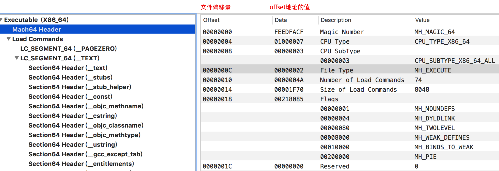

可以看出：

1. 该文件是可执行文件
2. 文件的构架是x86_64
3. number of Load commands表示有74个load commond
4. MH_TWOLEVEL二级名字空间
5. MH_PIE 随机地址空间

接下来介绍head后的load command部分。

## load command

Load commands紧跟在头部之后。Load commands指定了文件的布局结构和链接特征。有很多很多种Load commands。这些加载指令清晰地告诉加载器如何处理二进制数据，有些命令是由内核处理的，有些是由动态链接器处理的。  

这里列举几个看上去比较熟悉的....

``` 
// <mach-o/loader.h>
#define	LC_SEGMENT	0x1	/* segment of this file to be mapped  被映射到内存的段*/
#define	LC_SYMTAB	0x2	/* link-edit stab symbol table info  符号表*/
#define	LC_DYSYMTAB	0xb	/* dynamic link-edit symbol table info 动态符号表*/
#define	LC_LOAD_DYLIB	0xc	/* load a dynamically linked shared library 动态链接库*/
/*
 * load a dynamically linked shared library that is allowed to be missing
 * (all symbols are weak imported).
 */
#define	LC_LOAD_WEAK_DYLIB (0x18 | LC_REQ_DYLD)

#define	LC_SEGMENT_64	0x19	/* 64-bit segment of this file to be
				   mapped */
#define LC_UUID		0x1b	/* the uuid */
#define LC_RPATH       (0x1c | LC_REQ_DYLD)    /* runpath additions */
#define LC_CODE_SIGNATURE 0x1d	/* local of code signature */
```

load command的基本定义如下：

```
struct load_command {
    uint32_t cmd;       /* type of load command */
    uint32_t cmdsize;   /* total size of command in bytes */
};
```


这个结构体只表示了所有的command都需要包含的属性----命令类型和命令的大小。具体对于不同的命令都会有不同的定义。但是必须包含上面两个字段。

下面就来看具体的命令---LC_SEGMENT_64类型命令的定义。

### LC_SEGMENT

```
/*
 * The segment load command indicates that a part of this file is to be
 * mapped into the task's address space.  The size of this segment in memory,
 * vmsize, maybe equal to or larger than the amount to map from this file,
 * filesize.  The file is mapped starting at fileoff to the beginning of
 * the segment in memory, vmaddr.  The rest of the memory of the segment,
 * if any, is allocated zero fill on demand.  The segment's maximum virtual
 * memory protection and initial virtual memory protection are specified
 * by the maxprot and initprot fields.  If the segment has sections then the
 * section structures directly follow the segment command and their size is
 * reflected in cmdsize.
段加载命令指定了：文件需要映射到程序地址空间的某个部分。 
段在内存中的大小用vmsize指定。内存中段的大小可能等于或大于文件大小（filesize），文件大小使用filesize指定。
映射的源起始文件地址是fileoff，目的起始地址是vmaddr。内存中剩余的段内存用0填充。
段的最大内存权限和初始内存权限用maxprot、initprot字段指定。
如果段有section，那么section的结构紧跟着段。section的大小包括在cmdsize字段中。
 */
struct segment_command { /* for 32-bit architectures */
	uint32_t	cmd;		/* LC_SEGMENT */
	uint32_t	cmdsize;	/* includes sizeof section structs */
	char		segname[16];	/* segment name */
	uint32_t	vmaddr;		/* memory address of this segment */
	uint32_t	vmsize;		/* memory size of this segment */
	uint32_t	fileoff;	/* file offset of this segment */
	uint32_t	filesize;	/* amount to map from the file */
	vm_prot_t	maxprot;	/* maximum VM protection */
	vm_prot_t	initprot;	/* initial VM protection */
	uint32_t	nsects;		/* number of sections in segment */
	uint32_t	flags;		/* flags */
};
```

可以看出segment_command包含了命令必须的属性cmd、cmdsize。剩下的属性是segment_command特有的属性。

下面是名称为_DATA的segment commond的截图：

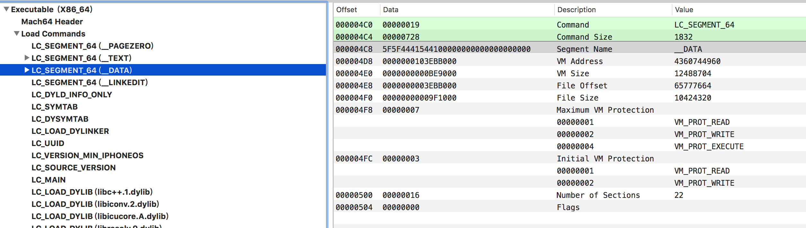

可以看出：

1. 命令类型是LC_SEGMENT_64
2. 命令的大小1832
3. segment 命令的名称是__DATA
4. 映射的内存地址是4360744960（十进制）
5. 内存的大小12488704
6. 文件的偏移量是65777664
7. 需要映射的文件的大小10424320
8. 最大内存保护权限：读写执行
9. 初始内存权限：读写
10. 这个端附属了22个 section，也就是说1832大小的segment_command包括了22个section命令的大小。
11. 看的方法：offset代表文件的便宜量、Data表示内存地址中存储的值、description表示这段内存地址的名称的描述、value表示存储的值的可视描述。

下面看看22个section的示意图：

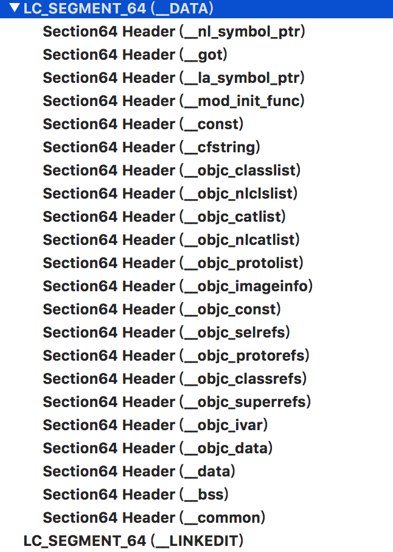

下面讲解section的结构,section 的定义如下：

```
struct section_64 { /* for 64-bit architectures */
	char		sectname[16];	/* name of this section */
	char		segname[16];	/* segment this section goes in */
	uint64_t	addr;		/* memory address of this section */
	uint64_t	size;		/* size in bytes of this section */
	uint32_t	offset;		/* file offset of this section */
	uint32_t	align;		/* section alignment (power of 2) */
	uint32_t	reloff;		/* file offset of relocation entries */
	uint32_t	nreloc;		/* number of relocation entries */
	uint32_t	flags;		/* flags (section type and attributes)*/
	uint32_t	reserved1;	/* reserved (for offset or index) */
	uint32_t	reserved2;	/* reserved (for count or sizeof) */
	uint32_t	reserved3;	/* reserved */
};
```

下图是\_\_nl\_symbol\_ptr section 的示意图：

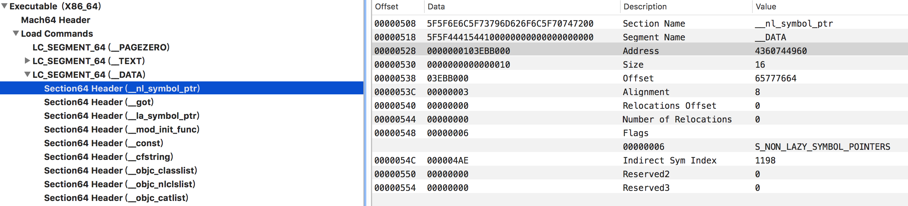

可以看出：

1. section的名称是\_\_nl\_symbol\_ptr
2. 该section所属的segment的名称 _DATA 。segment名称大写，section名称小写，这个是默认的规定。
3. 内存地址4360744960
4. 该section在内存中的大小是16
5. 该section在物理文件的偏移量65777664
6. 内存对齐大小 8
7. 间接符号索引是1198 （这里不太懂什么意思）

segment 常用的有四种，如图所示：

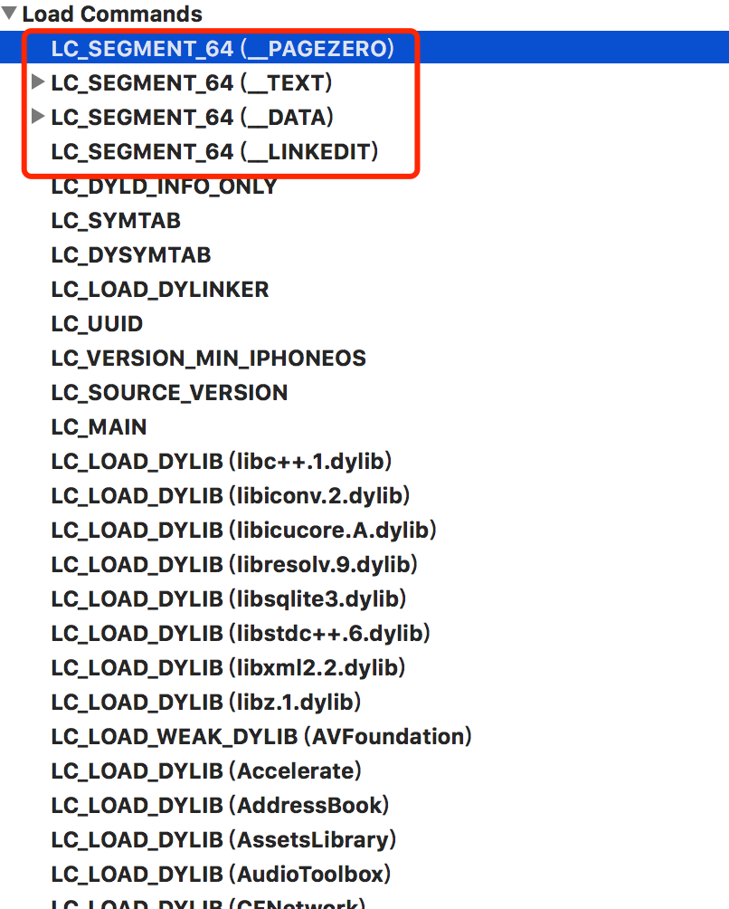

可以看出有__PAGEZERO、__TEXT、__DATA、__LINKEDIT。下面是这四个segement的基本介绍。

1. The static linker creates a \_\_PAGEZERO segment as the first segment of an executable file. This segment is located at virtual memory location 0 and has no protection rights assigned, the combination of which causes accesses to NULL, a common C programming error, to immediately crash. The \_\_PAGEZERO segment is the size of one full VM page for the current architecture (for Intel-based and PowerPC-based Macintosh computers, this is 4096 bytes or 0x1000 in hexadecimal). Because there is no data in the \_\_PAGEZERO segment, it occupies no space in the file (the file size in the segment command is 0).
2. The `__TEXT` segment contains executable code and other read-only data. To allow the kernel to map it directly from the executable into sharable memory, the static linker sets this segment’s virtual memory permissions to disallow writing. When the segment is mapped into memory, it can be shared among all processes interested in its contents. (This is primarily used with frameworks, bundles, and shared libraries, but it is possible to run multiple copies of the same executable in OS X, and this applies in that case as well.) The read-only attribute also means that the pages that make up the `__TEXT` segment never need to be written back to disk. When the kernel needs to free up physical memory, it can simply discard one or more __TEXT pages and re-read them from disk when they are next needed.
3. The `__DATA` segment contains writable data. The static linker sets the virtual memory permissions of this segment to allow both reading and writing. Because it is writable, the `__DATA` segment of a framework or other shared library is logically copied for each process linking with the library. When memory pages such as those making up the `__DATA` segment are readable and writable, the kernel marks them copy- on-write; therefore when a process writes to one of these pages, that process receives its own private copy of the page.
4. The `__LINKEDIT` segment contains raw data used by the dynamic linker, such as symbol, string, and relocation table entries.


### LC_SYMTAB

```
/*
 * The symtab_command contains the offsets and sizes of the link-edit 4.3BSD
 * "stab" style symbol table information as described in the header files
 * <nlist.h> and <stab.h>.
 * symtab_command 包含了符号表、字符串索引表 的偏移量和大小 。
 */
struct symtab_command {
	uint32_t	cmd;		/* LC_SYMTAB */
	uint32_t	cmdsize;	/* sizeof(struct symtab_command) */
	uint32_t	symoff;		/* symbol table offset */
	uint32_t	nsyms;		/* number of symbol table entries */
	uint32_t	stroff;		/* string table offset */
	uint32_t	strsize;	/* string table size in bytes */
};
```

下面是LC_SYMTAB command示意图：

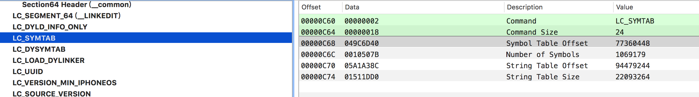

由表中可以看出

1. 命令的大小是24 （十进制）
2. 符号表在物理文件的偏移量是 77360448
3. 符号表的大小 1069179
4. String表的物理文件偏移量是94479244
5. string表的大小是22093264

这个commond同时指定了两个表(符号表、String表)的位置信息。

### 	LC_UUID	

LC_UUID 用来标识唯一APP，命令的定义如下:

```
struct uuid_command {
    uint32_t	cmd;		/* LC_UUID */
    uint32_t	cmdsize;	/* sizeof(struct uuid_command) */
    uint8_t	uuid[16];	/* the 128-bit uuid */
};
```

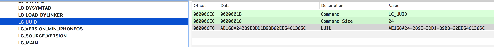

每个可执行程序都有一个uuid，这样根据不同的uuid能确定包。比如崩溃日志中就会包含uuid字段。表示是哪个包崩溃了。

### LC_DYSYMTAB（动态符号表）

下面的描述摘至`<mach-o/loader.h>` 的459行。

  This is the second set of the symbolic information which is used to support  the data structures for the dynamically link editor.
LC_DYSYMTAB 是第二种类型符号集，这个符号集被动态连接器的数据结构使用。


  The original set of symbolic information in the symtab_command which contains the symbol and string tables must also be present when this load command is present. 
当这个command（动态符号command）出现的时候，symtab_command必须出现，symtab_command包含符号表和String表。
 
  When this load command is present the symbol table is organized into three groups of symbols:
当这个加载命令出现的时候，符号表被组织为三部分：
 
1. local symbols (static and debugging symbols) - grouped by module
2. defined external symbols - grouped by module (sorted by name if not lib)
3. undefined external symbols (sorted by name if MH_BINDATLOAD is not set, and in order the were seen by the static linker if MH_BINDATLOAD is set)


In this load command there are offsets and counts to each of the three groups of symbols.
这个命令指定了每个部分的偏移量和符号个数：

This load command contains a the offsets and sizes of the following new symbolic information tables:
这个命令包含下面新的符号：

1. table of contents
2. module table
3. reference symbol table
4. indirect symbol table

 
The first three tables above (the table of contents, module table and reference symbol table) are only present if the file is a dynamically linked shared library. 
前三个只有文件是动态库的时候才出现。 


For executable and object modules, which are files containing only one module, the information that would be in these three tables is determined as follows:

1. table of contents - the defined external symbols are sorted by name
2. module table - the file contains only one module so everything in the file is part of the module.
3.  reference symbol table - is the defined and undefined external symbols

For dynamically linked shared library files this load command also contains offsets and sizes to the pool of relocation entries for all sections separated into two groups:
1. external relocation entries
2. local relocation entries

For executable and object modules the relocation entries continue to hang off the section structures.


| 名称 | 类型 | 描述 |
| --- | ---| --- |
| cmd | uint32_t | LC_DYSYMTAB |
| cmdsize | uint32_t  | sizeof(struct dysymtab_command)|
|-|-|-|
| ilocalsym | uint32_t |index to local symbols|
| nlocalsym | uint32_t |number of local symbols|
| iextdefsym | uint32_t |index to externally defined symbols|
| nextdefsym | uint32_t |number of externally defined symbols|
| iundefsym | uint32_t | index to undefined symbols|
| nundefsym | uint32_t |number of undefined symbols|
| -|-|-|
| tocoff | uint32_t |file offset to table of contents|
| ntoc | uint32_t |number of entries in table of contents|
| modtaboff | uint32_t |file offset to module table|
| nmodtab | uint32_t |number of module table entries|
| extrefsymoff | uint32_t |offset to referenced symbol table |
| nextrefsyms | uint32_t |number of referenced symbol table entries|
| indirectsymoff | uint32_t |file offset to the indirect symbol table|
| nindirectsyms | uint32_t |number of indirect symbol table entries|
| --|--|--|
| extreloff | uint32_t |offset to external relocation entries|
| nextrel | uint32_t |number of external relocation entries|
| locreloff | uint32_t |offset to local relocation entries|
| nlocrel | uint32_t |number of local relocation entries|

又表得：动态符号command定义了各种符号的偏移量和各种符号的个数(9种)。

## DATA部分

DATA部分是Mach-O文件的主体，存储着各种类型的实际数据，例如LC_SEGMENT（__TEXT）指定的代码段, LC_SEGMENT（__DATA）指定的数据段。 LC_SYMTAB（__LINKEDIT）段指定的符号表和String表、以及动态符号表，等等。
这里只了解三种结构：

* 符号表
* String表
* 动态符号表

### 符号表

符号表的数据结构如下：

```
struct nlist_64 {
    union {
        uint32_t  n_strx; /* index into the string table */
    } n_un;
    uint8_t n_type;        /* type flag, see below */
    uint8_t n_sect;        /* section number or NO_SECT */
    uint16_t n_desc;       /* see <mach-o/stab.h> */
    uint64_t n_value;      /* value of this symbol (or stab offset) */
};
/*
 * Symbols with a index into the string table of zero (n_un.n_strx == 0) are
 * defined to have a null, "", name.  Therefore all string indexes to non null
 * names must not have a zero string index.  This is bit historical information
 * that has never been well documented.
 */

/*
 * The n_type field really contains four fields:
 *	unsigned char N_STAB:3,
 *		      N_PEXT:1,
 *		      N_TYPE:3,
 *		      N_EXT:1;
 * which are used via the following masks.
 */
#define	N_STAB	0xe0  /* if any of these bits set, a symbolic debugging entry */
#define	N_PEXT	0x10  /* private external symbol bit */
#define	N_TYPE	0x0e  /* mask for the type bits */
#define	N_EXT	0x01  /* external symbol bit, set for external symbols */
```

示意图如下：
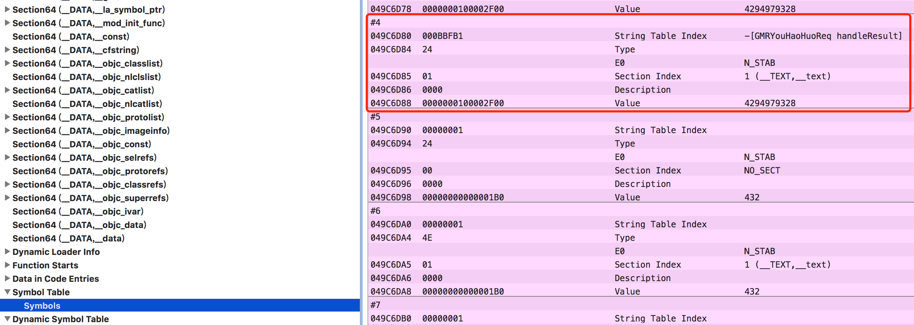

可以看出：

1. String表的偏移量是0xbbff8, 翻译后是[GMRYouHaoHuoReq getRequestURL]
2. 地址是0x100003300，

### string表

String表顺序列出了二进制mach-O文件的中的所有可见字符串。串之间通过0x00分隔。可以通过相对String表起始位置的偏移量随机访问String表中的字符串。符号表结构中的n_strx指定的就是String表中的偏移量。通过这个偏移量可以访问到符号对应的具体字符串。

例如： String表的0xbbf8处是不是[GMRYouHaoHuoReq getRequestURL]，string表的地址是0x049C6D40 加上偏移量0x000BBFB1 ，等于0x54d633d。

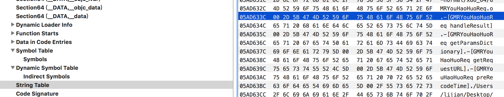

可以看出string表的0x54d633d地址出就是：[GMRYouHaoHuoReq getRequestURL]。  

### 动态符号表。

动态符号表中存储着动态连接器使用的相关符号。 每个符号一般占用32bit的存储空间。存储的内容是符号表中的索引。

## 注意啦

网上直接下载的MachOView经常崩溃，是由于有段代码没有做非空判断，所以为了有效使用MachOView，请从[官网](https://github.com/gdbinit/MachOView)下载代码，然后在崩溃的地方添加非空判断。就OK拉。

## 参考
1. [mach-o/loader.h](https://opensource.apple.com/source/xnu/xnu-1456.1.26/EXTERNAL_HEADERS/mach-o/loader.h)
2. [趣探 Mach-O：文件格式分析](https://www.jianshu.com/p/54d842db3f69)
3. [MachOView 源码地址](https://github.com/gdbinit/MachOView)
