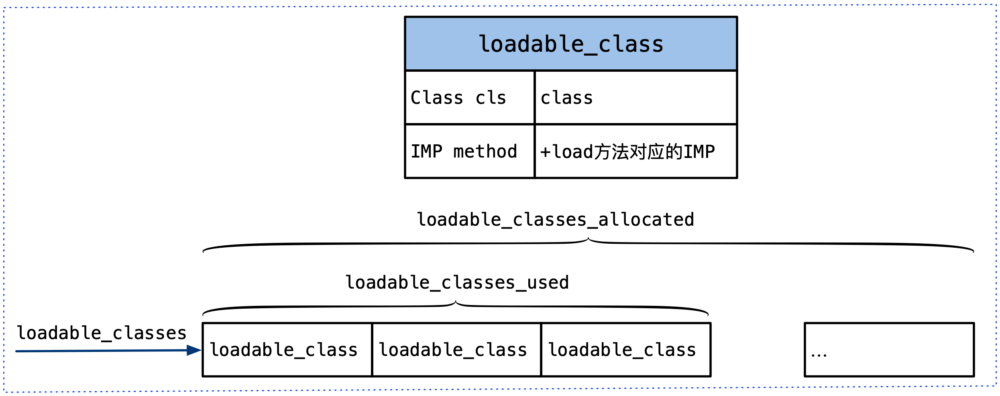
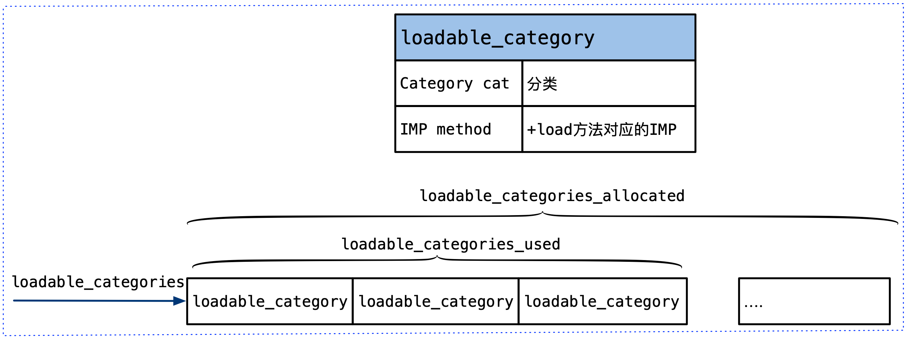
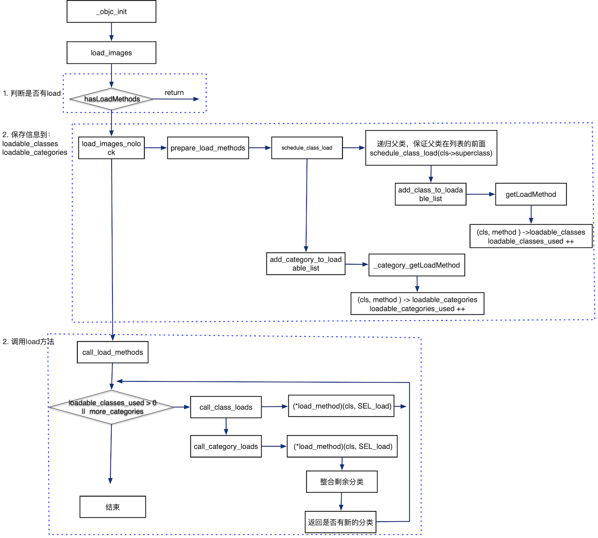

本文分析load_images 函数,该函数完成+load方法的调用。

<!--more-->

## load_images 相关的数据结构

在_objc_init 函数中，dyld_register_image_state_change_handler 将 load_images 作为回调函数注册给dylib，所以，当镜像的状态变化时，会回调load_images函数。

```
void _objc_init(void)
{
    ...
    dyld_register_image_state_change_handler(dyld_image_state_dependents_initialized, 0/*not batch*/, &load_images);
}
```

在分析load_images前，先介绍相关的数据结构：

```
typedef void(*load_method_t)(id, SEL); // 用于 +load 方法的 imp 类型

struct loadable_class { // 需要被调用 +load 方法的类
    Class cls;  // may be nil
    IMP method; // +load 方法对应的 imp
};

struct loadable_category { // 需要被调用 +load 方法的分类
    Category cat;  // may be nil
    IMP method; // +load 方法对应的 imp
};


// List of classes that need +load called (pending superclass +load)
// This list always has superclasses first because of the way it is constructed
static struct loadable_class *loadable_classes = nil; // 这个列表中存放所有需要调用 +load 方法的类
static int loadable_classes_used = 0; // loadable_classes 列表中已经被使用了多少个位置
static int loadable_classes_allocated = 0; // loadable_classes 列表开辟了多少位置，如果位置不够用了，会进行扩容

// List of categories that need +load called (pending parent class +load)
static struct loadable_category *loadable_categories = nil; // 这个列表中存放所有需要执行 +load 方法的分类
static int loadable_categories_used = 0; // loadable_categories 列表中已经被使用了多少个位置
static int loadable_categories_allocated = 0; // loadable_categories 列表开辟了多少位置，如果位置不够用了，会进行扩容
```

可load 的class相关的数据结构：



可load 的category相关的数据结构：




## load_images 源码分析

```
const char *
load_images(enum dyld_image_states state, uint32_t infoCount,
            const struct dyld_image_info infoList[])
{
    bool found;
    found = false;
    for (uint32_t i = 0; i < infoCount; i++) {
        // 快速扫描镜像中是否有 +load 方法 (其实只查找了镜像中是否有类或分类）
        // imageLoadAddress 是镜像加载的内存地址
        if (hasLoadMethods((const headerType *)infoList[i].imageLoadAddress)) {
            found = true;
            break;
        }
    }
    if (!found) return nil; // 如果没有找到，就直接返回 nil


    
    // Discover load methods
    { // 加上括号，是为了 runtimeLock 锁，可以在这个块内自动释放，否则下次重入该函数时，会死锁
        
        rwlock_writer_t lock2(runtimeLock); // runtimeLock 加写锁
        
        // 做一些准备工作，将需要 +load 的类和分类分别存储到 loadable_classes、loadable_categories 中，
        // 在 call_load_methods() 中才有类可以调 +load
        // 并进一步确认是否真的有类或分类需要调用 +load
        found = load_images_nolock(state, infoCount, infoList);
    }


    // Call +load methods (without runtimeLock - re-entrant)
    // 不加 runtimeLock 锁，是因为 runtimeLock 与递归锁不一样，它是不可重入的，
    // 因为 load_images 中调用 +load 时，会导致其他镜像被 load，
    // 即 load_images 函数会在一个线程上被接连调用多次，如果加上 runtimeLock，就会造成死锁
    if (found) { // 确实有类或分类需要 +load
        call_load_methods(); // 就调用 +load
    }

    return nil;
}
```

这个函数分为三部分工作：

1. hasLoadMethods 判断是否有load函数
2. load_images_nolock 将load的信息添加到全局数据结构中
3. call_load_methods 调用load方法


###  判断是否含有load方法

```
bool hasLoadMethods(const headerType *mhdr)
{
    size_t count;
    // 扫描类列表
    if (_getObjc2NonlazyClassList(mhdr, &count)  &&  count > 0) return true;
    // 扫描分类列表
    if (_getObjc2NonlazyCategoryList(mhdr, &count)  &&  count > 0) return true;
    return false;
}
```

如果累有load方法，就会被放入__objc_nlclslist section，如果分类有load方法，分类就会被放入__objc_nlcatlist section，所以判断是否有这两个section，就判断出了是否有load方法

### 存储含有load方法的类、分类到全局数据中

```
bool 
load_images_nolock(enum dyld_image_states state,uint32_t infoCount,
                   const struct dyld_image_info infoList[])
{
    bool found = NO;
    uint32_t i;

    i = infoCount;
    
    // 从后往前遍历 infoList 中所有镜像，如果镜像中有 +load 方法（其实只查找了镜像中是否有类或分类）
    // 就对镜像调用 prepare_load_methods，
    // 并且记录下有 +load 方法，只要有一个镜像有 +load ，就返回 YES
    while (i--) {
        const headerType *mhdr = (headerType*)infoList[i].imageLoadAddress;
        if (!hasLoadMethods(mhdr)) continue;
        
        // 为 +load 做一些准备工作
        // 将需要 +load 的类添加到 loadable_classes 列表，
        // 将需要 +load 的分类添加到 loadable_categories 列表
        prepare_load_methods(mhdr);
        found = YES;
    }

    return found;
}
```

调用prepare_load_methods 保存信息。

```void prepare_load_methods(const headerType *mhdr)
{
    size_t count, i;

    runtimeLock.assertWriting(); // runtimeLock 需要事先加好写锁（是在 load_images() 中加的锁）

    // 获得镜像中所有 objective-2.0 且是非惰性的 类的 列表
    classref_t *classlist = _getObjc2NonlazyClassList(mhdr, &count);
    
    // 遍历类列表，先取得重映射的类，然后调用 schedule_class_load 函数将其添加到 loadable_classes 列表中
    for (i = 0; i < count; i++) {
        schedule_class_load(remapClass(classlist[i]));
    }

    // 取得分类列表
    category_t **categorylist = _getObjc2NonlazyCategoryList(mhdr, &count);
    
    // 遍历分类列表
    for (i = 0; i < count; i++) {
        category_t *cat = categorylist[i];
        Class cls = remapClass(cat->cls); // 取得 分类所属的类 所对应的 重映射类
        if (!cls) continue;  // category for ignored weak-linked class
                             // cls == nil，即 cat->cls 是 ignored weak-linked 类，就跳过
        realizeClass(cls);  // 将 cls 类 realize 了，里面当然也会一并 realize 了 cls 的祖宗类和元类
        assert(cls->ISA()->isRealized()); // 确认 realizeClass 是否已经将 cls 的元类也一并 realize 了，
                                          // 见 realizeClass()
        add_category_to_loadable_list(cat); // 将分类 cat 添加到 loadable_categories 列表中
    }
}
```

这个函数完成的功能有两个：

1. 调用schedule_class_load 将含有 +load 的类添加到 loadable_classes 列表；
2. 调用add_category_to_loadable_list 将含有 +load 的分类添加到 loadable_categories 列表


#### 保存含有load方法的类到loadable_classes

```
// 保证 loadable_classes 列表中，父类在前，子类在后，父类的 +load 先被调用
static void schedule_class_load(Class cls)
{
    if (!cls) return; // cls 为 nil，这会出现在根类的时候，结束递归
    
    assert(cls->isRealized());  // cls 必须已经是 realize 的，即 realize 在 load 之前，
                                // realize 是在 _read_images() 中做的

    if (cls->data()->flags & RW_LOADED) return; // 如果该类已经被 load 过了，就直接返回，结束递归

    // Ensure superclass-first ordering
    schedule_class_load(cls->superclass); // 递归，确保在 loadable_classes 列表中父类排在前面

    add_class_to_loadable_list(cls); // 将 cls 类添加到 loadable_classes 列表中
                                     // 其中会检查 cls 类是否确实有 +load 方法，只有拥有 +load 方法，才会将其添加到 loadable_classes 列表
    
    cls->setInfo(RW_LOADED); // 将 cls 类设置为已经 load
}
```

schedule_class_load  将含有 +load 的类添加到 loadable_classes 列表，需要注意的是：，父类在前，子类在后，父类的 +load 先被调用。内部调用add_class_to_loadable_list 添加到loadable_classes列表中。

```
void add_class_to_loadable_list(Class cls)
{
    IMP method;

    loadMethodLock.assertLocked(); // loadMethodLock 需要事先加锁

    method = cls->getLoadMethod(); // 取得 cls 类的 +load 方法的 imp
    
    if (!method) return;  // Don't bother if cls has no +load method
                        // 如果 cls 类压根儿就没有 +load 方法，那也没有将其添加到 loadable_classes 列表的必要
                        // 直接返回
    
    if (PrintLoading) {
        _objc_inform("LOAD: class '%s' scheduled for +load", 
                     cls->nameForLogging());
    }
    
    // 如果 loadable_classes 列表已经满了
    if (loadable_classes_used == loadable_classes_allocated) {
        // 重新计算一下新的大小
        loadable_classes_allocated = loadable_classes_allocated*2 + 16;
        // 重新开辟新的内存空间，并将原来的数据拷贝过去
        loadable_classes = (struct loadable_class *)
            realloc(loadable_classes,
                              loadable_classes_allocated *
                              sizeof(struct loadable_class));
    }
    
    // cls 插入到列表末尾
    loadable_classes[loadable_classes_used].cls = cls;
    loadable_classes[loadable_classes_used].method = method;
    
    loadable_classes_used++; // 元素数量 +1
}
```
调用getLoadMethod 获取cls 的load方法的函数指针。然后将cls、method 放入到loadable_classes中。

```
IMP 
objc_class::getLoadMethod()
{
    runtimeLock.assertLocked(); // runtimeLock 需要事先加锁

    const method_list_t *mlist;

    assert(isRealized()); // 该类必须是 realized 过的
    assert(ISA()->isRealized()); // 元类也必须是 realized 过的
    assert(!isMetaClass()); // 该类不能是元类
    assert(ISA()->isMetaClass()); // 该类的 isa 必须是元类

    mlist = ISA()->data()->ro->baseMethods(); // +load 是类方法，所以存在了元类中，取出元类的 ro 中的方法列表
    if (mlist) {
        for (const auto& meth : *mlist) { // 遍历元类的方法列表，
            const char *name = sel_cname(meth.name);
            if (0 == strcmp(name, "load")) { // 寻找名字叫 "load" 的方法
                return meth.imp; // 如果找到了，就返回该方法的 imp
            }
        }
    }

    return nil; // 找不到就返回 nil
}
```

getLoadMethod 函数循环比较元类中ro中的baseMethods，如果方法名称一样，就返回对应的IMP。

#### 保存含有load方法的分类到loadable_categories
```
// 将分类 cat 添加到 loadable_categories 列表中
void add_category_to_loadable_list(Category cat)
{
    IMP method;

    loadMethodLock.assertLocked();

    method = _category_getLoadMethod(cat);

    // Don't bother if cat has no +load method
    if (!method) return;

    if (PrintLoading) {
        _objc_inform("LOAD: category '%s(%s)' scheduled for +load", 
                     _category_getClassName(cat), _category_getName(cat));
    }
    
    if (loadable_categories_used == loadable_categories_allocated) {
        loadable_categories_allocated = loadable_categories_allocated*2 + 16;
        loadable_categories = (struct loadable_category *)
            realloc(loadable_categories,
                              loadable_categories_allocated *
                              sizeof(struct loadable_category));
    }

    loadable_categories[loadable_categories_used].cat = cat;
    loadable_categories[loadable_categories_used].method = method;
    loadable_categories_used++;
}
```
调用_category_getLoadMethod 获取分类中load方法的IMP，然后将cat、method放入到loadable_categories

```
// 取得分类的 +load 方法对应的 imp，如果没有 +load 方法，就返回 nil
IMP 
_category_getLoadMethod(Category cat)
{
    runtimeLock.assertLocked(); // runtimeLock 需要事先加锁

    const method_list_t *mlist;

    mlist = cat->classMethods; // 取得分类的类方法列表，因为 +load 也是类方法，位于类方法列表中
    if (mlist) {
        for (const auto& meth : *mlist) { // 遍历类方法列表，查找名为 "load" 的方法
            const char *name = sel_cname(meth.name);
            if (0 == strcmp(name, "load")) {
                return meth.imp; // 如果找到了，就将方法的 imp 返回
            }
        }
    }

    return nil; // 没有 +load 方法，就返回 nil
}
```

call_load_methods 获取分类classMethods中方法列表，循环比较方法名称，如果一致，返回方法的IMP。

### 调用load方法

```
// 这个函数中调用类的 +load 方法
void call_load_methods(void)
{
    static bool loading = NO;
    bool more_categories;

    loadMethodLock.assertLocked();

    // Re-entrant calls do nothing; the outermost call will finish the job.
    if (loading) return;
    loading = YES;

    void *pool = objc_autoreleasePoolPush();

    do {
        // 1. Repeatedly call class +loads until there aren't any more
        while (loadable_classes_used > 0) {
            call_class_loads();
        }

        // 2. Call category +loads ONCE
        more_categories = call_category_loads();

        // 3. Run more +loads if there are classes OR more untried categories
    } while (loadable_classes_used > 0  ||  more_categories);

    objc_autoreleasePoolPop(pool);

    loading = NO;
}
```

#### 调用类的load方法

```
static void call_class_loads(void)
{
    int i;
    
    // Detach current loadable list.
    struct loadable_class *classes = loadable_classes; // 先将列表暂存起来，即另一个指针指向列表的内存
    int used = loadable_classes_used; // 暂存列表中类的数量
    loadable_classes = nil; // loadable_classes 指向指向 nil，与原来的列表脱离关系
    loadable_classes_allocated = 0; // 容量清零
    loadable_classes_used = 0; // 类的个数清零
    
    // Call all +loads for the detached list.
    for (i = 0; i < used; i++) { // 遍历暂存的列表
        Class cls = classes[i].cls;
        // 取得该类的 +load 方法的 imp
        load_method_t load_method = (load_method_t)classes[i].method;
        if (!cls) continue;  // 如果 imp 不存在，没得玩，跳过
                             // 一般情况下，不会这么糟糕，因为 add_class_to_loadable_list() 中对
                             // 没有 +load imp 的类进行了排除
        (*load_method)(cls, SEL_load); // 直接调用 +load 的 imp 函数，跳过 objc_msgSend 速度更快
    }
    
    // Destroy the detached list.
    if (classes) free(classes); // 将暂存的列表销毁释放
}
```

load方法的调用时直接执行函数指针，所以不存在runtime中的消息转发，对子类发送load消息，不会执行父类中的load方法。这样保证每个类的load方法都只调用一次。

#### 调用分类的load方法

```
// 调用分类中的 +load 方法
// 调用者：call_load_methods()
static bool call_category_loads(void)
{
    int i, shift;
    bool new_categories_added = NO;
    
    // Detach current loadable list.
    struct loadable_category *cats = loadable_categories;
    int used = loadable_categories_used;
    int allocated = loadable_categories_allocated;
    loadable_categories = nil;
    loadable_categories_allocated = 0;
    loadable_categories_used = 0;

    // Call all +loads for the detached list.
    for (i = 0; i < used; i++) {
        Category cat = cats[i].cat;
        load_method_t load_method = (load_method_t)cats[i].method;
        Class cls;
        if (!cat) continue;

        cls = _category_getClass(cat);
        if (cls  &&  cls->isLoadable()) {
            (*load_method)(cls, SEL_load);
            cats[i].cat = nil;
        }
    }

    // Compact detached list (order-preserving)
    shift = 0;
    for (i = 0; i < used; i++) {
        if (cats[i].cat) {
            cats[i-shift] = cats[i];
        } else {
            shift++;
        }
    }
    used -= shift;

    // Copy any new +load candidates from the new list to the detached list.
    new_categories_added = (loadable_categories_used > 0);
    for (i = 0; i < loadable_categories_used; i++) {
        if (used == allocated) {
            allocated = allocated*2 + 16;
            cats = (struct loadable_category *)
                realloc(cats, allocated *
                                  sizeof(struct loadable_category));
        }
        cats[used++] = loadable_categories[i];
    }

    // Destroy the new list.
    if (loadable_categories) free(loadable_categories);

    // Reattach the (now augmented) detached list. 
    // But if there's nothing left to load, destroy the list.
    if (used) {
        loadable_categories = cats;
        loadable_categories_used = used;
        loadable_categories_allocated = allocated;
    } else {
        if (cats) free(cats);
        loadable_categories = nil;
        loadable_categories_used = 0;
        loadable_categories_allocated = 0;
    }
    return new_categories_added;
}
```

首先将全局中的信息拷贝处理啊，调用分类的load方法。 调用完成之后就将cats[i]中的cat 置位 nil，  对于那些不符合调用load方法的分类不做处理， 这样就会剩下一部分分类。 下面就是整合剩下的分类和新添加到loadable_categories的分类为新的结构。

上面说明的了分类中的load方法也会调用。并且分类中的load方法不会覆盖本类中的load方法。


## 总体的流程图 



## 参考资料

1. [Draveness git地址](https://github.com/Draveness/analyze)
2. [Classes and Metaclasses](http://www.sealiesoftware.com/blog/archive/2009/04/14/objc_explain_Classes_and_metaclasses.html)
3. [类型编码](https://developer.apple.com/library/mac/documentation/Cocoa/Conceptual/ObjCRuntimeGuide/Articles/ocrtTypeEncodings.html)
4. [Type Encodings](http://nshipster.cn/type-encodings/)
5. [Tagged Pointer](https://en.wikipedia.org/wiki/Tagged_pointer)
6. [Xcode 10 下如何调试objc4-723](https://www.jianshu.com/p/9e0fc8295c4b)


