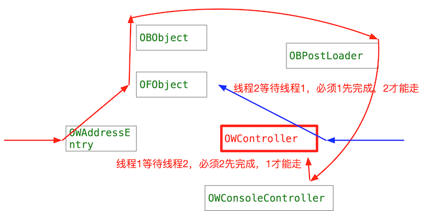
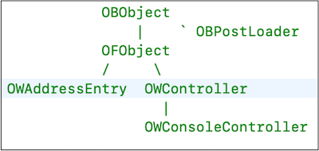
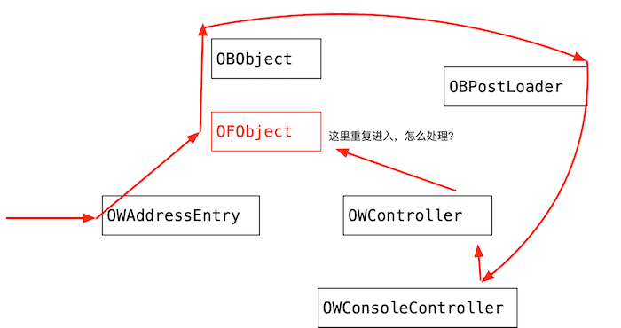

本文是我自己理解_class_initialize的记录

<!--more-->


## _class_initialize 源码分析

### _class_initialize 干什么  

_class_initialize 主要功能是调用+initialize方法。简化代码如下：

```
void _class_initialize(Class cls)
{
    // 调用 +initialize，主要的初始化工作，就是调用这个方法
    // 注意：如果 cls 没有实现 +initialize 方法的话，它会被发给父类
    ((void(*)(Class, SEL))objc_msgSend)(cls, SEL_initialize);
}
```


### 多线程调用_class_initialize的问题

假如有下面的示例：



调用的顺序如下

```
线程 1 ：
    初始化 OWAddressEntry 类 ->
    初始化 OFObject 类 ->
    初始化 OBObject 类 ->
    [OBObject initialize] 中用了 OBPostLoader 类，里面需要初始化好多类 ->
    初始化 OWConsoleController 类 ->
    初始化 OWController 类，发现线程2正在初始化 OWController 类，就阻塞等待线程2完成对 OWController 的初始化工作 ....
 
线程 2 ：
    初始化 OWController 类 ->
    初始化 OFObject 类，发现线程1正在初始化 OFObject 类，就阻塞等待线程1完成对 OFObject 类的初始化工作....：
```

上面这种多线程场景，就会出现死锁的问题。

解决办法：

父类一定比子类先开始初始化。
因为 OWController的父类 OFObject 还没有初始化，所以它也不会开始初始化，而是等到父类在同一线程开始初始化，或者在另一线程完成初始化后，才会进行初始化。所以线程2并没有在初始化OWController，线程1也并不需要等待，也就是没有了竞争和死锁。


### 保证父类的initialize如何比子类的调用早（早进入）


父类的initialize如何比子类的调用早 通过下面的代码实现：

```
if (supercls  &&  !supercls->isInitialized())///父类递归调用本函数
{
    _class_initialize(supercls);
}
```

### 如何等待父类调用完成

假如：有下面一个例子，如何保证父类比子类调用早呢 ？




调用的顺序如下：


1. 首先进入OWAddressEntry 找父类
2. OFObject 找父类
3. OBObject 执行initialize方法
4. [OBObject initialize] 中用了 OBPostLoader 类，里面需要初始化好多类 
5. 初始化 OWController 类 找父类
7. 再次进入OFObject 这里就重复进入了， 解决办法，查看父类正在RW_INITIALIZING，就不能在进入，直接开始OFObject的初始化。

这样就出现了一个问题，OFObject会比父类OBObject早结束initialize方法，这样是一个不完全的初始化，所以先将OFObject保持起来，等到父类完成了，然后在设置OFObject为初始哈完成状态。

这里就用到了一个数据结构：

```
typedef struct PendingInitialize {
    Class subclass;                 // 子类
    struct PendingInitialize *next; // 下一个，看来是一个链表
} PendingInitialize;
```

保存方法如下：

```
static void _finishInitializingAfter(Class cls, Class supercls)
{
    PendingInitialize *pending;
    
    .....

    pending->subclass = cls; // pending 记录子类 cls
    // next 指向下一个 pending，因为类会多个子类，所以还是才用了树的结构，next 指向的是兄弟节点
    pending->next = (PendingInitialize *) NXMapGet(pendingInitializeMap, supercls);
    // 将 pending 插入 pendingInitializeMap 中，key 是父类
    NXMapInsert(pendingInitializeMap, supercls, pending);
}
```

如果OFObject比OBObject先初始化完成，就调用_finishInitializingAfter将OFObject保存起来，等到父类OBObject初始化完成，在调用_finishInitializing从pendingInitializeMap中删除，同时置OFObject为初始化完成状态。

```
static void _finishInitializing(Class cls, Class supercls)
{
    cls->setInitialized();

    pending = (PendingInitialize *)NXMapGet(pendingInitializeMap, cls);

    // 利用 key cls 将 pending链表 从 pendingInitializeMap 中移除
    NXMapRemove(pendingInitializeMap, cls);
}
```


## 小结

到这里，我们对 `initialize` 方法的研究基本上已经结束了，这里会总结一下关于其方法的特性：

1. `initialize` 的调用是惰性的，它会在第一次调用当前类的方法时被调用
2. 与 `load` 不同，`initialize` 方法调用时，所有的类都**已经加载**到了内存中
3. `initialize` 的运行是线程安全的
4. 子类会**继承**父类的 `initialize` 方法

而其作用也非常局限，一般我们只会在 `initialize` 方法中进行一些常量的初始化。

## 参考资料

+ [What is a meta-class in Objective-C?](http://www.cocoawithlove.com/2010/01/what-is-meta-class-in-objective-c.html)
+ [NSObject +load and +initialize - What do they do?](http://stackoverflow.com/questions/13326435/nsobject-load-and-initialize-what-do-they-do)


