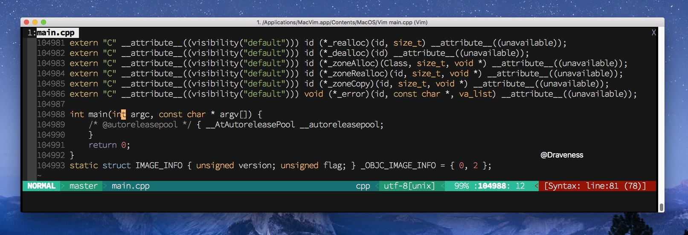
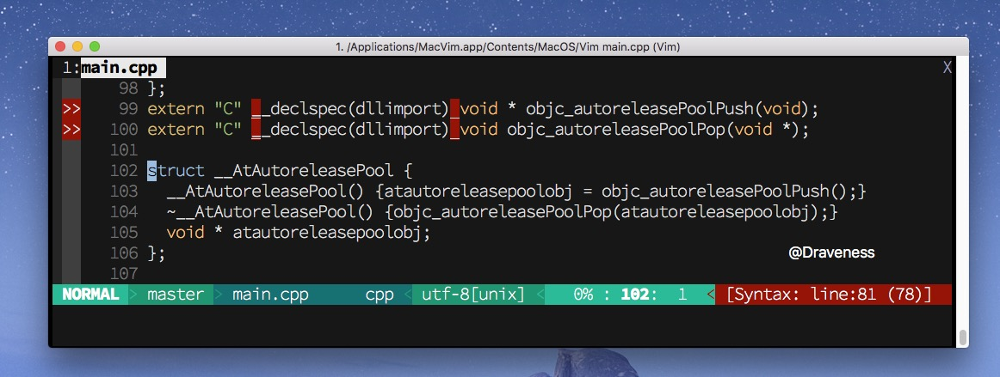
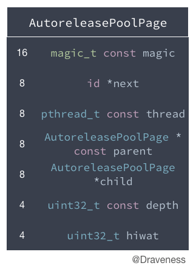
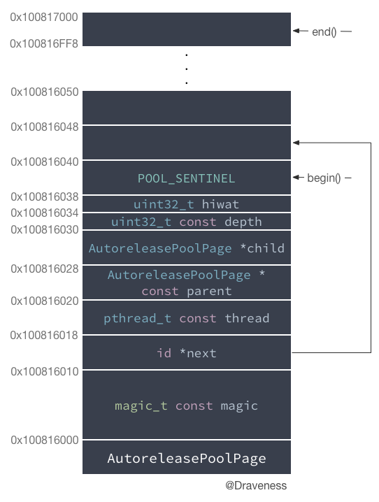
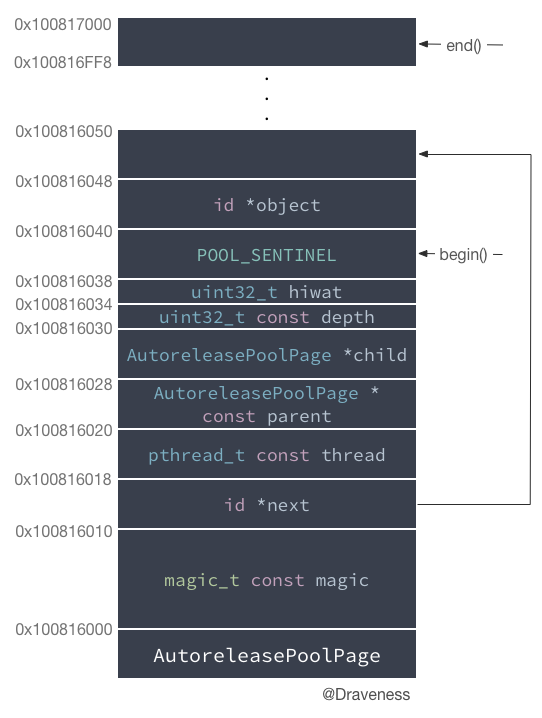
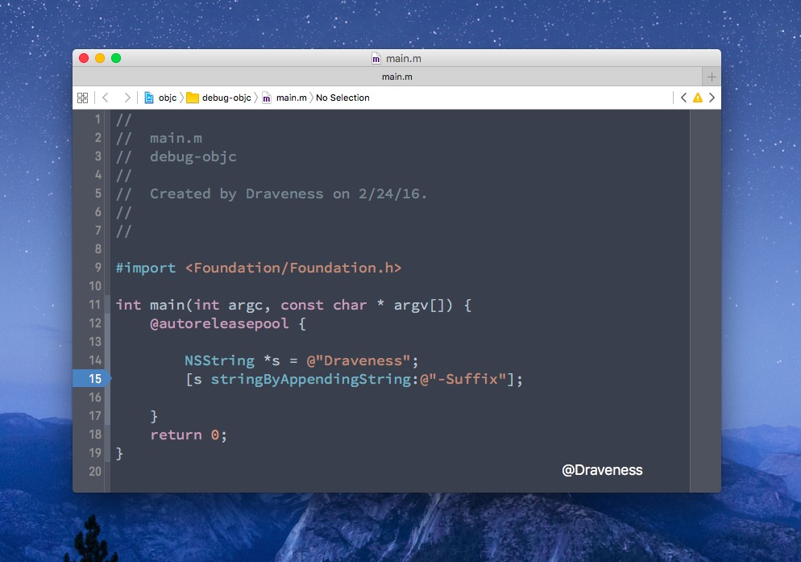
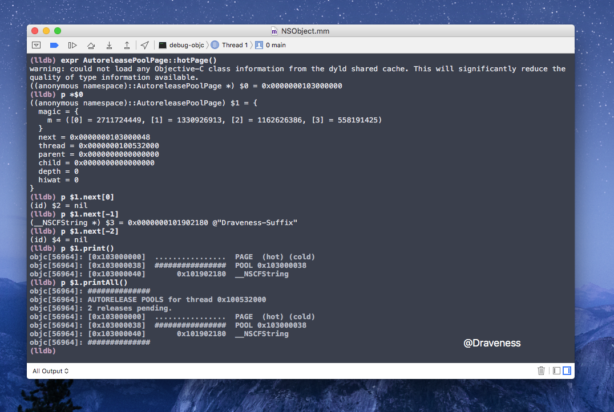

> 由于 Objective-C 中的内存管理是一个比较大的话题，所以会分为两篇文章来对内存管理中的一些机制进行剖析，一部分分析自动释放池以及 `autorelease` 方法，另一部分分析 `retain`、`release` 方法的实现以及自动引用计数。

<!--more-->

## 写在前面

这篇文章会在源代码层面介绍 Objective-C 中自动释放池，以及方法的 `autorelease` 的具体实现。

## 从 main 函数开始

`main` 函数可以说是在整个 iOS 开发中非常不起眼的一个函数，它很好地隐藏在 `Supporting Files` 文件夹中，却是整个 iOS 应用的入口。


`main.m` 文件中的内容是这样的：

```objectivec
int main(int argc, char * argv[]) {
    @autoreleasepool {
        return UIApplicationMain(argc, argv, nil, NSStringFromClass([AppDelegate class]));
    }
}
```

在这个 `@autoreleasepool` block 中只包含了一行代码，这行代码将所有的事件、消息全部交给了 `UIApplication` 来处理，但是这不是本文关注的重点。

需要注意的是：**整个 iOS 的应用都是包含在一个自动释放池 block 中的**。

## @autoreleasepool

`@autoreleasepool` 到底是什么？我们在命令行中使用 `clang -rewrite-objc main.m` 让编译器重新改写这个文件：

```shell
$ clang -rewrite-objc main.m
```

在生成了一大堆警告之后，当前目录下多了一个 `main.cpp` 文件



> 这里删除了 `main` 函数中其他无用的代码。

在这个文件中，有一个非常奇怪的 `__AtAutoreleasePool` 的结构体，前面的注释写到 `/* @autoreleasepool */`。也就是说 `@autoreleasepool {}` 被转换为一个 `__AtAutoreleasePool` 结构体：

```objectivec
{
    __AtAutoreleasePool __autoreleasepool;
}
```

想要弄清楚这行代码的意义，我们要在 `main.cpp` 中查找名为 `__AtAutoreleasePool` 的结构体：



```objectivec
struct __AtAutoreleasePool {
  __AtAutoreleasePool() {atautoreleasepoolobj = objc_autoreleasePoolPush();}
  ~__AtAutoreleasePool() {objc_autoreleasePoolPop(atautoreleasepoolobj);}
  void * atautoreleasepoolobj;
};
```

这个结构体会在初始化时调用 `objc_autoreleasePoolPush()` 方法，会在析构时调用 `objc_autoreleasePoolPop` 方法。

这表明，我们的 `main` 函数在实际工作时其实是这样的：

```objectivec
int main(int argc, const char * argv[]) {
    {
        void * atautoreleasepoolobj = objc_autoreleasePoolPush();
        
        // do whatever you want
        
        objc_autoreleasePoolPop(atautoreleasepoolobj);
    }
    return 0;
}
```

`@autoreleasepool` 只是帮助我们少写了这两行代码而已，让代码看起来更美观，然后要根据上述两个方法来分析自动释放池的实现。

## AutoreleasePool 是什么

这一节开始分析方法 `objc_autoreleasePoolPush` 和 `objc_autoreleasePoolPop` 的实现：

```objectivec
void *objc_autoreleasePoolPush(void) {
    return AutoreleasePoolPage::push();
}

void objc_autoreleasePoolPop(void *ctxt) {
    AutoreleasePoolPage::pop(ctxt);
}
```

上面的方法看上去是对 `AutoreleasePoolPage` 对应**静态方法** `push` 和 `pop` 的封装。

这一小节会按照下面的顺序逐步解析代码中的内容：

+ [AutoreleasePoolPage 的结构](#AutoreleasePoolPage)
+ [objc_autoreleasePoolPush 方法](#objc_autoreleasePoolPush)
+ [objc_autoreleasePoolPop 方法](#objc_autoreleasePoolPop)

### AutoreleasePoolPage 的结构

`AutoreleasePoolPage` 是一个 C++ 中的类：



它在 `NSObject.mm` 中的定义是这样的：

```objectivec
class AutoreleasePoolPage {
    magic_t const magic;
    id *next;
    pthread_t const thread;
    AutoreleasePoolPage * const parent;
    AutoreleasePoolPage *child;
    uint32_t const depth;
    uint32_t hiwat;
};
```

+ `magic` 用于对当前 `AutoreleasePoolPage` **完整性**的校验
+ `thread` 保存了当前页所在的线程

**每一个自动释放池都是由一系列的 `AutoreleasePoolPage` 组成的，并且每一个 `AutoreleasePoolPage` 的大小都是 `4096` 字节（16 进制 0x1000）**

```c
#define I386_PGBYTES 4096
#define PAGE_SIZE I386_PGBYTES
```

#### 双向链表

自动释放池中的 `AutoreleasePoolPage` 是以**双向链表**的形式连接起来的：


> `parent` 和 `child` 就是用来构造双向链表的指针。

#### 自动释放池中的栈

如果我们的一个 `AutoreleasePoolPage` 被初始化在内存的 `0x100816000 ~ 0x100817000` 中，它在内存中的结构如下：



其中有 56 bit 用于存储 `AutoreleasePoolPage` 的成员变量，剩下的 `0x100816038 ~ 0x100817000` 都是用来存储**加入到自动释放池中的对象**。

> `begin()` 和 `end()` 这两个类的实例方法帮助我们快速获取 `0x100816038 ~ 0x100817000` 这一范围的边界地址。

`next` 指向了下一个为空的内存地址，如果 `next` 指向的地址加入一个 `object`，它就会如下图所示**移动到下一个为空的内存地址中**：



> 关于 `hiwat` 和 `depth` 在文章中并不会进行介绍，因为它们并不影响整个自动释放池的实现，也不在关键方法的调用栈中。

#### POOL_SENTINEL（哨兵对象）

到了这里，你可能想要知道 `POOL_SENTINEL` 到底是什么，还有它为什么在栈中。

首先回答第一个问题： `POOL_SENTINEL` 只是 `nil` 的别名。

```objectivec
#define POOL_SENTINEL nil
```

在每个自动释放池初始化调用 `objc_autoreleasePoolPush` 的时候，都会把一个 `POOL_SENTINEL` push 到自动释放池的栈顶，并且返回这个 `POOL_SENTINEL` 哨兵对象。

```objectivec
int main(int argc, const char * argv[]) {
    {
        void * atautoreleasepoolobj = objc_autoreleasePoolPush();
        
        // do whatever you want
        
        objc_autoreleasePoolPop(atautoreleasepoolobj);
    }
    return 0;
}
```

> 上面的 `atautoreleasepoolobj` 就是一个 `POOL_SENTINEL`。

而当方法 `objc_autoreleasePoolPop` 调用时，就会向自动释放池中的对象发送 `release` 消息，直到第一个 `POOL_SENTINEL`：


### <a id='objc_autoreleasePoolPush'></a>objc_autoreleasePoolPush 方法

了解了 `POOL_SENTINEL`，我们来重新回顾一下 `objc_autoreleasePoolPush` 方法：

```objectivec
void *objc_autoreleasePoolPush(void) {
    return AutoreleasePoolPage::push();
}
```

它调用 `AutoreleasePoolPage` 的类方法 `push`，也非常简单：

```objectivec
static inline void *push() {
   return autoreleaseFast(POOL_SENTINEL);
}
```

<a id='autoreleaseFast'></a>在这里会进入一个比较关键的方法 `autoreleaseFast`，并传入哨兵对象 `POOL_SENTINEL`：

```objectivec
static inline id *autoreleaseFast(id obj)
{
   AutoreleasePoolPage *page = hotPage();
   if (page && !page->full()) {
       return page->add(obj);
   } else if (page) {
       return autoreleaseFullPage(obj, page);
   } else {
       return autoreleaseNoPage(obj);
   }
}
```

上述方法分三种情况选择不同的代码执行：

+ 有 `hotPage` 并且当前 `page` 不满
    + 调用 `page->add(obj)` 方法将对象添加至 `AutoreleasePoolPage` 的栈中
+ 有 `hotPage` 并且当前 `page` 已满
    + 调用 `autoreleaseFullPage` 初始化一个新的页
    + 调用 `page->add(obj)` 方法将对象添加至 `AutoreleasePoolPage` 的栈中
+ 无 `hotPage`
    + 调用 `autoreleaseNoPage` 创建一个 `hotPage`
    + 调用 `page->add(obj)` 方法将对象添加至 `AutoreleasePoolPage` 的栈中

最后的都会调用 `page->add(obj)` 将对象添加到自动释放池中。

> `hotPage` 可以理解为当前正在使用的 `AutoreleasePoolPage`。

#### page->add 添加对象

`id *add(id obj)` 将对象添加到自动释放池页中：

```objectivec
id *add(id obj) {
    id *ret = next;
    *next = obj;
    next++;
    return ret;
}
```

> 笔者对这个方法进行了处理，更方便理解。

这个方法其实就是一个压栈的操作，将对象加入 `AutoreleasePoolPage` 然后移动栈顶的指针。

#### autoreleaseFullPage（当前 hotPage 已满）

`autoreleaseFullPage` 会在当前的 `hotPage` 已满的时候调用：

```objectivec
static id *autoreleaseFullPage(id obj, AutoreleasePoolPage *page) {
    do {
        if (page->child) page = page->child;
        else page = new AutoreleasePoolPage(page);
    } while (page->full());

    setHotPage(page);
    return page->add(obj);
}
```

它会从传入的 `page` 开始遍历整个双向链表，直到：

1. 查找到一个未满的 `AutoreleasePoolPage`
2. 使用构造器传入 `parent` 创建一个新的 `AutoreleasePoolPage`

在查找到一个可以使用的 `AutoreleasePoolPage` 之后，会将该页面标记成 `hotPage`，然后调动上面分析过的 `page->add` 方法添加对象。

#### autoreleaseNoPage（没有 hotPage)

如果当前内存中不存在 `hotPage`，就会调用 `autoreleaseNoPage` 方法初始化一个 `AutoreleasePoolPage`：

```objectivec
static id *autoreleaseNoPage(id obj) {
    AutoreleasePoolPage *page = new AutoreleasePoolPage(nil);
    setHotPage(page);

    if (obj != POOL_SENTINEL) {
        page->add(POOL_SENTINEL);
    }

    return page->add(obj);
}
```

既然当前内存中不存在 `AutoreleasePoolPage`，就要**从头开始构建这个自动释放池的双向链表**，也就是说，新的 `AutoreleasePoolPage` 是没有 `parent` 指针的。

初始化之后，将当前页标记为 `hotPage`，然后会先向这个 `page` 中添加一个 `POOL_SENTINEL` 对象，来确保在 `pop` 调用的时候，不会出现异常。

最后，将 `obj` 添加到自动释放池中。

### <a id='objc_autoreleasePoolPop'></a>objc_autoreleasePoolPop 方法

同样，回顾一下上面提到的 `objc_autoreleasePoolPop` 方法：

```objectivec
void objc_autoreleasePoolPop(void *ctxt) {
    AutoreleasePoolPage::pop(ctxt);
}
```

> 看起来传入任何一个指针都是可以的，但是在整个工程并没有发现传入其他对象的例子。不过在这个方法中**传入其它的指针也是可行的**，会将自动释放池释放到相应的位置。

我们一般都会在这个方法中传入一个哨兵对象 `POOL_SENTINEL`，如下图一样释放对象：


#### 对 objc_autoreleasePoolPop 行为的测试

在继续分析这个方法之前做一个小测试，在 `objc_autoreleasePoolPop` 传入非哨兵对象，测试一下这个方法的行为。

下面是 `main.m` 文件中的源代码：

```objectivec
#import <Foundation/Foundation.h>

int main(int argc, const char * argv[]) {
    @autoreleasepool {

        NSString *s = @"Draveness";
        [s stringByAppendingString:@"-Suffix"];

    }
    return 0;
}
```

在代码的这一行打一个断点，因为这里会调用 `autorelease` 方法，将字符串加入自动释放池：



当代码运行到这里时，通过 lldb 打印出当前 `hotPage` 中的栈内容：



1. 通过 `static` 方法获取当前 `hotPage`
2. 打印 `AutoreleasePoolPage` 中的内容
3. 打印当前 `next` 指针指向的内容，以及之前的内容，`-2 `时已经到了 `begin()` 位置
4. 使用 `print() `和 `printAll() `打印自动释放池中内容

然后将字符串 `@"Draveness-Suffix"` 的指针传入 `pop` 方法，测试 `pop` 方法能否传入非哨兵参数。


再次打印当前 `AutoreleasePoolPage` 的内容时，字符串已经不存在了，这说明**向 `pop` 方法传入非哨兵参数是可行的**，只是我们一般不会传入非哨兵对象。

----

让我们重新回到对 `objc_autoreleasePoolPop` 方法的分析，也就是 `AutoreleasePoolPage::pop` 方法的调用：

```objectivec
static inline void pop(void *token) {
    AutoreleasePoolPage *page = pageForPointer(token);
    id *stop = (id *)token;

    page->releaseUntil(stop);

    if (page->child) {
        if (page->lessThanHalfFull()) {
            page->child->kill();
        } else if (page->child->child) {
            page->child->child->kill();
        }
    }
}
```

> 在这个方法中删除了大量无关的代码，以及对格式进行了调整。

该静态方法总共做了三件事情：

1. 使用 `pageForPointer` 获取当前 `token` 所在的 `AutoreleasePoolPage`
2. 调用 `releaseUntil` 方法释放**栈中的**对象，直到 `stop`
3. 调用 `child` 的 `kill` 方法

> 我到现在也不是很清楚为什么要根据当前页的不同状态 `kill` 掉不同 `child` 的页面。

```objectivec
if (page->lessThanHalfFull()) {
    page->child->kill();
} else if (page->child->child) {
    page->child->child->kill();
}
```

#### pageForPointer 获取 AutoreleasePoolPage

`pageForPointer` 方法主要是通过内存地址的操作，获取当前指针所在页的首地址：

```objectivec
static AutoreleasePoolPage *pageForPointer(const void *p) {
    return pageForPointer((uintptr_t)p);
}

static AutoreleasePoolPage *pageForPointer(uintptr_t p) {
    AutoreleasePoolPage *result;
    uintptr_t offset = p % SIZE;

    assert(offset >= sizeof(AutoreleasePoolPage));

    result = (AutoreleasePoolPage *)(p - offset);
    result->fastcheck();

    return result;
}
```

将指针与页面的大小，也就是 4096 取模，得到当前指针的偏移量，因为所有的 `AutoreleasePoolPage` 在内存中都是对齐的：

```
p = 0x100816048
p % SIZE = 0x48
result = 0x100816000
```

而最后调用的方法 `fastCheck()` 用来检查当前的 `result` 是不是一个 `AutoreleasePoolPage`。

> 通过检查 `magic_t` 结构体中的某个成员是否为 `0xA1A1A1A1`。

#### releaseUntil 释放对象

`releaseUntil` 方法的实现如下：

```objectivec
void releaseUntil(id *stop) {
    while (this->next != stop) {
        AutoreleasePoolPage *page = hotPage();

        while (page->empty()) {
            page = page->parent;
            setHotPage(page);
        }

        page->unprotect();
        id obj = *--page->next;
        memset((void*)page->next, SCRIBBLE, sizeof(*page->next));
        page->protect();

        if (obj != POOL_SENTINEL) {
            objc_release(obj);
        }
    }

    setHotPage(this);
}
```

它的实现还是很容易的，用一个 `while` 循环持续释放 `AutoreleasePoolPage` 中的内容，直到 `next` 指向了 `stop` 。

使用 `memset` 将内存的内容设置成 `SCRIBBLE`，然后使用 `objc_release` 释放对象。

#### kill() 方法

到这里，没有分析的方法就只剩下 `kill` 了，而它会将当前页面以及子页面全部删除：

```objectivec
void kill() {
    AutoreleasePoolPage *page = this;
    while (page->child) page = page->child;

    AutoreleasePoolPage *deathptr;
    do {
        deathptr = page;
        page = page->parent;
        if (page) {
            page->unprotect();
            page->child = nil;
            page->protect();
        }
        delete deathptr;
    } while (deathptr != this);
}
```

### autorelease 方法

我们已经对自动释放池生命周期有一个比较好的了解，最后需要了解的话题就是 `autorelease` 方法的实现，先来看一下方法的调用栈：

```objectivec
- [NSObject autorelease]
└── id objc_object::rootAutorelease()
    └── id objc_object::rootAutorelease2()
        └── static id AutoreleasePoolPage::autorelease(id obj)
            └── static id AutoreleasePoolPage::autoreleaseFast(id obj)
                ├── id *add(id obj)
                ├── static id *autoreleaseFullPage(id obj, AutoreleasePoolPage *page)
                │   ├── AutoreleasePoolPage(AutoreleasePoolPage *newParent)
                │   └── id *add(id obj)
                └── static id *autoreleaseNoPage(id obj)
                    ├── AutoreleasePoolPage(AutoreleasePoolPage *newParent)
                    └── id *add(id obj)
```

在 `autorelease` 方法的调用栈中，最终都会调用上面提到的 [autoreleaseFast](#autoreleaseFast) 方法，将当前对象加到 `AutoreleasePoolPage` 中。

这一小节中这些方法的实现都非常容易，只是进行了一些参数上的检查，最终还要调用 [autoreleaseFast](#autoreleaseFast) 方法：

```objectivec
inline id objc_object::rootAutorelease() {
    if (isTaggedPointer()) return (id)this;
    if (prepareOptimizedReturn(ReturnAtPlus1)) return (id)this;

    return rootAutorelease2();
}

__attribute__((noinline,used)) id objc_object::rootAutorelease2() {
    return AutoreleasePoolPage::autorelease((id)this);
}

static inline id autorelease(id obj) {
   id *dest __unused = autoreleaseFast(obj);
   return obj;
}
```

由于在上面已经分析过 `autoreleaseFast` 方法的实现，这里就不会多说了。

## 小结

整个自动释放池 `AutoreleasePool` 的实现以及 `autorelease` 方法都已经分析完了，我们再来回顾一下文章中的一些内容：

+ 自动释放池是由 `AutoreleasePoolPage` 以双向链表的方式实现的
+ 当对象调用 `autorelease` 方法时，会将对象加入 `AutoreleasePoolPage` 的栈中
+ 调用 `AutoreleasePoolPage::pop` 方法会向栈中的对象发送 `release` 消息

## 参考资料

+ [What is autoreleasepool? - Objective-C](http://stackoverflow.com/questions/14677049/what-is-autoreleasepool-objective-c)
+ [Using Autorelease Pool Blocks](https://developer.apple.com/library/ios/documentation/Cocoa/Conceptual/MemoryMgmt/Articles/mmAutoreleasePools.html)
+ [NSAutoreleasePool](https://developer.apple.com/library/ios/documentation/Cocoa/Reference/Foundation/Classes/NSAutoreleasePool_Class/index.html#//apple_ref/occ/cl/NSAutoreleasePool)
+ [黑幕背后的 Autorelease](http://blog.sunnyxx.com/2014/10/15/behind-autorelease/)

> Follow: [Draveness · Github](https://github.com/Draveness)


