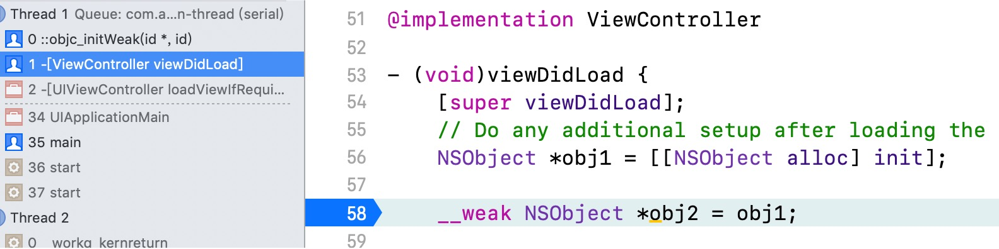
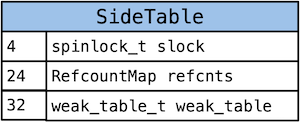
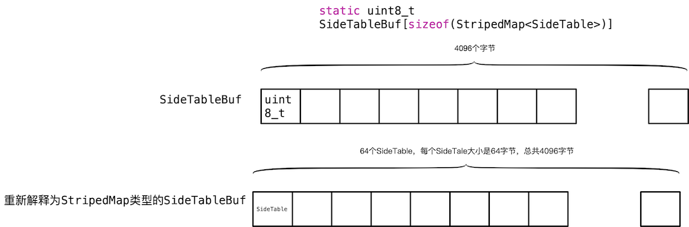
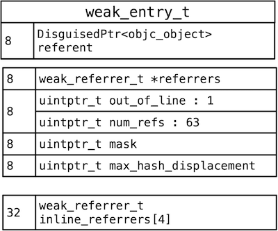
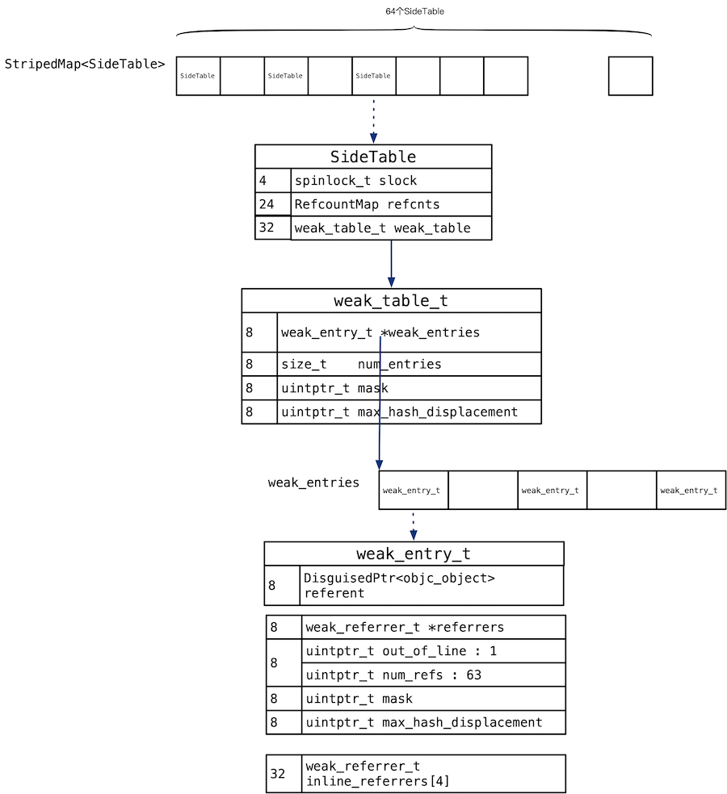
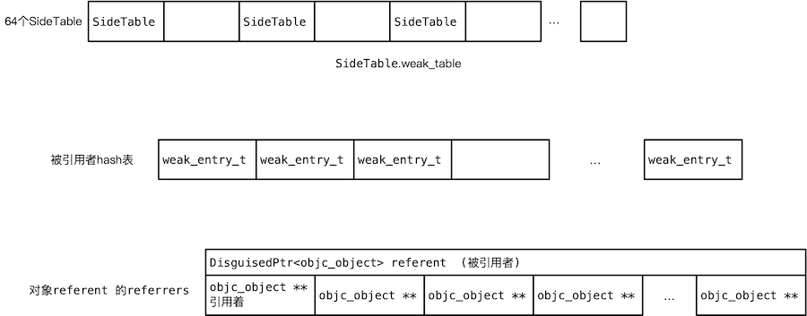

weak相关源码分析

<!--more-->


## __weak探究

程序中添加了一个`__weak`变量，查看调用堆栈，看到下一个调用的是`objc_initWeak`函数。



所以我们就objc_initWeak函数作为入口，探究weak。

## 数据结构

首先了解以下的变量，这些变量在这章的数据结构、函数形参中使用：

```
__weak id weakPtr = o
location            newObj
refferer            reffenent
引用着               被引用者
```


### StripedMap

下面从SideTables() 函数为入口，了解weak相关的数据结构。

```
static StripedMap<SideTable>& SideTables() {
    return *reinterpret_cast<StripedMap<SideTable>*>(SideTableBuf);
}
```

这个函数返回StripedMap<SideTable> 结构，StripedMap<SideTable> 是一个模板类，函数体内将SideTableBuf强制转换为`StripedMap<SideTable>*`：

StripedMap 定义如下：

```
template<typename T>
class StripedMap {
    struct PaddedT {
        T value alignas(64);
    };

    PaddedT array[64];
};
```

上面代码是StripedMap的简化定义，StripedMap是个模板类，根据模板参数T生成实例类，我们给模板参数传递的实参是SideTable，StripedMap内部只定义了一个数据成员PaddedT array[64]，PaddedT就是64位对齐后的SideTable。

进一步简化：

```
SideTable array[64];
```

所以StripedMap就是SideTable型的数组，数组有64个成员。

SideTable的结构如下：

```
struct SideTable {
    spinlock_t slock;
    RefcountMap refcnts;
    weak_table_t weak_table;
```



可以看出SideTable的大小是62，64位对齐后是64。其中weak_talbe存储着weak相关的内容。其他的两个成员refcnts、slock不在本文的研究范围内。

所以数组`SideTable array[64]` 中元素的大小就是64。整个array 共占用64*64=4096字节。回到没有简化前的版本，`StripedMap<SideTable>`本质是一个数组，数组的元素是模板参数类型 ---SideTable。大小为64。


函数SideTables()是将SideTableBuf转化为`StripedMap<SideTable>`的。所以下面了解SideTableBuf的定义。


### SideTableBuf

SideTableBuf的定义：

```
alignas(StripedMap<SideTable>) static uint8_t
    SideTableBuf[sizeof(StripedMap<SideTable>)];
```

前面的alignas(StripedMap<SideTable>)是对齐的。`sizeof(StripedMap<SideTable>)`根据上面分析是4096，所以上面的代码简化为：

```
static uint8_t SideTableBuf[4096];
```

所以SideTableBuf 就是一个包含 4096个uint8_t的数组 。

所以,函数SideTables() 就相当将uint8_t SideTableBuf[4096] 重新解释为`SideTable array[64]`。

```
static StripedMap<SideTable>& SideTables() {
    return *reinterpret_cast<StripedMap<SideTable>*>(SideTableBuf);
}
```




###  weak_table_t

```
// 全局的弱引用表
struct weak_table_t {
    weak_entry_t *weak_entries; 
    size_t    num_entries; // 实体的数量
    uintptr_t mask;
    uintptr_t max_hash_displacement;
};
```

1.  weak_entries一个数组，数组每个元素是 weak_entry_t 结构体，一个weak_entry_t结构存储了一个reffenent，以及指向reffenent的弱引用者们。
2. num_entries 是实体（weak_entry_t）的数量
3. mask是容量减1.

###  weak_entry_t

```
struct weak_entry_t {
    DisguisedPtr<objc_object> referent; 
    union {
        struct {
            weak_referrer_t *referrers; 
            uintptr_t        out_of_line : 1; // 变量名是 out_of_line ，占 1 个 bit
            uintptr_t        num_refs : PTR_MINUS_1; // 数组中有几个元素，即 referent 有几个弱引用
            uintptr_t        mask;
            uintptr_t        max_hash_displacement;
        };
        struct {
            // out_of_line=0 is LSB of one of these (don't care which)
            weak_referrer_t  inline_referrers[WEAK_INLINE_COUNT];
        };
    };
};
```

这个结构看着比较复杂：

1. referent存储被弱引用的对象。
2. 第二个成员是一个union，存储若引用者（refferer）。如果referent的弱引用者小于四个，也就是out_of_line为0时，弱引用者就存储在inline_referrers数组中。 否则，就存储在referrers中，这是out_of_line 为1，referrers是个二级指针，里面存的是指向referent 的对象们的地址。num_refs 是弱引用着的个数。mask是容量减1。





### 小结

上面分析了weak相关的结构，现在花一张总图：



上面是详细的数据结构，比较复杂，下面列出我认为核心的结构，核心结构就是三级hash表。




## 函数接口 

```
id objc_storeWeakOrNil(id *location, id newObj);
id objc_initWeak(id *location, id newObj);
void objc_destroyWeak(id *location);
```

下面章节的代码只是简化的代码，为了方便理解，可能缺失部分细节。

### objc_initWeak

```
id
objc_initWeak(id *location, id newObj)
{
    if (!newObj) {
        *location = nil;
        return nil;
    }

    return storeWeak<DontHaveOld, DoHaveNew, DoCrashIfDeallocating>
        (location, (objc_object*)newObj);
}
```

objc_initWeak内部只调用了storeWeak函数。

### objc_storeWeak
 
```
id
objc_storeWeak(id *location, id newObj)
{

    return storeWeak<true/*old*/,
                    true/*new*/,
                    true/*crash*/>
        (location, (objc_object *)newObj);
}
```

### objc_destroyWeak

```
objc_destroyWeak(id *location)
{
    (void)storeWeak<true/*old*/, false/*new*/, false/*crash*/>
        (location, nil);
}
```

可以看出objc_initWeak 、 objc_storeWeak 、objc_destroyWeak 的关键内容都是调用storeWeak函数，只是模板参数传递的不一样。


### storeWeak 

下面讲解storeWeak函数，下面只关注添加的过程。删除的过程没有关注。

```
template <HaveOld haveOld, HaveNew haveNew,
          CrashIfDeallocating crashIfDeallocating>
static id 
storeWeak(id *location, objc_object *newObj)
{
    assert(haveOld  ||  haveNew);
    if (!haveNew) assert(newObj == nil);

    Class previouslyInitializedClass = nil;
    id oldObj;
    SideTable *oldTable;
    SideTable *newTable;

    if (haveNew) {
        newTable = &SideTables()[newObj];
    } else {
        newTable = nil;
    }


    // Assign new value, if any.
    if (haveNew) {
        newObj = (objc_object *)
            weak_register_no_lock(&newTable->weak_table, (id)newObj, location, 
                                  crashIfDeallocating);
    }
    return (id)newObj;
}
```


```
if (haveNew) {
        newTable = &SideTables()[newObj];
    } else {
        newTable = nil;
    }
```

就是根据newObj 找到存储newObj的地址对应的SideTable。


```
 static unsigned int indexForPointer(const void *p) {
        uintptr_t addr = reinterpret_cast<uintptr_t>(p);
        return ((addr >> 4) ^ (addr >> 9)) % StripeCount;
    }

 public:
    T& operator[] (const void *p) { 
        return array[indexForPointer(p)].value; 
    }
```

StripedMap重载了[] 操作符，内部调用了indexForPointer ，indexForPointer就是将对象的地址做某些操作，相当于hash。然后将hash的结果和64取余，得到0~63的值，这个值就可以当做数组的索引使用。

storeWeak函数接着调用了 weak_register_no_lock函数：


```
id 
weak_register_no_lock(weak_table_t *weak_table, id referent_id, 
                      id *referrer_id, bool crashIfDeallocating)
{
    objc_object *referent = (objc_object *)referent_id;
    objc_object **referrer = (objc_object **)referrer_id;
	 weak_entry_t *entry;
  

    // now remember it and where it is being stored
    weak_entry_t *entry;
    // 找到 referent 所在的 entry
    if ((entry = weak_entry_for_referent(weak_table, referent))) {
        // 将 referrer 添加进这个 entry 中，这样 referrer 就成为 referent 的弱引用之一了
        append_referrer(entry, referrer);
    }
    // 如果没有找到对应的 entry ，那么说明 referent 还没有弱引用，就为其新建一个 entry
    else {
        weak_entry_t new_entry;
        new_entry.referent = referent;
        new_entry.out_of_line = 0;
        new_entry.inline_referrers[0] = referrer;
        // 数组中 4 个referrer全部初始化为 nil
        for (size_t i = 1; i < WEAK_INLINE_COUNT; i++) {
            new_entry.inline_referrers[i] = nil;
        }
        // 检查一下需不需要扩容
        weak_grow_maybe(weak_table);
        // 将新建的 entry 插入 weak table 中
        weak_entry_insert(weak_table, &new_entry);
    }
    return referent_id;
}
```

这个函数的功能就是讲referrer_id 插入到正确的位置，分为两种情况：

1. 如果根据referent_id可以找到一个weak_entry_t类型的实体entry ，就调用将append_referrer 将referrer_id插入到entry（相当于三级hash表）中。
2. 如果没有，就需要新建一个weak_entry_t类型的实体new_entry。然后调用weak_entry_insert将new_entry插入到二级hash表中。


```
static weak_entry_t *
weak_entry_for_referent(weak_table_t *weak_table, objc_object *referent)
{
    // 不能是 nil
    assert(referent);

    // weak_table 中存的实体数组
    weak_entry_t *weak_entries = weak_table->weak_entries;

    if (!weak_entries) {
        return nil;
    }

    // 通过 Hash 的方法找到 referent 所在的索引，不过实在看不懂
    size_t index = hash_pointer(referent) & weak_table->mask;
    size_t hash_displacement = 0;
    while (weak_table->weak_entries[index].referent != referent) {
        index = (index+1) & weak_table->mask;
        hash_displacement++;
        if (hash_displacement > weak_table->max_hash_displacement) {
            return nil;
        }
    }
    
    // 返回找到的 weak_entry_t，这里可以证明 weak_entries 确实是一个数组
    return &weak_table->weak_entries[index];
}
```

weak_entry_for_referent 根据给的的referent 在weak_table->weak_entries中遍历，是否有相同的，如果相同就返回对应的weak_entry_t类型的实体，如果没有nil。

hash_pointer 就是对对象referent的地址做个hash，然后和`weak_table->mask` 做与操作，返回的结果小于weak_table->mask，当做数组的索引。

hash_displacement记录的就是最佳位置和实际存储位置的便宜距离。


```
static void weak_entry_insert(weak_table_t *weak_table, weak_entry_t *new_entry)
{
    weak_entry_t *weak_entries = weak_table->weak_entries;
    assert(weak_entries != nil);

    // 通过 hash 决定 索引
    size_t index = hash_pointer(new_entry->referent) & (weak_table->mask);
    size_t hash_displacement = 0;
    
    // 如果该索引中已经有 entry，那么这个索引就不能用了，就找下一个索引
    while (weak_entries[index].referent != nil) {
        index = (index+1) & weak_table->mask;
        hash_displacement++;
    }

    // 将 new_entry 放入指定的索引中
    weak_entries[index] = *new_entry;
    weak_table->num_entries++;

    if (hash_displacement > weak_table->max_hash_displacement) {
        weak_table->max_hash_displacement = hash_displacement;
    }
}
```

weak_entry_insert 就是在二级hash表中插入一个新的实体new_entry。通过hash_pointer找到一个最佳位置index，如果最佳位置已经有内容了，就接着查找下一个位置，直到找到空位置。记录下index。在index处插入new_entry。同时将num_entries累加1。


```
static void append_referrer(weak_entry_t *entry, objc_object **new_referrer)
{
    // out_of_line == 0 的情况
    if (! entry->out_of_line) {
        // Try to insert inline.
        // inline_referrers 还放得下，就放在 inline_referrers 里
        for (size_t i = 0; i < WEAK_INLINE_COUNT; i++) {
            if (entry->inline_referrers[i] == nil) {
                entry->inline_referrers[i] = new_referrer;
                return;
            }
        }

        weak_referrer_t *new_referrers = (weak_referrer_t *)
            calloc(WEAK_INLINE_COUNT, sizeof(weak_referrer_t));
    
        
        // 将 inline_referrers 存的 4 个对象拷贝到 new_referrers 中
        for (size_t i = 0; i < WEAK_INLINE_COUNT; i++) {
            new_referrers[i] = entry->inline_referrers[i];
        }
        entry->referrers = new_referrers;
        entry->num_refs = WEAK_INLINE_COUNT;
        entry->out_of_line = 1;
        entry->mask = WEAK_INLINE_COUNT-1;
        entry->max_hash_displacement = 0;
    }

    assert(entry->out_of_line);

    if (entry->num_refs >= TABLE_SIZE(entry) * 3/4) {
        return grow_refs_and_insert(entry, new_referrer);
    }
    
    size_t index = w_hash_pointer(new_referrer) & (entry->mask);
    size_t hash_displacement = 0;
    // 找到可以存放 new_referrer 的索引位置
    while (entry->referrers[index] != NULL) {
        index = (index+1) & entry->mask;
        hash_displacement++;
    }
    if (hash_displacement > entry->max_hash_displacement) {
        entry->max_hash_displacement = hash_displacement;
    }
    // 将 index 处的对象替换成 new_referrer
    weak_referrer_t &ref = entry->referrers[index];
    ref = new_referrer;
    // 总数加一
    entry->num_refs++;
}

```

append_referrer 是在三级hash表entry中出入一个新的弱引用着new_referrer。

分为三种情况：

1. 如果inline_referrers没有存储满，直接存储到inline_referrers中
2. 如果inline_referrers个数是4个了，在插入，就需要将inline_referrers拷贝到referrers，然后进入第三步。
2. 如果inline_referrers存储满了，判断是否需要扩容，然后将数据存储到referrers中。

存储到inline_referrers的代码是：

```
for (size_t i = 0; i < WEAK_INLINE_COUNT; i++) {
    if (entry->inline_referrers[i] == nil) {
        entry->inline_referrers[i] = new_referrer;
        return;
    }
}
```

存储完成后，直接返回了，所以后面的代码就是存储在referrers的情况。

```
weak_referrer_t *new_referrers = (weak_referrer_t *)
    calloc(WEAK_INLINE_COUNT, sizeof(weak_referrer_t));
    
    
// 将 inline_referrers 存的 4 个对象拷贝到 new_referrers 中
for (size_t i = 0; i < WEAK_INLINE_COUNT; i++) {
    new_referrers[i] = entry->inline_referrers[i];
}
entry->referrers = new_referrers;
entry->num_refs = WEAK_INLINE_COUNT;
entry->out_of_line = 1;
entry->mask = WEAK_INLINE_COUNT-1;
entry->max_hash_displacement = 0;
```
这段代码的功能是inline_referrers正好4个，如果再次添加，肯定放不下了，所以将inline_referrers中的数据移到referrers中。

```
if (entry->num_refs >= TABLE_SIZE(entry) * 3/4) {
    return grow_refs_and_insert(entry, new_referrer);
}
```

如果使用超过 3/4，就先扩容，然后再插入。


```
size_t index = w_hash_pointer(new_referrer) & (entry->mask);
size_t hash_displacement = 0;
// 找到可以存放 new_referrer 的索引位置
while (entry->referrers[index] != NULL) {
    index = (index+1) & entry->mask;
    hash_displacement++;
}
if (hash_displacement > entry->max_hash_displacement) {
    entry->max_hash_displacement = hash_displacement;
}
// 将 index 处的对象替换成 new_referrer
weak_referrer_t &ref = entry->referrers[index];
ref = new_referrer;
// 总数加一
entry->num_refs++;
```

上面的代码是通过弱引用着new_referrer找到index。然后从index开始，寻址空位置，将new_referrer插入到entry->referrers[index]位置处。同时将entry->num_refs累加


## 总结

weak即使一个三级hash表。

1. 第一级用来提高效率的，可以想象，很多多选，放到一个hash表中，降低了效率。所有将多有的对象散列到64个表中。
2. 二级缓存存储被弱引用的对象。
3. 三级缓存存储某个对象的所有的弱引用着。


