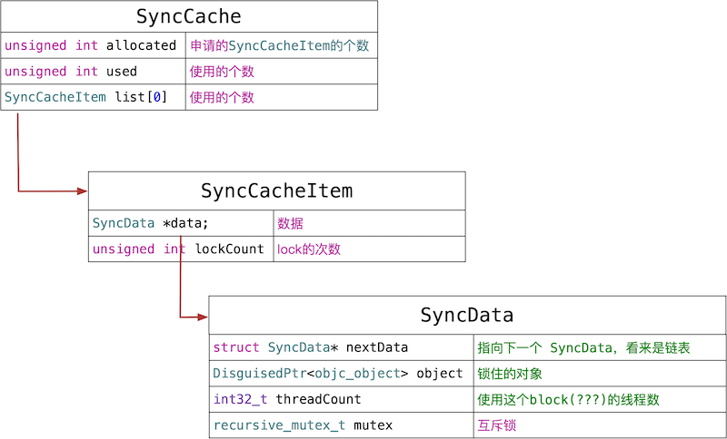
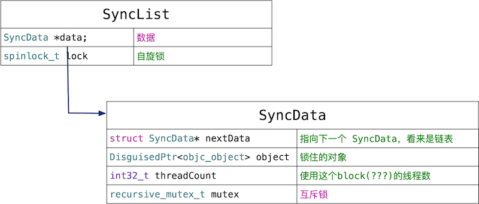
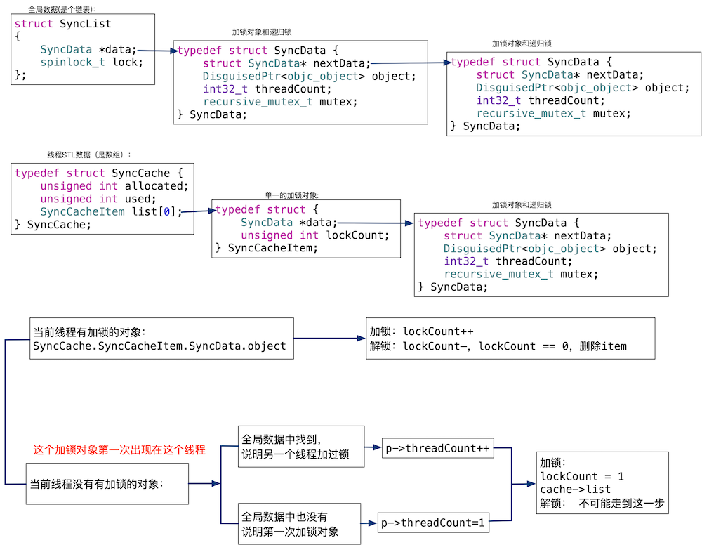

@synchronized  内幕揭秘

<!--more-->


## @synchronized揭秘

```
int main(int argc, const char * argv[]) {
    @autoreleasepool {
        AXPerson * p = [AXPerson new];
        @synchronized (p) {
            NSLog(@"p is @synchronized");
        }
    }
    return 0;
}
```

重写为C++：

```
int main(int argc, const char * argv[]) {
    { __AtAutoreleasePool __autoreleasepool;
        AXPerson * p = ((AXPerson *(*)(id, SEL))(void *)objc_msgSend)((id)objc_getClass("AXPerson"), sel_registerName("new"));
        {
            id _sync_obj = (id)p;
            objc_sync_enter(_sync_obj);  
            struct _SYNC_EXIT {
                _SYNC_EXIT(id arg) : sync_exit(arg) {} // 构造函数
                ~_SYNC_EXIT() { // 析构函数，析构的时候会自动释放锁
                    objc_sync_exit(sync_exit); 
                }
                id sync_exit; // 成员变量
            }
            _sync_exit(_sync_obj);  
            NSLog((NSString *)&__NSConstantStringImpl__var_folders_cp_sc2q63f937j88dcxp23f471w0000gn_T_main_3c34e3_mi_0);
         }
    }
    return 0;
}
```

下面一步步分析代码 

```
id _sync_obj = (id)p;
objc_sync_enter(_sync_obj); 
```

将上锁的对象p赋值给_sync_obj ， 调用objc_sync_enter函数，实参传递_sync_obj, objc_sync_enter函数就相当于上锁。后面详细分析

```
struct _SYNC_EXIT {
    _SYNC_EXIT(id arg) : sync_exit(arg) {} // 构造函数
    ~_SYNC_EXIT() { // 析构函数，析构的时候会自动释放锁
        objc_sync_exit(sync_exit); 
    }
    id sync_exit; // 成员变量
}
_sync_exit(_sync_obj);
```

这不是一个单独的语句，注意看结构体的右大括号后面并没有分号，所以 _sync_exit(_sync_obj) 是跟在 _SYNC_EXIT 结构体后面的，即它声明了一个名为 _sync_exit 的结构体对象。

_sync_exit对象的的析构函数里面调用了objc_sync_exit函数。这个函数相当于解锁。 析构函数在_sync_exit释放的时候调用。也就是作用域结束的时候调用。
                                    
所以， `@synchronized (p)` 相当于  新建了一个作用域，在作用域开始的时候，调用objc_sync_enter函数，实参是p，作用域结束的时候，自动调用析构函数objc_sync_exit，解锁。

## @synchronized数据结构

@synchronized 相关的数据结构，安装存储的位置划分，有两种：

1. 线程内部存储的数据。
2. 全局数据，用来线程间共享。

后面会分析这两种数据的相互关系。

线程内部：

```
typedef struct SyncData { // 同步数据结构体
    struct SyncData* nextData; // 指向下一个 SyncData，看来是链表
    DisguisedPtr<objc_object> object; // 锁住的对象
    int32_t threadCount;  // 使用这个block(???)的线程数  number of THREADS using this block
    recursive_mutex_t mutex; // 递归锁
} SyncData;


typedef struct {
    SyncData *data;
    unsigned int lockCount;  // number of times THIS THREAD locked this block
} SyncCacheItem;


typedef struct SyncCache {
    unsigned int allocated;
    unsigned int used;
    SyncCacheItem list[0];
} SyncCache;
```



全局数据定义如下：

```
struct SyncList {
    SyncData *data;
    spinlock_t lock; // 自旋锁

    SyncList() : data(nil) { }
};
```




## @synchronized源码分析

@synchronized 相关的API有两个：

```
int objc_sync_enter(id obj)
int objc_sync_exit(id obj)
```

### objc_sync_enter

```
int objc_sync_enter(id obj)
{
    int result = OBJC_SYNC_SUCCESS; // 用来记录结果，默认成功

    if (obj) { // obj 必须非空，
        SyncData* data = id2data(obj, ACQUIRE); // 为 obj 对象绑定一个递归锁
        assert(data);
        data->mutex.lock(); // 递归锁加锁
    }
    else { // 否则 @synchronized 啥也不干
        // @synchronized(nil) does nothing
        if (DebugNilSync) {
            _objc_inform("NIL SYNC DEBUG: @synchronized(nil); set a breakpoint on objc_sync_nil to debug");
        }
        objc_sync_nil();
    }

    return result;
}
```

内部调用了id2data函数，取出所对象，上锁。

### objc_sync_exit

```
int objc_sync_exit(id obj)
{
    int result = OBJC_SYNC_SUCCESS;
    
    if (obj) {
        SyncData* data = id2data(obj, RELEASE); // 为 obj 解绑递归锁
        if (!data) {
            result = OBJC_SYNC_NOT_OWNING_THREAD_ERROR; // 压根儿没有 objc_sync_enter 过
        } else {
            bool okay = data->mutex.tryUnlock(); // 尝试解锁
            if (!okay) {
                result = OBJC_SYNC_NOT_OWNING_THREAD_ERROR; // 解锁失败
            }
        }
    } else {
        // @synchronized(nil) does nothing
    }
	

    return result;
}
```

通过id2data取出锁对象，解锁。

所以关键锁对象建模都在id2data函数中。这个函数顾名思义，就是将id类型的对象转化为锁数据。


### id2data

```
static SyncData* id2data(id object, enum usage why)
{
    spinlock_t *lockp = &LOCK_FOR_OBJ(object);
    SyncData **listp = &LIST_FOR_OBJ(object);
    SyncData* result = NULL;

    
    // Check per-thread cache of already-owned locks for matching object
    SyncCache *cache = fetch_cache(NO);
    if (cache) {
        unsigned int i;
        for (i = 0; i < cache->used; i++) {
            SyncCacheItem *item = &cache->list[i];
            if (item->data->object != object) continue;

            // Found a match.
            result = item->data;
            if (result->threadCount <= 0  ||  item->lockCount <= 0) {
                _objc_fatal("id2data cache is buggy");
            }
                
            switch(why) {
            case ACQUIRE:
                item->lockCount++;
                break;
            case RELEASE:
                item->lockCount--;
                if (item->lockCount == 0) {
                    // remove from per-thread cache
                    cache->list[i] = cache->list[--cache->used];
                    // atomic because may collide with concurrent ACQUIRE
                    OSAtomicDecrement32Barrier(&result->threadCount);
                }
                break;
            case CHECK:
                // do nothing
                break;
            }

            return result;
        }
    }

    // Thread cache didn't find anything.
    // Walk in-use list looking for matching object
    // Spinlock prevents multiple threads from creating multiple 
    // locks for the same new object.
    // We could keep the nodes in some hash table if we find that there are
    // more than 20 or so distinct locks active, but we don't do that now.
    
    lockp->lock();
    {
        SyncData* p;
        SyncData* firstUnused = NULL;
        for (p = *listp; p != NULL; p = p->nextData) {
            if ( p->object == object ) {
                result = p;
                // atomic because may collide with concurrent RELEASE
                OSAtomicIncrement32Barrier(&result->threadCount);
                goto done;
            }
            if ( (firstUnused == NULL) && (p->threadCount == 0) )
                firstUnused = p;
        }
    
        // no SyncData currently associated with object
        if ( (why == RELEASE) || (why == CHECK) )
            goto done;
    
        // an unused one was found, use it
        if ( firstUnused != NULL ) {
            result = firstUnused;
            result->object = (objc_object *)object;
            result->threadCount = 1;
            goto done;
        }
    }

    // malloc a new SyncData and add to list.
    // XXX calling malloc with a global lock held is bad practice,
    // might be worth releasing the lock, mallocing, and searching again.
    // But since we never free these guys we won't be stuck in malloc very often.
    result = (SyncData*)calloc(sizeof(SyncData), 1);
    result->object = (objc_object *)object;
    result->threadCount = 1;
    new (&result->mutex) recursive_mutex_t();
    result->nextData = *listp;
    *listp = result;
    
 done:
    lockp->unlock();
    if (result) {
        // Only new ACQUIRE should get here.
        // All RELEASE and CHECK and recursive ACQUIRE are 
        // handled by the per-thread caches above.
        if (why == RELEASE) {
            // Probably some thread is incorrectly exiting 
            // while the object is held by another thread.
            return nil;
        }
        if (why != ACQUIRE) _objc_fatal("id2data is buggy");
        if (result->object != object) _objc_fatal("id2data is buggy");
        {
            // Save in thread cache
            if (!cache) cache = fetch_cache(YES);
            cache->list[cache->used].data = result;
            cache->list[cache->used].lockCount = 1;
            cache->used++;
        }
    }
    return result;
}
```

```
#define LOCK_FOR_OBJ(obj) sDataLists[obj].lock
#define LIST_FOR_OBJ(obj) sDataLists[obj].data
static StripedMap<SyncList> sDataLists;
```
整个代码可以分为2种情况：

1. 当前线程的TLS已经有对象object的数据 ：直接对锁的次数lockCount累加.
2. 当前的线程里面没有，说明object在这个线程第一次上锁，那么也分两种情况，一种情况是：这个对象在所有线程中第一次上锁，那么，新建锁对象数据SyncData，然后将线程数threadCount赋值为1.  数据另一种情况是，这个对象在其他的线程中上过锁，那么从全局数据sDataLists中取出锁数据listp，将线程数累加。  因为这两种情况都是第一次进入这个线程，所以，执行完上面的操作，需要将锁数据result添加到线程TLS中。

下面放置了一张图，方便理解 。图的上面是全局数据结构，是个链表，因为全局的数据比较多。所以使用高效的链表作为基本数据结构。中间是线程内部的数据结构，对于某个线程，锁没有全局的多，所以使用简单的数据结构数组。下面部分是这段代码的基本逻辑。




拆分理解三种情况：

```
 SyncCache *cache = fetch_cache(NO);
if (cache) {
    unsigned int i;
    for (i = 0; i < cache->used; i++) {
        SyncCacheItem *item = &cache->list[i];
        if (item->data->object != object) continue;

        // Found a match.
        result = item->data;
        if (result->threadCount <= 0  ||  item->lockCount <= 0) {
            _objc_fatal("id2data cache is buggy");
        }
            
        switch(why) {
        case ACQUIRE:
            item->lockCount++;
            break;
        case RELEASE:
            item->lockCount--;
            if (item->lockCount == 0) {
                // remove from per-thread cache
                cache->list[i] = cache->list[--cache->used];
                // atomic because may collide with concurrent ACQUIRE
                OSAtomicDecrement32Barrier(&result->threadCount);
            }
            break;
        case CHECK:
            // do nothing
            break;
        }

        return result;
    }
}
```

上面的代码是第一种情况，上锁情况累加lockCount，解锁情况递减lockCount。如果lockCount为0 ，清楚数据。如果符合这种情况，就直接返回了。 下面的代码都属于第二种情况。

```
SyncData* p;
SyncData* firstUnused = NULL;
for (p = *listp; p != NULL; p = p->nextData) {
    if ( p->object == object ) {
        result = p;
        // atomic because may collide with concurrent RELEASE
        OSAtomicIncrement32Barrier(&result->threadCount);
        goto done;
    }
    if ( (firstUnused == NULL) && (p->threadCount == 0) )
        firstUnused = p;
}
```
这个代码是对象的锁数据在全局数据中找到了。直接递增threadCount。

```
 // an unused one was found, use it
if ( firstUnused != NULL ) {
    result = firstUnused;
    result->object = (objc_object *)object;
    result->threadCount = 1;
    goto done;
}
```

这种情况是对象在全局数据中没有找到对应的锁数据，也就是第一对对象加锁，但是在全局数据中找到了空的result，直接赋值threadCount为1。

```
result = (SyncData*)calloc(sizeof(SyncData), 1);
result->object = (objc_object *)object;
result->threadCount = 1;
new (&result->mutex) recursive_mutex_t();
result->nextData = *listp;
*listp = result;
```
这种情况是对象在全局数据中没有找到对应的锁数据，也就是第一对对象加锁，并且在全局数据中没有找到空的SyncData。直接创建，添加到链表中。

```
if (!cache) cache = fetch_cache(YES);
cache->list[cache->used].data = result;
cache->list[cache->used].lockCount = 1;
cache->used++;
```

这段代码是第二种情况的最后一步，以为第二种情况都是第一次进入改线程，所以需要将创建或者以后的锁数据result添加到线程数据TLS中。


## 总结

@synchronized 就是在作用开始的时候，调用objc_sync_enter 函数，用对象创建出了锁数据SyncData，并上锁 。 当作用域结束的时候，调用objc_sync_exit 解锁，使用的锁是递归锁，在同一个线程中可以重入。所以，对同一个对象嵌套使用@synchronized，不会死锁。

