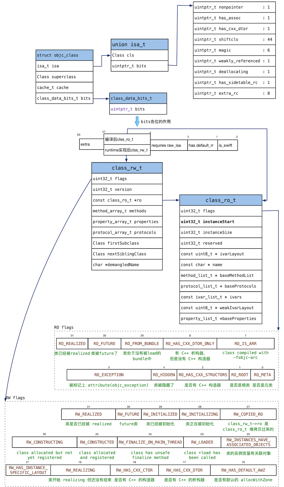
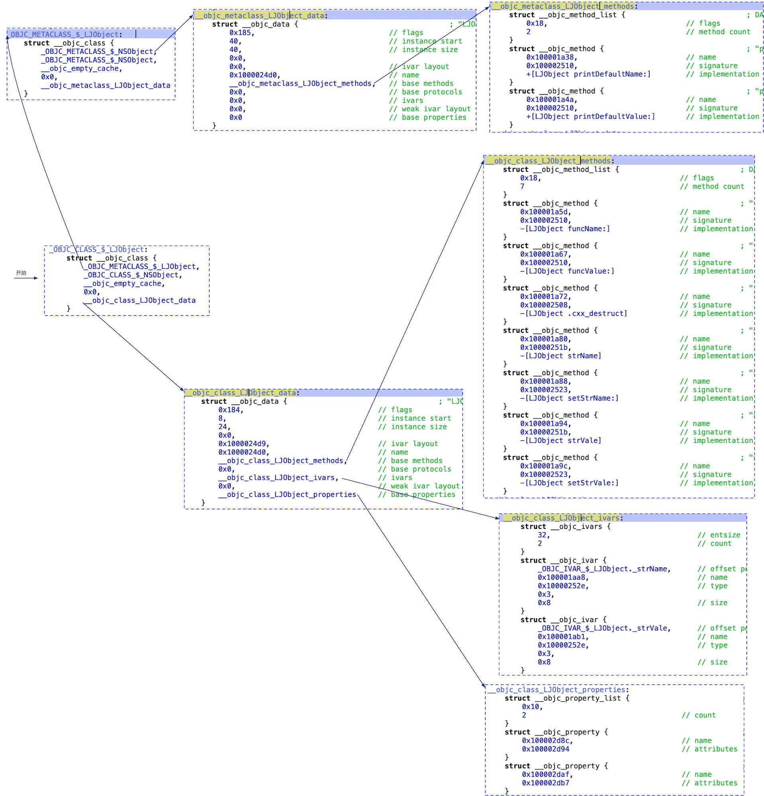
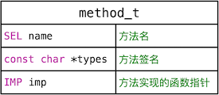
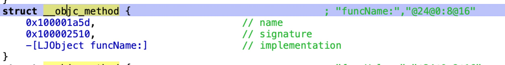
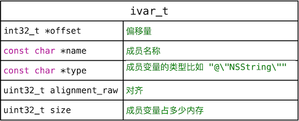
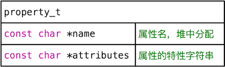
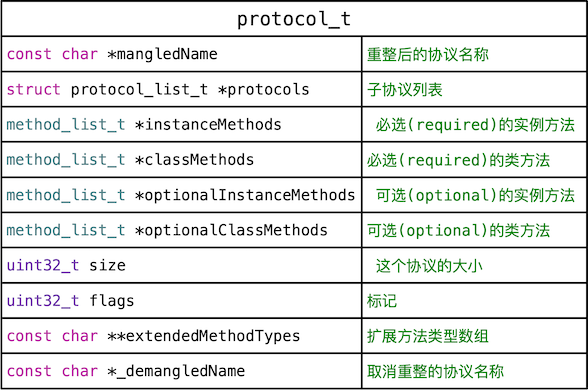
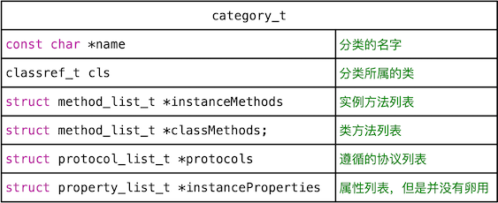
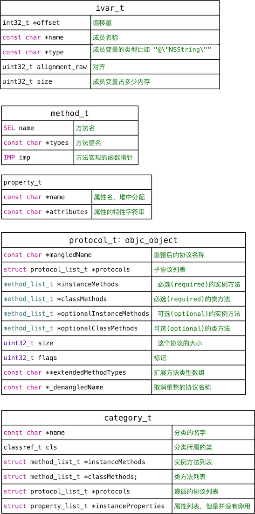

本文保存了NSObject的基本完整类图。方便以后理解。

<!--more-->


## NSObject 完整类图

NSObject 基本完整类图如下：




objc_class 有四个成员，本图说明两个非常重要的成员- isa、bits。 isa指向对象的类（或者类的元类）；bits定义了类的数据，包括类的属性、方法、协议、ivar 。 它的类型是class_data_bits_t，class_data_bits_t 有一个成员，类型是uintptr_t，64位。其中1~3位表示一个属性，3~47位表示一个指针，如果class还没有实现，这个指针指向class_ro_t类型，表示类编译完后的只读属性。当类实现后，这个指针指向了class_rw_t类型，表示runtime实现完class后类的数据，这是，数据里面已经包括了分类的方法信息。


## 使用hopper查看类结构

首先定义类LJObject，头文件如下：

```
//LJObject.h
@interface LJObject : NSObject

@property(nonatomic, strong) NSString *strName;

@property(nonatomic, strong)NSString *strVale;

-(NSString *) funcName:(NSString *) strName;

-(NSString *) funcValue:(NSString *)strValue;

+(NSString*) printDefaultName:(NSString *) strName;

+(NSString *)printDefaultValue:(NSString *)strValue;

@end
```

实现文件如下 ：

```
#import "LJObject.h"

@implementation LJObject

-(NSString *) funcName:(NSString *) strName
{
return nil;
}

-(NSString *) funcValue:(NSString *)strValue
{
return nil;
}

+(NSString*) printDefaultName:(NSString *) strName
{
return nil;
}

+(NSString *)printDefaultValue:(NSString *)strValue
{
return nil;
}

@end
```

使用hopper查看的结构如下：




## 五小结构  

###  method_t

方法的定义如下 ：

```
// 方法结构体
struct method_t {
    SEL name;          // 方法名，就是 SEL
    const char *types; // 方法类型字符串，有的地方又称 method signature 方法签名
    IMP imp;           // 指向方法的函数实现的指针
}
```

类图如下：



hopper查看的结果如下：



总结method_t值包含三个属性，方法名字、方法签名、方法的实现。

###  ivar_t

定义如下：

```
// 成员变量结构体
struct ivar_t {
    int32_t *offset; // 偏移量 用 __OFFSETOFIVAR__ 计算
    const char *name; // 成员变量名  比如 "_name"
    const char *type; // 成员变量的类型 比如 "@\"NSString\""
    // alignment is sometimes -1; use alignment() instead
    uint32_t alignment_raw; // 对齐
    uint32_t size;  // 成员变量占多少内存
};
```

类图如下：



###  property_t

定义如下：

```
// 属性结构体
struct property_t {
    const char *name;  // 属性名，堆中分配
    const char *attributes; // 属性的特性字符串，标识了属性有哪些特性
                            // 该字符串是在堆中分配的
};
```

类图如下：


###  protocol_t

定义如下

```
// 协议结构体，继承自 objc_object
struct protocol_t : objc_object {
    const char *mangledName;    // 重整后的协议名称，为了兼容 swift 协议而准备的，
                                // 它在 objc_allocateProtocol() 中被赋值，
                                // 普通 oc 的协议重整前后的名字是一样的，而 swift 的协议重整前后名字不一样，
                                // 重整名字是编译器给出的，加了 swift 复杂前缀的，用于混编时区分 oc协议 和 swift协议，
                                // 而 demangledName 取消重整的名称，应该就是去掉前缀的正常的名字
    
    struct protocol_list_t *protocols;  // 子协议列表，见 protocol_addProtocol()
                                        // 又可以称为 incorporated protocols 合并的协议
    
    method_list_t *instanceMethods;  // 必选(required)的实例方法
    method_list_t *classMethods;   //  必选(required)的类方法
    method_list_t *optionalInstanceMethods; // 可选(optional)的实例方法
    method_list_t *optionalClassMethods;  // 可选(optional)的类方法
    
    property_list_t *instanceProperties;  // 实例属性，当前协议只支持 required 的实例属性，
                                          // 协议中也是可以添加属性的，
                                          // 不知道会不会生成成员变量，但生成 set 和 get 方法是一定有的
                                          // 比如 NSObject 协议，就有几个 readonly 的属性
    
    uint32_t size;   // 这个协议的大小，其中也包括了 extendedMethodTypes 整个数组的大小
    uint32_t flags;  // 标记 跟 PROTOCOL_FIXED_UP_1 / PROTOCOL_FIXED_UP_2 有关系
    
    // Fields below this point are not always present on disk.
    // 这句话的意思，好像是下面这几个成员变量不一定有，
    // 所以用到它们的时候都检查了下 size 是否足够大，比如 hasExtendedMethodTypesField() 和 protocol_t::demangledName()
    
    const char **extendedMethodTypes; // 扩展方法类型数组，每个元素是一个扩展类型字符串
    
    const char *_demangledName; // 取消重整的协议名称，为了兼容 swift 协议而准备的，
                                // 普通 oc 的协议重整前后的名字是一样的，而 swift 的协议重整前后名字不一样
                                // 见 demangledName()
                                // demangledName 取消重整的名称，应该就是去掉 swift 前缀的正常的名字

}
```

类图如下：



###  category_t

定义如下：

```
struct category_t {
    const char *name; // 分类的名字
    classref_t cls;   // 分类所属的类，classref_t 专门用于 unremapped 的类
    struct method_list_t *instanceMethods;  // 实例方法列表
    struct method_list_t *classMethods;     // 类方法列表
    struct protocol_list_t *protocols;      // 遵循的协议列表
    struct property_list_t *instanceProperties; // 属性列表，但是并没有卵用... 唉....
}
```

类图如下：




### 五小结构总图


