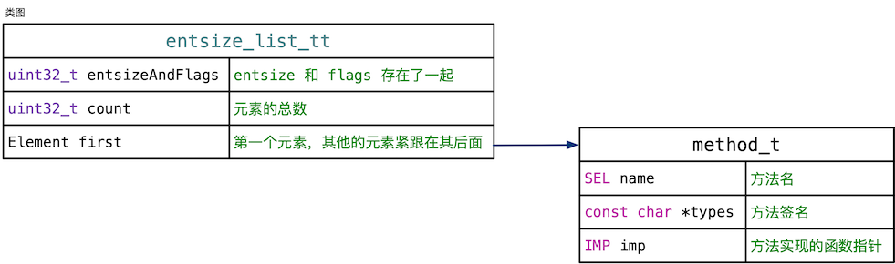
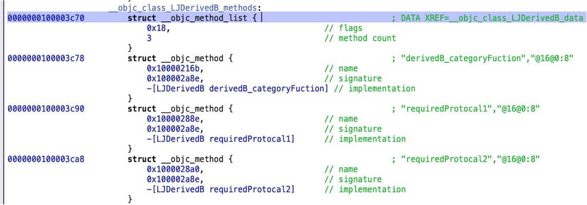
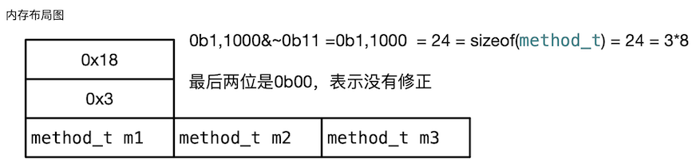
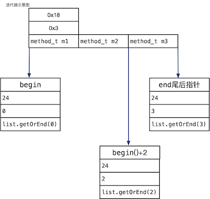

本文讲解entsize_list_tt方法列表的数据结构。本节代码位于objc-runtime-new.h头文件中

<!--more-->


## entsize_list_tt 简单介绍


类的编译后的数据存储在class_ro_t结构中，其中各种方法列表、变量列表、属性列表的类型分别是method_list_t、ivar_list_t、property_list_t，这些类型全部继承于entsize_list_tt。class_ro_t的定义如下：

```
// RO 就是 Read Only
struct class_ro_t {
    ...
    method_list_t * baseMethodList;  // 基本方法列表，存储编译期确定的方法
    const ivar_list_t * ivars;       // 类的成员变量列表，存储编译期确定的成员变量
    property_list_t *baseProperties; // 基本属性列表，存储编译期确定的属性
    ...
};
```
method_list_t 继承于entsize_list_tt 的源码如下：

```
struct method_list_t : entsize_list_tt<method_t, method_list_t, 0x3> { // 0x3 就是 0b11
                                                                       // 即 flag 占 2 个 bit，用来放 fixedup markers
    ....
};
```

下面就开始学习entsize_list_tt数据结构。

## entsize_list_tt 详细分析

entsize_list_tt其实就是一个列表，用来存储编译完成后类的属性。由于位于class_ro_t结构中，所以这个结构是只读的，没有写方法，只有访问的相关方法，定义如下，只包含了部分代码。

```
// entsize_list_tt 可以理解为一个容器，拥有自己的迭代器用于遍历所有元素。
// Element 表示元素类型，List 用于指定容器类型，
// 最后一个参数为标记位, 用来在 entsize field 里存放一些额外的 bits，也就是 flags
template <typename Element, typename List, uint32_t FlagMask>
struct entsize_list_tt {
    // entsize 和 flags 存在了一起，需要用 FlagMask 进行区分哪些 bits 里存的是 flags
    // entsize 就是每个元素的大小
    uint32_t entsizeAndFlags;
    uint32_t count; // 元素的总数
    Element first;  // 第一个元素，其他的元素紧跟在其后面

    // 取出 entsize 单个元素的大小
    uint32_t entsize() const {
        return entsizeAndFlags & ~FlagMask;
    }
    // 取出 flags
    uint32_t flags() const {
        return entsizeAndFlags & FlagMask;
    }

    // 取得指定 索引 处的元素，i <= count
    // 如果 i 等于 count，取得的就是最后一个元素的末尾地址
    Element& getOrEnd(uint32_t i) const { 
        assert(i <= count);
        // 从第一个元素开始，加上偏移量 i * 单个元素的大小
        // 就是 i 索引处的元素
        return *(Element *)((uint8_t *)&first + i*entsize()); 
    }
    // 取得指定 索引 处的元素
    // i 必须小于总数
    Element& get(uint32_t i) const { 
        assert(i < count);
        return getOrEnd(i);
    }

    // 取得整个 entsize_list_tt 对象以及其保存的所有元素占多少内存
    size_t byteSize() const {
        // sizeof(*this) 计算是对象本身占的大小，其中还包括了第一个元素
        // (count-1)*entsize() 计算的是除了第一个元素外，其他所有元素占的大小
        return sizeof(*this) + (count-1)*entsize();
    }
    // 向前声明
    struct iterator;
    // 取得指向容器的第一个元素的迭代器，返回值是变量，可以变
    iterator begin() { 
        return iterator(*static_cast<const List*>(this), 0); 
    }
    // 取得指向容器尾部的迭代器，注意是尾部，也就是最后一个元素的末尾，并不是最后的一个元素
    iterator end() { 
        return iterator(*static_cast<const List*>(this), count); 
    }

    // 向前声明
    struct iterator {
        uint32_t entsize; // 元素的大小
        uint32_t index;  // 当前的索引  // keeping track of this saves a divide in operator-
        Element* element;  // 指向当前的元素的指针

        // 真正有用的构造函数，参数 list 是迭代器用在哪个 List 上
        // start 是当前的索引
        iterator(const List& list, uint32_t start = 0)
            : entsize(list.entsize())  // 记录 List 中单个元素的大小
            , index(start)   // 记录当前的索引
            , element(&list.getOrEnd(start))  // 保存当前的元素的地址
        { }

        // 迭代器向后移动 delta 个位置
        const iterator& operator += (ptrdiff_t delta) {
            // 计算出新元素的地址，保存起来
            element = (Element*)((uint8_t *)element + delta*entsize);
            // 索引也加上 delta
            index += (int32_t)delta;
            return *this;
        }
        ....   
    };
};

```

entsize_list_tt 是个模板，可以实例化出method_list_t、ivar_list_t、property_list_t三种类型。有三个数据成员，entsizeAndFlags 是个复合成员，高位表示元素的大小，低位是个标志位，entsize、Flags具体占用多少位，根据模板参数FlagMask决定。例如：

```
//0x3 就是 0b11,即 flag 占 2 个 bit
struct method_list_t : entsize_list_tt<method_t, method_list_t, 0x3>

//flag 占 0 个 bit
struct ivar_list_t : entsize_list_tt<ivar_t, ivar_list_t, 0>

// flag 占 0 个 bit
struct property_list_t : entsize_list_tt<property_t, property_list_t, 0>
```

method_list_t 实例化时，递给FlagMask的模板实参是0x3，转化为二进制为0b11，占用两位。那么在method_list_t结构中，entsizeAndFlags 表示的entsize占用30位，Flags占用2位。

count 表示列表中存储元素的个数，first 表示首元素。注意他不是个指针，只是一个首元素，后面的元素会挨着first顺序存储。

method_list_t 的方法基本都是访问属性的。慢慢看着注释应该嫩看懂。

类图以方法列表method_list_t为例，里面存储的元素是method_t类型：



## entisize_list_tt 内存布局

为了进一步理解这个结构，我用hopper抓了一个这样的结构，如图所示，



我们将这个数据放入内存，内存结构大致如下：



entsizeAndFlags 的值是0x18，转化为二进制，为0b1,1000，那么entsize的值去高20位，还是0b1,1000，十进制为24表示元素的大小是24，然后继续看元素，元素的类型是method_t，大小为24，验证了entsize的含义。flag取低二位，为0 。

接下来的count的值是3，表示有三个元素。后面紧跟着三个元素。


##  迭代器

既然entsize_list_tt是一个列表，那么就需要一个迭代器，从而枚举列表内部的元素。迭代器是个内部类，重载了很多方法，迭代器类主要的方法是构造函数，剩下的全部是重载运算符，大致雷同。


```
uint32_t entsize; // 元素的大小
uint32_t index;  // 当前的索引  // keeping track of this saves a divide in operator-
Element* element;  // 指向当前的元素的指针

// 真正有用的构造函数，参数 list 是迭代器用在哪个 List 上
// start 是当前的索引
iterator(const List& list, uint32_t start = 0)
    : entsize(list.entsize())  // 记录 List 中单个元素的大小
    , index(start)   // 记录当前的索引
    , element(&list.getOrEnd(start))  // 保存当前的元素的地址
{ }
```

下面是迭代器的示意图。



示意图中列出指向首元素的迭代器begin、尾后迭代器end、和begin+2的内存结构。


