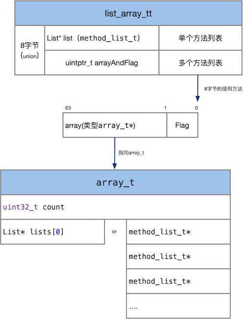
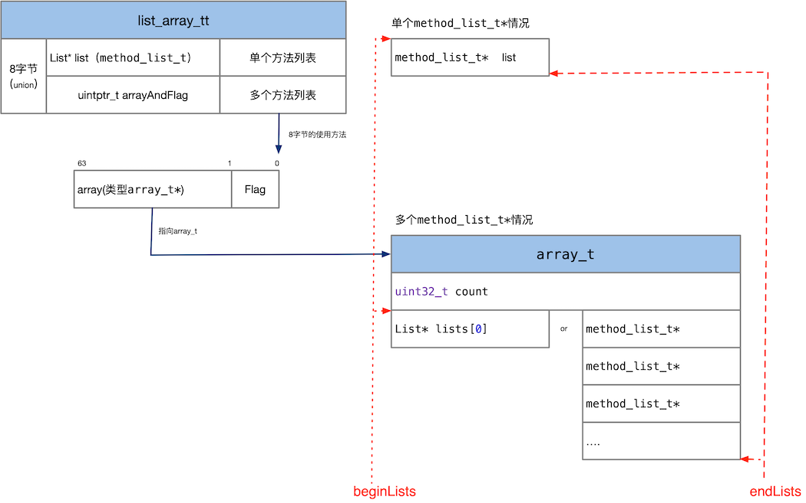
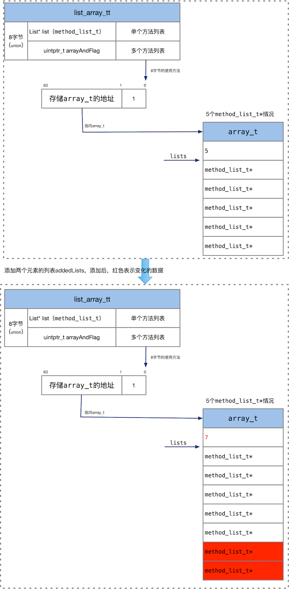
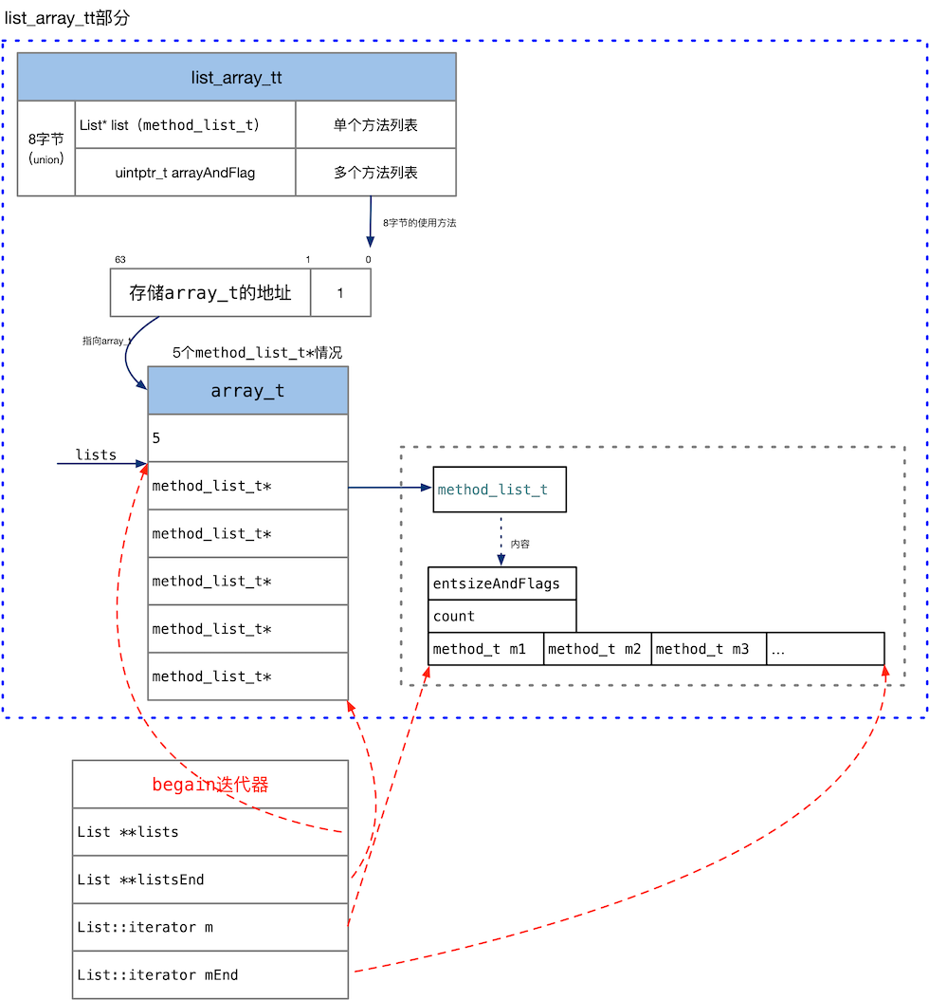

list_array_tt 是个模板类，可以实例化出method_array_t，method_array_t在class_rw_t中使用，存储多个分类中的方法列表。

<!--more-->


## list_array_tt 总的源码和类图

下面是list_array_tt的源码：

```
/***********************************************************************
 Element 是元数据类型，比如 method_t
 List 是元数据的列表类型，比如 method_list_t
 
 一个 list_array_tt 的值可能有三种情况：
 - 空的
 - 一个指针指向一个单独的列表
 - 一个数组，数组中都是指针，每个指针分别指向一个列表
 
* countLists/beginLists/endLists iterate the metadata lists
* count/begin/end iterate the underlying metadata elements
**********************************************************************/
template <typename Element, typename List>
class list_array_tt {
    struct array_t {
        uint32_t count;   /// 有多少个List*
        List* lists[0];

        static size_t byteSize(uint32_t count) {
            return sizeof(array_t) + count*sizeof(lists[0]);
        }
        size_t byteSize() {
            return byteSize(count);
        }
    };

 protected:
    class iterator {
        List **lists;
        List **listsEnd;
        typename List::iterator m, mEnd;

     public:
        iterator(List **begin, List **end) 
            : lists(begin), listsEnd(end)
        {
            if (begin != end) {
                m = (*begin)->begin();
                mEnd = (*begin)->end();
            }
        }

        const Element& operator * () const {
            return *m;
        }
        Element& operator * () {
            return *m;
        }

        bool operator != (const iterator& rhs) const {
            if (lists != rhs.lists) return true;
            if (lists == listsEnd) return false;  // m is undefined
            if (m != rhs.m) return true;
            return false;
        }

        const iterator& operator ++ () {
            assert(m != mEnd);
            m++;
            if (m == mEnd) {
                assert(lists != listsEnd);
                lists++;
                if (lists != listsEnd) {
                    m = (*lists)->begin();
                    mEnd = (*lists)->end();
                }
            }
            return *this;
        }
    };

 private:
    union {
        List* list;
        uintptr_t arrayAndFlag;
    };

    bool hasArray() const {
        return arrayAndFlag & 1;
    }

    array_t *array() {
        return (array_t *)(arrayAndFlag & ~1);
    }

    void setArray(array_t *array) {
        arrayAndFlag = (uintptr_t)array | 1;
    }

 public:

    /// 所有的list的所有元素总数
    uint32_t count() {
        uint32_t result = 0;
        for (auto lists = beginLists(), end = endLists(); 
             lists != end;
             ++lists)
        {
            result += (*lists)->count;
        }
        return result;
    }

    iterator begin() {
        return iterator(beginLists(), endLists());
    }

    iterator end() {
        List **e = endLists();
        return iterator(e, e);
    }


    uint32_t countLists() {
        if (hasArray()) {
            return array()->count;
        } else if (list) {
            return 1;
        } else {
            return 0;
        }
    }

    List** beginLists() {
        if (hasArray()) {
            return array()->lists;
        } else {
            return &list;
        }
    }

    List** endLists() {
        if (hasArray()) {
            return array()->lists + array()->count;
        } else if (list) {
            return &list + 1;
        } else {
            return &list;
        }
    }

    void attachLists(List* const * addedLists, uint32_t addedCount) {
        if (addedCount == 0) return;

        if (hasArray()) {
            // many lists -> many lists
            uint32_t oldCount = array()->count;
            uint32_t newCount = oldCount + addedCount;
            setArray((array_t *)realloc(array(), array_t::byteSize(newCount)));
            array()->count = newCount;
            memmove(array()->lists + addedCount, array()->lists, 
                    oldCount * sizeof(array()->lists[0]));
            memcpy(array()->lists, addedLists, 
                   addedCount * sizeof(array()->lists[0]));
        }
        else if (!list  &&  addedCount == 1) {
            // 0 lists -> 1 list
            list = addedLists[0];
        } 
        else {
            // 1 list -> many lists
            List* oldList = list;
            uint32_t oldCount = oldList ? 1 : 0;
            uint32_t newCount = oldCount + addedCount;
            setArray((array_t *)malloc(array_t::byteSize(newCount)));
            array()->count = newCount;
            if (oldList) array()->lists[addedCount] = oldList;
            memcpy(array()->lists, addedLists, 
                   addedCount * sizeof(array()->lists[0]));
        }
    }

    void tryFree() {
        if (hasArray()) {
            for (uint32_t i = 0; i < array()->count; i++) {
                try_free(array()->lists[i]);
            }
            try_free(array());
        }
        else if (list) {
            try_free(list);
        }
    }

    template<typename Result>
    Result duplicate() {
        Result result;

        if (hasArray()) {
            array_t *a = array();
            result.setArray((array_t *)memdup(a, a->byteSize()));
            for (uint32_t i = 0; i < a->count; i++) {
                result.array()->lists[i] = a->lists[i]->duplicate();
            }
        } else if (list) {
            result.list = list->duplicate();
        } else {
            result.list = nil;
        }

        return result;
    }
};
```


由图可以看出，list_array_tt结构的成员是一个匿名的union，或者存储单个类型为List*的list,或者存储多个列表，多个list使用arrayAndFlag表示，arrayAndFlag是个符合结构，低1位存储标志，高63位存储多个列表的地址，低位为1，表示多个列表，为0表示一个列表。

arrayAndFlag 高位存储一个地址，指向的类型是array_t，array_t有两个成员，第一个count表示列表的个数，lists存储List*类型的指针数组。 


## list_array_tt 部分源码分析

下面看最基本的三个方法：

```
bool hasArray() const {
    return arrayAndFlag & 1;
}

array_t *array() {
    return (array_t *)(arrayAndFlag & ~1);
}

void setArray(array_t *array) {
    arrayAndFlag = (uintptr_t)array | 1;
}
```
hasArray 判断存储的是一个列表，还是多个列表。

array返回多个列表的地址，返回类型是`array_t *`

setArray设置多个列表。将多个列表的地址和1与操作，存储在arrayAndFlag中。


下面首先看beginLists、endLists方法：

```
List** beginLists() {
    if (hasArray()) {
        return array()->lists;
    } else {
        return &list;
    }
}

List** endLists() {
    if (hasArray()) {
        return array()->lists + array()->count;
    } else if (list) {
        return &list + 1;
    } else {
        return &list;
    }
}
```
beginLists 返回列表的首元素的地址，endLists返回列表尾后元素的地址。为了方便理解，画了下图：

  

图中需要注意命名规则，list表示单个列表，lists表示多个列表。

如上图所示，当list_array_tt存储一个`List*`时，beginLists返回list的地址、当list_array_tt存储多个`List*`时，beginLists返回lists的地址，返回类型是`List**`。 

同理，当list_array_tt存储一个`List*`时，endLists返回list尾后地址、当list_array_tt存储多个`List*`时，endLists返回lists的尾后地址，就是最后一个List*的末尾。返回类型是`List**`

图中红色的线表示beginLists、endLists指向的地址。


下面在来看countLists方法。
```
uint32_t countLists() {
    if (hasArray()) {
        return array()->count;
    } else if (list) {
        return 1;
    } else {
        return 0;
    }
}
```

countLists返回`List*`的个数，如果是单个列表，返回1，多个列表返回array()->count。


下面看最关键的函数attachLists，这个函数个将分类的方法列表添加到原始类的方法列表上面。

```
void attachLists(List* const * addedLists, uint32_t addedCount) {
    if (addedCount == 0) return;

    if (hasArray()) {
        // many lists -> many lists
        uint32_t oldCount = array()->count;
        uint32_t newCount = oldCount + addedCount;
        setArray((array_t *)realloc(array(), array_t::byteSize(newCount)));
        array()->count = newCount;
        memmove(array()->lists + addedCount, array()->lists, 
                oldCount * sizeof(array()->lists[0]));
        memcpy(array()->lists, addedLists, 
               addedCount * sizeof(array()->lists[0]));
    }
    else if (!list  &&  addedCount == 1) {
        // 0 lists -> 1 list
        list = addedLists[0];
    } 
    else {
        // 1 list -> many lists
        List* oldList = list;
        uint32_t oldCount = oldList ? 1 : 0;
        uint32_t newCount = oldCount + addedCount;
        setArray((array_t *)malloc(array_t::byteSize(newCount)));
        array()->count = newCount;
        if (oldList) array()->lists[addedCount] = oldList;
        memcpy(array()->lists, addedLists, 
               addedCount * sizeof(array()->lists[0]));
    }
}
```

这个函数分为三部分，分别处理：

1. 多个列表添加新的列表
2. 单个列表添加新的列表
3. 空列表添加新的列表

多个列表时： 首先计算所有列表的总数，申请大的空间，将原有列表和新addedLists添加到新的空间中。

`else if`是处理在空列表中添加一个新元素的列表addedLists。

`else` 分支处理在空列表中添加多个元素的列表、或者在原来一个元素的列表(list)中添加新列表addedLists，添加的结果列表中存储多个列表。所以一起处理。处理的流程和第一个分支类似。

下面是部分在原有5个元素的列中中添加两个元素的列表addedLists的示意图。

  


## list_array_tt 迭代器

下面看begin、end方法：

```
iterator begin() {
    return iterator(beginLists(), endLists());
}

iterator end() {
    List **e = endLists();
    return iterator(e, e);
}
```

begin、end方法返回list_array_tt的首元素迭代器和尾后元素迭代器。

迭代器有四个元素：

```
List **lists;
List **listsEnd;
typename List::iterator m, mEnd;
```

首迭代器四个成员指向的位置如图所示：

  

根据上图可以容易的理解迭代器的各个成员的指向。那么迭代器重要的操作++就比较容易理解了。代码如下：

```
const iterator& operator ++ () {
    assert(m != mEnd);
    m++;
    if (m == mEnd) {
        assert(lists != listsEnd);
        lists++;
        if (lists != listsEnd) {
            m = (*lists)->begin();
            mEnd = (*lists)->end();
        }
    }
    return *this;
}
```

首先在是类别的元素的（method_t）的迭代器指向++操作，即m执行++，如果元素的迭代器迭代完成，即，m==mEnd,退出到外部，指向lists的++操作,然后在继续内部元素的迭代器操作。以此类推。

## 参考资料

+ [Classes and Metaclasses](http://www.sealiesoftware.com/blog/archive/2009/04/14/objc_explain_Classes_and_metaclasses.html)
+ [Tagged Pointer](https://en.wikipedia.org/wiki/Tagged_pointer)
+ [类型编码](https://developer.apple.com/library/mac/documentation/Cocoa/Conceptual/ObjCRuntimeGuide/Articles/ocrtTypeEncodings.html)
+ [Type Encodings](http://nshipster.cn/type-encodings/)

