这篇文章介绍NXMapTable数据结构

<!--more-->

##   NXMapTable 数据结构

```
typedef struct _NXMapTable {
    /* private data structure; may change */
    const struct _NXMapTablePrototype	*prototype;
    unsigned	count;
    unsigned	nbBucketsMinusOne;
    void	*buckets;
} NXMapTable OBJC_MAP_AVAILABILITY;
```
count 存储的个数， nbBucketsMinusOne 容量减1， buckets 存储数据。

_NXMapTablePrototype定义如下

```
typedef struct _NXMapTablePrototype {
    unsigned	(*hash)(NXMapTable *, const void *key);
    int		(*isEqual)(NXMapTable *, const void *key1, const void *key2);
    void	(*free)(NXMapTable *, void *key, void *value);
    int		style; /* reserved for future expansion; currently 0 */
} NXMapTablePrototype OBJC_MAP_AVAILABILITY;
```

_NXMapTablePrototype 结构存储三个函数指针hash、 isEqual、 free。

类图如下:

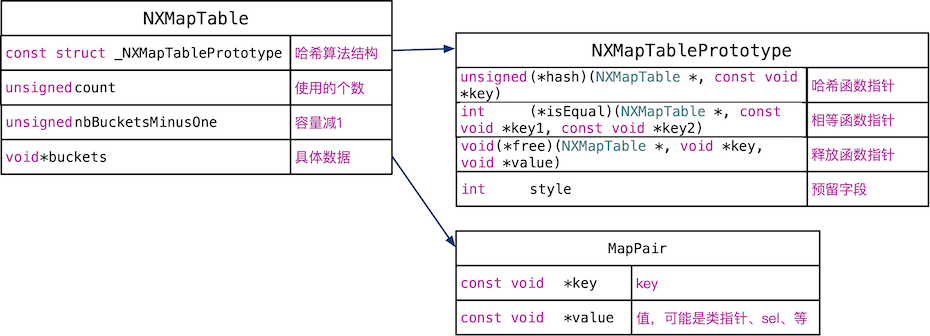

### 主要的接口

```
NXMapTable *NXCreateMapTableFromZone(NXMapTablePrototype prototype, unsigned capacity, void *z) OBJC_MAP_AVAILABILITY;
NXMapTable *NXCreateMapTable(NXMapTablePrototype prototype, unsigned capacity) OBJC_MAP_AVAILABILITY;

void NXFreeMapTable(NXMapTable *table) OBJC_MAP_AVAILABILITY;

void NXResetMapTable(NXMapTable *table) OBJC_MAP_AVAILABILITY;

BOOL NXCompareMapTables(NXMapTable *table1, NXMapTable *table2) OBJC_MAP_AVAILABILITY;

unsigned NXCountMapTable(NXMapTable *table) OBJC_MAP_AVAILABILITY;
	
void *NXMapMember(NXMapTable *table, const void *key, void **value) OBJC_MAP_AVAILABILITY;
	
void *NXMapGet(NXMapTable *table, const void *key) OBJC_MAP_AVAILABILITY;
	
void *NXMapInsert(NXMapTable *table, const void *key, const void *value) OBJC_MAP_AVAILABILITY;
	
void *NXMapRemove(NXMapTable *table, const void *key) OBJC_MAP_AVAILABILITY;
```

### NXCreateMapTableFromZone

```
NXMapTable *NXCreateMapTableFromZone(NXMapTablePrototype prototype, unsigned capacity, void *z) {
    NXMapTable			*table = (NXMapTable *)malloc_zone_malloc((malloc_zone_t *)z, sizeof(NXMapTable));
    NXMapTablePrototype		*proto;
    if (! prototypes) prototypes = NXCreateHashTable(protoPrototype, 0, NULL);
    if (! prototype.hash || ! prototype.isEqual || ! prototype.free || prototype.style) {
	_objc_inform("*** NXCreateMapTable: invalid creation parameters\n");
	return NULL;
    }
    proto = (NXMapTablePrototype *)NXHashGet(prototypes, &prototype); 
    if (! proto) {
	proto = (NXMapTablePrototype *)malloc(sizeof(NXMapTablePrototype));
	*proto = prototype;
    	(void)NXHashInsert(prototypes, proto);
    }
    table->prototype = proto; table->count = 0;
    table->nbBucketsMinusOne = exp2u(log2u(capacity)+1) - 1;
    table->buckets = allocBuckets(z, table->nbBucketsMinusOne + 1);
    return table;
}

NXMapTable *NXCreateMapTable(NXMapTablePrototype prototype, unsigned capacity) {
    return NXCreateMapTableFromZone(prototype, capacity, malloc_default_zone());
}
```

NXCreateMapTableFromZone 主要工作：

1. 创建table
2. 处理proto，如果先前没有prototype，存储在prototypes全局hash表中。
3. 赋值成员。


### NXFreeMapTable
```
void NXFreeMapTable(NXMapTable *table) {
    NXResetMapTable(table);
    freeBuckets(table->buckets);
    free(table);
}

void NXResetMapTable(NXMapTable *table) {
    MapPair	*pairs = (MapPair *)table->buckets;
    void	(*freeProc)(struct _NXMapTable *, void *, void *) = table->prototype->free;
    unsigned	index = table->nbBucketsMinusOne + 1;
    while (index--) {
	if (pairs->key != NX_MAPNOTAKEY) {
	    freeProc(table, (void *)pairs->key, (void *)pairs->value);
	    pairs->key = NX_MAPNOTAKEY; pairs->value = NULL;
	}
	pairs++;
    }
    table->count = 0;
}
```

循环调用free函数， 删除存储的数据。

### NXCountMapTable

```
unsigned NXCountMapTable(NXMapTable *table) { return table->count; }
```

获取table中存储数据的个数。返回NXMapTable的count成员。

### NXMapMember

```
static INLINE void *_NXMapMember(NXMapTable *table, const void *key, void **value) {
    MapPair	*pairs = (MapPair *)table->buckets;
    unsigned	index = bucketOf(table, key);
    MapPair	*pair = pairs + index;
    if (pair->key == NX_MAPNOTAKEY) return NX_MAPNOTAKEY;
    if (isEqual(table, pair->key, key)) {
	*value = (void *)pair->value;
	return (void *)pair->key;
    } else {
	unsigned	index2 = index;
	while ((index2 = nextIndex(table, index2)) != index) {
	    pair = pairs + index2;
	    if (pair->key == NX_MAPNOTAKEY) return NX_MAPNOTAKEY;
	    if (isEqual(table, pair->key, key)) {
	    	*value = (void *)pair->value;
		return (void *)pair->key;
	    }
	}
	return NX_MAPNOTAKEY;
    }
}

void *NXMapMember(NXMapTable *table, const void *key, void **value) {
    return _NXMapMember(table, key, value);
}
```


NXMapMember 获取给定key对应的值，该函数首先通过bucketOf取出索引：

```
static INLINE unsigned bucketOf(NXMapTable *table, const void *key) {
    unsigned	hash = (table->prototype->hash)(table, key);
    return hash & table->nbBucketsMinusOne;
}
```

bucketOf 函数通过key计算出hash值，然后将hash值和table->nbBucketsMinusOne按位与，执行的结果一定小于等于 table->nbBucketsMinusOne，也就是一定小于容量，不会产生一个超出容量的索引。 


```
MapPair	*pair = pairs + index;
```

通过索引找到存储的内容pair，类型是MapPair。

接着根据pair的内容，分三种情况：

1. 索引位置位的内容为空，直接返回NX_MAPNOTAKEY,value值不设置。
2. 索引位置的内容不空，但是key一样，返回key，设置value的内容为当前pair的value。
3. 索引位置内容不空，并且key不一样，循环查找下一个位置，直到找到一个位置，这个位置的key和传入的key相等。返回key，设置value的内容为当前pair的value。

```
if (pair->key == NX_MAPNOTAKEY) return NX_MAPNOTAKEY;
```

如果找到的位置没有内容，直接返回NX_MAPNOTAKEY。

```
if (isEqual(table, pair->key, key)) {
	*value = (void *)pair->value;
	return (void *)pair->key;
    }
```

如果索引位置的key相同，传出key对应的内容。

```
else {
	unsigned	index2 = index;
	while ((index2 = nextIndex(table, index2)) != index) {
	    pair = pairs + index2;
	    if (pair->key == NX_MAPNOTAKEY) return NX_MAPNOTAKEY;
	    if (isEqual(table, pair->key, key)) {
	    	*value = (void *)pair->value;
		return (void *)pair->key;
	    }
	}
```

如果索引的位置有值，且key不相等，循环查找下一个位置，直到找到相同的key，或者循环完成。


其中nextIndex 函数计算出下一个索引。

```
static INLINE unsigned nextIndex(NXMapTable *table, unsigned index) {
    return (index + 1) & table->nbBucketsMinusOne;
}
```

所以递增的示意图如下：

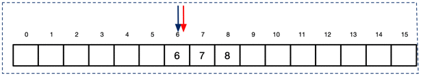

### NXMapInsert

```
void *NXMapInsert(NXMapTable *table, const void *key, const void *value) {
    MapPair	*pairs = (MapPair *)table->buckets;
    unsigned	index = bucketOf(table, key);
    MapPair	*pair = pairs + index;
    if (key == NX_MAPNOTAKEY) {
	_objc_inform("*** NXMapInsert: invalid key: -1\n");
	return NULL;
    }

    unsigned numBuckets = table->nbBucketsMinusOne + 1;

    if (pair->key == NX_MAPNOTAKEY) {
        pair->key = key; pair->value = value;
        table->count++;
        if (table->count * 4 > numBuckets * 3) _NXMapRehash(table);
        return NULL;
    }
    
    if (isEqual(table, pair->key, key))
    {
        const void	*old = pair->value;
        if (old != value) pair->value = value;/* avoid writing unless needed! */
        return (void *)old;
    }
    else if (table->count == numBuckets) {
        /* no room: rehash and retry */
        _NXMapRehash(table);
        return NXMapInsert(table, key, value);
    }
    else {
        unsigned	index2 = index;
        while ((index2 = nextIndex(table, index2)) != index) {
            pair = pairs + index2;
            if (pair->key == NX_MAPNOTAKEY)
            {
                  pair->key = key; pair->value = value;
                table->count++;
                if (table->count * 4 > numBuckets * 3) _NXMapRehash(table);
                return NULL;
            }
            if (isEqual(table, pair->key, key))
            {
                const void	*old = pair->value;
                if (old != value) pair->value = value;/* avoid writing unless needed! */
                return (void *)old;
            }
	}
	/* no room: can't happen! */
	_objc_inform("**** NXMapInsert: bug\n");
	return NULL;
    }
}
```

这个代码有几个关键的地方：

1. 容量大于3/4 就扩容，扩大为原来的2倍。
2. 添加分为三种情况： 索引位置为空，直接插入、索引位置不空，key相同，替换新的内容、索引位置内容不空，key不相同，循环查找下一个内容为空的位置，如果找到，插入，否则什么页不做。

下面两图分别说明上面的三种情况 。

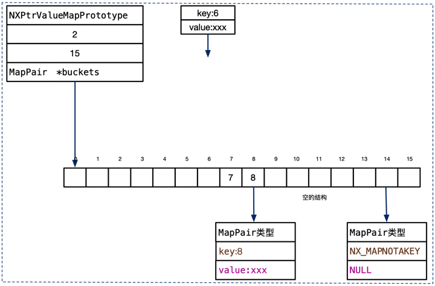

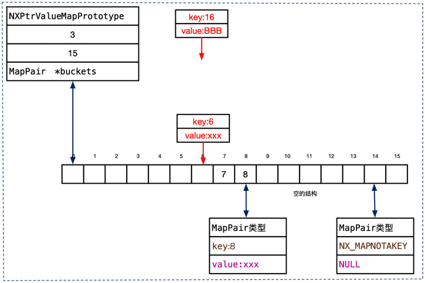


### NXMapRemove

```
void *NXMapRemove(NXMapTable *table, const void *key) {
    MapPair	*pairs = (MapPair *)table->buckets;
    unsigned	index = bucketOf(table, key);
    MapPair	*pair = pairs + index;
    unsigned	chain = 1; /* number of non-nil pairs in a row */
    int		found = 0;
    const void	*old = NULL;
    if (pair->key == NX_MAPNOTAKEY) return NULL;
    mapRemove ++;
    /* compute chain */
    {
	unsigned	index2 = index;
	if (isEqual(table, pair->key, key)) {found ++; old = pair->value; }
	while ((index2 = nextIndex(table, index2)) != index) {
	    pair = pairs + index2;
	    if (pair->key == NX_MAPNOTAKEY) break;
	    if (isEqual(table, pair->key, key)) {found ++; old = pair->value; }
	    chain++;
	}
    }
    if (! found) return NULL;
    if (found != 1) _objc_inform("**** NXMapRemove: incorrect table\n");
    /* remove then reinsert */
    {
	MapPair	buffer[16];
	MapPair	*aux = (chain > 16) ? (MapPair *)malloc(sizeof(MapPair)*(chain-1)) : buffer;
	unsigned	auxnb = 0;
	int	nb = chain;
	unsigned	index2 = index;
	while (nb--) {
	    pair = pairs + index2;
	    if (! isEqual(table, pair->key, key)) aux[auxnb++] = *pair;
	    pair->key = NX_MAPNOTAKEY; pair->value = NULL;
	    index2 = nextIndex(table, index2);
	}
	table->count -= chain;
	if (auxnb != chain-1) _objc_inform("**** NXMapRemove: bug\n");
	while (auxnb--) NXMapInsert(table, aux[auxnb].key, aux[auxnb].value);
	if (chain > 16) free(aux);
    }
    return (void *)old;
}
```

删除指定key的内容分为下面几步：

1. 通过key找到索引
2. 如果key对于的MapPair为空，直接返回
3. 计算key存储数据的实际位置和应该存储位置的距离chain。这段距离内的元素的存储位置可能不是按照对应位置存储的。
4. 删除chain内的元素，重新插入chain-1 个元素。

用下面图理解删除的代码。

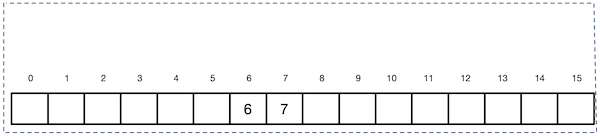
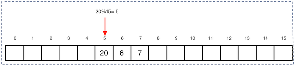
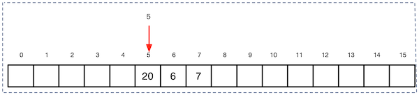
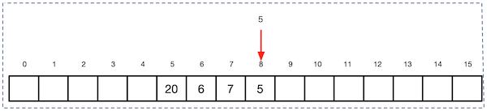
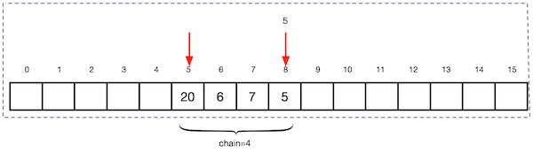
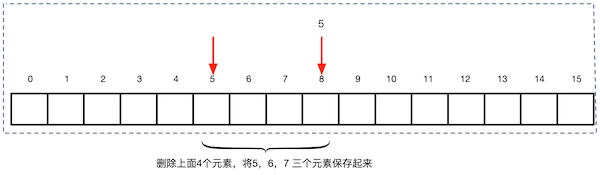
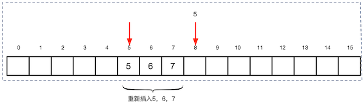

## 参考资料

1. [Draveness git地址](https://github.com/Draveness/analyze)
2. [Classes and Metaclasses](http://www.sealiesoftware.com/blog/archive/2009/04/14/objc_explain_Classes_and_metaclasses.html)
3. [类型编码](https://developer.apple.com/library/mac/documentation/Cocoa/Conceptual/ObjCRuntimeGuide/Articles/ocrtTypeEncodings.html)
4. [Type Encodings](http://nshipster.cn/type-encodings/)
5. [Tagged Pointer](https://en.wikipedia.org/wiki/Tagged_pointer)


