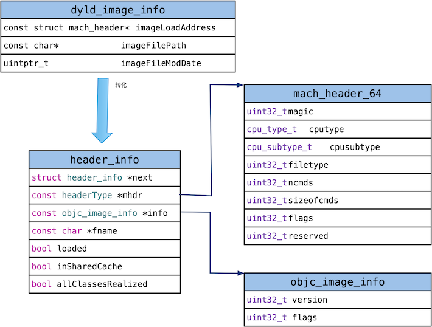
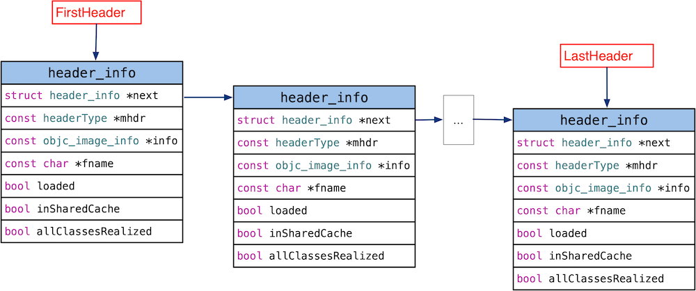

__objc_init函数是objc4库的入口函数。该函数里面注册了dyld_image_state_bound、dyld_image_state_dependents_initialized两种状态， 当Dyld bind 操作结束之后，会发出 dyld_image_state_bound 通知，然后执行与之绑定的回调函数 map_2_images，当调用Objc 的 + load的时候发送dyld_image_state_dependents_initialized消息，执行load_images函数。

<!--more-->

##   _objc_init

```
void _objc_init(void)
{
	....
    // Register for unmap first, in case some +load unmaps something
    // 首先第一步，注册 unmap 函数，万一有的类的 +load 方法需要 unmap 一些东西
    // unmap，即 un-memory-mapped，这里应该就是取消内存映射，移除镜像的意思
    _dyld_register_func_for_remove_image(&unmap_image);
    
    // 注册镜像状态改变时的回调函数
    dyld_register_image_state_change_handler(dyld_image_state_bound,
                                             1/*batch 是否批处理*/, &map_2_images);
    
    // 注册镜像状态改变时的回调函数，镜像加载完成后，需要调用 +load 时会回调 load_images 函数
    // 不进行批处理，所以 load_images 会被调用多次，每次有新的镜像进来时，都会被调用
    dyld_register_image_state_change_handler(dyld_image_state_dependents_initialized, 0/*not batch*/, &load_images);
}

```

首先看map_2_images函数，load_images后面一遍介绍。

```
// 处理给定的镜像，这些镜像被 dyld库 映射
// 这个函数其实是一个回调函数，被 dyld 库调用，参数中的镜像信息也是 dyld 库传进来的，详情见 _objc_init()
const char *
map_2_images(enum dyld_image_states state,
             uint32_t infoCount,
             const struct dyld_image_info infoList[])
{
    rwlock_writer_t lock(runtimeLock); // runtimeLock 加写锁
    
    // 在 map_images_nolock 函数中，完成所有 class 的注册、fixup等工作，
    // 还包括初始化自动释放池、初始化 side table 等等工作
    return map_images_nolock(state, infoCount, infoList);
}
```

map_2_images内部调用了map_images_nolock函数。


```
// 映射镜像，在这个函数中，完成所有 class 的注册、fixup等工作，
// 还包括初始化自动释放池、初始化 side table 等工作
const char *
map_images_nolock(enum dyld_image_states state,
                  uint32_t infoCount,
                  const struct dyld_image_info infoList[])
{
    static bool firstTime = YES;
    static bool wantsGC = NO;
    uint32_t i;
    header_info *hi;
    header_info *hList[infoCount];
    uint32_t hCount;
    size_t selrefCount = 0;
   ....
    // Find all images with Objective-C metadata.
    hCount = 0;
    i = infoCount;
    while (i--) {
        const headerType *mhdr = (headerType *)infoList[i].imageLoadAddress;

        hi = addHeader(mhdr);
        if (!hi) {
            // no objc data in this entry
            continue;
        }

        if (mhdr->filetype == MH_EXECUTE) {
            // Size some data structures based on main executable's size
            _getObjcSelectorRefs(hi, &selrefCount);
        }

        hList[hCount++] = hi
    }
   ....
    _read_images(hList, hCount);

    return NULL;
}
```

map_images_nolock对所有的镜像列表执行addHeader，主要过滤重复的镜像。

接着调用_read_images函数。_read_images比较复杂，后面文章分析。下面看看addHeader的具体实现：


```
static header_info * addHeader(const headerType *mhdr)
{
    header_info *hi;

    if (bad_magic(mhdr)) return NULL;
    {
        // Didn't find an hinfo in the dyld shared cache.

        // Weed out duplicates
        for (hi = FirstHeader; hi; hi = hi->next) {
            if (mhdr == hi->mhdr) return NULL;
        }

        // Locate the __OBJC segment
        size_t info_size = 0;
        unsigned long seg_size;
        const objc_image_info *image_info = _getObjcImageInfo(mhdr,&info_size);
        const uint8_t *objc_segment = getsegmentdata(mhdr,SEG_OBJC,&seg_size);
        if (!objc_segment  &&  !image_info) return NULL;

        // Allocate a header_info entry.
        hi = (header_info *)calloc(sizeof(header_info), 1);

        // Set up the new header_info entry.
        hi->mhdr = mhdr;
        hi->info = image_info;
        hi->fname = dyld_image_path_containing_address(hi->mhdr);
        hi->loaded = true;
        hi->inSharedCache = false;
        hi->allClassesRealized = NO;
    }

    // dylibs are not allowed to unload
    // ...except those with image_info and nothing else (5359412)
    if (hi->mhdr->filetype == MH_DYLIB  &&  _hasObjcContents(hi)) {
        dlopen(hi->fname, RTLD_NOLOAD);
    }

    appendHeader(hi);
    
    return hi;
}
```

addHeader将传入的headerType参数mhdr 构造出header_info类型，最后调用appendHeader函数：

```
void appendHeader(header_info *hi)
{
    // Add the header to the header list. 
    // The header is appended to the list, to preserve the bottom-up order.
    HeaderCount++;
    hi->next = NULL;
    if (!FirstHeader) {
        // list is empty
        FirstHeader = LastHeader = hi;
    } else {
        if (!LastHeader) {
            // list is not empty, but LastHeader is invalid - recompute it
            LastHeader = FirstHeader;
            while (LastHeader->next) LastHeader = LastHeader->next;
        }
        // LastHeader is now valid
        LastHeader->next = hi;
        LastHeader = hi;
    }
}
```

appendHeader 将hi放入FirstHeader的列表中。
其中FirstHeader、LastHeader的定义如下。

```
header_info *FirstHeader = 0;  // NULL means empty list 第一个 image(镜像)
header_info *LastHeader  = 0;  // NULL means invalid; recompute it
int HeaderCount = 0;
```


## 总结

map_2_images  主要完成的工作如下：

1. 镜像去重复
2. 对于每个镜像，从dyld_image_info 构造出header_info结构
3. 将header_info结构添加到列表FirstHeader中，LastHeader 指向列表的最后一个元素。
4. 执行_read_images，后续讲解。


转化的header_info结构如下：



FirstHeader 的链表结构如下图所示,这里记录了objc库加载的所有的镜像。


## 参考资料

1. [Draveness git地址](https://github.com/Draveness/analyze)
2. [Classes and Metaclasses](http://www.sealiesoftware.com/blog/archive/2009/04/14/objc_explain_Classes_and_metaclasses.html)
3. [类型编码](https://developer.apple.com/library/mac/documentation/Cocoa/Conceptual/ObjCRuntimeGuide/Articles/ocrtTypeEncodings.html)
4. [Type Encodings](http://nshipster.cn/type-encodings/)
5. [Tagged Pointer](https://en.wikipedia.org/wiki/Tagged_pointer)


