_read_images从镜像文件中读取所有类信息、方法信息、分类信息。这篇文章就介绍具体读取了什么信息。

<!--more-->

## 背景

Mach-O 运行的时候，通过dylb加载到内存，须进一步提取出详细的信息，进而使用Mach-O中的类、方法。dylb加载完Mach-O文件后，通知runtime，调用_read_images ，_read_images就是将Mach-O文件中的DATA segment中的数据读入到对应的数据结构中，方便使用。
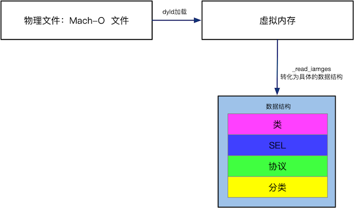
 
读取的所有section：

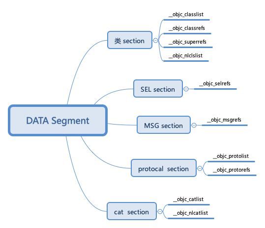
 
##   _read_images函数 代码分析

### 读取Mach-O指定Section的基础设施

首先登场的是GETSECT，位于objc-file.mm文件中，GETSECT宏可以生成不同的函数。函数名为name，这些函数完成读取Mach-O文件指定Section的内容。

```
#define GETSECT(name, type, sectname)                                   \
type *name(const headerType *mhdr, size_t *outCount) {              \
    return getDataSection<type>(mhdr, sectname, nil, outCount);     \
}                                                                   \
type *name(const header_info *hi, size_t *outCount) {               \
    return getDataSection<type>(hi->mhdr, sectname, nil, outCount); \
}
```

内部会调用getDataSection 函数。

```
template <typename T>
T* getDataSection(const headerType *mhdr, const char *sectname, 
                  size_t *outBytes, size_t *outCount)
{
    unsigned long byteCount = 0;
    T* data = (T*)getsectiondata(mhdr, "__DATA", sectname, &byteCount);
    if (!data) {
        data = (T*)getsectiondata(mhdr, "__DATA_CONST", sectname, &byteCount);
    }
    if (!data) {
        data = (T*)getsectiondata(mhdr, "__DATA_DIRTY", sectname, &byteCount);
    }
    if (outBytes) *outBytes = byteCount;
    if (outCount) *outCount = byteCount / sizeof(T);
    return data;
}
```

getDataSection 函数会读取__DATA、__DATA_CONST、__DATA_DIRTY Segement中名为sectname的section。

下面是使用GETSECT定义的函数列表。

```
//      function name                 content type     section name
GETSECT(_getObjc2SelectorRefs,        SEL,             "__objc_selrefs"); 
GETSECT(_getObjc2MessageRefs,         message_ref_t,   "__objc_msgrefs"); 
GETSECT(_getObjc2ClassRefs,           Class,           "__objc_classrefs");
GETSECT(_getObjc2SuperRefs,           Class,           "__objc_superrefs");
GETSECT(_getObjc2ClassList,           classref_t,      "__objc_classlist");
GETSECT(_getObjc2NonlazyClassList,    classref_t,      "__objc_nlclslist");
GETSECT(_getObjc2CategoryList,        category_t *,    "__objc_catlist");
GETSECT(_getObjc2NonlazyCategoryList, category_t *,    "__objc_nlcatlist");
GETSECT(_getObjc2ProtocolList,        protocol_t *,    "__objc_protolist");
GETSECT(_getObjc2ProtocolRefs,        protocol_t *,    "__objc_protorefs");
```

上面10行代码定了了10个函数，分别读取10种section的内容。例如_getObjc2ClassList 函数，会读取 __objc_classlist section，也就是读取镜像中的所有类的列表。 这些函数下面都会用到，是这篇文章的基础。

### 首次执行任务---申请存放类的映射表

_read_images 定义如下：

```
void _read_images(header_info **hList, uint32_t hCount)
```

入参是map_images_nolock函数处理过的、非重复的、镜像列表和个数。下面只介绍重要的代码段，有部分代码会被忽略，全部代码请看OBJC4源码库。


```
 if (!doneOnce) 
 { // 这个块里的代码只会执行一次
        doneOnce = YES;
        ....
        // Count classes. Size various table based on the total.
        // 计算类的总数
        int total = 0; // 总数
        int unoptimizedTotal = 0; // 未优化的类的总数，不包括处于 shared cache 中的类
        for (EACH_HEADER) { // 遍历 hList
            if (_getObjc2ClassList(hi, &count)) { // 获得 header 中所有 objective-2.0 类的列表
                total += (int)count; // 总数累加
                if (!hi->inSharedCache) { // 如果 header 不在 shared cache 的话，未优化的类的总数累加
                    unoptimizedTotal += count;
                }
            }
        }


        // gdb_objc_realized_classes 中装的是不在 shared cache 中的类，所以如果经过了预优化，
        // 那么就只考虑未优化的那些类，即 unoptimizedTotal，否则考虑全部类 total
        int namedClassesSize = 
            (isPreoptimized() ? unoptimizedTotal : total) * 4 / 3;
        gdb_objc_realized_classes =
            NXCreateMapTable(NXStrValueMapPrototype, namedClassesSize);
        
        // realizedClasses and realizedMetaclasses - less than the full total
        realized_class_hash = 
            NXCreateHashTable(NXPtrPrototype, total / 8, nil);
        realized_metaclass_hash = 
            NXCreateHashTable(NXPtrPrototype, total / 8, nil);
}
```

```
GETSECT(_getObjc2ClassList,           classref_t,      "__objc_classlist");
```

```
#define EACH_HEADER \                 
    hIndex = 0;         \
    crashlog_header_name(nil) && hIndex < hCount && (hi = hList[hIndex]) && crashlog_header_name(hi); \
    hIndex++
```

上面代码完成的工作：

1. 这段代码只有第一次进入_read_images才执行，只能执行一次；
2. 通过_getObjc2ClassList函数获取__objc_classlist section中的所有类的总数 total、不在shared cache中的类的个数unoptimizedTotal；
3. 创建gdb_objc_realized_classes、realized_class_hash、realized_metaclass_hash三个hash表， 容量由total、unoptimizedTotal 决定。

gdb_objc_realized_classes、realized_class_hash、realized_metaclass_hash三个表的结构如下：

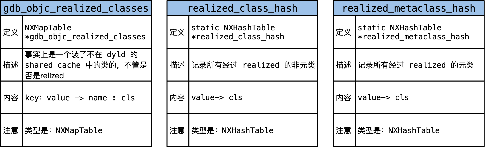


### 读取__objc_classlist（所有类列表，存储到gdb_objc_realized_classes map中

```
///代码位于objc-runtime-new文件中
for (EACH_HEADER) { // 遍历 hList
    bool headerIsBundle = hi->isBundle(); // header 是否是 bundle 类型
    bool headerIsPreoptimized = hi->isPreoptimized(); // header 是否经过预优化

    // 取出 header 中的所有的 objective-c 2.0 的类
    classref_t *classlist = _getObjc2ClassList(hi, &count);
    for (i = 0; i < count; i++) { // 遍历类列表
        Class cls = (Class)classlist[i];
        // 读取该类，会做一些处理，取得新类(逻辑很复杂，完全懵圈)
        Class newCls = readClass(cls, headerIsBundle, headerIsPreoptimized);

        // 如果获得的是一个非空的新类
        if (newCls != cls  &&  newCls) {
            // Class was moved but not deleted. Currently this occurs 
            // only when the new class resolved a future class.
            // Non-lazily realize the class below.
            
            // 类被移动了，但是没有被删除，
            // 这只会发生在新类 resolve 了一个 future 类的情况下
            // 下面以非惰性的方法 realize 了 newCls
            
            // 为 resolvedFutureClasses 数组重新开辟一块更大的空间，并将原来的数据拷贝进来
            resolvedFutureClasses = (Class *)
                realloc(resolvedFutureClasses, 
                                  (resolvedFutureClassCount+1) 
                                  * sizeof(Class));
            // 将 newCls 添加到数组的末尾，resolvedFutureClassCount 加 1
            resolvedFutureClasses[resolvedFutureClassCount++] = newCls;
        }
    }
}

GETSECT(_getObjc2ClassList,           classref_t,      "__objc_classlist");
```

这段代码循环所有镜像，通过_getObjc2ClassList函数，读取每个镜像中的__objc_classlist  section中的所有类，然后对每个类调用readClass函数。readClass如果返回的类是future类，存储到resolvedFutureClasses数组中，后面会实现这些future类。


####  __objc_classlist 理解

首先创建一个命令行程序，添加如下代码：

```
@interface LJPersion : NSObject

@end

@implementation LJPersion


+ (NSString*) classMethod
{
    return nil;
}

- (NSString *) instanceMethod
{
    return nil;
}

@end
```
编译完成后，使用mashOView 查看__objc_classlist内容：

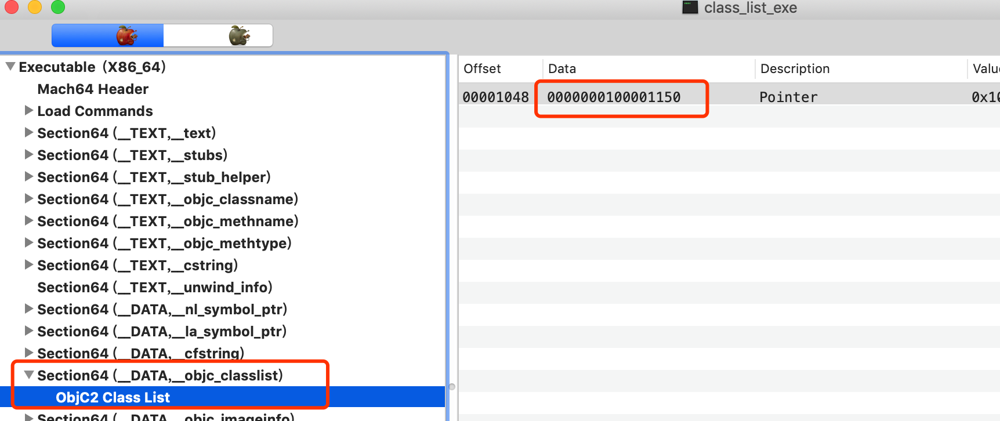

__objc_classlist 就是这个镜像中所有的类的列表，我新建的程序只有一个类LJPersion，根据图所示，LJPersion 应该存储在0x0000000100001150中， 然后用hopper 查看0x0000000100001150处的内容，验证存储的内容是否是LJPersion类。

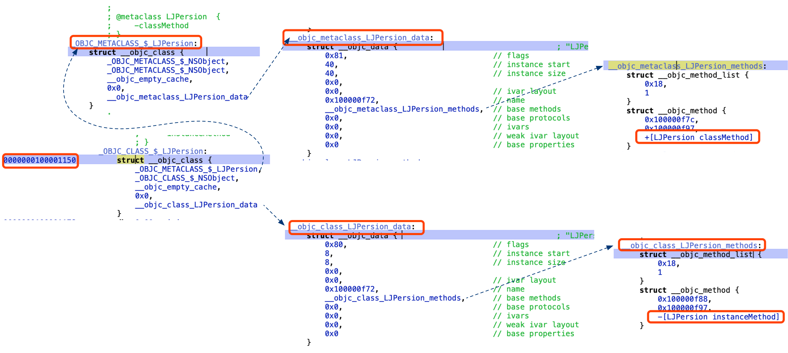

可以确定0x0000000100001150地址存储的内容就是LJPersion类，同时可以看出类的数据中保存着instanceMethod方法，元类中保存着classMethod方法。

#### readClass代码分析

通过`classref_t *classlist = _getObjc2ClassList(hi, &count);`将 hi表示的镜像中的所有类读取到classlist中，然后对classlist中的每个类调用readClass函数。


```
/***********************************************************************
 读取一个编译器写的 类 或 元类，
 返回新类的指针，有可能是：
    - cls
    - nil (cls 有一个 missing weak-linked 的父类)
    - 同名的 future 类，该 future 类填充了 cls 类的信息
 调用者：_read_images() / objc_readClassPair()
**********************************************************************/
Class readClass(Class cls,
                bool headerIsBundle/*是否是 bundle*/,
                bool headerIsPreoptimized/*是否被预优化过，即是否来自 shared cache*/)
{
    const char *mangledName = cls->mangledName(); // 取得 cls 的重整后的名字
    
    if (missingWeakSuperclass(cls)) { // 查看 cls 类的祖宗类中是否有类是 weak-linked 的，并且已经 missing
        // 祖宗类里有 missing weak-linked 的
        // 则 cls 的所有信息也是不可信的，所以将其添加到重映射表里，映射为nil，即 cls -> nil
        
        addRemappedClass(cls, nil); // 将其添加到重映射表里，映射为nil
        cls->superclass = nil; // 父类指针指向 nil
        return nil;
    }

    Class replacing = nil; // 记录被代替的类
    
    // 尝试将 mangledName 对应的 future 的类从 future_named_class_map 中弹出
    // 如果返回的 newCls 有值，则 newcls 类是以前开辟的一个同名的 future 类，
    // 这个 future 类现在得到了兑现，因为有一个同名的新类 cls 进来了，
    // future 类里的信息会由 cls 中的信息填充（原来 future 类只开辟了内存，里面其实是啥都没的）
    // 并将 cls 代替
    if (Class newCls = popFutureNamedClass(mangledName)) {
        // This name was previously allocated as a future class.
        // Copy objc_class to future class's struct.
        // Preserve future's rw data block.
        
        // 但是 newcls 不能是 swift 类，因为太大了？啥意思？swift类能有多大
        if (newCls->isSwift()) {
            _objc_fatal("Can't complete future class request for '%s' "
                        "because the real class is too big.", 
                        cls->nameForLogging());
        }
        
        class_rw_t *rw = newCls->data();     // 取得 newCls 中的 rw，rw 中除了 ro 外的其他数据是需要保留的
        const class_ro_t *old_ro = rw->ro;   // 旧的 ro
        memcpy(newCls, cls, sizeof(objc_class)); // 将 cls 中的数据完整得拷贝到 newCls 中
        rw->ro = (class_ro_t *)newCls->data();   // rw 中使用新的 ro
        newCls->setData(rw);        // 将 rw 赋给 newCls，那么 newCls 中使用的还是原来的 rw，只是其中的 ro 变了
        free((void *)old_ro->name); // 旧 ro 中的 name 是在堆上分配的，所以需要释放
        free((void *)old_ro);       // 将旧 ro 释放
        
        addRemappedClass(cls, newCls); // 将 cls -> newCls 的重映射添加到映射表中
        
        replacing = cls; // 记录下 cls 类被代替
        cls = newCls;   // 新类 newCls 赋给 cls
    }
    
    if (headerIsPreoptimized  &&  !replacing) { // 预优化过，且没有被代替
        assert(getClass(mangledName));
    } else {
        // 否则将 mangledName -> cls 的映射添加到 gdb_objc_realized_classes 表中
        // 如果上 cls 被 newCls 代替了，那么 replacing 就是老的 cls，即在 gdb_objc_realized_classes 中
        // 也会将老的 cls 代替
        addNamedClass(cls, mangledName, replacing);
    }
    
    // for future reference: shared cache never contains MH_BUNDLEs
    if (headerIsBundle) {
        cls->data()->flags |= RO_FROM_BUNDLE;
        cls->ISA()->data()->flags |= RO_FROM_BUNDLE;
    }
    return cls;
}
```

主要的完成的任务用下图表示：

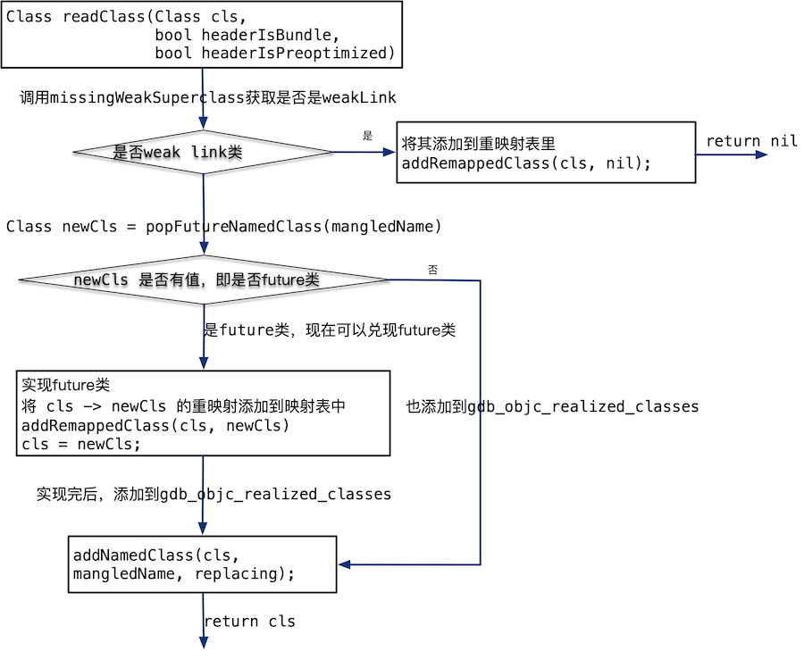


其中missingWeakSuperclass 确定cls的祖宗类是否缺失：

```
// 判断 cls 类的祖宗类中是否有类是 weak-linked 的，或者说已经 missing(丢失)
// 这是一个递归函数
static bool 
missingWeakSuperclass(Class cls)
{
    assert(!cls->isRealized()); // cls 不能是已经 realized 的类，因为 realized 的类一定是正常的

    if (!cls->superclass) { // 如果没有父类，则看它是否是根类，若是根类，那么就是正常的，否则它的父类就是丢了
                            // 结束递归
        // superclass nil. This is normal for root classes only.
        return (!(cls->data()->flags & RO_ROOT));
    } else {
        // superclass not nil. Check if a higher superclass is missing.
        // 如果有父类，则递归调用一直向上查找祖宗类，看是否有丢的了
        Class supercls = remapClass(cls->superclass); // 取得重映射的父类，如果父类是 weak-link 的，
                                                      // 则 remapClass 会返回 nil
        assert(cls != cls->superclass); // 这两个断言很奇怪，完全想不到什么奇葩情况下这两个断言会不成立
        assert(cls != supercls);
        if (!supercls) return YES; // 如果父类是 weak-link 的，则 supercls 为 nil，返回 YES，结束递归
        if (supercls->isRealized()) return NO; // 如果父类已经被 realized，则直接返回 NO，因为 realized 的类一定是正常的
                                               // 结束递归
        return missingWeakSuperclass(supercls); // 否则递归寻找祖宗类们
    }
}
```

在重映射表中查找key为cls的类：

```
// 返回 cls 类的 live class（活动的类）指针，这个指针可能指向一个已经被 reallocated 的结构体（#疑问：什么意思？？）
// 若 cls 是 weak linking（弱连接），则 cls 会被忽略，而返回 nil
// 调用者 ：_class_remap() / missingWeakSuperclass() / realizeClass() /
//         remapClass() / remapClassRef()
static Class remapClass(Class cls)
{
    runtimeLock.assertLocked();

    Class c2; // 这里没有初始化为 nil，有没有可能指向一块垃圾内存？？

    if (!cls) return nil; // 如果 cls 是 nil，则直接返回 nil

    NXMapTable *map = remappedClasses(NO); // 取得 remapped_class_map 映射表，若为空，不创建
    // 如果 map 非空，或者 cls 不是一个 key，NX_MAPNOTAKEY(not a key)，即 cls 压根儿不在 remapped_class_map 映射表里
    // 则将 cls 返回
    if (!map  ||  NXMapMember(map, cls, (void**)&c2) == NX_MAPNOTAKEY) {
        return cls;
    } else {
        return c2;  // 1. 如果 map 是空，则返回的 c2 == nil（#疑问：有没有可能是垃圾内存？？），因为 || 的断路特点，后面的代码不会执行
                    // 2. 如果 map 不为空，并且 cls 确实是 remapped_class_map 中的 key，则 c2 就是取得的 value
                    //      但是其中 key 如果是 ignored weak-linked class 的话，c2 就是 nil
    }
}
```

remapClass 函数功能是： 从remapped_class_map表中取key为cls的内容。 如果表位空，或者表中没有，直接返回cls，否则返回表中内容。

addRemappedClass 添加成员到重映射表：

```
// 添加一个 remapped 的类到 remapped_class_map 映射表中
// newcls 是一个已经被 realized 的 future 类，oldcls 是老的 future 类
// 或者 newcls 是 nil，oldcls 是 ignored weak-linked 类
static void addRemappedClass(Class oldcls, Class newcls)
{
    ....
    void *old;
    // 将 oldcls 为 key，newcls 为 value 插入到 remapped_class_map 映射表 中，
    // remappedClasses(YES) 中 YES 是指定如果 remapped_class_map 为空的话，就创建一个
    old = NXMapInsert(remappedClasses(YES), oldcls, newcls);
    
    assert(!old); // old 不能为空
}
```

将oldcls：newcls 添加到 重映射remapped_class_map表中。

popFutureNamedClass 函数定义如下:

```
// 将指定 name 对应的 future 类从 future_named_class_map 中移除
// 因为 这个类 已经被 realized 过了，它已经不再处于 future 状态
// 返回 name 对应的 future class，如果没有对应的 future class，就返回 nil
// caller : readClass()
static Class popFutureNamedClass(const char *name)
{
    runtimeLock.assertWriting();

    Class cls = nil;

    if (future_named_class_map) { // 如果 future_named_class_map 非空
        // 利用 key name 将 future class 从 future_named_class_map 移除
        // NXMapKeyFreeingRemove 与 NXMapRemove 功能一样，但是会释放 key，因为 key 是在堆中分配的，原因见 NXMapKeyCopyingInsert()
        cls = (Class)NXMapKeyFreeingRemove(future_named_class_map, name);
        
        // 如果 name 确实有对应的 future class，并且当前 future_named_class_map 已经空了
        // 就将 future_named_class_map 释放
        if (cls && NXCountMapTable(future_named_class_map) == 0) {
            NXFreeMapTable(future_named_class_map);
            future_named_class_map = nil; // 防止野指针
        }
    }

    return cls;
}
```

从future_named_class_map中弹出指定名称的类。

```
/***********************************************************************
* addNamedClass
* Adds name => cls to the named non-meta class map.
* Warns about duplicate class names and keeps the old mapping.
* Locking: runtimeLock must be held by the caller
 
 添加 name -> cls 对到 named non-meta class map（gdb_objc_realized_classes）中
 警告有副本，但是会保持老的映射，即会有多份，
 新的映射被存在了 secondary metaclass map(二级元类映射表) 表中，见 addNonMetaClass()，
 replacing : 被代替的老的 cls (见 readClass()) 如果有旧映射，但是与 replacing 不符合，还是会保留旧映射，
             否则新值会将 gdb_objc_realized_classes 中的旧映射覆盖
 调用者：objc_duplicateClass() / objc_registerClassPair() / readClass()
**********************************************************************/
static void addNamedClass(Class cls, const char *name, Class replacing = nil)
{
    runtimeLock.assertWriting();
    
    Class old;
    // 先根据 name 查找是否有对应的旧类，如果有，并且 old 与 replacing 不同
    // 则报警告，但是会保持老的映射，插入新的映射
    if ((old = getClass(name))  &&  old != replacing) {
        
        inform_duplicate(name, old, cls); // 给出警告：名字为 name 的类有两份实现，但只有一份会被使用

        // getNonMetaClass uses name lookups. Classes not found by name 
        // lookup must be in the secondary meta->nonmeta table.
        addNonMetaClass(cls); // 将 cls 存入 matacls->cls 的二级映射表中
    } else {
        // 如果没有旧值，或者指定要覆盖旧值（replacing == old），就将新的 name->cls 对插入 gdb_objc_realized_classes
        NXMapInsert(gdb_objc_realized_classes, name, cls);
    }
    assert(!(cls->data()->flags & RO_META)); // cls 不能是元类
}
```
将类添加到一级或者二级缓存中。


readClass 做了下面三件事：

1. 如果class的祖宗类丢失，将类添加到NXMapTable *remapped_class_map表中，key是cls，value是nil。 最后直接返回 nil。
2. 从future_named_class_map中查找cls是否是future类，如果是，通过cls实现future类，然后将结果添加到remapped_class_map中，key是cls，value是实现完成的future类------newCls。 同时调用addNamedClass函数，将newCls添加到gdb_objc_realized_classes或 nonmeta_class_map表中。
3. 其他情况，直接调用addNamedClass函数，将类添加到gdb_objc_realized_classes或nonmeta_class_map表中。 返回cls。  一般代码走这一步。
  
下面是这段代码使用的几个新表:

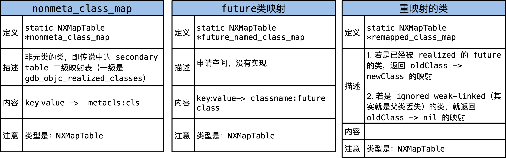


#### 将类读取到gdb_objc_realized_classes的意义

为了说明读取类到gdb_objc_realized_classes的意义，举个例子，objc_getClass函数就是通过名字获取对应的类：

```
Class objc_getClass(const char *aClassName)
{
    if (!aClassName) return Nil;

    // NO unconnected, YES class handler
    return look_up_class(aClassName, NO, YES);
}
```

内部调用 look_up_class 函数：

```
Class 
look_up_class(const char *name, 
              bool includeUnconnected __attribute__((unused)), 
              bool includeClassHandler __attribute__((unused)))
{
    if (!name) return nil; // 类名不能为 nil，否则不能查

    Class result;
    bool unrealized;
    { // 加函数块是为了能实现自动释放 runtimeLock 锁，下面也一样
        
        rwlock_reader_t lock(runtimeLock); // 加读锁
        result = getClass(name); // 利用 getClass 函数查找类
        unrealized = result  &&  !result->isRealized(); // 如果找到了类，且类没有被 realize，就标记为 unrealized
    }
    if (unrealized) { // 类存在，且没有被 realize
        rwlock_writer_t lock(runtimeLock); // 加写锁
        realizeClass(result); // 将类 realize 了
    }
    return result;
}
```

内部调用 getClass函数

```
// 根据 name 查找类，实际上调用的还是 getClass_impl，但是需要对 swift 的类做一些处理
static Class getClass(const char *name)
{
    runtimeLock.assertLocked(); // 必须事先被加锁

    // Try name as-is
    Class result = getClass_impl(name); // 先直接用 name 查找
    if (result) {
        return result; // 找到直接返回
    }

    // 如果找不到，就处理成 swift 类的 mangled name 试试
    
    // Try Swift-mangled equivalent of the given name.
    if (char *swName = copySwiftV1MangledName(name)) { // 尝试转成 swift mangled name，函数里判断 name 是否符合
                                                       // swift unmangled name(重整前的名字) 的格式，如果符合就返回 mangled name，
                                                       // 否则返回 nil
        result = getClass_impl(swName); // 用 mangled name 再去找
        free(swName); // 将 swName 释放，原因见 copySwiftV1MangledName()
        return result; // 不用再判断 result 是否有值，直接将它返回
    }

    return nil; // 如果连 swift 类都不是，就返回 nil
}
```

内部调用getClass_impl 函数

```
// 根据名字查找类，这个类可能没有被 realize 过
// 该函数被 getClass() 函数调用
static Class getClass_impl(const char *name)
{
    runtimeLock.assertLocked(); // 必须事先被加锁

    // allocated in _read_images 
    assert(gdb_objc_realized_classes); // gdb_objc_realized_classes 是在 _read_images() 函数中被初始化的(分配内存)

    // Try runtime-allocated table
    // 从 gdb_objc_realized_classes 根据 key 即 name 查找类
    Class result = (Class)NXMapGet(gdb_objc_realized_classes, name);
    if (result) {
        return result; // 找到了，就将其返回
    }

    // Try table from dyld shared cache
    // 如果在 gdb_objc_realized_classes 中找不到，就去预优化的类中找找看（跟 dyld shared cache 有关）
    return getPreoptimizedClass(name);
}
```

这里面就是使用了gdb_objc_realized_classes。

###  读取_getObjc2ClassRefs、_getObjc2SuperRefs（使用的类、父类），修正重映射类表

```
// Fix up remapped classes
// Class list and nonlazy class list remain unremapped.
// Class refs and super refs are remapped for message dispatching.
   
// 如果 remapped_class_map 不是空的
if (!noClassesRemapped()) {
    for (EACH_HEADER) { // 遍历 hList
        // 取得 header 中所有的类引用
        Class *classrefs = _getObjc2ClassRefs(hi, &count);
        // 遍历这些类引用，fix-up 类引用，从重映射类表中取出新类，如果旧类新类不一致，就将新类赋给这个类引用
        for (i = 0; i < count; i++) {
            remapClassRef(&classrefs[i]);
        }
        // fixme why doesn't test future1 catch the absence of this?
        // 取得镜像中所有类的父类引用
        classrefs = _getObjc2SuperRefs(hi, &count);
        // 遍历父类引用，将其 fix-up 了
        for (i = 0; i < count; i++) {
            remapClassRef(&classrefs[i]);
        }
    }
}
```

通过_getObjc2ClassRefs、_getObjc2SuperRefs读取__objc_classrefs、__objc_superrefs， 也就是读取程序中引用的类、父类，将classrefs分别调用remapClassRef，修正重映射表--------remapped_class_map。

```
/***********************************************************************
* remapClassRef
* Fix up a class ref, in case the class referenced has been reallocated 
* or is an ignored weak-linked class.
* Locking: runtimeLock must be read- or write-locked by the caller
**********************************************************************/
// fix-up 一个类引用，万一这个类引用指向的类已经被 reallocated(重新分配？) 或者它是一个 ignored weak-linked 类
// 从重映射类表中用 *clsref 为 key 取出新类，如果 *clsref 不等于新类，则将新类赋给 *clsref
// clsref 是一个二级指针，它指向一个类的指针
// 调用者 ：_read_images()
static void remapClassRef(Class *clsref)
{
    runtimeLock.assertLocked();

    Class newcls = remapClass(*clsref); // 用 *clsref 为 key 从重映射类表中取出新类
    if (*clsref != newcls) { // 如果 *clsref 不等于新类，则将新类赋给 *clsref
        *clsref = newcls;
    }
}
```

__objc_classrefs在Mach-O的结构如下。

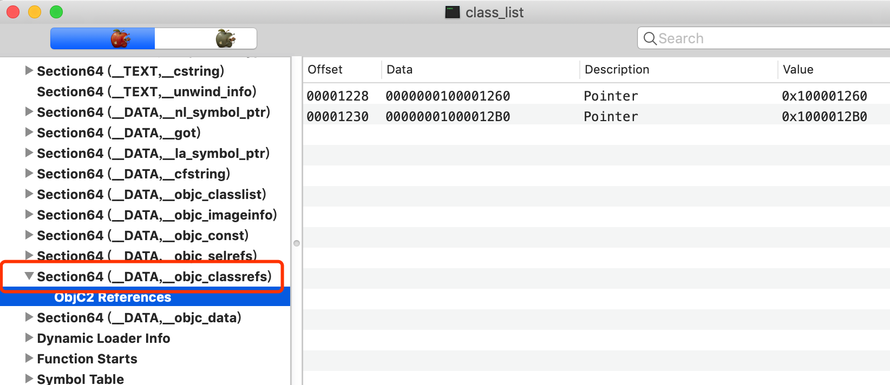

### 读取__objc_selrefs（方法列表）--将读取的方法注册到namedSelectors表中

```
// Fix up @selector references fixup @selector 引用
static size_t UnfixedSelectors; // 记录 hList 中所有镜像中一共有多少 unfixed 的 selector
sel_lock(); // selLock 上写锁
for (EACH_HEADER) { // 遍历 hList
    // 只处理没有预优化的，被预优化过的就跳过
    if (hi->isPreoptimized()) continue;

    bool isBundle = hi->isBundle(); // 是否是 bundle
    // 取得镜像中所有的 selector 引用
    SEL *sels = _getObjc2SelectorRefs(hi, &count);
    UnfixedSelectors += count; // 累加
    for (i = 0; i < count; i++) { // 遍历刚才取出的 selector
        const char *name = sel_cname(sels[i]); // 转为char * 字符串
        sels[i] = sel_registerNameNoLock(name, isBundle); // 注册这个 selector 的名字
    }
}
```

读取Mach-O中的__objc_selrefs section，调用sel_registerNameNoLock方法注册。 

```
// 注册 SEL 的名字，不加锁
SEL sel_registerNameNoLock(const char *name, bool copy) {
    return __sel_registerName(name, 0, copy);  // NO lock, maybe copy
}

/ 注册 SEL 的名字，能决定是否加锁和拷贝，拷贝即是否深拷贝 name，见 sel_alloc()
// 调用者：sel_getUid() / sel_registerName() / sel_registerNameNoLock()
static SEL __sel_registerName(const char *name, int lock, int copy) 
{
    SEL result = 0;
    ...

    if (!namedSelectors) {
        namedSelectors = NXCreateMapTable(NXStrValueMapPrototype, 
                                          (unsigned)SelrefCount);
    }
    if (lock) {
        // Rescan in case it was added while we dropped the lock
        result = (SEL)NXMapGet(namedSelectors, name);
    }
    if (!result) {
        result = sel_alloc(name, copy);
        // fixme choose a better container (hash not map for starters)
        NXMapInsert(namedSelectors, sel_getName(result), result);
    }

    if (lock) selLock.unlockWrite();
    return result;
}
```
sel_registerNameNoLock 内部调用了__sel_registerName方法，将(sel Name：SEL) 对插入到namedSelectors表中。


为啥注册，下面有一段说明

```
 * @note You must register a method name with the Objective-C runtime system to obtain the
 *  method’s selector before you can add the method to a class definition. If the method name
 *  has already been registered, this function simply returns the selector.
 *  
```

这里有一个新的表，结构如下：

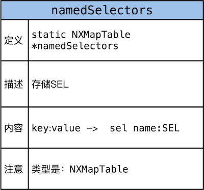
 
 读取的Mach-O 中__objc_selrefs 的内容如下：
 
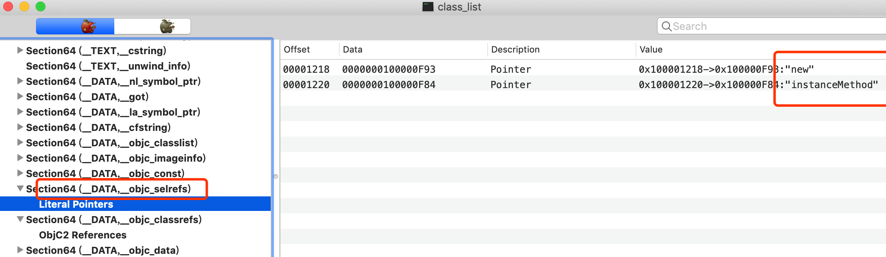

#### 将SEL存储到namedSelectors Hash表的意义

```
/** 
 * Identifies a selector as being valid or invalid.
 * 
 * @param sel The selector you want to identify.
 * 
 * @return YES if selector is valid and has a function implementation, NO otherwise. 
 * 
 * @warning On some platforms, an invalid reference (to invalid memory addresses) can cause
 *  a crash. 
 */
OBJC_EXPORT BOOL sel_isMapped(SEL sel)
    __OSX_AVAILABLE_STARTING(__MAC_10_0, __IPHONE_2_0);
```

rumtime 提供了这样一个API，判断SEL 是否被映射，可能其他的系统库会调用。
    
### 读取__objc_msgrefs（OBJC的消息），修正部分SEL的IMP

```
 for (EACH_HEADER) {
        message_ref_t *refs = _getObjc2MessageRefs(hi, &count);
        if (count == 0) continue;

        if (PrintVtables) {
            _objc_inform("VTABLES: repairing %zu unsupported vtable dispatch "
                         "call sites in %s", count, hi->fname);
        }
        for (i = 0; i < count; i++) {
            fixupMessageRef(refs+i);
        }
    }
```

通过 _getObjc2MessageRefs 读取Mach-O文件中的 __objc_msgrefs section。

```
// 修复一个老的 vtable 调度
// 调用者：_read_images()
static void 
fixupMessageRef(message_ref_t *msg)
{
    // 注册消息的 sel
    msg->sel = sel_registerName((const char *)msg->sel);

    if (ignoreSelector(msg->sel)) { // 如果 sel 是需要被忽略的，就将其 imp 设为 _objc_ignored_method
        // ignored selector - bypass dispatcher
        msg->imp = (IMP)&_objc_ignored_method;
    }
    else if (msg->imp == &objc_msgSend_fixup) { // 如果消息的 imp 是 objc_msgSend_fixup，即指定了需要将 imp fixup
        if (msg->sel == SEL_alloc) {
            msg->imp = (IMP)&objc_alloc;
        } else if (msg->sel == SEL_allocWithZone) {
            msg->imp = (IMP)&objc_allocWithZone;
        } else if (msg->sel == SEL_retain) {
            msg->imp = (IMP)&objc_retain;
        } else if (msg->sel == SEL_release) {
            msg->imp = (IMP)&objc_release;
        } else if (msg->sel == SEL_autorelease) {
            msg->imp = (IMP)&objc_autorelease;
        } else {
            msg->imp = &objc_msgSend_fixedup; // 如果上面都不符合，就将它设置为已经 fixed-up 了
        }
    } 
    else if (msg->imp == &objc_msgSendSuper2_fixup) { 
        msg->imp = &objc_msgSendSuper2_fixedup;
    } 
    else if (msg->imp == &objc_msgSend_stret_fixup) { 
        msg->imp = &objc_msgSend_stret_fixedup;
    } 
    else if (msg->imp == &objc_msgSendSuper2_stret_fixup) { 
        msg->imp = &objc_msgSendSuper2_stret_fixedup;
    } 
#if defined(__i386__)  ||  defined(__x86_64__)
    else if (msg->imp == &objc_msgSend_fpret_fixup) { 
        msg->imp = &objc_msgSend_fpret_fixedup;
    } 
#endif
#if defined(__x86_64__)
    else if (msg->imp == &objc_msgSend_fp2ret_fixup) { 
        msg->imp = &objc_msgSend_fp2ret_fixedup;
    } 
#endif
}
```

fixupMessageRef 函数的作用是修正部分SEL的IMP。


### 读取__objc_protolist（协议列表），添加到protocol_map表中


#### __objc_protolist 理解

编写下面代码，展示协议的结构：

```
@protocol LJProtocal <NSObject>

@required
-(NSString *) instanceMethod;

+ (NSString *) calssMethod;

@optional

-(NSString *) instanceOptMethod;

+ (NSString *) calssOptMethod;

@property(nonatomic,strong) NSString * strProperty;

@end
```

用machoview查看：

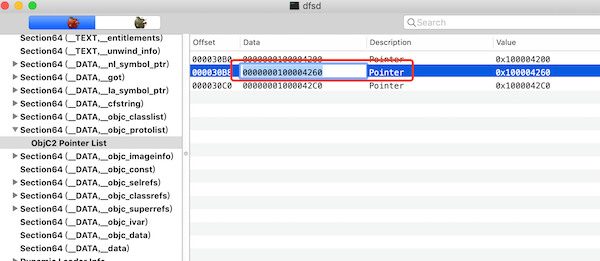

用hopper 查看地址0x 0000000100004260：

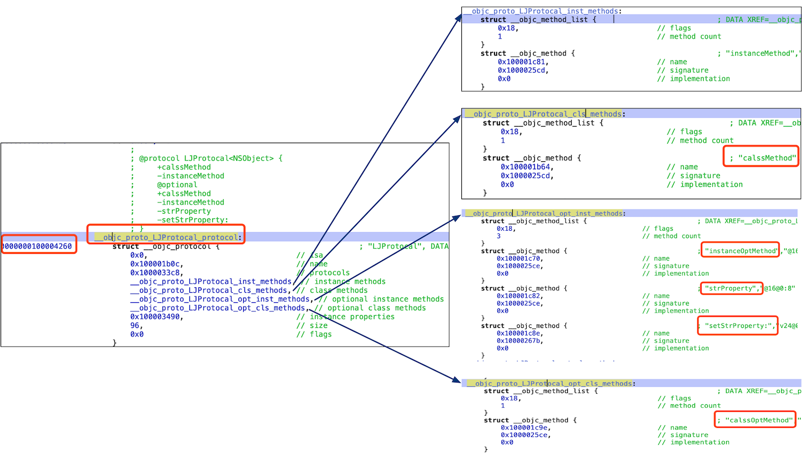


#### 源码分析

```
// Discover protocols. Fix up protocol refs. 取得镜像中的协议，读出协议
for (EACH_HEADER) {
    extern objc_class OBJC_CLASS_$_Protocol;
    Class cls = (Class)&OBJC_CLASS_$_Protocol;
    assert(cls);
    NXMapTable *protocol_map = protocols();
    bool isPreoptimized = hi->isPreoptimized();
    bool isBundle = hi->isBundle();

    protocol_t **protolist = _getObjc2ProtocolList(hi, &count);
    for (i = 0; i < count; i++) {
        readProtocol(protolist[i], cls, protocol_map, 
                     isPreoptimized, isBundle);
    }
}
```

通过_getObjc2ProtocolList 读取__objc_protolist section. 将读取的结果分别调用readProtocol函数。

```
// 读取一个编译器写的协议
// 调用者：_read_images()
static void
readProtocol(protocol_t *newproto,
             Class protocol_class,
             NXMapTable *protocol_map, 
             bool headerIsPreoptimized,
             bool headerIsBundle)
{
    // This is not enough to make protocols in unloaded bundles safe, 
    // but it does prevent crashes when looking up unrelated protocols.
    // 如果镜像是 bundle，就使用 NXMapKeyCopyingInsert 函数，否则使用 NXMapInsert
    // NXMapKeyCopyingInsert 会在堆中拷贝 key
    auto insertFn = headerIsBundle ? NXMapKeyCopyingInsert : NXMapInsert;

    // 根据新协议的重整名称，去 protocol_map 映射表中查找老的协议
    protocol_t *oldproto = (protocol_t *)getProtocol(newproto->mangledName);

    if (oldproto) { // 如果存在老的协议，就只报个警告，因为不允许有重名的协议
    }
    else if (headerIsPreoptimized) { // 如果不存在老的协议，但是镜像是经过预优化的
        // Shared cache initialized the protocol object itself, 
        // but in order to allow out-of-cache replacement we need 
        // to add it to the protocol table now.

        // 根据新协议的重整名称 查找 预优化的缓存协议
        // 但是 getPreoptimizedProtocol 现在一直返回 nil
        protocol_t *cacheproto = (protocol_t *)
            getPreoptimizedProtocol(newproto->mangledName);
        
        protocol_t *installedproto;
        if (cacheproto  &&  cacheproto != newproto) {
            // Another definition in the shared cache wins (because 
            // everything in the cache was fixed up to point to it).
            installedproto = cacheproto;
        }
        else { // 因为 cacheproto 永远是 nil，所以一直走 else 分支
            // This definition wins.
            installedproto = newproto;
        }
        
        assert(installedproto->getIsa() == protocol_class);
        assert(installedproto->size >= sizeof(protocol_t));
        
        // 将 新协议的重整名称 -> 新协议 的映射插入 protocol_map 映射表中
        insertFn(protocol_map, installedproto->mangledName, 
                 installedproto);
    }
    else if (newproto->size >= sizeof(protocol_t)) { // 如果不存在老的协议，且没有经过预优化，且新协议的大小
                                                     // 比 protocol_t 的标准尺寸要大
        // New protocol from an un-preoptimized image
        // with sufficient storage. Fix it up in place.
        // fixme duplicate protocols from unloadable bundle
        newproto->initIsa(protocol_class);  // fixme pinned
        insertFn(protocol_map, newproto->mangledName, newproto); // 就将 新协议的重整名称 -> 新协议 的映射插入
                                                                 // protocol_map 映射表中
    }
    else { // 如果不存在老的协议，且没有经过预优化，且新协议的大小比 protocol_t 的标准尺寸要小
        
        // New protocol from an un-preoptimized image
        // with insufficient storage. Reallocate it.
        // fixme duplicate protocols from unloadable bundle
        
        // 取大的 size，这里按照上面的逻辑，应该是 sizeof(protocol_t)
        size_t size = max(sizeof(protocol_t), (size_t)newproto->size);
        // 新建一个 installedproto 协议，在堆中分配内存，并清零
        protocol_t *installedproto = (protocol_t *)calloc(size, 1);
        // 将 newproto 内存上的内容 拷贝到 installedproto 中
        memcpy(installedproto, newproto, newproto->size);
        // 将 installedproto->size 设为新的 size
        installedproto->size = (__typeof__(installedproto->size))size;
        
        installedproto->initIsa(protocol_class); // 设置 isa  // fixme pinned
        
        // 将 installedproto 插入 protocol_map 映射表中
        insertFn(protocol_map, installedproto->mangledName, installedproto);
    }
}
```

readProtocol 将读取的协议，存储到protocol_map 表中。 

存储协议的hash表的介绍如下：

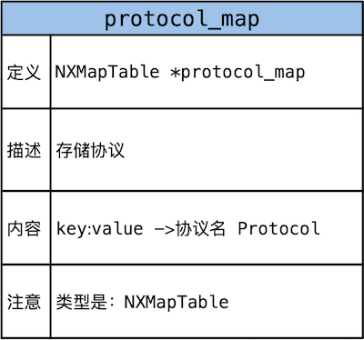


####  将协议存储到表的作用


这里也是举个例子，例如，  NSObject的conformsToProtocol 方法，判断当前类是否遵守协议protocol：

```
- (BOOL)conformsToProtocol:(Protocol *)protocol {
    if (!protocol) return NO;
    for (Class tcls = [self class]; tcls; tcls = tcls->superclass) {
        if (class_conformsToProtocol(tcls, protocol)) return YES;
    }
    return NO;
}
```

循环所有当前类-->超类，调用 class_conformsToProtocol方法。

```
BOOL class_conformsToProtocol(Class cls, Protocol *proto_gen)
{
    protocol_t *proto = newprotocol(proto_gen);
    
    if (!cls) return NO;
    if (!proto_gen) return NO;

    rwlock_reader_t lock(runtimeLock);

    assert(cls->isRealized());

    for (const auto& proto_ref : cls->data()->protocols) {
        protocol_t *p = remapProtocol(proto_ref);
        if (p == proto || protocol_conformsToProtocol_nolock(p, proto)) {
            return YES;
        }
    }

    return NO;
}
```

取出类cls中所有准守的协议，循环调用protocol_conformsToProtocol_nolock，判断两个协议是否一致。

```
**********************************************************************/
static bool 
protocol_conformsToProtocol_nolock(protocol_t *self, protocol_t *other)
{
    runtimeLock.assertLocked();

    if (!self  ||  !other) {
        return NO;
    }

    // protocols need not be fixed up

    if (0 == strcmp(self->mangledName, other->mangledName)) {
        return YES;
    }

    if (self->protocols) {
        uintptr_t i;
        for (i = 0; i < self->protocols->count; i++) {
            protocol_t *proto = remapProtocol(self->protocols->list[i]);
            if (0 == strcmp(other->mangledName, proto->mangledName)) {
                return YES;
            }
            if (protocol_conformsToProtocol_nolock(proto, other)) {
                return YES;
            }
        }
    }

    return NO;
}
```

如果协议的整合名称mangledName一样，认为协议一致，否则循环self中剩下的协议，只要有一个相同，就认为是遵守。

```
static protocol_t *remapProtocol(protocol_ref_t proto)
{
    runtimeLock.assertLocked();

    protocol_t *newproto = (protocol_t *)
        getProtocol(((protocol_t *)proto)->mangledName);
    return newproto ? newproto : (protocol_t *)proto;
}
```

remapProtocol 根据协议的引用在表中找到协议。

```
static Protocol *getProtocol(const char *name)
{
    runtimeLock.assertLocked();

    // Try name as-is.
    Protocol *result = (Protocol *)NXMapGet(protocols(), name);
    if (result) return result;

    // Try Swift-mangled equivalent of the given name.
    if (char *swName = copySwiftV1MangledName(name, true/*isProtocol*/)) {
        result = (Protocol *)NXMapGet(protocols(), swName);
        free(swName);
        return result;
    }

    return nil;
}
```
getProtocol 通过协议名称找到协议。


###  读取__objc_nlclslist（none lazy类），并实现类 

__objc_nlclslist section中存储着这样的类：

1. 类中还有+load方法
2. 类有静态实例

这样的类会马上使用，所以需要立马初始化。


#### __objc_nlclslist 介绍

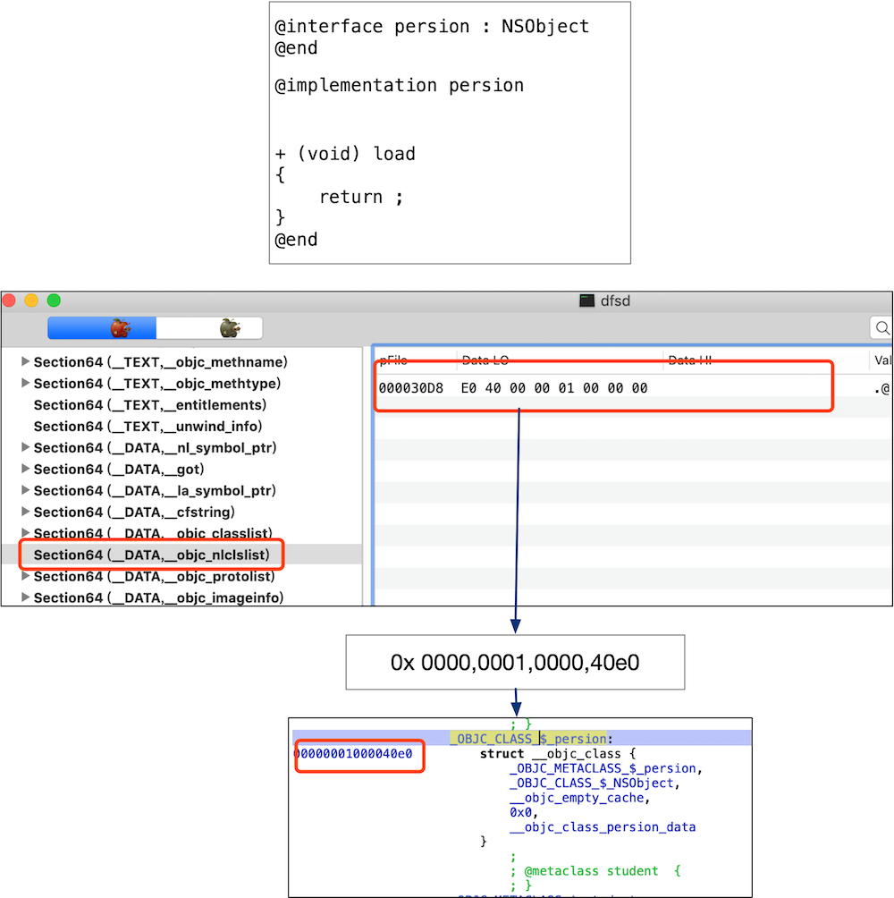

上图说明 如果类中有+load方法，这个类在编译的时候就会放置到__objc_nlclslist section中。 图中上面部分是测试代码，中间部分是machoview查看结果，下面部分是使用hopper查看反汇编地址，证明40e0处存储的是persion类。

#### 源码解析

```
// Realize non-lazy classes (for +load methods and static instances)
for (EACH_HEADER) {
    classref_t *classlist = 
        _getObjc2NonlazyClassList(hi, &count);
        for (i = 0; i < count; i++) 
        {
	        Class cls = remapClass(classlist[i]);
	        if (!cls) continue;
	
	        realizeClass(cls);
    }
}
```

当类中有+load方法、或者类有静态实例，编译器会将类添加到__objc_nlclslist section中。 上面代码读取__objc_nlclslist 中的所有类，将读出的类调用realizeClass函数实现类。

```
static Class realizeClass(Class cls)
{
    runtimeLock.assertWriting(); // 看 runtimeLock 是否正确得加了写锁

    const class_ro_t *ro;
    class_rw_t *rw;
    Class supercls;
    Class metacls;
    bool isMeta;

    if (!cls) return nil;
    
    // 如果类已经被 realize 过，就不用 realize 了
    if (cls->isRealized()) {
        return cls;
    }
    
    assert(cls == remapClass(cls)); // remapClass(cls) 得到的是 cls 对应的重映射类，
                                    // 如果 cls 不存在于 remapped_class_map 映射表，得到的才是 cls 本身，
                                    // 所以这里断言 cls == remapClass(cls) 就是看 cls 是否存在于 remapped_class_map 映射表
                                    // 不存在，就是正确；存在，就是错误
                                    // 不存在，则 cls 既不是 realized future class，也不是 ignored weak-linked class
                                    // 见 remappedClasses()

    // fixme verify class is not in an un-dlopened part of the shared cache?

//    从 class_data_bits_t 调用 data 方法，将结果从 class_rw_t 强制转换为 class_ro_t 指针
//    初始化一个 class_rw_t 结构体
//    设置结构体中 ro 的值以及 flag
//    最后设置正确的 data。
    
    ro = (const class_ro_t *)cls->data(); // 因为在 realized 之前，objc_class 中的 class_data_bits_t bits 里
                                          // 本质上存的是 class_ro_t，所以这里只需要转成 class_ro_t 类型就可以了
                                          // 但 future 的类是例外!!!
    
    if (ro->flags & RO_FUTURE) {
        // 如果 ro 的 flag 里记录了这是一个 future 的类，那么 objc_class 中的 class_data_bits_t bits 里存的是 class_rw_t
        // rw 数据已经被分配好内存了，现在要做的就是填充信息
        // This was a future class. rw data is already allocated.
        rw = cls->data();  // 取出 rw
        ro = cls->data()->ro; // 取出 ro
        cls->changeInfo(RW_REALIZED|RW_REALIZING, RW_FUTURE); // 清除 future 状态，RW_FUTURE 位的值置为 0
                                                              // 设置为 realized + realizing 状态
    } else {                                                  // RW_REALIZED 和 RW_REALIZING 位的值置为 1
        // Normal class. Allocate writeable class data.
        // 正常的类的话，就需要开辟内存
        rw = (class_rw_t *)calloc(sizeof(class_rw_t), 1);
        rw->ro = ro; // 将原来的 ro 赋给新 rw 中的 ro 字段
        rw->flags = RW_REALIZED|RW_REALIZING; // 设置为 realized + realizing 状态
        cls->setData(rw); // 将新的 rw 替换老的 rw
    }

    isMeta = ro->flags & RO_META; // cls 类是否是元类

    rw->version = isMeta ? 7 : 0;  // old runtime went up to 6
                            // 版本，元类是 7，普通类是 0

    // Realize superclass and metaclass, if they aren't already.
    // This needs to be done after RW_REALIZED is set above, for root classes.
    
    // remapClass() 函数是如果参数是一个已经 realized 的 future 类，则返回的是新类，否则返回的是自己
    // 查看 cls 的父类对应的重映射的类，将其 realize 了
    supercls = realizeClass(remapClass(cls->superclass));
    // 查看 cls 的元类对应的重映射的类，将其 realize 了
    metacls = realizeClass(remapClass(cls->ISA()));

    // Update superclass and metaclass in case of remapping
    cls->superclass = supercls; // 更新 cls 的父类
    cls->initClassIsa(metacls); // 和元类

    // Reconcile instance variable offsets / layout.
    // This may reallocate class_ro_t, updating our ro variable.
    if (supercls  &&  !isMeta) { // 根据父类，调整 cls 类 ro 中实例变量的偏移量和布局
                                 // 可能重新分配 class_ro_t，更新 ro
        reconcileInstanceVariables(cls, supercls, ro);
    }

    // Set fastInstanceSize if it wasn't set already.
    cls->setInstanceSize(ro->instanceSize); // 设置成员变量的新的大小

    // Copy some flags from ro to rw
    // 从 ro 拷贝一些 flag 到 rw 中，可能是为了加快查找速度
    if (ro->flags & RO_HAS_CXX_STRUCTORS) { // 是否有 C++ 构造器/析构器
        cls->setHasCxxDtor(); // 设置有 C++ 析构器
        if (! (ro->flags & RO_HAS_CXX_DTOR_ONLY)) { // 不只有 C++ 析构器，那么就是也有 C++ 构造器，真绕啊
            cls->setHasCxxCtor();
        }
    }
    .....

    // Connect this class to its superclass's subclass lists
    if (supercls) {
        addSubclass(supercls, cls);
    }

    // 调用 methodizeClass 函数来将分类中的方法列表、属性列表、协议列表加载到 methods、 properties 和 protocols 列表数组中
    // Attach categories
    methodizeClass(cls);

    if (!isMeta) { // 如果不是元类
        addRealizedClass(cls); // 就把它添加到 realized_class_hash 哈希表中
    } else {
        addRealizedMetaclass(cls); // 否则是元类，就把它添加到 realized_metaclass_hash 哈希表中
    }

    return cls;
}
```

realizeClass realize(实现) 指定的 cls 类：

1. 包括开辟它的 read-write data，也就是 rw，见 class_rw_t 结构体；
2. 设置类的类型，元类or 普通类；
3. 递归超类、元类，调用realizeClass。确保超类全部实现过；
4. 设置superclass指针、元类指针；
5. reconcileInstanceVariables ；
6. addSubclass 构建类继承体系的链表；
7. methodizeClass 调整方法  ；
8. 添加到全局表中。


realizeClass 的总体流程如下图：

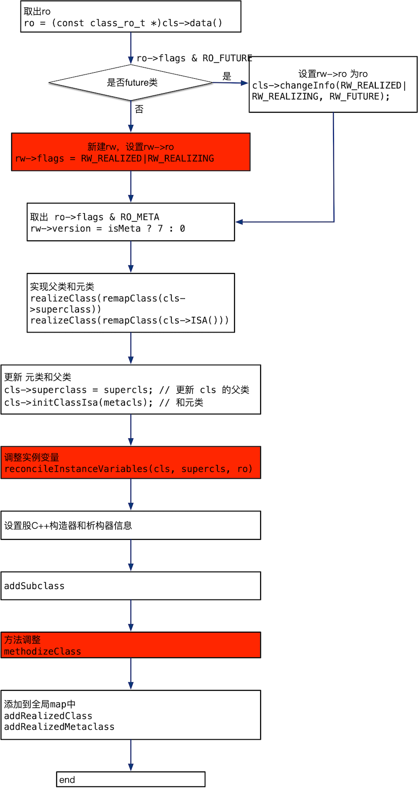


#### 开辟rw

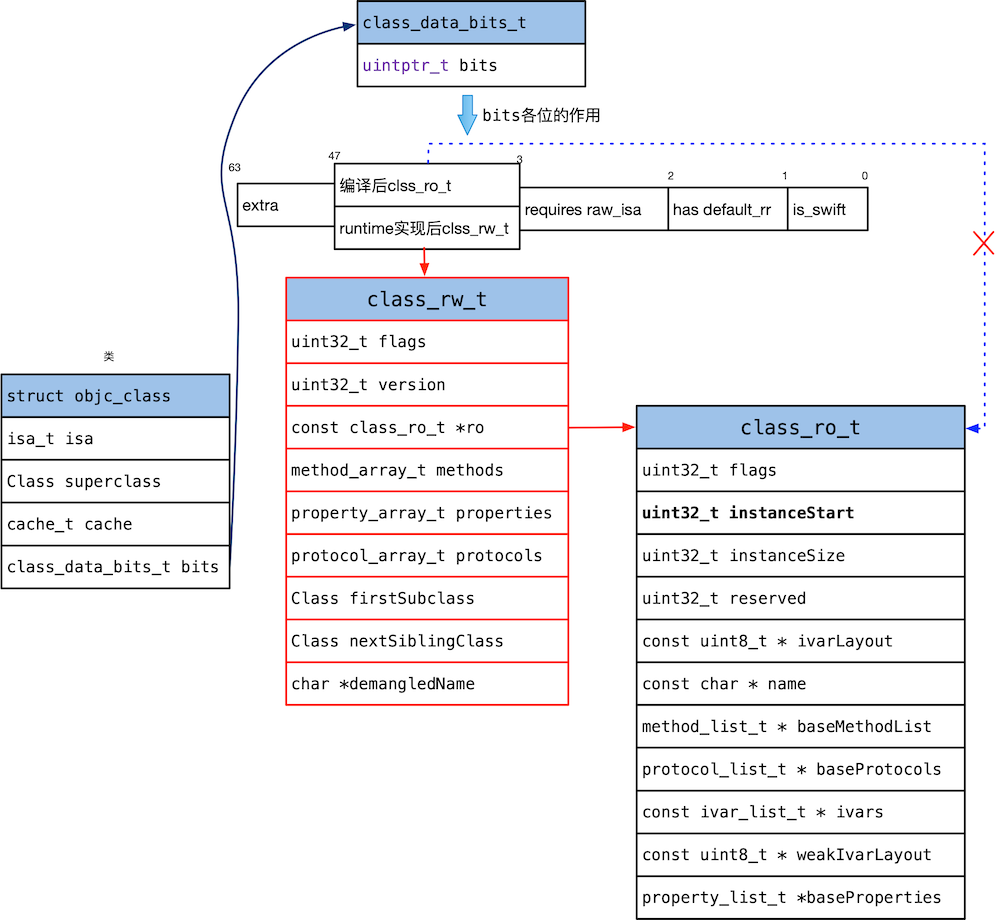

开辟RW的工作就是：将class_data_bits_t结构中bits的3->47位指定的RO切断，创建新的class_rw_t结构，3->47位 重新存储新的class_rw_t结构地址，然后将class_rw_t结构中的ro指针指向原始的class_ro_t结构。

#### reconcileInstanceVariables（没看）

这部分我也不会，没看。

#### addSubclass

构建出的链表如下：

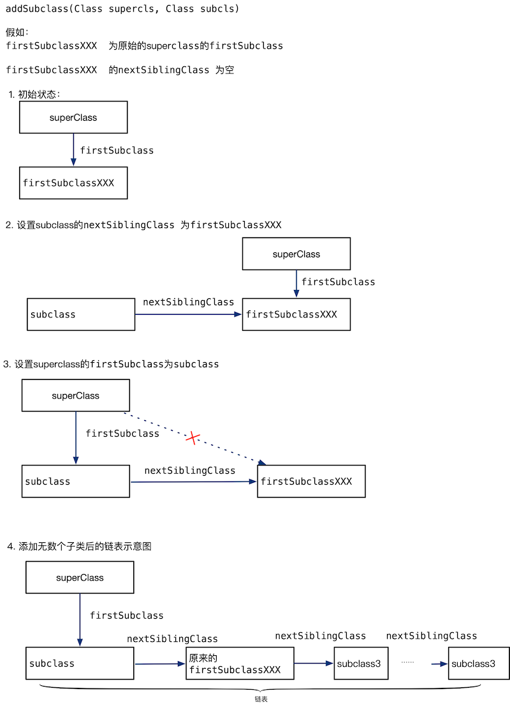


#### methodizeClass

methodizeClass代码如下：

```
// 1. fix-up cls 类的方法列表、协议列表、属性列表（但是看代码，被 fix-up 的只有方法列表啊）
//    将 cls 类的所有没有被 attach 的分类 attach 到 cls 上
// 2. 即将分类中的方法、属性、协议添加到 methods、 properties 和 protocols 中
//    runtimeLock 读写锁必须被调用者上写锁，保证线程安全
static void methodizeClass(Class cls)
{
    runtimeLock.assertWriting(); // 看调用者是否已经正确地将 runtimeLock 上了写锁

    bool isMeta = cls->isMetaClass(); // 记录 cls 类是否是元类
    auto rw = cls->data(); // 取得 cls 中的 rw，因为在 realizeClass() 中已经处理好了 cls->data()，
                           // 所以里面现在存的确定是 rw，而不是 ro
    auto ro = rw->ro; // 取得 rw->ro

    // Methodizing for the first time
    if (PrintConnecting) {
        _objc_inform("CLASS: methodizing class '%s' %s", 
                     cls->nameForLogging(), isMeta ? "(meta)" : "");
    }

    // Install methods and properties that the class implements itself.
    // 取得 ro 中的 baseMethodList，在将其 prepare 后，插入 rw 的方法列表数组中
    method_list_t *list = ro->baseMethods();
    if (list) {
        prepareMethodLists(cls, &list, 1, YES, isBundleClass(cls));
        rw->methods.attachLists(&list, 1);
    }

    // 将 ro 中的 baseProperties 插入 rw 中的属性列表数组中
    property_list_t *proplist = ro->baseProperties;
    if (proplist) {
        rw->properties.attachLists(&proplist, 1);
    }

    // 将 ro 中的 baseProtocols 插入 rw 中的协议列表数组中
    protocol_list_t *protolist = ro->baseProtocols;
    if (protolist) {
        rw->protocols.attachLists(&protolist, 1);
    }

    // Root classes get bonus method implementations if they don't have 
    // them already. These apply before category replacements.
    if (cls->isRootMetaclass()) { // 如果是根元类
        // root metaclass
        // 给根元类的 SEL_initialize 指定了对应的 IMP - objc_noop_imp
        // 即给根元类发送 SEL_initialize 消息，不会走到它的 +initialize，而是走 objc_noop_imp，里面啥也不干
        addMethod(cls, SEL_initialize, (IMP)&objc_noop_imp, "", NO);
    }

    // Attach categories.
    // 给 cls 类附加分类，unattachedCategoriesForClass 会返回 cls 类的没有被附加的类
    category_list *cats = unattachedCategoriesForClass(cls, true /*realizing 其实这个参数压根没用*/);
    // 从分类列表中添加方法列表、属性和协议到 cls 类中
    // attachCategories 要求分类列表中是排好序的，老的分类排前面，新的排后面，那么排序是在哪里做的呢？？？？
    // 自问自答：见 addUnattachedCategoryForClass() 函数，新的 unattached 的分类本来就是插入到列表末尾的
    //         所以压根儿不用再另外排序
    attachCategories(cls, cats, false /*不清空缓存 因为这时候压根连缓存都没有 don't flush caches*/);

    if (cats) {
        free(cats); // 将分类列表释放，见 unattachedCategoriesForClass，
                    // 里面着重强调了调用方需要负责释放分类列表
    }
}
```
上面的代码完成的四个工作用图中的4条虚线表示：

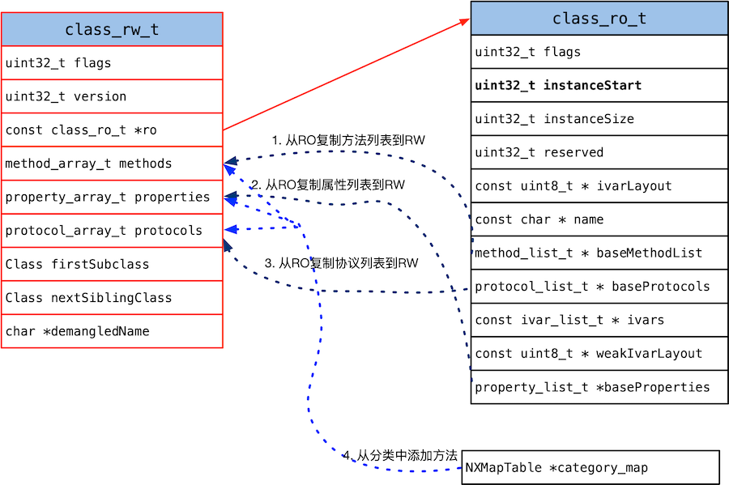

接下来的工作是是分类的处理，这里需要详细的讲下，所以在分出一节 


#### 分类 处理


##### 分类的数据结构 

```
// 存放 locstamped_category_t 的列表
struct locstamped_category_list_t {
    uint32_t count;  // 数组有几个元素
#if __LP64__
    uint32_t reserved;
#endif
    locstamped_category_t list[0]; // 数组的起始地址
};
```

```
// 本地的盖了戳的 category，即已经被添加进了 unattachedCategories
struct locstamped_category_t {
    category_t *cat;   //  category
    struct header_info *hi;  // 所属的 header，即所属的镜像
};
```

```
struct category_t {
    const char *name; // 分类的名字
    classref_t cls;   // 分类所属的类，classref_t 专门用于 unremapped 的类
    struct method_list_t *instanceMethods;  // 实例方法列表
    struct method_list_t *classMethods;     // 类方法列表
    struct protocol_list_t *protocols;      // 遵循的协议列表
    struct property_list_t *instanceProperties; // 属性列表，但是并没有卵用... 唉....
}
```

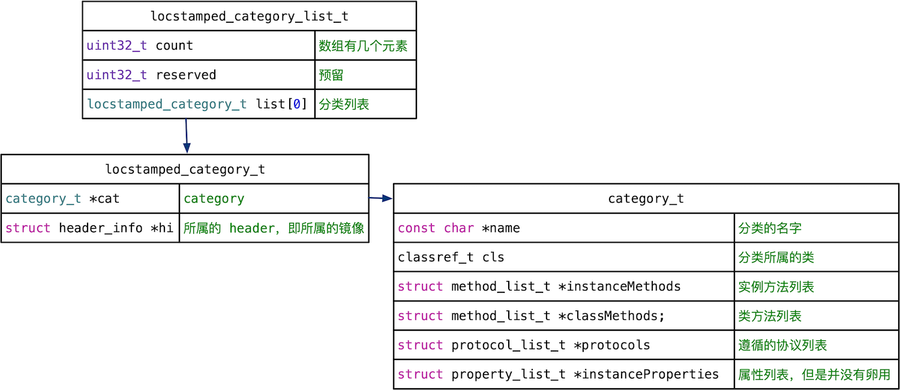


##### 存储所有分类的Map结构

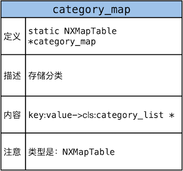

##### 向category_map中添加新的分类 

向category_map中添加新的分类 调用addUnattachedCategoryForClass方法：

```
static void addUnattachedCategoryForClass(category_t *cat, Class cls, header_info *catHeader)
{
    runtimeLock.assertWriting();

    // DO NOT use cat->cls! cls may be cat->cls->isa instead
    NXMapTable *cats = unattachedCategories(); // 取得存储所有没有被 attached 的分类的列表
    category_list *list;

    // 从所有 unattached 的分类列表中取得 cls 类对应的所有没有被 attach 的分类列表
    list = (category_list *)NXMapGet(cats, cls);
    if (!list) { // 如果 cls 没有未  attach 的分类
        // 就开辟出一个单位的空间，用来放新来的这个分类
        list = (category_list *)
            calloc(sizeof(*list) + sizeof(list->list[0]), 1);
    } else {
        // 否则开辟出比原来多一个单位的空间，用来放新来的这个分类，因为 realloc ，所以原来的数据会被拷贝过来
        list = (category_list *)
            realloc(list, sizeof(*list) + sizeof(list->list[0]) * (list->count + 1));
    }
    // 将新来的分类 cat 添加刚刚开辟的位置上
    list->list[list->count++] = (locstamped_category_t){cat, catHeader};
    // 将新的 list 重新插入 cats 中，会覆盖老的 list
    NXMapInsert(cats, cls, list);
}
```

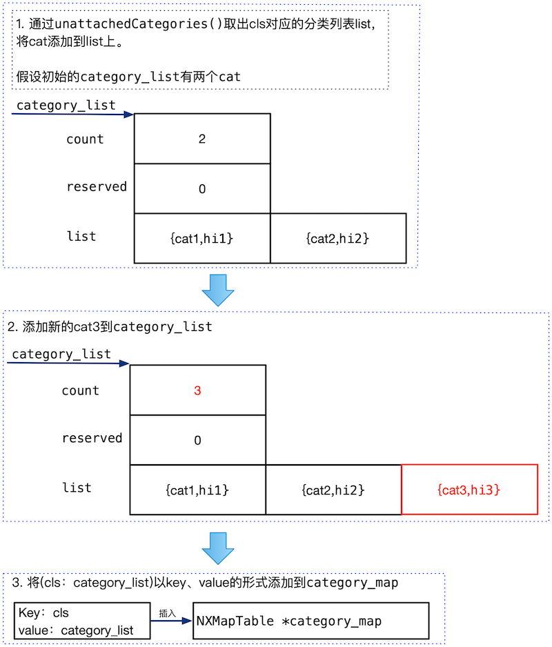


##### 将分类附着（attachCategories）到类中

```
// Attach categories.
// 给 cls 类附加分类，unattachedCategoriesForClass 会返回 cls 类的没有被附加的类
category_list *cats = unattachedCategoriesForClass(cls, true /*realizing 其实这个参数压根没用*/);
// 从分类列表中添加方法列表、属性和协议到 cls 类中
// attachCategories 要求分类列表中是排好序的，老的分类排前面，新的排后面，那么排序是在哪里做的呢？？？？
// 自问自答：见 addUnattachedCategoryForClass() 函数，新的 unattached 的分类本来就是插入到列表末尾的
//         所以压根儿不用再另外排序
attachCategories(cls, cats, false /*不清空缓存 因为这时候压根连缓存都没有 don't flush caches*/);
```

```
static void 
attachCategories(Class cls, category_list *cats, bool flush_caches)
{
    if (!cats) return; // 如果列表是 nil，直接返回
    
    // 打印一些信息
    if (PrintReplacedMethods) {
        printReplacements(cls, cats);
    }

    bool isMeta = cls->isMetaClass(); // 记录 cls 类是否是元类

    // fixme rearrange to remove these intermediate allocations
    
    // 在堆中为方法列表数组、属性列表数组、协议列表数组分配足够大内存，注意，它们都是二维数组
    // 后面会将所有分类中的方法列表、属性列表、协议列表的首地址放到里面
    method_list_t **mlists = (method_list_t **)
        malloc(cats->count * sizeof(*mlists));
    property_list_t **proplists = (property_list_t **)
        malloc(cats->count * sizeof(*proplists));
    protocol_list_t **protolists = (protocol_list_t **)
        malloc(cats->count * sizeof(*protolists));

    // Count backwards through cats to get newest categories first
    int mcount = 0; // 记录方法的数量
    int propcount = 0; // 记录属性的数量
    int protocount = 0; // 记录协议的数量
    int i = cats->count; // 从后开始，保证先取最新的分类
    bool fromBundle = NO; // 记录是否是从 bundle 中取的
    while (i--) { // 从后往前遍历
        
        auto& entry = cats->list[i]; // 分类，locstamped_category_t 类型

        // 取出分类中的方法列表；如果是元类，取得的是类方法列表；否则取得的是实例方法列表
        method_list_t *mlist = entry.cat->methodsForMeta(isMeta);
        if (mlist) {
            mlists[mcount++] = mlist; // 将方法列表放入 mlists 方法列表数组中
            fromBundle |= entry.hi->isBundle(); // 分类的头部信息中存储了是否是 bundle，将其记住
        }

        // 取出分类中的属性列表，如果是元类，取得是nil
        property_list_t *proplist = entry.cat->propertiesForMeta(isMeta);
        if (proplist) {
            proplists[propcount++] = proplist; // 将属性列表放入 proplists 属性列表数组中
        }

        // 取出分类中遵循的协议列表
        protocol_list_t *protolist = entry.cat->protocols;
        if (protolist) {
            protolists[protocount++] = protolist; // 将协议列表放入 protolists 协议列表数组中
        }
    }

    auto rw = cls->data(); // 取出 cls 的 class_rw_t 数据

    // 准备 mlists 中的方法列表们
    prepareMethodLists(cls, mlists, mcount/*方法列表的数量*/, NO/*不是基本方法*/, fromBundle/*是否来自bundle*/);
    rw->methods.attachLists(mlists, mcount); // 将准备完毕的新方法列表们添加到 rw 中的方法列表数组中
    free(mlists); // 释放 mlists
    if (flush_caches  &&  mcount > 0) { // 如果需要清空方法缓存，并且刚才确实有方法列表添加进 rw 中，
                                        // 不然没有新方法加进来，就没有必要清空，清空是为了避免无法命中缓存的错误
                                        // 因为缓存位置是按照 hash 的方法确定的，详情见 cache_t::find() 函数
        flushCaches(cls); // 清空 cls 类 / cls 类的元类 / cls 类的子孙类 的方法缓存
    }

    rw->properties.attachLists(proplists, propcount); // 将新属性列表添加到 rw 中的属性列表数组中
    free(proplists); // 释放 proplists

    rw->protocols.attachLists(protolists, protocount); // 将新协议列表添加到 rw 中的协议列表数组中
    free(protolists); // 释放 protolists
}
```

上面代码将 category_list *cats 中的list成员表示的方法列表转化为数组mlists：

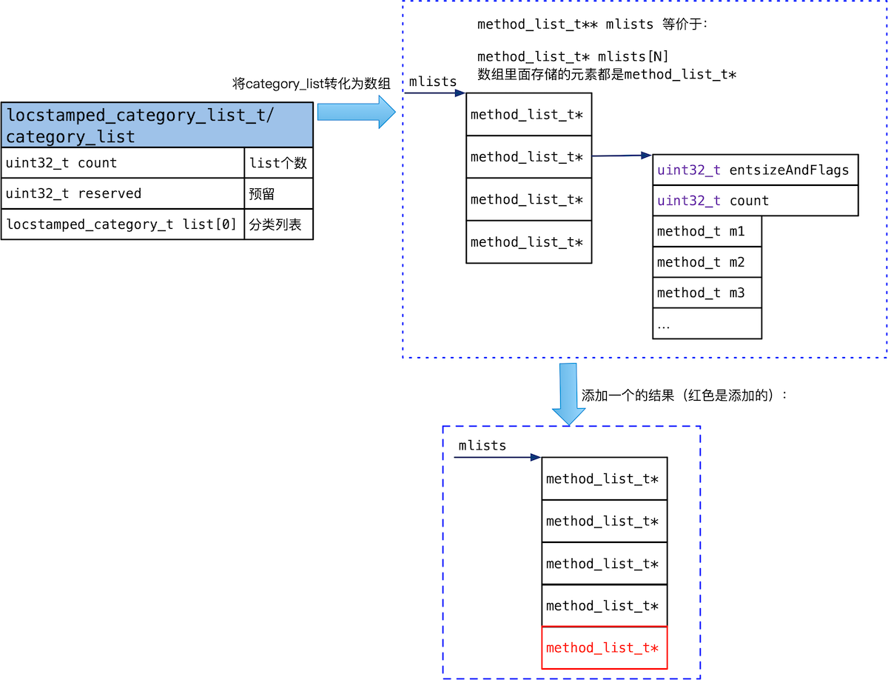

转化完成后，调用attachLists方法，附着到类上：

```
 void attachLists(List* const * addedLists, uint32_t addedCount) {
    if (addedCount == 0) return;

    if (hasArray()) {
        // many lists -> many lists
        uint32_t oldCount = array()->count;
        uint32_t newCount = oldCount + addedCount;
        setArray((array_t *)realloc(array(), array_t::byteSize(newCount)));
        array()->count = newCount;
        memmove(array()->lists + addedCount, array()->lists, 
                oldCount * sizeof(array()->lists[0]));
        memcpy(array()->lists, addedLists, 
               addedCount * sizeof(array()->lists[0]));
    }
    else if (!list  &&  addedCount == 1) {
        // 0 lists -> 1 list
        list = addedLists[0];
    } 
    else {
        // 1 list -> many lists
        List* oldList = list;
        uint32_t oldCount = oldList ? 1 : 0;
        uint32_t newCount = oldCount + addedCount;
        setArray((array_t *)malloc(array_t::byteSize(newCount)));
        array()->count = newCount;
        if (oldList) array()->lists[addedCount] = oldList;
        memcpy(array()->lists, addedLists, 
               addedCount * sizeof(array()->lists[0]));
    }
}
```

将List** 中的内容附着到method_array_t 上,原理如图：

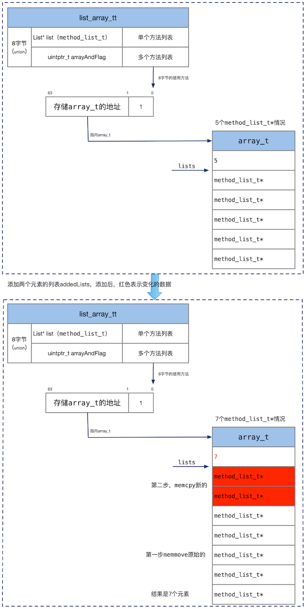

#### 添加全局表

添加的到全局表的代码如下：

```
if (!isMeta) { // 如果不是元类
    addRealizedClass(cls); // 就把它添加到 realized_class_hash 哈希表中
} else {
    addRealizedMetaclass(cls); // 否则是元类，就把它添加到 realized_metaclass_hash 哈希表中
}
```

根据类的类型，元类还是普通类，调用不同的方法。


```
static void addRealizedClass(Class cls)
{
    runtimeLock.assertWriting();
    void *old;
    old = NXHashInsert(realizedClasses(), cls); // 将 cls 插入 realized_class_hash 哈希表中
    objc_addRegisteredClass(cls); // 将 cls 添加到已注册类的哈希表中(objc-auto.mm 中的 AllClasses)
    
    assert(!cls->isMetaClass()); // cls 不能是元类
    assert(!old); // 不能有旧值
}
```

普通类调用addRealizedClass方法，将类添加到realizedClasses()表中。

```
// 取得存有所有经过 realized 的非元类的哈希表
static NXHashTable *realizedClasses(void)
{
    return realized_class_hash;
}
```

直接返回realized_class_hash hash表。

```
static void addRealizedMetaclass(Class cls)
{
    runtimeLock.assertWriting();
    void *old;
    old = NXHashInsert(realizedMetaclasses(), cls); // 将 cls 元类添加到 realized_metaclass_hash 哈希表中
    assert(cls->isMetaClass()); // cls 必须是元类
    assert(!old); // 不能有旧值
}
```

元类调用addRealizedMetaclass 将类添加到 realizedMetaclasses()表中

```
// 取得存有所有经过 realized 的元类的哈希表
// 该函数被 addRealizedMetaclass()/flushCaches()/removeRealizedMetaclass()函数调用
static NXHashTable *realizedMetaclasses(void)
{   
    return realized_metaclass_hash;
}
```


### 读取分类，remethodize类

```
// Discover categories.
for (EACH_HEADER) { // 遍历 hList
    // 取得 hi 镜像中的所有分类
    category_t **catlist = _getObjc2CategoryList(hi, &count);
    for (i = 0; i < count; i++) { // 遍历所有分类
        category_t *cat = catlist[i];
        Class cls = remapClass(cat->cls); // 得到分类所属的类的 live class

        if (!cls) { // 如果 cls 为空
            // Category's target class is missing (probably weak-linked).
            // Disavow any knowledge of this category.
            
            // 分类所属的类丢了，很多可能是 weak-linked 了
            // 这个分类就是不可信的，完全没有什么鸟用了
            catlist[i] = nil; // 将这个分类从列表中删除
            continue;
        }

        // Process this category. 
        // First, register the category with its target class. 
        // Then, rebuild the class's method lists (etc) if 
        // the class is realized.
        
        bool classExists = NO;
        
        if (cat->instanceMethods ||  cat->protocols  
            ||  cat->instanceProperties) // 如果分类中存在实例方法 or 协议 or 实例属性
        {
            // 添加分类到所属的 cls 类上，即把这个分类添加到 cls 对应的所有 unattached 的分类的列表中
            addUnattachedCategoryForClass(cat, cls, hi);
            
            // 如果 cls 类已经被 realized
            if (cls->isRealized()) {
                // 就重新 methodize 一下 cls 类，里面会重新 attachCategories 一下所有未被 attach 的分类
                // 即把这些分类中的方法、协议、属性添加到 cls 类中
                remethodizeClass(cls);
                classExists = YES; // 标记类存在
            }
        }

        // 如果分类中存在类方法 or 协议
        if (cat->classMethods  ||  cat->protocols  
            /* ||  cat->classProperties */) 
        {
            // 添加分类到所属类 cls 的元类中
            addUnattachedCategoryForClass(cat, cls->ISA(), hi);
            // 如果 cls 的元类已经 realized 过了
            if (cls->ISA()->isRealized()) {
                // 就重新 methodize 一下 cls 类的元类
                remethodizeClass(cls->ISA());
            }
        }
    }
}
```

这个代码发现所有的分类，

1. 如果分类中包含实例方法、协议、属性，调用addUnattachedCategoryForClass， 以（cls：(cat：hi)） 键值对 添加到category_map表中，添加完成后调用remethodizeClass函数，将分类属性添加到类中。
2. 如果分类中包含类方法、协议、属性，调用addUnattachedCategoryForClass， 以（cls->ISA()：(cat： hi)） 键值对 添加到category_map表中，添加完成后调用remethodizeClass函数，将分类属性添加到元类中。

remethodizeClass 实现如下：

```
static void remethodizeClass(Class cls)
{
    category_list *cats;
    bool isMeta;

    runtimeLock.assertWriting(); // 看 runtimeLock 是否已经被正确得加上了写锁

    isMeta = cls->isMetaClass();

    // Re-methodizing: check for more categories
    // 取得 cls 类的未被 attach 的分类列表
    if ((cats = unattachedCategoriesForClass(cls, false/*not realizing*/))) {
        // 将分类列表 attach 附加到 cls 类上，因为这不是第一次 methodize，所以需要清空缓存，因为原来的缓存也已经废了
        attachCategories(cls, cats, true /* 清空方法缓存 flush caches*/);
        free(cats); // 将 cats 释放，原因见 unattachedCategoriesForClass()
    }
}
```

remethodizeClass 调用unattachedCategoriesForClass 取得类所属的分类，调用attachCategories将分类中的方法、协议、属性添加的类中。
这个方面和上面的methodizeClass 功能基本相同。methodizeClass比remethodizeClass多一个操作————处理base相关的信息。

## 总结 

_read_images 主要是读取Mach-O中下面的section ，存储到内存中

```
GETSECT(_getObjc2SelectorRefs,        SEL,             "__objc_selrefs"); 
GETSECT(_getObjc2MessageRefs,         message_ref_t,   "__objc_msgrefs"); 
GETSECT(_getObjc2ClassRefs,           Class,           "__objc_classrefs");
GETSECT(_getObjc2SuperRefs,           Class,           "__objc_superrefs");
GETSECT(_getObjc2ClassList,           classref_t,      "__objc_classlist");
GETSECT(_getObjc2NonlazyClassList,    classref_t,      "__objc_nlclslist");
GETSECT(_getObjc2CategoryList,        category_t *,    "__objc_catlist");
GETSECT(_getObjc2NonlazyCategoryList, category_t *,    "__objc_nlcatlist");
GETSECT(_getObjc2ProtocolList,        protocol_t *,    "__objc_protolist");
GETSECT(_getObjc2ProtocolRefs,        protocol_t *,    "__objc_protorefs");
```

## 参考资料

1. [Draveness git地址](https://github.com/Draveness/analyze)
2. [Classes and Metaclasses](http://www.sealiesoftware.com/blog/archive/2009/04/14/objc_explain_Classes_and_metaclasses.html)
3. [类型编码](https://developer.apple.com/library/mac/documentation/Cocoa/Conceptual/ObjCRuntimeGuide/Articles/ocrtTypeEncodings.html)
4. [Type Encodings](http://nshipster.cn/type-encodings/)
5. [Tagged Pointer](https://en.wikipedia.org/wiki/Tagged_pointer)


