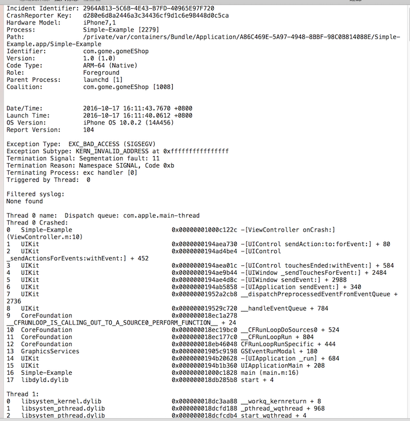
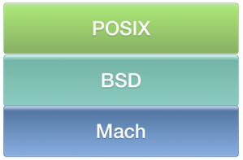
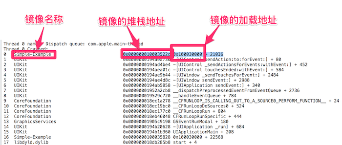
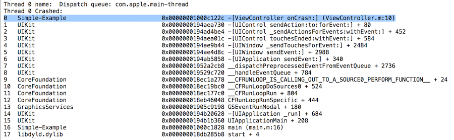
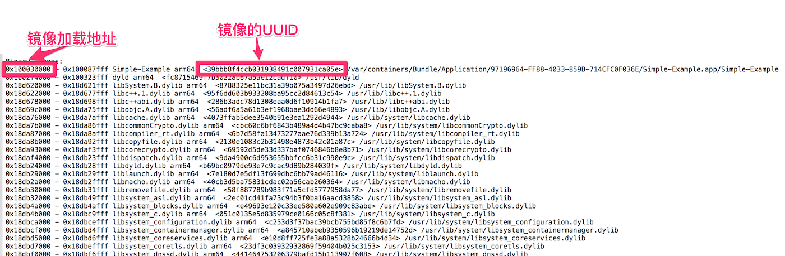
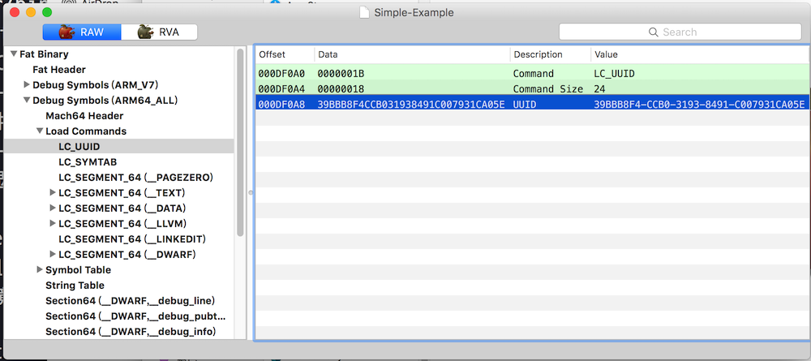

由于代码的缺陷，我们千辛万苦发布发布出去的APP，在用户手中，偶尔会出现Crash现象。为了及时查找到Crash的原因，我们需要收集这些Crash信息,解决问题。本文就是从分析系统Crash日志开始，一直到定制个性化的Crash日志收集系统，一步步的说明如何完成Crash日志收集系统。
<!--more-->

千里之行，始于足下，我们先从系统Crash日志开始。
<!--合理的应用收集、解析崩溃日志的方法，有N种方式可以完美的消灭大部分的Crash。为了便于理解，我从CrashReporter捕获的标准Crash日志结构、系统Crash收集解析、 定制的Crash报告收集分析。
若了解CrashReporter收集的崩溃日志的各个部分的含义，对消除Crash应该大有裨益。-->


系统的Crash日志相信大家都见过，但不一定都认真分析过，所以我想，有必要重新对它做个认识。先贴出一张Crash日志截图，方便大家认识我啊~~~。



Crash日志内容非常，截图只能展示一部分内容，后续会依次贴出每个模块的内容，分别讲解。一个Crash日志由六部分组成：基本信息模块、系统信息模块、异常信息模块、线程回溯、CUP寄存器信息、镜像信息。

## 基本信息模块

```
///崩溃报告的唯一标识符，标识不同的Crash
Incident Identifier: 2964A813-5C6B-4E43-B7FD-40965E97F720   
CrashReporter Key:   d280e6d8a2446a3c34436cf9d1c6e98448d0c5ca
///代表发生Crash的设备类型
Hardware Model:      iPhone7,1    
///Crash的APP名称、APP进程id       
Process:             Simple-Example [2279]  
///Crash的APP在设备上的存储路径 
Path:                /private/var/containers/Bundle/Application/A86C469E-5A97-4948-8BBF-98C0B814088E/Simple-Example.app/Simple-Example    
///APP 的描述符       
Identifier:          com.gome.gomeEShop 
///APP的版本   
Version:             1.0 (1.0)   
///代码的构架，可以通过file命名查看代码的编译构架，
///了解更过的构架信息可以到IOS SDK路径下的/usr/include/mach/machine.h文件中查找  
Code Type:           ARM-64 (Native)     
Role:                Foreground
///父进程
Parent Process:      launchd [1]     
Coalition:           com.gome.gomeEShop [1008]
```

## 系统信息模块

系统信息模块包含Crash时间、 APP启动时间、OS 版本信息、Crash日志的格式 

```
///Crash发生的时间
Date/Time:           2016-10-17 16:11:43.7670 +0800
///Crash的APP的启动时间   
Launch Time:         2016-10-17 16:11:40.0612 +0800  
///系统版本，（）内的数字代表的是Bulid号 
OS Version:          iPhone OS 10.0.2 (14A456)  
Crash日志的格式，一般为104  
Report Version:      104 
```

## 异常信息模块

异常信息模块包含异常类型（Mach异常、Unix信号异常）、异常子类型、异常原因、异常线程ID。

```
///异常类型
Exception Type:  EXC_BAD_ACCESS (SIGSEGV)  
///异常子类型、异常的地址
Exception Subtype: KERN_INVALID_ADDRESS at 0xffffffffffffffff   
Termination Signal: Segmentation fault: 11
///异常原因（非常重要）
Termination Reason: Namespace SIGNAL, Code 0xb
Terminating Process: exc handler [0]
///发生异常的线程ID
Triggered by Thread:  0   
```

异常类型(Exception Type)由两部分构成：Mach异常、Unix信号异常。 

苹果系统有一个微内核，叫做[XNU](http://opensource.apple.com/source/xnu/)，它的源码可以在opensource上载到。Mach是XNU的核心，因而，Mach异常就指Mach内核异常。Mach包含三部分内容：thread，task，host。后续的章节中很多地方都会用到Mach。不妨移步到[Mach IPC Interface](http://web.mit.edu/darwin/src/modules/xnu/osfmk/man/)，了解下Mach暴露给用户的API。

Mach暴露给了用户部分API，允许用户和内核交互。用户态的开发者可以通过Mach API设置thread、task、host的异常端口，来捕获Mach异常，抓取Crash事件。

Mach异常包括：

```
#define EXC_BAD_ACCESS		1	/* Could not access memory */
	/* Code contains kern_return_t describing error. */
	/* Subcode contains bad memory address. */
	
#define EXC_BAD_INSTRUCTION	2	/* Instruction failed */
	/* Illegal or undefined instruction or operand */
	
#define EXC_ARITHMETIC		3	/* Arithmetic exception */
	/* Exact nature of exception is in code field */
	
#define EXC_EMULATION		4	/* Emulation instruction */
	/* Emulation support instruction encountered */
	/* Details in code and subcode fields	*/
	
#define EXC_SOFTWARE		5	/* Software generated exception */
	/* Exact exception is in code field. */
	/* Codes 0 - 0xFFFF reserved to hardware */
	/* Codes 0x10000 - 0x1FFFF reserved for OS emulation (Unix) */
	
#define EXC_BREAKPOINT		6	/* Trace, breakpoint, etc. */
	/* Details in code field. */
	
#define EXC_SYSCALL		7	/* System calls. */
	
#define EXC_MACH_SYSCALL	8	/* Mach system calls. */
	
#define EXC_RPC_ALERT		9	/* RPC alert */
	
#define EXC_CRASH		10	/* Abnormal process exit */
	
#define EXC_RESOURCE		11	/* Hit resource consumption limit */
```

Unix信号：信号是通知进程已发生某种情况的软中断技术。例如：某个进程执行了除法操作，其除数为0，则将名为SIGFPE（浮点异常）的信号发送给该进程。

那么，怎么会有两种异常信息呢？

念茜的[漫谈iOS Crash收集框架](http://www.cocoachina.com/cms/wap.php?action=article&id=12301)阐述了两者的关系，我这里再重复下。

苹果系统是基于Unix系统的，苹果的大牛们为了兼容Unix信号，将Mach异常转化为Unix信号，并投射到异常的线程，这样做的目的是：对于不懂Mach异常的人，也可以使用Unix信号捕获异常。所以，Crash日志有两种异常信息。

Mach和Unix关系图：



所有Mach异常都在host层被ux_exception转换为相应的Unix信号，并通过threadsignal将信号投递到出错的线程。<!--iOS系统中的 POSIX API 就是通过 Mach 之上的 BSD 层实现的。-->

捕获Mach异常或者Unix信号都可以抓到crash事件，这两种方式哪个更好呢？ 
优选Mach异常，因为Mach异常的处理会先于Unix信号处理，如果Mach异常的handler让程序exit了，那么Unix信号就永远不会到达这个进程了。<!--转换Unix信号是为了兼容更为流行的POSIX标准，这样不必了解Mach内核也可以通过Unix信号的方式来兼容开发。-->

所以，Crash日志中的EXC_BAD_ACCESS 是Mach异常信息，SIGSEGV是Unix信号异常信息。

小贴士:
因为硬件产生的信号(通过CPU陷阱)被Mach层捕获，然后才转换为对应的Unix信号；苹果为了统一机制，于是操作系统和用户产生的信号(通过调用kill和pthread_kill)也首先沉下来被转换为Mach异常，再转换为Unix信号。

## 线程回溯

### 符号化回溯线程
线程的回溯是APP Crash瞬间，程序中所有线程的逆向调用堆栈。线程回溯对我们修复Crash非常非常的有用，根据线程回溯，可以分析、定位程序崩溃的原因。

下面将崩溃的代码、未符号化崩溃日志、符号化崩溃日志贴出来，做个对比性的理解。

```
@implementation ViewController
		
- (IBAction) onCrash:(__unused id) sender
{
    char* ptr = (char*)-1;
    *ptr = 10;  ///这里程序崩溃了 
}
@end
```
		





图5中红色文字展示了几个名词：镜像文件、加载地址、堆栈地址。还有没有展示出来的一个名词：符号在二进制中的偏移量。他们的含义分别为：

镜像文件：是可执行二进制文件和二进制文件依赖的动态库的总称。
堆栈地址：是代码在内存中执行的内存地址。
镜像的加载地址：程序执行时，内核会将包含程序代码的镜像加载到内存中，镜像在内存中的基地址就是加载地址。程序每次启动时，镜像的加载地址是随机的。所以，同一代码在不同的设备中执行时，堆栈地址是不一样的。
符号在二进制中的偏移量：按照字面意思理解吧。它以通过下面的公式得到：

```
符号在二进制中的偏移量 = 堆栈地址 - 镜像的加载地址  
```
	
符号在二进制中的偏移量非常有用，我们就是根据它，从符号文件中查找出地址对应的代码符号。这里的符号文件指的是：带有符号表的可执行二进制文件、dSYM文件，这两种文件在后续章节中都统称为符号文件。

那么怎么将图5中的Crash日志符号化为图6中的形式呢？

苹果自带的atos命令行工具可以查找地址对应的符号，在终端中输入：

```
/usr/bin/atos -o [符号文件] -arch arm64 -l 0x100030000 0x000000010003522c 
```

输出结果如下：

```
-[ViewController onCrash:]  (in Simple-Example) (ViewController.m:10)
```

是不是很简单的就将地址转换为符号？是的，只需将符号文件（-o指定）、代码构架（-arch指定）、加载地址（-l指定）、堆栈地址 传入atos命令，就能解析出符号。 atos命令解析出了堆栈地址为0x000000010003522c、加载地址为0x100030000对应的符号。符号为[ViewController onCrash:]，也验证了崩溃发生在onCrash函数中，也验证了崩溃日志中的地址是可以符号化的。

符号化是简单，但是原理是什么？怎么就通过地址找到了Crash代码的符号，要听详细信息，请看《符号化内幕》。

### 符号化内幕

符号化的内幕就是：在符号文件中，通过偏移量查找符号。下面，一步步的来分析，首先计算Crash地址在符号文件中的偏移量，为000000010000522c。

```
符号在二进制中的偏移量 = 堆栈地址 - 镜像的加载地址 = 0x000000010003522c -  0x100030000 = 000000010000522c
```

在符号文件中直接找地址000000010000522c，应该是找不到，在后续你可以理解。我们使用逆向方法，根据符号-[ViewController onCrash:]，找对应的地址，比较是不是000000010000522c，如果是，就充分说明了，通过偏移量是可以查找到内存地址对应的符号的。在终端中输入下面的命令：

```
nm [符号文件] | grep "ViewController onCrash:"
```

输出如下 

```
00008320 t -[ViewController onCrash:]
0000000100005224 t -[ViewController onCrash:]
```

输出的第一行是armv7s构架的符号，第二行是arm64构架的符号，Crash日志显示的代码构架是arm64，使用第二行，符号-[ViewController onCrash:]对应的偏移量是0000000100005224，而不是 000000010000522c，是我给你埋了个坑吗？专门来坑你的？不是的，不是的，这个问题也困扰了我N久、折磨了我N久。这个公式是在stack overflow上找到的，我也怀疑他们骗了我，但是，仔细看两个地址，又那么的相似、那么的相近---就相差8！！！ 虽说相差8，但毕竟不一样。差之毫厘谬以千里啊。感觉就要成功，但就是不对。就永远差了那么一点点，试了好多崩溃日志，都是差那么一点点，相信你也体会过这种感觉，只差一点点，真的只差一点点。就差那么该死的一点点，问题就能解决。百思不得其姐的困扰、抓狂的困扰 。。好久好久我都没想明白，那一点点是怎么差的。这不，今天写日志组织测试用例的时候，忽然明白了为什么差那一点点，踏破铁鞋无觅处，得来全不费功夫！！。 
原来，我们通过nm命令查找出的符号地址对，是函数入口地址和对应的函数调用的符号对，仅仅是函数调用的符号，没有函数内部代码的符号，而程序是崩溃到函数内部，崩溃到*ptr = 10这句话，内部代码的地址怎么可能和入口地址一样呢！相差一点点！ 
下面根据偏移量000000010000522c和代码推算函数的入口地址吧，看看是什么。崩溃代码*ptr = 10前面只有一个语句---定义初始化指针“char* ptr = (char*)-1”，在64位系统上指针的地址占8个字节，000000010000522c - 8= 0000000100005224， 果然是0000000100005224。这个不就是函数的入口地址嘛，对，就是。原来那一点点的原因在这里。 那么偏移量0000000100005224 对应的符号正是-[ViewController onCrash:]。<!--这就是通过偏移量查找符号的原理。--> 

上面通过nm 命令查找符号可能不直观，可以通过可视化工具[MachOView](http://of685p9vy.bkt.clouddn.com/MachOView-2.4.9200.dmg)查看。验证下吧，选择 Debug Symbols（ARM64_ALL）->Symbol Table->Symbols,然后在右上角的搜索框中输入符号：-[ViewController onCrash:]，结果如下，

通过这个工具可以直观的查看到符号和地址的对应关系。

### 小小结
ok，终于可以歇一歇了，我们终于把符号化和符号化原理阐述完了。简单的回顾下：

1. 可以通过系统的atos符号化崩溃日志的单个符号 
2. 符号化内部原理就是：根据符号在二进制中的偏移量，在符号文件中查找对应的符号。其中：符号在二进制中的偏移量 = 堆栈地址 - 镜像的加载地址。

<!--### 1.4.4 弱弱的问题

1. 为什么图5中的回溯线程中，Simple-Example镜像中的地址“0x000000010003522c 0x100030000 + 21036”没有解析出来，显示的是一串十六进制的数字，你是否也遇到过？也被这样的问题困惑过？《1.6小节 Binary Images》， 会阐述该问题。-->
               
## 线程的状态寄存器 

```
Thread 0 crashed with ARM Thread State (64-bit):
    x0: 0x000000010050b460   x1: 0x0000000100102cea   x2: 0x00000001004339d0   x3: 0x00000001740f8f00
    x4: 0x00000001740f8f00   x5: 0x00000001740f8f00   x6: 0x0000000000000001   x7: 0x0000000000000000
    x8: 0xffffffffffffffff   x9: 0x000000000000000a  x10: 0x00000001b3ad0018  x11: 0x00c1580100c15880
   x12: 0x0000000000c15800  x13: 0x0000000000c15900  x14: 0x0000000000c158c0  x15: 0x0000000000c15801
   x16: 0x0000000000000000  x17: 0x00000001000c1224  x18: 0x0000000000000000  x19: 0x00000001740f8f00
   x20: 0x00000001004339d0  x21: 0x0000000100102cea  x22: 0x000000010050b460  x23: 0x0000000170240bd0
   x24: 0x000000017400db90  x25: 0x0000000000000001  x26: 0x0000000000000000  x27: 0x00000001b2822000
   x28: 0x0000000000000040   fp: 0x000000016fd41ab0   lr: 0x0000000194aea7b0
    sp: 0x000000016fd41a90   pc: 0x00000001000c122c cpsr: 0x60000000
```

这是APP crash的时候，ARM64 构架CPU的32个寄存器的值， 其中fp 帧指针、sp堆栈指针，lr 是返回地址指针，这三个都比较有用，用来逐级回溯线程调用栈。

## Binary Images

 


镜像文件就是上面讲的可执行程序 和 依赖的所有动态库。
镜像文件中包括镜像的加载地址，和线程回溯中的镜像加载地址指的是一个地址。加载地址后面有个UUID，符号文件中也有个UUID，只有这两个地址一致，才能解析出地址对应的符号。符号文件中的UUID可以通过终端中输入下面的命令得到：

```
dwarfdump —u [符号文件]
```

输出如下：
	
```
UUID: C8E0E6E4-F761-3A19-B231-A31C1BB9037A (armv7) 
UUID: 39BBB8F4-CCB0-3193-8491-C007931CA05E (arm64) 
```

第二行的arm64构架的UUID居然和图8中的红色矩形框中UUID惊人的一致。是的。必须得一致，这才表示代码对应的符号能在这个符号文件中找到，如果不一致，就没法解析出地址对应的符号。不论是Xcode，还是symbolicatecrash，都解析不了。
也可以通过MachOView查看符号文件的UUID，结果如下：



### 小结

这节阐述了崩溃日志的组成结构、通过atos命令行工具符号化崩溃日志以及符号化崩溃日志的原理。同时提及了几个工具有用的工具：
1. file,文件类型显示工具（The file-type displaying tool，位于/usr/bin/file）;
2. atos,(将数字地址转换为镜像或可执行程序中的符号工具，convert numeric addresses to symbols of binary images or processes，位于/usr/bin/atos);
3. nm，（符号表展示工具，The symbol table display tool,位于 /usr/bin/nm）;
4. 可视化查看Mach-O工具，MachOView。


