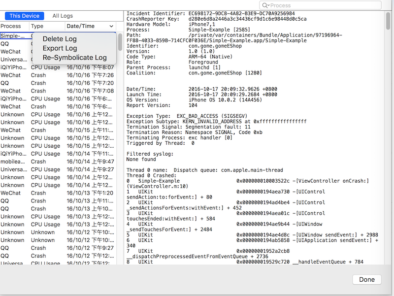
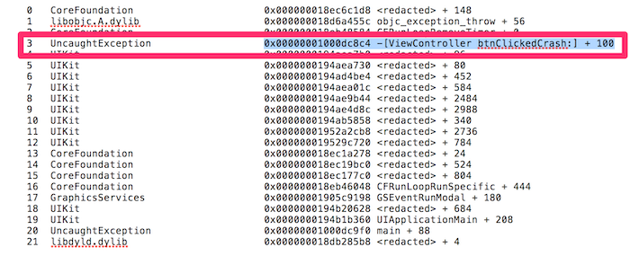
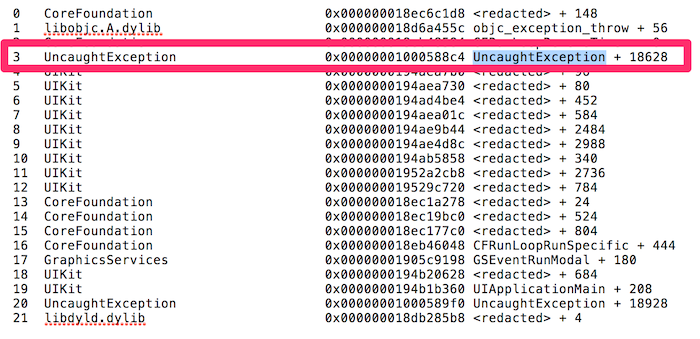
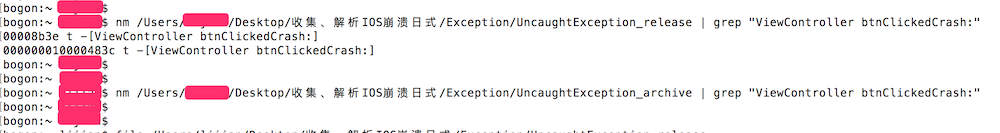
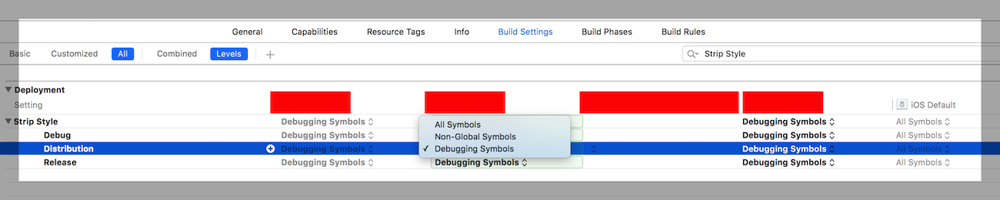

本文主要内容：

1. Crash日志收集的方法
2. 搭建一个简单的系统日志收集方案。

<!--more-->


## 系统收集、符号化Crash日志

系统如何收集、符号化Crash日志有多种方式，主要有如下几种方式：

1. CrashReporter收集、Xocde或symbolicatecrash符号化。当iOS系统上的某个 APP崩溃时，IOS系统自带的CrashReporter会创建一份crash日志保存在设备上。如果能拿到Crash的手机，就可以通过Xcode或symbolicatecrash符号化Crash日志。<font color=blue>如果设备上的Crash 日志超过了一定数量，可能保存不了Crash日志</font>。
2. 第三方SDK。如友盟，鹅厂的[Bugly](http://bugly.qq.com) 等等  Crash
3. 打造自己的收集、符号化程序。主要方法：使用NSSetUncaughtExceptionHandler注册异常处理函数，当APP 发生Crash时刻，回调到异常处理函数，在异常处理函数中收集Crash信息，然后上传到服务器；当需要分析的时候，从服务器取回Crash日志，如果没有符号化，使用atos命令符号化。
4. 开源框架KSCrash。如果上面的几种收集、符号化的方式依然不能满足你的需求，那么完备的KSCrash框架应该是一个不错的选择。

### CrashReporter收集日志

CrashReporter 是IOS自带的工具，当APP发生崩溃时，CrashReporter会创建一份Crash日志并保存到设备上。上一篇阐述的Crash日志，就是出自CrashReporter之手。

可以使用Xcode、iTool导出CrashReporter创建的日志。其中：Xcode导出Crash日志的方法如下：



在Xcode->Window菜单->Devices，弹出的设备面板，选择崩溃的设备 -> 选择右侧的View Device Logs->选中导出的日志，右击，选中export log, 导出.crash后缀的崩溃日志

### Xcode 解析Crash日志

Xcode可以将日志中的地址信息符号化为代码中的符号，但有个前提条件：crash log和dSYM或APP携带的UUID一致。crash log携带的UUID指的是镜像的UUID。

- 如果APP是自己电脑编译生成的，Xcode会根据spotlight自动找到对应的符号文件
- 如果不是自己电脑编译生成的，只需要将.app和dSYM放入同一文件夹，然后手动生成索引，这样Xcode也能找到。在命令行中输入如下命令手动创建索引：

```
mdimport pathName
```

mdimport ,导入文件到datastore（import file hierarchies into the metadata datastore）。

上面两种方式确保了Xcode能依据UUID找到地址对应的符号文件，这样，Xcode就能解析出崩溃日志。<!--而且Xcode可以批量解析崩溃日志，比symbolicatecrash好用多了。-->

使用Xcode解析崩溃日志的方法：在Xcode->Devices->View Device Logs中，查看设备的所有崩溃日志，如果能解析，Xcode会自动解析崩溃日志。这种方式可以实现批量解析崩溃日志 。

Xcode解析崩溃日志的优势：

1. 批量解析，可以一次解析出所有可解析的Crash日志。
2. 稳定性比symbolicatecrash好。

### symbolicatecrash

symbolicatecrash，按照字面意思理解，就是符号化异常工具。symbolicatecrash符号化日志的一般步骤为：

1. 查找symbolicatecrash的存储位置，symbolicatecrash在各个Xcode版本中的位置都不一样，我没有办法记住每个版本的位置，所以使用查找命令查找symbolicatecrash 的位置

	```
	find /Applications/Xcode.app -name symbolicatecrash -type f   #查找symbolicatecrash 的路径。
	```

	输出如下:

	```
	AAA$ find /Applications/Xcode.app -name symbolicatecrash -type f
	/Applications/Xcode.app/Contents/SharedFrameworks/DVTFoundation.framework/Versions/A/Resources/symbolicatecrash
	```
	
2. 将符号文件、Crash日志、symbolicatecrash放在同一目录下。cd 到该目录下，终端执行命令：

	```
	./symbolicatecrash name.crash 符号文件 > out.txt
	```
	
	如果成功，会将符号化的日志重定向到out.txt中。

3. 备注： 如果执行中遇到下面的错误：

	```
	Error: "DEVELOPER_DIR" is not defined at ./symbolicatecrash line 60.
	```
	执行下面的命令，设置环境变量

	```
	export DEVELOPER_DIR=/Applications/Xcode.app/Contents/Developer
	```
		
## 打造自己的收集、符号化程序

当APP发布到AppStore后，如果发生了Crash，通常情况下我们拿不到崩溃手机，也就是说拿不到Crash日志。这是一个棘手的问题。有人说可以在开发者中心找到用户上传到苹果的日志，但是，不是所有的用户都会在程序Crash后上传Crash日志，所以有必要打造一个属于我们自己的异常收集系统。下面就讲讲我打造的异常收集系统，主要思路：使用NSSetUncaughtExceptionHandler注册异常处理函数，当APP 发生Crash时，回调到异常处理函数，在异常处理函数中收集Crash信息，然后上传到服务器；当需要分析的时候，从服务器取回Crash日志，如果没有符号化，使用atos命令符号化。由于我没有服务器，就保存到了沙盒路径的Document目录下，可以使用itunes方便的导出日志。这里我提供了一个简单示例代码：[caughtException](https://github.com/jianli2017/caughtException/tree/master/UncaughtException)。

### 实现代码 

这里会分别列出关键的代码。下面是 AppDelegate.m中的代码 

```
- (BOOL)application:(UIApplication *)application didFinishLaunchingWithOptions:(NSDictionary *)launchOptions
{
    [LJCaughtException setDefaultHandler];
    // Override point for customization after application launch.
    return YES;
}
```

在application:didFinishLaunchingWithOptions:中注册异常处理函数，所有的异常注册和异常处理函数的代码都封装到LJCaughtException.m中，如下：

```
///先前注册的处理句柄
NSUncaughtExceptionHandler *preHander;
	
/// 异常处理函数
void UncaughtExceptionHandler(NSException * exception)
{
    [LJCaughtException  processException:exception];
}
	
@implementation LJCaughtException
	
+ (void)setDefaultHandler
{
		///首先保存先前注册的异常处理句柄
    preHander = [LJCaughtException getHandler];
    ///注册异常处理句柄
    NSSetUncaughtExceptionHandler(&UncaughtExceptionHandler);
}
	
+ (NSUncaughtExceptionHandler *)getHandler
{
    return NSGetUncaughtExceptionHandler();
}
	
///异常处理句柄
+ (void)processException:(NSException *)exception
{
    /// 异常的堆栈信息
    NSArray *aryCrashBackTrace = [exception callStackSymbols];
    if (!aryCrashBackTrace)
    {
        return;
    }
    /// 出现异常的原因
    NSString *strCrashReason = [exception reason];
    
    /// 异常名称
    NSString *strCrashName = [exception name];
    
    ....
}
... 
	
@end
```

上面代码可以分解为三个部分理解：

1. 定义异常处理函数：异常处理函数的原型为：

	```
	typedef void NSUncaughtExceptionHandler(NSException *exception);
	```
	
2. 注册异常处理函数：使用NSSetUncaughtExceptionHandler注册异常处理函数,注册的代码为：

   ```
   NSSetUncaughtExceptionHandler(&UncaughtExceptionHandler);
 	```
 	
3. 执行异常处理函数：当异常发生时，自动执行异常处理函数。异常处理函数内部完成收集Crash信息的功能。
 
下面是在Debug模式下，Crash时捕获的线程回溯： 



可以看出，使用系统的API可以完美的捕获到崩溃日志，而且符号化了，一行代码（callStackSymbols）就获取了异常线程的回溯并完成了符号化工作，不费吹灰之力。其实，事情没有这么简单，不妨试试发布包，是不是也能像在debug和release模式那样，获取到符号化的异常线程回溯？

### 发布包没带符号表  

将测试程序打为发布包，查看异常线程回溯图，如下：



是不是很奇怪，图中红框是异常线程的关键回溯，显示的是镜像的名字，没有被转化为有效的代码符号。这是为什么？

发布包没有包含符号表，是不是？ 请在终端中使用nm命令验证下。 



确实是，发布包没有符号表，为什么？

原来，符号表是一个debug产物，如果使用archive模式打包，那么符号表会被剪裁掉。不过你也可以在Xcode的编译选项中配置为符号表不剪裁。方法是设置Strip Style选项为Debugging Symbols，但是会让最后生成的IPA变大约%5。我用我们项目测试，居然大了约%30，可能是代码太多的原因吧。这个对于严格限制APP大小的人来说，是无法接受的。下图是设置发布包带符号表的方法：



其实，使用archive打包时，生成了一个dSYM符号文件，这个文件不发布，在本地保存着。

显然，对于发布到用户手中的发布包，在程序Crash后，不能在用户设备上完成符号化工作，callStackSymbols只能返回带地址的日志信息，需要我们线下符号化，还好苹果提供了一个命令行工具-----atos，完成符号化工作。 若想通过atos工具在符号文件中查找到地址对应的符号，需要代码构架、镜像加载地址这两个参数，查看图11，这两个参数都没有，怎么办？我只能祭出[OS X ABI Mach-O File Format Reference](http://of685p9vy.bkt.clouddn.com/OS%20X%20ABI%20Mach-O%20File%20Format%20Reference.pdf)和[KSCrash](https://github.com/kstenerud/KSCrash) 开源框架这两个终极神器。[OS X ABI Mach-O File Format Reference](http://of685p9vy.bkt.clouddn.com/OS%20X%20ABI%20Mach-O%20File%20Format%20Reference.pdf)阐述了可执行二进制程序的存储格式，提供原理性的支撑。[KSCrash](https://github.com/kstenerud/KSCrash)包含了获取代码构架和镜像加载地址的代码。依据这两个神器，我们可以顺利的拿到代码构架、镜像加载地址。其中《OS X ABI Mach-O File Format Reference》居然在苹果的官网上找不到了，前段时间都能找到的，幸好我又一个备份，我只能放在七牛上保存起来了。
<!--既然不能符号，也不是一个完整的Crash日志，没法用Xocde解析，也缺少atos解析的条件：代码构架、镜像加载地址。也就是说这个只能开发的时候用，发布到App Store就没有什么用了？是不是觉得一下回到了解放前？ 
不过生成了一个dSYM符号文件。-->


### 获取构架、镜像加载地址

好了，上面说了那么多Mach-O文件结构，主要是提供原理支撑，目的是通过对Mach-O文件结构的理解，找到获取构架、镜像加载地址的方法。 

构架很好获取，就在Mach-O的文件头中，获取的关键代码如下 ：

```
/*
 获取代码的构架
 */
NSString * getCodeArch()
{
    NSString *strSystemArch =nil;
    
    
    ///获取应用程序的名称
    NSDictionary *dicInfo =   [[NSBundle mainBundle] infoDictionary];
    if (LJM_Dic_Not_Valid(dicInfo))
    {
        return strSystemArch;
    }
    NSString *strAppName = dicInfo[@"CFBundleName"];
    if (!strAppName)
    {
        return strSystemArch;
    }
    
    ///获取  cpu 的大小版本号
    uint32_t count = _dyld_image_count();
    cpu_type_t cpuType = -1;
    cpu_type_t cpuSubType =-1;
    
    for(uint32_t iImg = 0; iImg < count; iImg++)
    {
        const char* szName = _dyld_get_image_name(iImg);
        if (strstr(szName, strAppName.UTF8String) != NULL)
        {
            const struct mach_header* machHeader = _dyld_get_image_header(iImg);
            cpuType = machHeader->cputype;
            cpuSubType = machHeader->cpusubtype;
            break;
        }
    }
    
    if(cpuType < 0 ||  cpuSubType <0)
    {
        return  strSystemArch;
    }
    ///转化cpu 版本为文字类型
    switch(cpuType)
    {
        case CPU_TYPE_ARM:
        {
            strSystemArch = @"arm";
            switch (cpuSubType)
            {
                case CPU_SUBTYPE_ARM_V6:
                    strSystemArch = @"armv6";
                    break;
                case CPU_SUBTYPE_ARM_V7:
                    strSystemArch = @"armv7";
                    break;
                case CPU_SUBTYPE_ARM_V7F:
                    strSystemArch = @"armv7f";
                    break;
                case CPU_SUBTYPE_ARM_V7K:
                    strSystemArch = @"armv7k";
                    break;
#ifdef CPU_SUBTYPE_ARM_V7S
                case CPU_SUBTYPE_ARM_V7S:
                    strSystemArch = @"armv7s";
                    break;
#endif
            }
            break;
        }
#ifdef CPU_TYPE_ARM64
        case CPU_TYPE_ARM64:
            strSystemArch = @"arm64";
            break;
#endif
        case CPU_TYPE_X86:
            strSystemArch = @"i386";
            break;
        case CPU_TYPE_X86_64:
            strSystemArch = @"x86_64";
            break;
    }
    return strSystemArch;
}
```

主要思路是：通过_dyld_image_count 获取到所有的镜像个数，然后根据镜像索引（0...镜像个数-1），依次枚举出镜像的名字，然后，镜像名字使用_dyld_get_image_header函数获取到镜像的header结构体信息，赋值到：mach_header* machHeader中。最后，通过machHeader->cputype（ CPU的类型）和machHeader->cpusubtype（CPU的子类型）转化为具体的代码构架。

对于镜像的加载地址，其实就是镜像的header结构体的首地址。详细代码如下

```
/*
 获取应用程序的加载地址
 */
NSString * getImageLoadAddress()
{
    NSString *strLoadAddress =nil;
    
    
    NSString * strAppName = getAppName();
    if (!strAppName)
    {
        return strLoadAddress;
    }
    
    ///获取应用程序的load address
    uint32_t count = _dyld_image_count();
    for(uint32_t iImg = 0; iImg < count; iImg++)
    {
        const char* szName = _dyld_get_image_name(iImg);
        if (strstr(szName, strAppName.UTF8String) != NULL)
        {
            const struct mach_header* header = _dyld_get_image_header(iImg);
            strLoadAddress = [NSString stringWithFormat:@"0x%lX",(uintptr_t)header];
            break;
        }
    }
    return strLoadAddress;
}
```

主要思路就是：利用_dyld_get_image_header获取镜像的header结构体，header结构体是整个Mach-O的起始部分，所以，header结构体的首地址就是镜像的加载地址。

好了，到目前为止，使用atos符号化崩溃日志的三个条件条件（符号文件、代码构架、镜像加载地址）都有了，那么我们就可以完成异常地址的符号化工作了。所以，到目前为止，我们定制的异常系统基本完成了，收集功能、符号化动能都有了。下面来看看我们的系统输出的内容。

### 输出Crash日志

本崩溃收集系统的输出格式使用json格式，输出的信息包括arch、CrashName、CrashReason、CrashBackTrace、CrashSystemVerson 。有了这些信息，我们完全可以符号化崩溃地址了。

```
{
  "strCrashArch" : "arm64",         ///代码构架
  "strCrashName" : "NSRangeException",
  "strCrashSystemVersion" : "10.0.2",
  "strCrashReason" : "*** -[__NSArrayI objectAtIndex:]: index 2 beyond bounds [0 .. 1]",
  "aryCrashBackTrace" : [
    {
      "strStackAddress" : "0x000000018ec6c1d8",
      "strImageName" : "CoreFoundation",
      "strImageLoadAddress" : "<redacted>"
    },
    {
      "strStackAddress" : "0x000000018d6a455c",
      "strImageName" : "libobjc.A.dylib",
      "strImageLoadAddress" : "objc_exception_throw"
    },
    {
      "strStackAddress" : "0x000000018eb48584",
      "strImageName" : "CoreFoundation",
      "strImageLoadAddress" : "CFRunLoopRemoveTimer"
    },
    {
      "strStackAddress" : "0x00000001000b48a0",    ///崩溃地址
      "strImageName" : "UncaughtException",
      "strImageLoadAddress" : "0x1000B0000"       ///镜像加载地址
    },
    {
      "strStackAddress" : "0x0000000194aea7b0",
      "strImageName" : "UIKit",
      "strImageLoadAddress" : "<redacted>"
    },
    ........
    ........
    {
      "strStackAddress" : "0x0000000194b1b360",
      "strImageName" : "UIKit",
      "strImageLoadAddress" : "UIApplicationMain"
    },
    {
      "strStackAddress" : "0x00000001000b4df0",
      "strImageName" : "UncaughtException",
      "strImageLoadAddress" : "0x1000B0000"
    },
    {
      "strStackAddress" : "0x000000018db285b8",
      "strImageName" : "libdyld.dylib",
      "strImageLoadAddress" : "<redacted>"
    }
  ]
}
```

### 小结

这章，我们使用苹果的API完成了Crash日志收集系统，这个系统输出的日志可以使用atos在线下符号化。同时介绍了Mach-O的文件结构。 

### 你被默默的坑了吗

通常一个大型的APP总是会引用第三方的SDK，第三方SDK也会集成一个Crash收集服务，以及时发现他们SDK的问题。当多个收集服务集成到一个APP中时，难免出现时序问题，强行覆盖等等的恶意竞争，总会有人默默被坑。所以NSSetUncaughtExceptionHandler设置自己的异常处理函数前，要保存先前的异常处理函数。当我们的异常处理函数执行完，执行先前的异常处理函数。这样才能保证多个异常收集系统能有序工作。

<!--不过我看我们项目的代码非常的高大上，我们注册异常处理函数延迟执行，当程序启动后10秒，才注册，是不是因为我们被坑过，我不知道。-->


## 深度定制异常收集系统

我们上面定制的系统非常简单，功能单一。只能捕获到Object C异常。不能满足实际项目的需求，所以有必要找一个功能完善的异常收集框架，经过筛选，KSCrash是个不错的选择。

[KSCrash](https://github.com/kstenerud/KSCrash) 是一个异常收集的开源框架。它可以捕获到Mach级内核异常、信号异常、C++异常、Objective-C异常、主线程死锁；当捕获到异常后，KSCrash可以在设备上完成符号化崩溃日志(前提是编译的时候将符号表编译到可执行程序中)；日志的格式你也可以定制，可以是JSON格式的，也可以是Apple crash日志风格。另外，还有僵尸对象查找、内存自省等特性。

## 总结

本文介绍了开发者获取崩溃日志，和解析崩溃日志的一般方法。最后定制了一个简单的崩溃日志收集程序。