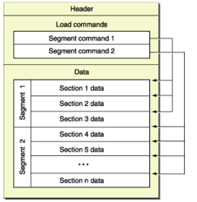
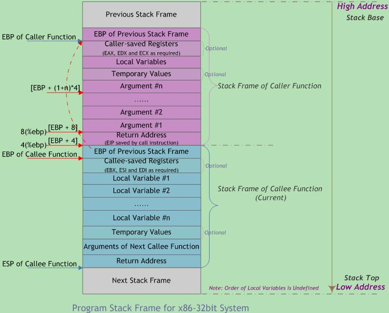
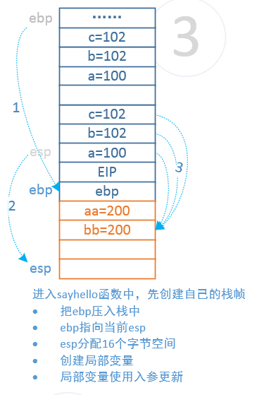
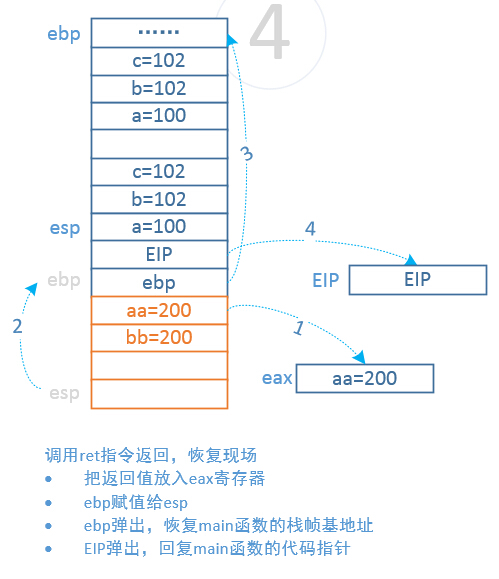
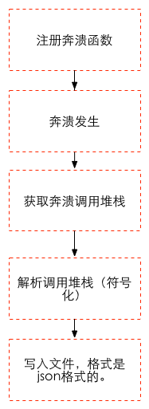
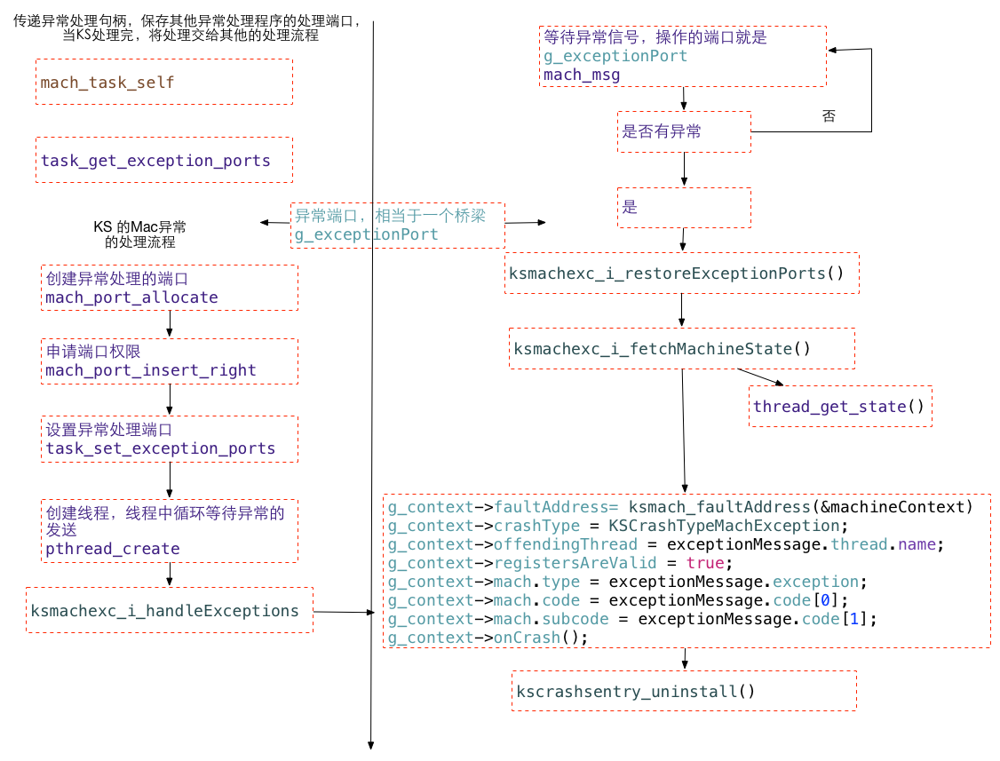
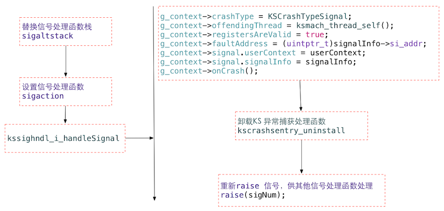
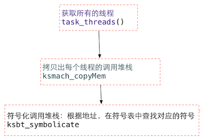

[KSCrash](https://github.com/kstenerud/KSCrash) 是一个异常收集的开源框架。它可以捕获到Mach级内核异常、信号异常、C++异常、Objective-C异常、主线程死锁；当捕获到异常后，KSCrash可以在设备上完成符号化崩溃日志(前提是编译的时候将符号表编译到可执行程序中)；日志的格式你也可以定制，可以是JSON格式的，也可以是Apple crash日志风格。另外，还有僵尸对象查找、内存自省等特性。

<!--more-->


目前异常收集的框架非常多，有集成了收集、统计功能的一条龙产品，如，友盟，鹅厂的[Bugly](http://bugly.qq.com) 等等；也有几个开源框架，如，[KSCrash](https://github.com/kstenerud/KSCrash)，plcrashreporter，CrashKit。
基于我们项目的安全性考虑，即，不希望第三方SDK看到崩溃日志，我选取了开源框架这条路。纵览这几个开源框架，只有[KSCrash](https://github.com/kstenerud/KSCrash)一直在更新。所以，毫不犹豫的选用了它。

<!--# 一、什么是KSCrash

[KSCrash](https://github.com/kstenerud/KSCrash) 是一个崩溃日志收集的开源框架，可以在程序发生Crash时，捕获到所有线程的调用堆栈。加入你的APP有符号表，KSCrash还能在线符号化崩溃日志。-->

APP Crash后，获取崩溃线程的程调用堆栈的过程，是程序执行过程的逆向过程。那么，了解APP的执行正向过程，对获取崩溃线程的调用堆栈是非常非常有益的。所以，在分析KSCrash原理前，依照APP正向执行过程先推导下 异常收集、符号化的原理。

## 推导异常收集、符号化的原理

本节描述的内容只是按照自己的理解编写的，由于道行尚浅，理解不深，所以具体安排的内容不一定合理。依据APP执行的过程，主要囊括了：编译生成可执行APP、内核加载并启动APP、调用堆栈等，并穿插了一点理解KSCrash的必备知识。

### 编译生成可执行APP

开发者通过IDE集成开发环境（例如Xcode），将源码文件转化为临时中间文件（这种文件应该是机器语言了），然后使用链接器（/usr/bin/ld）将临时的对象文件（object file）合并为可执行文件。不过上面的编译、链接步骤都集成到Xcode中了。我们在Xcode中编译的时候，体会不到这个过程。在苹果系统中，可执行APP的存储格式是Mach-O格式。所以我们先了解下Mach-O文件格式。

### Mach-O文件存储格式

Mach-O (Mach object的缩写) 是苹果系统上存储可执行程序和库（libraries）的标准格式。它是BSD系统中.a文件格式的替代物，它封装着程序的可执行代码和数据。可以参考[《OS X ABI Mach-O File Format Reference》](http://of685p9vy.bkt.clouddn.com/OS%20X%20ABI%20Mach-O%20File%20Format%20Reference.pdf)官方文档。这个文档在官网打不来了，我就链接到我自己的pdf地址了。


Mach-O文件包括三个组成部分，分别如下：

1. header：指定了文件的基本信息，如CUP类型、加载命令个数等。
2. Load commands：加载命令，指定了文件的逻辑结构、在虚拟内存（virtual memory）中文件的布局。你可以理解为一片文章的目录。
3. Raw segment data：数据部分。



这个是官网上的结构示意图。

#### header

Mach-O文件的开头部分是就是Header---文件头。Header的数据结构定义在XNU微内核的[loader.h](http://opensource.apple.com/source/xnu/xnu-792.13.8/osfmk/mach-o/loader.h)文件中。loader.h也可以在IOS SDK的/usr/include/mach-o目录下找到，header的数据结构定义如下：

```
struct mach_header 
{
	uint32_t	magic;		/* mach magic number identifier */
	cpu_type_t	cputype;	/* cpu specifier */
	cpu_subtype_t	cpusubtype;	/* machine specifier */
	uint32_t	filetype;	/* type of file */
	uint32_t	ncmds;		/* number of load commands */
	uint32_t	sizeofcmds;	/* the size of all the load commands */
	uint32_t	flags;		/* flags */
};
```

可以看出包括了 ：魔数、cup的类型、子类型、文件的类型、load commend个数、load commend大小等数据。

#### load commend

紧跟在Header后面的是load commend。load commend指定了文件的布局。具体指定了以下内容：

• The initial layout of the file in virtual memory 文件在虚拟内存中的初始布局

• The location of the symbol table (used for dynamic linking) 符号表的位置

• The initial execution state of the main thread of the program 程序主线程的入口地址

• The names of shared libraries that contain definitions for the main executable’s imported symbols 主执行文件依赖的分享库

load commend 的种类非常多，loader.h 中的定义了各种所有的类型。我们仅以LC_SEGMENT、LC_SYMTAB（符号表）为例了解load commend。每种类型的load commend都有对应的数据结构，可以在loader.h文件中查看。下面是部分类型Load Commond：

```
#define	LC_SEGMENT	0x1	///代码段
#define	LC_SYMTAB	0x2	  /// 符号表 
#define	LC_SYMSEG	0x3	/* link-edit gdb symbol table info (obsolete) */
#define	LC_THREAD	0x4	/* thread */
#define	LC_UNIXTHREAD	0x5	/* unix thread (includes a stack) */
#define	LC_LOADFVMLIB	0x6	/* load a specified fixed VM shared library */
#define	LC_IDFVMLIB	0x7	/* fixed VM shared library identification */
#define	LC_IDENT	0x8	/* object identification info (obsolete) */
#define LC_FVMFILE	0x9	/* fixed VM file inclusion (internal use) */
#define LC_PREPAGE      0xa     /* prepage command (internal use) */
#define	LC_DYSYMTAB	0xb	/* dynamic link-edit symbol table info */
#define	LC_LOAD_DYLIB	0xc	/* load a dynamically linked shared library */
#define	LC_ID_DYLIB	0xd	/* dynamically linked shared lib ident */
#define LC_LOAD_DYLINKER 0xe	/* load a dynamic linker */
#define LC_ID_DYLINKER	0xf	/* dynamic linker identification */
#define	LC_PREBOUND_DYLIB 0x10	/* modules prebound for a dynamically */
...................
```

#### Data

Data紧跟在Load Commond后面。load commend中定义的各种数据都存储在这部分中。

#### 查看Mach-O实用工具

在终端中有几个工具是可以查看Mach-O文件内容的。另外位于usr/include/mach-o/dyld.h中的函数可以在程序中访问Mach-O文件内容。

1. 文件类型展示工具-file。The file-type displaying tool, 位于/usr/bin/file，显示文件的类型，对于多构架的文件，它显示每个构架下的镜像类型。在终端中输入：

```
~/Desktop/收集、解析IOS崩溃日式/Exception/UncaughtException_archive
```
	输出：
	
```
/Users/lijian/Desktop/收集、解析IOS崩溃日式/Exception/UncaughtException_archive: Mach-O universal binary with 2 architectures
/Users/lijian/Desktop/收集、解析IOS崩溃日式/Exception/UncaughtException_archive (for architecture armv7):	Mach-O executable arm
/Users/lijian/Desktop/收集、解析IOS崩溃日式/Exception/UncaughtException_archive (for architecture arm64):	Mach-O 64-bit executable
```

2. 对象文件展示工具otool。The object-file displaying tool，位于/usr/bin/otool，显示Mach-O文件的各种数据。查看Mach-O header内容，在终端中输入：

```
otool -hV ~/Desktop/收集、解析IOS崩溃日式/Exception/UncaughtException_archive 
```

输出：
	
```
Mach header
  magic cputype cpusubtype  caps    filetype ncmds sizeofcmds      flags
MH_MAGIC     ARM         V7  0x00     EXECUTE    23       2432   NOUNDEFS DYLDLINK TWOLEVEL PIE
Mach header
  magic cputype cpusubtype  caps    filetype ncmds sizeofcmds      flags
MH_MAGIC_64   ARM64        ALL  0x00     EXECUTE    23       2872   NOUNDEFS DYLDLINK TWOLEVEL PIE
```

可以使用otool 查看load commend。在终端中输入：
	
```
otool -lV ~/Desktop/收集、解析IOS崩溃日式/Exception/UncaughtException_archive 
```

输出：

```
Mach header
  magic cputype cpusubtype  caps    filetype ncmds sizeofcmds      flags
0xfeedface      12          9  0x00           2    23       2432 0x00200085
Load command 0
  cmd LC_SEGMENT
cmdsize 56
segname __PAGEZERO
vmaddr 0x00000000
vmsize 0x00004000
fileoff 0
filesize 0
maxprot 0x00000000
initprot 0x00000000
nsects 0
flags 0x0
..........
```

3. 符号展示工具-nm，The symbol table display tool,位于 /usr/bin/nm, allows you to view the contents of an object file’s symbol table。查看符号表，在终端中输入：

```
nm ~/Desktop/收集、解析IOS崩溃日式/Exception/UncaughtException_archive 
```

输出：
	
```
/Users/lijian/Desktop/收集、解析IOS崩溃日式/Exception/UncaughtException_archive (for architecture arm64):
             U _NSGetUncaughtExceptionHandler
             U _NSLog
             U _NSSearchPathForDirectoriesInDomains
             U _NSSetUncaughtExceptionHandler
             U _NSStringFromClass
             U _objc_msgSend
             U _objc_msgSendSuper2
             U _objc_release
             U _objc_retain
             U _objc_retainAutorelease
             U _objc_retainAutoreleasedReturnValue
             U _objc_setProperty_nonatomic_copy
             U _objc_storeStrong
             U _strstr
             U dyld_stub_binder
             ...........
```

### 绑定和执行

根据上面分析的可执行文件的结构，我们可以看到，可执行文件中已经包含了符号表 ，这个符号表是可执行代码的虚拟地址和代码中符号的对应表。符号表是绑定过程中建立的，程序的绑定有很多种，可以参看下面的文档：[Mach-O Programming Topics - Binding Symbols](https://developer.apple.com/library/mac/documentation/DeveloperTools/Conceptual/MachOTopics/1-Articles/executing_files.html#//apple_ref/doc/uid/TP40001829-97047-TPXREF111)，里面详细介绍了绑定和查找符号的过程。

看到符号表，那么我们可以做这样的设想：如果程序崩溃，只要我们获取到了崩溃调用堆栈的回溯地址，然后从这个符号表中查找对应的符号，就完成了调用堆栈的符号化工作？ 还有就是我们如何获取程序的调用堆栈呢？还有很多需要我们接着往下看。为了知道如何获取调用堆栈的回溯，我们了解下程序的执行过程：

程序的执行过程：内核首先加载可执行文件，并且检测程序文件的起始部分的mach_header结构，内核验证是否合法的Macj-O文件，解析header中的load commands。加载Load Commond中指定依赖镜像到内存中，然后启动进程，执行程序的入口函数，进入正常的run loop。

### 调用堆栈

首先介绍一下什么叫调用堆栈：假设我们为了完成一个任务1，任务1的完成需要完成任务2.... 分别定义为几个函数：function1,function2,function3,funtion4。即，function1调用function2，function2调用function3，function3调用function4。在function4运行过程中，我们可以从线程当前堆栈中了解到调用他的那几个函数分别是谁。function4、function3、function2、function1呈现出一种“堆栈”的特征，最后被调用的函数出现在最上方。因此称呼这种关系为调用堆栈(call stack)。 下面有一个图展示下：



函数调用经常是嵌套的，在同一时刻，堆栈中会有多个函数的信息。每个未完成运行的函数占用一个独立的连续区域，称作栈帧(Stack Frame)。栈帧是堆栈的逻辑片段，当调用函数时逻辑栈帧被压入堆栈, 当函数返回时逻辑栈帧被从堆栈中弹出。栈帧存放着函数参数，局部变量及恢复前一栈帧所需要的数据等。理解了入栈和出栈，基本能理解调用堆栈，下面两个图，一个是入栈，一个是出栈，图中描述的很清楚。





所以获取到崩溃时线程的ebp和esp 就能回溯到上一个调用，依次类推，回溯出所有的调用堆栈。下面了解下寄存器。

### 寄存器 
为了线程获取BP和SP，我们需要了解一点点寄存器。因为他们保存在CPU的寄存器中。
arm64构架的寄存器在[Procedure Call Standard for the ARM 64-bit Architecture (AArch64)](http://infocenter.arm.com/help/topic/com.arm.doc.ihi0055b/IHI0055B_aapcs64.pdf)有详细的说明。不过都是英文的，我没有看，我从代码中也找到了它的定义，位于IOS SDK的usr/include/arm目录下的_mcontext.h文件中。其中几个关键的定义的代码我摘录下来了，如下：

```
_STRUCT_MCONTEXT64
{
	_STRUCT_X86_EXCEPTION_STATE64  __es; ///异常寄存器
	_STRUCT_X86_THREAD_STATE64  __ss;    ///线程状态寄存器
	_STRUCT_X86_FLOAT_STATE64  __fs;     ///浮点寄存器
};
```

这个结构体
定义了所有的寄存器。其中_STRUCT_MCONTEXT64结构体定义了三大类寄存器，根据字面意思理解为：异常寄存器、线程状态寄存器、浮点寄存器。我们只关注线程状态寄存器。

```
_STRUCT_ARM_THREAD_STATE64
{
	__uint64_t    __x[29];   ///General purpose registers x0-x28
	__uint64_t    __fp;	     ///这里就是BP,x29
	__uint64_t    __lr;	     /// Link register x30 
	__uint64_t    __sp;	     ///这里就是SP   x31
	__uint64_t    __pc;	     Program counter
	__uint32_t    __cpsr;    Current program status register
	__uint32_t    __pad;    /* Same size for 32-bit or 64-bit clients */
};
```

不管你见或者不见我我就在那里，BP就在 _STRUCT_MCONTEXT64->__ss.__fp里，SP就在_STRUCT_MCONTEXT64->__ss->__sp里。不知不觉的问题已经转化了，转化为获取线程的_STRUCT_X86_THREAD_STATE64数据，即，获取线程的状态结构体。

XNU微内核的核心部分Mach，里面暴露了一些线程的接口函数，我们应该能获取到线程的状态结构体。了解这些函数的接口定义可以参考：[Mach IPC Interface](http://web.mit.edu/darwin/src/modules/xnu/osfmk/man/)、[IPC 原理讲解](https://developer.apple.com/library/mac/documentation/Darwin/Conceptual/KernelProgramming/Mach/Mach.html)。

### 获取线程状态

IPC 接口文档的线程接口部分（Thread Interface）的 thread_get_state函数可以获取线程的状态。他的定义如下：

```
kern_return_t   thread_get_state
                (thread_act_t                     target_thread,
                 thread_state_flavor_t                   flavor,
                 thread_state_t                       old_state,
                 mach_msg_type_number_t         old_state_count);
```

thread_get_state函数返回target_thread的执行状态，存储在flavor参数里。看着上面的定义，是不是一点感觉都没有，一头雾水，摸不着头脑？我也是，幸好KSCrash中有这部分代码，贴出来瞅瞅：

```
bool ksmach_threadState(const thread_t thread,
                        STRUCT_MCONTEXT_L* const machineContext)
{
    return ksmach_fillState(thread,
                            (thread_state_t)&machineContext->__ss,
                            ARM_THREAD_STATE,
                            ARM_THREAD_STATE_COUNT);
}
	
bool ksmach_fillState(const thread_t thread,
                      const thread_state_t state,
                      const thread_state_flavor_t flavor,
                      const mach_msg_type_number_t stateCount)
{
    mach_msg_type_number_t stateCountBuff = stateCount;
    kern_return_t kr;
	
    kr = thread_get_state(thread, flavor, state, &stateCountBuff);
    if(kr != KERN_SUCCESS)
    {
        KSLOG_ERROR("thread_get_state: %s", mach_error_string(kr));
        return false;
    }
    return true;
}
```

上面代码说明了thread_get_state函数可以根据线程ID（thread_t thread），获取到线程状态（_STRUCT_ARM_THREAD_STATE64），也就是通过线程ID，就能获取到线程当前执行状态的BP 和SP。

### 思路回溯

上面讲了，那么多，目的只有一个，就是理出一个思路-----获取程序崩溃时线程的调用堆栈。现在大概是这样的：

1. 程序发生崩溃，我们获取到崩溃的线程，取出线程的threadID。

2. 通过thread_get_state函数， 获取线程ID为threadID的线程的 当前执行状态，目的是获取：帧指针BP、栈指针SP；

3. 依据《调用堆栈》原理、BP、SP，循环取出线程的调用堆栈。

4. 依据《 Mach-O文件存储格式》原理，将调用堆栈中的地址转换为代码中的符号。

总体逻辑现在通了，但是，还有好多好多的细节，等待我们去完善，比如，一个关键的逻辑，我是怎么知道程序崩溃了呢？从而让程序执行到崩溃处理函数里，完成线程回溯功能。

通过分析KS的代码，得知，可以在程序启动的时候注册崩溃的处理函数，程序崩溃发生时，会执行崩溃处理函数。

其实，捕获异常的方式多种多样，不同捕获方式，捕获的原理不同。捕获原理请参看《二、KSCrash异常捕获原理》。这里只扫盲下经典的捕获方式。

### 捕获崩溃方式

捕获崩溃的方式有：
1. 捕获Mach 异常
2. 捕获Unix 信号
其实，这部分内容在[漫谈 iOS Crash 收集框架](http://www.wtoutiao.com/p/h27ist.html)中阐述的非常明白。为了表示写的好，这里再重复的阐述下。

iOS 系统自带的Apple’s Crash Reporter 记录在设备中的 Crash 日志，Exception Type项通常会包含两个元素：Mach 异常 和 Unix 信号。

```
Exception Type:         EXC_BAD_ACCESS (SIGSEGV)    
Exception Subtype:      KERN_INVALID_ADDRESS at 0x041a6f3
```

Mach 异常是什么？它又是如何与 Unix 信号建立联系的？
Mach 是一个 XNU 的微内核核心，Mach 异常是指最底层的内核级异常，被定义在 <mach/exception_types.h>下 。每个 thread，task，host 都有一个异常端口数组，Mach 的部分 API 暴露给了用户态，用户态的开发者可以直接通过 Mach API 设置 thread，task，host 的异常端口，来捕获 Mach 异常，抓取 Crash 事件。

所有 Mach 异常都在 host 层被ux_exception转换为相应的 Unix 信号，并通过threadsignal将信号投递到出错的线程。iOS 中的 POSIX API 就是通过 Mach 之上的 BSD 层实现的。

因此，EXC_BAD_ACCESS (SIGSEGV)表示的意思是：Mach 层的EXC_BAD_ACCESS异常，在 host 层被转换成 SIGSEGV 信号投递到出错的线程。既然最终以信号的方式投递到出错的线程，那么就可以通过注册 signalHandler 来捕获信号:

```
signal(SIGSEGV,signalHandler);
```

捕获 Mach 异常或者 Unix 信号都可以抓到 crash 事件，这两种方式哪个更好呢？优选 Mach 异常，因为 Mach 异常处理会先于 Unix 信号处理发生，如果 Mach 异常的 handler 让程序 exit 了，那么 Unix 信号就永远不会到达这个进程了。转换 Unix 信号是为了兼容更为流行的 POSIX 标准 (SUS 规范)，这样不必了解 Mach 内核也可以通过 Unix 信号的方式来兼容开发。

## KSCrash异常捕获原理

KSCrash是一个完备的异常捕获开源框架，它不仅可以捕获到各种异常，并可在设备上完成符号化工作。同时，还有很多高级的特性，例如查找僵尸对象（Zombie）、 内存自省（Introspection）、 主线程死锁检测。

### 捕获日志流程

这里只分析KSCrash获取崩溃日志的原理。下面是主要的流程：



获取崩溃日志主要流程有：

1. 注册异常处理函数
2. 等待异常发生
3. 异常发生
4.  回调到异常处理函数
5. 在异常处理函数中获取异常发生时刻的所有线程
6. 循环获取每个线程的调用堆栈
7. 符号化调用堆栈
8. 保存异常日志
9. 程序结束
10. 下次启动发送上次的崩溃日志

### 捕获的异常种类

根据[KSCrash](https://github.com/kstenerud/KSCrash)的官网介绍，它可以捕获多种异常,包括：

* Mach kernel exceptions  
* Fatal signals  
* C++ exceptions  
* Objective-C exceptions  
* Main thread deadlock (experimental)  
* Custom crashes (e.g. from scripting languages)  

下面主要介绍下 Mach kernel exceptions、Fatal signals、C++ exceptions异常的注册异常处理函数原理。

### Mach异常注册原理

下面是mach exceptions 的注册流程图

   

基本流程是：

1. 首先调用task_get_exception_ports 保存先前的异常处理端口。
2. 调用mach_port_allocate  创建异常处理端口g_exceptionPort。<!--xnu的进程内通信可以通过端口进行。-->
3. 调用 mach_port_insert_right 获取端口的权限
4. 设置异常处理端口  
5. 创建线程，线程中不停的调用mach_msg ，读取g_exceptionPort端口上的数据，如果异常发生，mach_msg成功，进入异常处理流程。
6. 恢复先前的异常处理端口
7. 调用ksmachexc_i_fetchMachineState 获取线程状态。
8. 保存状态并完成符号化功能。
9. 卸载异常处理函数。

千言万语，不如几行代码的说服力，所以后面的内容都使用代码+注释的形式表述。

```
bool kscrashsentry_installMachHandler(KSCrash_SentryContext* const context)
{
    bool attributes_created = false;
    pthread_attr_t attr;
	
    kern_return_t kr;
    int error;
	
    const task_t thisTask = mach_task_self();
    exception_mask_t mask = EXC_MASK_BAD_ACCESS |
    EXC_MASK_BAD_INSTRUCTION |
    EXC_MASK_ARITHMETIC |
    EXC_MASK_SOFTWARE |
    EXC_MASK_BREAKPOINT;
	
    if(g_installed)
    {
        return true;
    }
    g_installed = 1;
	
    g_context = context;
	
    ///获取先前异常捕获的端口
    kr = task_get_exception_ports(thisTask,
                                  mask,
                                  g_previousExceptionPorts.masks,
                                  &g_previousExceptionPorts.count,
                                  g_previousExceptionPorts.ports,
                                  g_previousExceptionPorts.behaviors,
                                  g_previousExceptionPorts.flavors);
	
    if(g_exceptionPort == MACH_PORT_NULL)
    {
    		///创建异常捕获端口
        kr = mach_port_allocate(thisTask,
                                MACH_PORT_RIGHT_RECEIVE,
                                &g_exceptionPort);
        ///获取端口的权限
        kr = mach_port_insert_right(thisTask,
                                    g_exceptionPort,
                                    g_exceptionPort,
                                    MACH_MSG_TYPE_MAKE_SEND);
    }
		///设置异常捕获端口
    kr = task_set_exception_ports(thisTask,
                                  mask,
                                  g_exceptionPort,
                                  EXCEPTION_DEFAULT,
                                  THREAD_STATE_NONE);
    ///启动读异常端口数据的线程
    pthread_attr_init(&attr);
    attributes_created = true;
    pthread_attr_setdetachstate(&attr, PTHREAD_CREATE_DETACHED);
    error = pthread_create(&g_secondaryPThread,
                           &attr,
                           &ksmachexc_i_handleExceptions,
                           kThreadSecondary);
                           
    g_secondaryMachThread = pthread_mach_thread_np(g_secondaryPThread);
    context->reservedThreads[KSCrashReservedThreadTypeMachSecondary] = g_secondaryMachThread;
	
    error = pthread_create(&g_primaryPThread,
                           &attr,
                           &ksmachexc_i_handleExceptions,
                           kThreadPrimary);
	
    pthread_attr_destroy(&attr);
    g_primaryMachThread = pthread_mach_thread_np(g_primaryPThread);
    context->reservedThreads[KSCrashReservedThreadTypeMachPrimary] = g_primaryMachThread;
failed:
    return false;
}
```

这里完了展示主要逻辑，去掉了很多日志和错误判断的代码。下面是异常处理函数

```
void* ksmachexc_i_handleExceptions(void* const userData)
{
    MachExceptionMessage exceptionMessage = {{0}};
    MachReplyMessage replyMessage = {{0}};
	
    const char* threadName = (const char*) userData;
    pthread_setname_np(threadName);
    if(threadName == kThreadSecondary)
    {
        thread_suspend(ksmach_thread_self());
    }
	
    for(;;)
    {
    		///读取异常端口
        kern_return_t kr = mach_msg(&exceptionMessage.header,
                                    MACH_RCV_MSG,
                                    0,
                                    sizeof(exceptionMessage),
                                    g_exceptionPort,
                                    MACH_MSG_TIMEOUT_NONE,
                                    MACH_PORT_NULL);
        if(kr == KERN_SUCCESS)
        {
            break;
        }
    }
		///读取到异常信息，证明崩溃发生
    if(g_installed)
    {
        bool wasHandlingCrash = g_context->handlingCrash;
        kscrashsentry_beginHandlingCrash(g_context);
        
        ///挂起所有的线程
        kscrashsentry_suspendThreads();
	
        // Switch to the secondary thread if necessary, or uninstall the handler
        // to avoid a death loop.
        if(ksmach_thread_self() == g_primaryMachThread)
        {
            KSLOG_DEBUG("This is the primary exception thread. Activating secondary thread.");
            if(thread_resume(g_secondaryMachThread) != KERN_SUCCESS)
            {
                KSLOG_DEBUG("Could not activate secondary thread. Restoring original exception ports.");
                ksmachexc_i_restoreExceptionPorts();
            }
        }
        else
        {
            KSLOG_DEBUG("This is the secondary exception thread. Restoring original exception ports.");
            ksmachexc_i_restoreExceptionPorts();
        }
				///是否正在处理异常 
        if(wasHandlingCrash)
        {
            KSLOG_INFO("Detected crash in the crash reporter. Restoring original handlers.");
            // The crash reporter itself crashed. Make a note of this and
            // uninstall all handlers so that we don't get stuck in a loop.
            g_context->crashedDuringCrashHandling = true;
            kscrashsentry_uninstall(KSCrashTypeAsyncSafe);
        }
	
        /// 填充异常信息 
        STRUCT_MCONTEXT_L machineContext;
        if(ksmachexc_i_fetchMachineState(exceptionMessage.thread.name, &machineContext))
        {
            if(exceptionMessage.exception == EXC_BAD_ACCESS)
            {
                g_context->faultAddress = ksmach_faultAddress(&machineContext);
            }
            else
            {
                g_context->faultAddress = ksmach_instructionAddress(&machineContext);
            }
        }
	
        g_context->crashType = KSCrashTypeMachException;
        g_context->offendingThread = exceptionMessage.thread.name;
        g_context->registersAreValid = true;
        g_context->mach.type = exceptionMessage.exception;
        g_context->mach.code = exceptionMessage.code[0];
        g_context->mach.subcode = exceptionMessage.code[1];
	
        g_context->onCrash();
	
        kscrashsentry_uninstall(KSCrashTypeAsyncSafe);
        kscrashsentry_resumeThreads();
    }
	
    // Send a reply saying "I didn't handle this exception".
    replyMessage.header = exceptionMessage.header;
    replyMessage.NDR = exceptionMessage.NDR;
    replyMessage.returnCode = KERN_FAILURE;
	
    mach_msg(&replyMessage.header,
             MACH_SEND_MSG,
             sizeof(replyMessage),
             0,
             MACH_PORT_NULL,
             MACH_MSG_TIMEOUT_NONE,
             MACH_PORT_NULL);
	
    return NULL;
}
```

### signals异常注册

下图是signals exceptions 异常处理函数的注册过程：



替换信号处理函数栈 

```
int sigaltstack(const stack_t *ss, stack_t *oss);</signal.h>
	
int sigaction(int signo,const struct sigaction *restrict act,
              struct sigaction *restrict oact);
```
              
给信号signum设置新的信号处理函数act， 同时保留该信号原有的信号处理函数oldact  

安装的信号句柄是g_signalStack，信号的种类包括如下：

```
SIGABRT,     /* abort() */
SIGBUS,  /* bus error */
SIGFPE,  /* floating point exception */
SIGILL,  /* illegal instruction (not reset when caught) */
SIGPIPE,  /* write on a pipe with no one to read it */
SIGSEGV,  /* segmentation violation */
SIGSYS,  /* bad argument to system call */
SIGTRAP,  /* trace trap (not reset when caught) */
```

### C++ exceptions 异常注册

这个比较简单，直接调用了标注库的std::set_terminate(CPPExceptionTerminate)函数，设置CPPExceptionTerminate为C++ exceptions 的异常处理函数。

### Object C 异常注册

具体看代码Sentry 目录下的KSCrashSentry_NSException.m文件

### 获取线程的调用堆栈、符号化调用堆栈

#### 获取线程的调用堆栈、符号化调用堆栈原理



下面只用代码讲解，代码只保留主要逻辑，kscrash_i_onCrash符号化的入口函数：

```
void kscrash_i_onCrash(void)
{
		...
		///根据崩溃上下文context，写崩溃日志
    kscrashreport_writeMinimalReport(context, g_recrashReportFilePath);
    ......
}
	
void kscrashreport_writeStandardReport(KSCrash_Context* const crashContext,
                                       const char* const path)
{
		......
		/// 写崩溃时刻所有线程的  回溯
    kscrw_i_writeAllThreads(writer,
                                KSCrashField_Threads,
                                &crashContext->crash,
                                crashContext->config.introspectionRules.enabled,
                                crashContext->config.searchThreadNames,
                                crashContext->config.searchQueueNames);
    .....
}
	
	
void kscrw_i_writeAllThreads(const KSCrashReportWriter* const writer,
                             const char* const key,
                             const KSCrash_SentryContext* const crash,
                             bool writeNotableAddresses,
                             bool searchThreadNames,
                             bool searchQueueNames)
{
    const task_t thisTask = mach_task_self();
    thread_act_array_t threads;
    mach_msg_type_number_t numThreads;
    kern_return_t kr;
    ///获取所有线程
    if((kr = task_threads(thisTask, &threads, &numThreads)) != KERN_SUCCESS)
    {
        KSLOG_ERROR("task_threads: %s", mach_error_string(kr));
        return;
    }
	
    // Fetch info for all threads.
    writer->beginArray(writer, key);
    {
        for(mach_msg_type_number_t i = 0; i < numThreads; i++)
        {
            kscrw_i_writeThread(writer, NULL, crash, threads[i], (int)i, writeNotableAddresses, searchThreadNames,
                                searchQueueNames);
        }
    }
    ....
}
void kscrw_i_writeThread(const KSCrashReportWriter* const writer,
                         const char* const key,
                         const KSCrash_SentryContext* const crash,
                         const thread_t thread,
                         const int index,
                         const bool writeNotableAddresses,
                         const bool searchThreadNames,
                         const bool searchQueueNames)
{
    bool isCrashedThread = thread == crash->offendingThread;
    char nameBuffer[128];
    STRUCT_MCONTEXT_L machineContextBuffer;
    uintptr_t backtraceBuffer[kMaxBacktraceDepth];
    int backtraceLength = sizeof(backtraceBuffer) / sizeof(*backtraceBuffer);
    int skippedEntries = 0;
		/// 获取线程状态、 异常状态
    STRUCT_MCONTEXT_L* machineContext = kscrw_i_getMachineContext(crash,
                                                                 thread,
                                                                 &machineContextBuffer);
    ///获取异常线程的回溯
    uintptr_t* backtrace = kscrw_i_getBacktrace(crash,
                                                thread,
                                                machineContext,
                                                backtraceBuffer,
                                                &backtraceLength,
                                                &skippedEntries);
                                                
     if(backtrace != NULL)
     {
				 ///符号化线程回溯
         kscrw_i_writeBacktrace(writer,
                                KSCrashField_Backtrace,
                                backtrace,
                                backtraceLength,
                                skippedEntries);
     }
    ......
}
```

代码分析到目前，关键的代码已经出现了，三部分：
1. 获取线程状态、 异常状态
2. 获取异常线程的回溯
3. 符号化线程回溯

#### 获取线程状态 代码分析

```
STRUCT_MCONTEXT_L* kscrw_i_getMachineContext(const KSCrash_SentryContext* const crash,
                                            const thread_t thread,
                                            STRUCT_MCONTEXT_L* const machineContextBuffer)
{
    if(!kscrw_i_fetchMachineState(thread, machineContextBuffer))
    {
        return NULL;
    }
    return machineContextBuffer;
}
	
bool kscrw_i_fetchMachineState(const thread_t thread,
                               STRUCT_MCONTEXT_L* const machineContextBuffer)
{
    if(!ksmach_threadState(thread, machineContextBuffer))
    {
        return false;
    }
	
    if(!ksmach_exceptionState(thread, machineContextBuffer))
    {
        return false;
    }
	
    return true;
}
	
bool ksmach_threadState(const thread_t thread,
                        STRUCT_MCONTEXT_L* const machineContext)
{
    return ksmach_fillState(thread,
                            (thread_state_t)&machineContext->__ss,
                            ARM_THREAD_STATE64,
                            ARM_THREAD_STATE64_COUNT);
}
	
bool ksmach_fillState(const thread_t thread,
                      const thread_state_t state,
                      const thread_state_flavor_t flavor,
                      const mach_msg_type_number_t stateCount)
{
    mach_msg_type_number_t stateCountBuff = stateCount;
    kern_return_t kr;
	
    kr = thread_get_state(thread, flavor, state, &stateCountBuff);
    if(kr != KERN_SUCCESS)
    {
        return false;
    }
    return true;
}
	
bool ksmach_exceptionState(const thread_t thread,
                           STRUCT_MCONTEXT_L* const machineContext)
{
    return ksmach_fillState(thread,
                            (thread_state_t)&machineContext->__es,
                            ARM_EXCEPTION_STATE64,
                            ARM_EXCEPTION_STATE64_COUNT);
}
```

#### 获取异常线程的回溯 代码分析

```                               
uintptr_t* kscrw_i_getBacktrace(const KSCrash_SentryContext* const crash,
                                const thread_t thread,
                                const STRUCT_MCONTEXT_L* const machineContext,
                                uintptr_t* const backtraceBuffer,
                                int* const backtraceLength,
                                int* const skippedEntries)
{
    int actualSkippedEntries = 0;
    int actualLength = ksbt_backtraceLength(machineContext);
    *backtraceLength = ksbt_backtraceThreadState(machineContext,
                                                 backtraceBuffer,
                                                 actualSkippedEntries,
                                                 *backtraceLength);
    return backtraceBuffer;
}
	
int ksbt_backtraceThreadState(const STRUCT_MCONTEXT_L* const machineContext,
                              uintptr_t*const backtraceBuffer,
                              const int skipEntries,
                              const int maxEntries)
{
    int i = 0;
	
    if(skipEntries == 0)
    {
        const uintptr_t instructionAddress = ksmach_instructionAddress(machineContext);
        backtraceBuffer[i] = instructionAddress;
        i++;
    }
	
   
    KSFrameEntry frame = {0};
	
    const uintptr_t framePtr = ksmach_framePointer(machineContext);
    if(framePtr == 0 ||
       ksmach_copyMem((void*)framePtr, &frame, sizeof(frame)) != KERN_SUCCESS)
    {
        return 0;
    }
    for(; i < maxEntries; i++)
    {
        backtraceBuffer[i] = frame.return_address;
        if(backtraceBuffer[i] == 0 ||
           frame.previous == 0 ||
           ksmach_copyMem(frame.previous, &frame, sizeof(frame)) != KERN_SUCCESS)
        {
            break;
        }
    }
    return i;
}

uintptr_t ksmach_instructionAddress(const STRUCT_MCONTEXT_L* const machineContext)
{
    return machineContext->__ss.__pc;
}
```

#### 符号化的代码 代码分析

```
struct nlist_64 {
    union {
        uint32_t  n_strx; /* index into the string table */
    } n_un;
    uint8_t n_type;        /* type flag, see below */
    uint8_t n_sect;        /* section number or NO_SECT */
    uint16_t n_desc;       /* see <mach-o/stab.h> */
    uint64_t n_value;      /* value of this symbol (or stab offset) */
};
	
typedef struct dl_info 
{
    const char      *dli_fname;     /* Pathname of shared object */
    void            *dli_fbase;     /* Base address of shared object */
    const char      *dli_sname;     /* Name of nearest symbol */
    void            *dli_saddr;     /* Address of nearest symbol */
} Dl_info;

void kscrw_i_writeBacktrace(const KSCrashReportWriter* const writer,
                            const char* const key,
                            const uintptr_t* const backtrace,
                            const int backtraceLength,
                            const int skippedEntries)
{
    Dl_info symbolicated[backtraceLength];
    ksbt_symbolicate(backtrace, symbolicated, backtraceLength, skippedEntries);
}
 
#define CALL_INSTRUCTION_FROM_RETURN_ADDRESS(A) (DETAG_INSTRUCTION_ADDRESS((A)) - 1)
                              
void ksbt_symbolicate(const uintptr_t* const backtraceBuffer,
                      Dl_info* const symbolsBuffer,
                      const int numEntries,
                      const int skippedEntries)
{
    int i = 0;
    for(; i < numEntries; i++)
    {
        ksdl_dladdr(CALL_INSTRUCTION_FROM_RETURN_ADDRESS(backtraceBuffer[i]), &symbolsBuffer[i]);
    }
}
	
bool ksdl_dladdr(const uintptr_t address, Dl_info* const info)
{
    info->dli_fname = NULL;
    info->dli_fbase = NULL;
    info->dli_sname = NULL;
    info->dli_saddr = NULL;
	
    const uint32_t idx = ksdl_imageIndexContainingAddress(address);
    if(idx == UINT_MAX)
    {
        return false;
    }
    const struct mach_header* header = _dyld_get_image_header(idx);
    const uintptr_t imageVMAddrSlide = (uintptr_t)_dyld_get_image_vmaddr_slide(idx);
    /// 符号在镜像的偏移量 = 堆栈地址 - 镜像的加载地址
    const uintptr_t addressWithSlide = address - imageVMAddrSlide;
     
    const uintptr_t segmentBase = ksdl_segmentBaseOfImageIndex(idx) + imageVMAddrSlide;
    if(segmentBase == 0)
    {
        return false;
    }
	
    info->dli_fname = _dyld_get_image_name(idx);
    info->dli_fbase = (void*)header;
	
    // Find symbol tables and get whichever symbol is closest to the address.
    const STRUCT_NLIST* bestMatch = NULL;
    uintptr_t bestDistance = ULONG_MAX;
    uintptr_t cmdPtr = ksdl_firstCmdAfterHeader(header);
    if(cmdPtr == 0)
    {
        return false;
    }

    for(uint32_t iCmd = 0; iCmd < header->ncmds; iCmd++)
    {
        const struct load_command* loadCmd = (struct load_command*)cmdPtr;
        
        ///查找LC_SYMTAB load command 
        if(loadCmd->cmd == LC_SYMTAB)
        {
            const struct symtab_command* symtabCmd = (struct symtab_command*)cmdPtr;
            const STRUCT_NLIST* symbolTable = (STRUCT_NLIST*)(segmentBase + symtabCmd->symoff);
            const uintptr_t stringTable = segmentBase + symtabCmd->stroff;
						///在符号表中循环查找，直到首次达到 镜像偏移量imageVMAddrSlide 
            for(uint32_t iSym = 0; iSym < symtabCmd->nsyms; iSym++)
            {
                // If n_value is 0, the symbol refers to an external object.
                if(symbolTable[iSym].n_value != 0)
                {
                    uintptr_t symbolBase = symbolTable[iSym].n_value;
                    uintptr_t currentDistance = addressWithSlide - symbolBase;
                    if((addressWithSlide >= symbolBase) &&
                       (currentDistance <= bestDistance))
                    {
                        bestMatch = symbolTable + iSym;
                        bestDistance = currentDistance;
                    }
                }
            }
            ///取出符号信息，符号信息存储在 
            if(bestMatch != NULL)
            {
                info->dli_saddr = (void*)(bestMatch->n_value + imageVMAddrSlide);
                info->dli_sname = (char*)((intptr_t)stringTable + (intptr_t)bestMatch->n_un.n_strx);
                if(*info->dli_sname == '_')
                {
                    info->dli_sname++;
                }
                // This happens if all symbols have been stripped.
                if(info->dli_saddr == info->dli_fbase && bestMatch->n_type == 3)
                {
                    info->dli_sname = NULL;
                }
                break;
            }
        }
        cmdPtr += loadCmd->cmdsize;
    }
    
    return true;
}
```

上面是所有的关键代码。用到了一些Mach 的API，单不是苹果私有API，放心用吧。

                              
<!--首先使用task_threads 获取崩溃时候所有的调用线程。

然后获取通过kscrw_i_getBacktrace 获取每个线程的调用堆栈的回溯，kscrw_i_getBacktrace 函数获取调用堆栈的原理就是根据寄存器中指定的栈基址指针rbp、当前栈帧地址rsp两个指针，一次复制出调用堆栈。

接着，使用ksbt_symbolicate 符号化各个调用堆栈。符号化的过程就是根据地址，在符号表查找对应的符号。这个过程参考文档：[ OS X ABI Mach-O File Format Reference](https://developer.apple.com/library/mac/documentation/DeveloperTools/Conceptual/MachORuntime/index.html#//apple_ref/doc/uid/20001298-96661)。

最后写入文件。
-->

<!--下面是IPC 的一个介绍（没用，做个记录）：


Interprocess Communication (IPC)

Communication between tasks is an important element of the Mach philosophy. Mach supports a client/server system structure in which tasks (clients) access services by making requests of other tasks (servers) via messages sent over a communication channel.

在任务间交互式mach的重要元素。Mach 支持client/server结构，在这种结构中，客户端任务向服务端任务发送请求，访问服务端的服务。

The endpoints of these communication channels in Mach are called ports, while port rights denote permission to use the channel. The forms of IPC provided by Mach include

在mach中发送消息的交互通道叫做prot，端口的权限标识了使用channel的许可，IPC的种类包括：
message queues
semaphores
notifications
lock sets
remote procedure calls (RPCs)
-->
