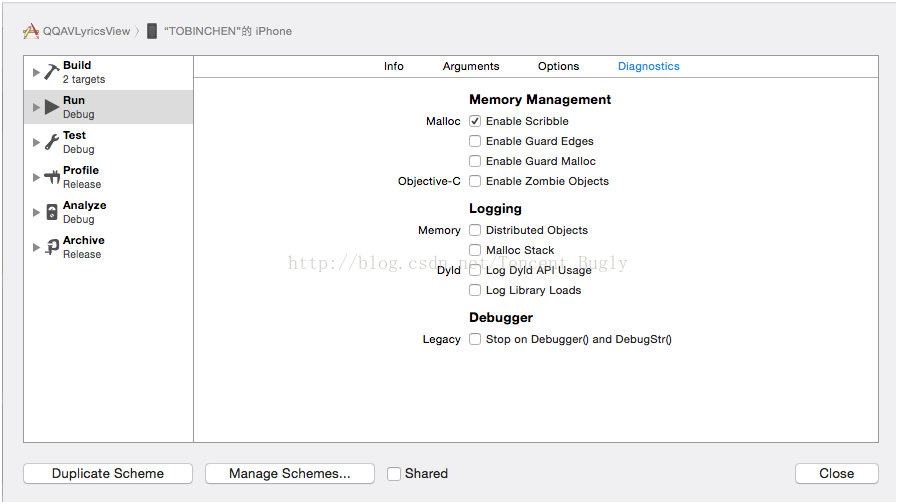
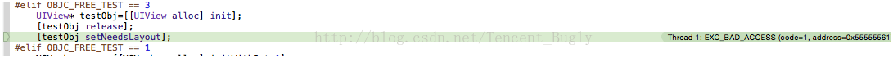

本文主要内容如下：


欲让其灭亡先让其疯狂，我们当然不是人为制造Crash，准确地说，是使隐藏的随机性Crash暴露出来，提高测试时的Crash率，从而降低版本发布后的Crash率。

写C、C++代码的同学应该都清楚，Crash最多的原因通常有两种，一种是多线程，一种是野指针。这两种Crash都带随机性，而且这两种Crash有相当一部分都很难区分，甚至大量的Crash只有系统栈，如果不能根据日志重现，几乎是无解，让人非常蛋疼。

本文主要讨论的方向是Obj-C的野指针。Obj-C的野指针最常见的一种栈是objc_msgSend，从Bugly上报的Crash数据来看，objc_msgSend的量占了五分之一，这其中大多数是Obj-C野指针。当然也有相当多的Obj-C野指针不是这种表现，所以野指针的Crash体量非常惊人。

<!--more-->


## 为什么Obj-C野指针的Crash那么多？

我们有这么多自动化和人工测试流程，而且还有几轮的灰度过程，其实很多Crash场景都应该已经覆盖到了，但随机性意味着，测试的时候它没有问题，等用户用了才有问题，这种情况该怎么办？！

我觉得关键在于它的随机性，随机性问题我初略地分为两类：

第一类是跑不进出错的逻辑，执行不到出错的代码，这种可以提高测试场景覆盖度来解决。

第二类是跑进了有问题的逻辑，但是野指针指向的地址并不一定会导致Crash，这好像要看人品了？

一说到人品就头疼啊有木有，由于上辈子做了太多善事，人品太好每次自测的时候根本不Crash有木有！

## 野指针的随机性

野指针是指指向一个已删除的对象或未申请访问受限内存区域的指针。本文说的Obj-C野指针，说的是Obj-C对象释放之后指针未置空，导致的野指针（Obj-C里面一般不会出现为初始化对象的常识性错误）。

既然是访问已经释放的对象为什么不是必现Crash呢？

因为dealloc执行后只是告诉系统，这片内存我不用了，而系统并没有就让这片内存不能访问。

现实大概是下面几种可能的情况：

1. 对象释放后内存没被改动过，原来的内存保存完好，可能不Crash或者出现逻辑错误（随机Crash）。
2. 对象释放后内存没被改动过，但是它自己析构的时候已经删掉某些必要的东西，可能不Crash、Crash在访问依赖的对象比如类成员上、出现逻辑错误（随机Crash）。
3. 对象释放后内存被改动过，写上了不可访问的数据，直接就出错了很可能Crash在objc_msgSend上面（必现Crash，常见）。
4. 对象释放后内存被改动过，写上了可以访问的数据，可能不Crash、出现逻辑错误、间接访问到不可访问的数据（随机Crash）。
5. 对象释放后内存被改动过，写上了可以访问的数据，但是再次访问的时候执行的代码把别的数据写坏了，遇到这种Crash只能哭了（随机Crash，难度大，概率低）！！
6. 对象释放后再次release（几乎是必现Crash，但也有例外，很常见）。

参考下面的这张图：


看看下面的代码，明显有问题，但是大部分时候是不会Crash的。

```
UIView* testObj=[[UIView alloc] init];
[testObj release];
[testObj setNeedsLayout];
```

但是这个放在用户那边或者不是UIView这个类就不好说了，Crash率可能飕飕就上去了！

## 让随机变成不随机

从上面列的情况来看，出现随机Crash的情况有很多种！这是得多蛋疼呢！或许最好的办法让他们全都立马Crash，然后把野指针都找出来！

仔细看看上面的关键路径只有出现被随机填入的数据是不可访问的时候才会必现Crash。

这个地方我们可以做一下手脚，把这一随机的过程变成不随机的过程。对象释放后在内存上填上不可访问的数据，其实这种技术其实一直都有，xcode的Enable Scribble就是这个作用。



下面我们就拿刚刚的代码试一下。

```
scheme=>diagnostics=>Enable Scribble
```

果然，必现了，0x5555561！！



但是有个问题：这货不能放在测试同学那边用！因为总不能让测试同学装了xcode来测试吧？

于是我们自己动手实现一个，这个过程中我们要解决几个问题：

1. 怎么在内存释放后填上不可访问的数据？内存释放很可能不在我们的代码中。为此我们需要hook对象释放的接口，内存时候之后马上执行我们的破坏工作。
2. 我们要重写对象释放的接口，重写哪个呢？NSObject的dealloc、runtime的 object_dispose，C的free应该都是可以，但是各有优点，我选择的是覆盖面最广的free，free是C的函数，重写了它之后还可以顺带解决一部分C的野指针问题。
3. 怎么重写？重写C的接口场景的有两种：
     
     1. 替换系统动态库
     2. hook
     
     替换动态库太麻烦，还不知道行不行得通；hook我们就找现成的fishhook，github里面找的，但现成的代码需要防止代码冲突。
4. 填充的不可访问的数据的长度怎么确定？获取内存长度的接口不在标准库中，好在在Mac和iOS中可以用malloc_size就可以。
5. 填什么？和xcode一样，填0x55。

上hook后的free代码：

```
void safe_free(void* p){

    size_tmemSiziee=malloc_size(p);

    memset(p,0x55, memSiziee);

    orig_free(p);

    return;
}
```


测试一下，出现了和Enable Scribble一样的Crash！

重复造了这个xcode的轮子之后，以后编包给测试，终于在某些情况下不需要那么拼人品了。但是这仅仅覆盖了众多野指针中的一部分，还有大量的疑问等着继续解答。比如：

1. 由于内存已经被释放了，很可能我们的0x55又被别的数据覆盖，这种情况还是无能为力。
2. 为什么我们的0x55555555变成了0x55555561。
3. 如果释放后访问野指针的是系统代码，虽然提前发现了Crash，但是离解决问题还是很远。
4. 如果野指针指向的数据没有被当成指针使用，还是可能不立即Crash。

## 参考

[如何定位Obj-C野指针随机Crash(一):先提高野指针Crash率](https://blog.csdn.net/tencent_bugly/article/details/46277055 )


