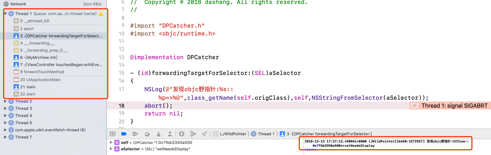

本文终于可以利用OC Runtime的特性，让OC野指针对象主动抛出自己的信息，某些情况下秒杀某些全系统栈Crash

<!--more-->

## 为什么错误地址是0x55555561？

前文介绍了在内存释放后填充0x55使野指针出现后数据不能访问，从而使野指针变成了必现的方法，那这里会有一个比较奇怪的问题：我们在释放的内存上填上了0x55，但为什么大部分时候野指针Crash了，出错的地址却是0x55555561？

为了解答这个问题，我们可以先看看Crash栈，就会发现这些Crash都是在objc_msgSend上。我们知道Obj-C的对象方法调用是通过objc_msgSend进行的，我们通过野指针访问一个对象的方法也一样，其实是通过objc_msgSend给已经释放的对象发了一条消息。

而objc_msgSend的函数签名是这样：

id objc_msgSend(id self, SEL op, ...)
我们再来看看objc_msgSend的代码:

```
libobjc.A.dylib`objc_msgSend:
 0x2f879f40 <+0>: cbz r0, 0x2f879f7e ; <+62>
 0x2f879f42 <+2>: ldr.w r9, [r0]
 0x2f879f46 <+6>: ldrh.w r12, [r9, #0xc]
 0x2f879f4a <+10>: ldr.w r9, [r9, #0x8]
 0x2f879f4e <+14>: and.w r12, r12, r1
 0x2f879f52 <+18>: add.w r9, r9, r12, lsl #3
 0x2f879f56 <+22>: ldr.w r12, [r9]
 0x2f879f5a <+26>: teq.w r12, r1
 0x2f879f5e <+30>: bne 0x2f879f66 ; <+38>
 0x2f879f60 <+32>: ldr.w r12, [r9, #0x4]
 0x2f879f64 <+36>: bx r12
 0x2f879f66 <+38>: cmp.w r12, #0x1
 0x2f879f6a <+42>: blo 0x2f879f78 ; <+56>
 0x2f879f6c <+44>: it eq
 0x2f879f6e <+46>: ldreq.w r9, [r9, #0x4]
 0x2f879f72 <+50>: ldr r12, [r9, #8]!
 0x2f879f76 <+54>: b 0x2f879f5a ; <+26>
 0x2f879f78 <+56>: ldr.w r9, [r0]
 0x2f879f7c <+60>: b 0x2f87a1c0 ; _objc_msgSend_uncached
 0x2f879f7e <+62>: mov.w r1, #0x0
 0x2f879f82 <+66>: bx lr
```

我们可以结合Obj-C类的内存布局再来解读一下上面的汇编代码（节选于Obj-C类的源代码）：

```
struct objc_class : objc_object {
 // Class ISA;
 Class superclass;
 cache_t cache;
 uintptr_t data_NEVER_USE; // class_rw_t * plus custom rr/alloc flags

 class_rw_t *data() {
 return (class_rw_t *)(data_NEVER_USE & ~CLASS_FAST_FLAG_MASK);
 }
 void setData(class_rw_t *newData) {
 uintptr_t flags = (uintptr_t)data_NEVER_USE & CLASS_FAST_FLAG_MASK;
 data_NEVER_USE = (uintptr_t)newData | flags;
 }
……..

struct cache_t {
 struct bucket_t *buckets;
 mask_t shiftmask;
 mask_t occupied;
……..

 
struct bucket_t {
 cache_key_t key;
 IMP imp;
…...

typedef uintptr_t cache_key_t;

```

根据苹果的函数调用约定，objc_msgSend被调用的时候，寄存器对应关系：r0是对象本身self，r1是sel，r2和r3是参数。根据objc_class的声明，我们可以知道：

```
0x2f879f40 <+0>: cbz r0, 0x2f879f7e //如果self为0就跳转到0x2f879f7e。给nil发消息的话就什么都不做
0x2f879f42 <+2>: ldr.w r9, [r0] //取对象的类到r9
0x2f879f46 <+6>: ldrh.w r12, [r9, #0xc] //取类的偏移#0xc的数据到r12，也就是shiftmask的值
0x2f879f4a <+10>: ldr.w r9, [r9, #0x8] //取类的偏移#0x8的成员到r9，也即是cache
0x2f879f4e <+14>: and.w r12, r12, r1 //r1和shiftmask与，放到r12,r1是参数一，也就是sel，用来计算sel的index
0x2f879f52 <+18>: add.w r9, r9, r12, lsl #3 //左移3位就是乘8，8是索引项 bucket_t的宽度，r12是cache索引，r9就cache的位置，r9+r12*8，就是当前sel对应的bucket_t缓存
0x2f879f56 <+22>: ldr.w r12, [r9] //取缓存bucket_t
0x2f879f5a <+26>: teq.w r12, r1 //判断缓存项是不是要找的sel key==sel？
0x2f879f5e <+30>: bne 0x2f879f66 //不是的话就要查找sel
0x2f879f60 <+32>: ldr.w r12, [r9, #0x4] //是的话就取出imp
0x2f879f64 <+36>: bx r12 //调sel的实现，跳到imp里面去执行
```

其实上面的代码就是从缓存中找sel的实现的过程，而错误地址之所以是0x55555561是因为ldrh.w r12, [r9, #0xc]这行指令。我们用0x55555555覆盖了对象的isa指针，当发生OC调用查找缓存0x55555555+0xc取shiftmask的时候，发现这个地址不可读，于是CPU抛出了异常。

## 怎么获取野指针的更多异常数据？

弄清楚上述问题后，又有一个问题：既然0x55555555是被当成了类的指针使用，那假如我们用指定的类覆盖这个指针，是不是就可以执行我们指定类的方法呢？

进一步说就是在发生野指针调用的时候，我们是不是可以控制CPU的行为？说起来有点像溢出攻击，利用shellcode覆盖函数返回值，一旦我们在出错的时候控制了CPU就可以获取更多异常信息，比如是哪个类，调了什么方法，对象的地址之类。

先解决几个关键问题：
1. 覆盖成什么？
我们需要自己写一个类，用它的isa来替换已经释放的对象的isa。如果不出我们所料，我们用自己的类覆盖之后，之前调用的sel就换成了调用我们自己的类的某个sel。这样，只要我们指定的类也实现这个方法，就可以执行我们需要执行的代码，然后在里面获取我们需要的信息。当然，我们无法预料野指针对象会在调用哪个函数时发生Crash，好在我们可以利用runtime的重定向特性了转到我们自己的代码里面去。

2. 怎么覆盖isa？
object_setClass可以替换一个类的isa，但是试了一下，发生死锁！根据Obj-C对象的内存布局，对象的第一个数据就是isa，这里我们可以直接用自己的类指针替换它，反正是已经释放的内存，随便我们怎么玩。
总之，还是很简单，这个类就是下面这样:

```
@interface DPCatcher : NSObject
@property (readwrite,assign,nonatomic) Class origClass;
@end

@implementation DPCatcher
- (id)forwardingTargetForSelector:(SEL)aSelector{
 NSLog(@"发现objc野指针:%s::%p=>%@",class_getName(self.origClass),self,NSStringFromSelector(aSelector));
 abort();
 return nil;
}
-(void)dealloc{
 NSLog(@"发现objc野指针:%s::%p=>%@",class_getName(self.origClass),self,@"dealloc");
 abort();
}

-(oneway void)release{
 NSLog(@"发现objc野指针:%s::%p=>%@",class_getName(self.origClass),self,@"release");
 abort();
}
- (instancetype)autorelease{
 NSLog(@"发现objc野指针:%s::%p=>%@",class_getName(self.origClass),self,@"autorelease");
 abort();
}
@end
```

注意：对象的release、dealloc等函数要特殊处理一下，因为任何对象都有这些方法，不会执行重定向。

然后，我们的free函数改成下面这样（去掉了一些多余代码）：

```
static void DPFree(void* p){
 
 size_t memSiziee=malloc_size(p);
 if (memSiziee>sDPCatchSize) {//有足够的空间才覆盖
 id obj=(id)p;
 Class origClass=object_getClass(obj); //判断是不是objc对象 ，registeredClasses里面有所有的类，如果可以查到，说明是objc类
 if (origClass && CFSetContainsValue(registeredClasses, origClass)) {
 memset(obj, 0x55, memSiziee);
 memcpy(obj, &sDPCatchIsa, sizeof(void*));//把我们自己的类的isa复制过去
 
 DPCatcher* bug=(DPCatcher*)p;
 bug.origClass=origClass;
 }else{
 memset(p, 0x55, memSiziee);
 }
 
 }else{
 memset(p, 0x55, memSiziee);
 }
 return;
}
```

初始化的时候获取所有类信息，获取填充类的的大小:

```
registeredClasses = CFSetCreateMutable(NULL, 0, NULL);

 unsigned int count = 0;
 Class *classes = objc_copyClassList(&count);
 for (unsigned int i = 0; i < count; i++) {
 CFSetAddValue(registeredClasses, (__bridge const void *)(classes[i]));
 }
 free(classes);
 classes=NULL;
 
 sDPCatchIsa=objc_getClass("DPCatcher");
 
 sDPCatchSize=class_getInstanceSize(sDPCatchIsa);
```
用下面简单的代码试一下：

```
UIView* testObj=[[UIView alloc] init];
[testObj release];
[testObj setNeedsLayout];
```

发生野指针的类、对象地址和访问的方法就这样可以被打印出来！



上面这两个Crash如果不能重现几乎是无解！但是，加上我们的野指针定位神器之后再看看，类名和地址都可以打出来了，解决起来就不是什么问题了。

说明：
1. 我们打印出了野指针对象的名字和地址，当这个类的对象比较少时，对查找问题有很大的用处（如果是自定义的类出现野指针，一般还是比较容易找到问题），但是如果是一些经常出现的类，比如nsarray，定位起来还是比较麻烦。这个时候建议试一下xcode的malloc history工具，或者可以自己实现一个类似记录内存使用记录的工具，因为有内存申请和释放的记录，只要重现一次就可以精确定位野指针。

2. 如果出现dealloc的使用错误，例如先[super dealloc]，然后release成员变量，那么就会出现崩溃的现象，且此时对象的地址为0x55555555。这是因为[super dealloc]只会释放对应的内存，但其成员的内存不会被release而变成了0x555555。 这种问题场景比较简单，一旦发生绝对是必现的，修复也比较容易。

后记

写到这里，关于iOS野指针随机问题定位的三篇文章就写完了，特别说一下，文中提到的方法虽然可以提高野指针的曝光率和定位精度，但并不是万能，比如下面这几种情况，可能并不一定适用：

1. 未触发出现野指针的逻辑：比如说一个有问题的代码，只有在特殊的逻辑下才会有野指针问题，如果我们没有触发这个逻辑，肯定也是无法暴露出这个问题的。这种情况建议还是提高测试的场景覆盖。
2. 产生野指针和使用野指针的时间间隔太长：时间太长的话，很可能我们保留的指针已经被释放了。
3. APP内存消耗大，会降低曝光率。因为内存消耗大的时候，我们保留的指针数量必然减少，而且保留的时间也会更短。


1. free之前先填上 0x55 ，这个0x55有什么具体含义吗？
答：实际上填写数据的关键在于填写数据后其地址指向不可读的内存。而填写0x55，和前面提到的出现异常情况的对象地址0x555555连接起来被当成指针使用的话，就会被识别为0x55555555，而CPU访问这个地址就会抛出异常。
另外一点，就是方便区分野指针，例如在Xcode启用Enable Scribble时，指定alloc之后填写的地址为0xaa，防止内存初始化就使用，也是为了方便和free之后的内存做区分。

2. 这个方法对于arc和非arc是否都可以用？
答：都可以，不过都是arc的话应该比较少出现野指针吧。