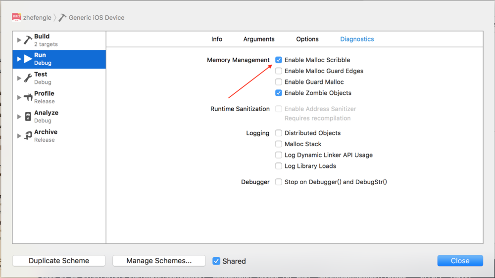
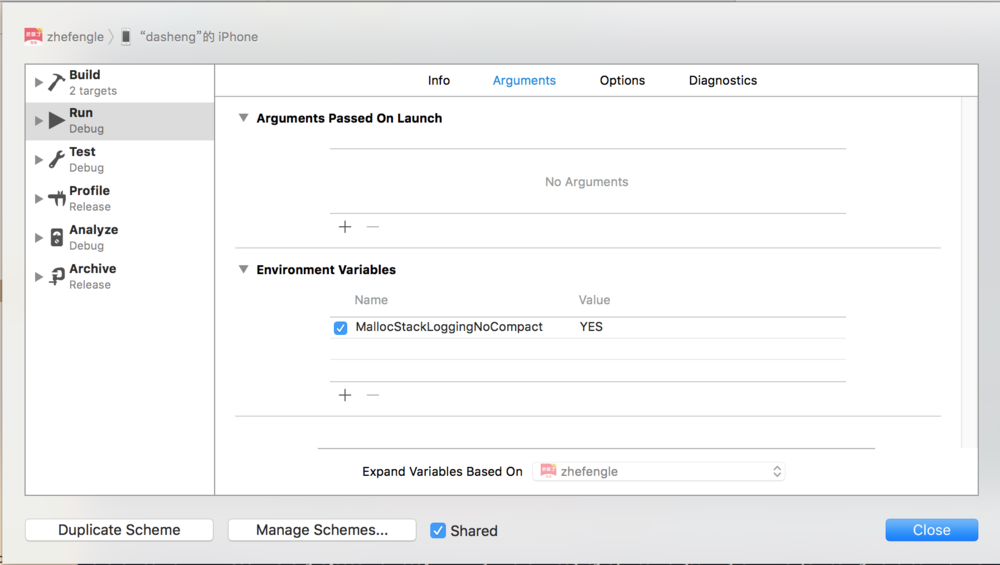
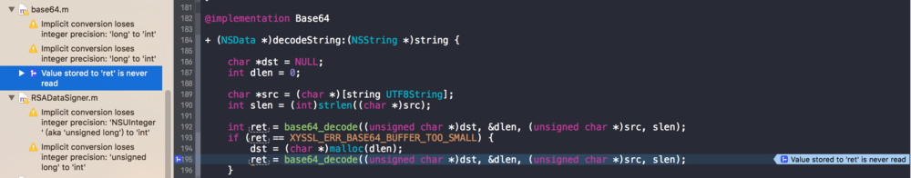
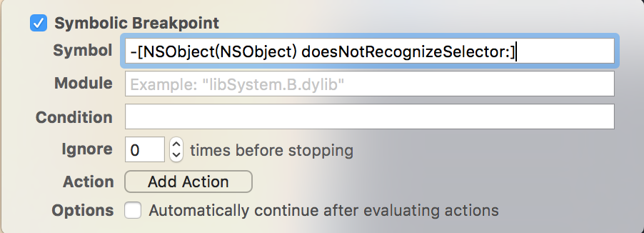

主要内容：

定位野指针的方法。

<!--more-->

## 野指针分析方法(Enable Malloc Scribble)

因为野指针的原因发生崩溃是常常出现的事，而且比较随机。所以我们要提高野指针的崩溃率,从而帮我们快速找到有问题的代码。

对象释放后，只有出现被随机填入的数据是不可访问的时候才会必现Crash。

这个地方我们可以做一下手脚，把这一随机的过程变成不随机的过程。对象释放后在内存上填上不可访问的数据，其实这种技术其实一直都有，xcode的Enable Scribble就是这个作用。

## 僵尸模式(NSZombieEnabled)

启用了NSZombieEnabled的话，它会用一个僵尸来替换默认的dealloc实现，也就是在引用计数降到0时，该僵尸实现会将该对象转换成僵尸对象。僵尸对象的作用是在你向它发送消息时，它会显示一段日志并自动跳入调试器。

所以当启用NSZombieEnabled时，一个错误的内存访问就会变成一条无法识别的消息发送给僵尸对象。僵尸对象会显示接受到得信息，然后跳入调试器，这样你就可以查看到底是哪里出了问题。

所以这时一般崩溃的原因是：调用了已经释放的内存空间，或者说重复释放了某个地址空间。

如何找出问题

### NSZombieEnabled

打开NSZombieEnabled之后，如果遇到对应的崩溃类型既调用了已经释放的内存空间，或者说重复释放了某个地址空间。那么就能在GDB中看到对应的输出信息。

比如会出现如下这样的问题：`[__NSArrayM addObject:]: message sent to deallocated instance 0x7179910`

### MallocStackLoggingNoCompact

如果崩溃是发生在当前调用栈，通过上面的做法，系统就会把崩溃原因定位到具体代码中。但是，如果崩溃不在当前调用栈，系统就仅仅只能把崩溃地址告诉我们，而没办法定位到具体代码，这样我们也没法去修改错误。这时就可以修改scheme，让xcode记录每个地址alloc的历史，这样我们就可以用命令把这个地址还原出来。如图：(跟设置`NSZombieEnabled`一样，添加`MallocStackLoggingNoCompact`，并且设置为YES)

这样，当出现崩溃原因是message sent to deallocated instance 0x7179910，我们可以使用以下命令，把内存地址还原：

`(gdb) nfo malloc-history 0x7179910`

也可以使用下面的命令`(gdb) shell malloc_history {pid/partial-process-name} {address}`

## Enable Address Sanitizer（地址消毒剂）

设置这个参数后就能看到一些更详细的错误信息提示，甚至会有内存使用情况的展示。

C语言是一门危险的语言，内存安全是一个主要的问题。C语言中根本没有内存安全可言。像下面的代码，会被正常的编译，而且可能正常运行：`char *ptr = malloc(5);ptr[12] = 0;`对于内存安全的验证已经有一些解决方案了。如Clang的静态代码分析，可以从代码中查找特定类型的内存安全问题。如Valgrind之类的程序可以在运行时检测到不安全的内存访问。

Address Sanitizer是另外一种解决方案。它使用了一种新的方法，有利有弊。但仍不失为一个查找代码问题的有力工具。

这类工具的理论依据是：访问内存时，通过比较访问的内存和程序实际分配的内存，验证内存访问的有效性，从而在bug发生时就检测到它们，而不会等到副作用产生时才有所察觉。

malloc函数总是最少分配16个字节。为了储存针对标准malloc的内存的保护，需要分配内存到16字节的范围内，因此，若分配的内存大小不是16字节的整数倍，余出的几个字节将不受保护。

Address Sanitizer会追踪受限内存，使用了一种简单但是很巧妙的方法：它在进程的内存空间上保存了一个固定的区域，叫做“影子内存区”。用内存消毒剂的术语来说，一个被标记为受限的内存被称作“中毒”内存。“影子内存区”会记录哪些内存字节是中毒的。通过一个简单的公式，可以将进程中的内存空间映射到“影子内存区”中，即：每8字节的正常内存块映射到一个字节的影子内存上。在影子内存上，会跟踪这8字节的“中毒状态”。

## Static Analyzer（静态分析）

Static Analyzer是一个非常好的工具去发现编译器警告不会提示的问题和一些个人的内错泄露和死存储（不会用到的赋了值的变量）错误。这个方法可能大大的提高内存使用和性能，以及提升应用的整体稳定性和代码质量。

打开方式：Xcode->Product-Analyze然后我们就能看到如下蓝色箭头所示的一些有问题的代码。

## unrecognized selector send to instancd 快速定位

在debug navigator的断点栏里添加Create Symbolic Breakpoint。

在Symbolic中填写如下方法签名：-[NSObject(NSObject) doesNotRecognizeSelector:] 

设置完成后再遇到类似的错误就会定位到具体的代码。

## 参考的源码

[FJFZombieSnifferDemo](https://github.com/fangjinfeng/MySampleCode/tree/master/FJFZombieSnifferDemo)

## 参考

[iOS崩溃crash大解析](https://www.jianshu.com/p/1b804426d212?hmsr=toutiao.io&utm_medium=toutiao.io&utm_source=toutiao.io)
[iOS 野指针定位:野指针嗅探器](https://www.jianshu.com/p/9fd4dc046046?utm_source=oschina-app)

