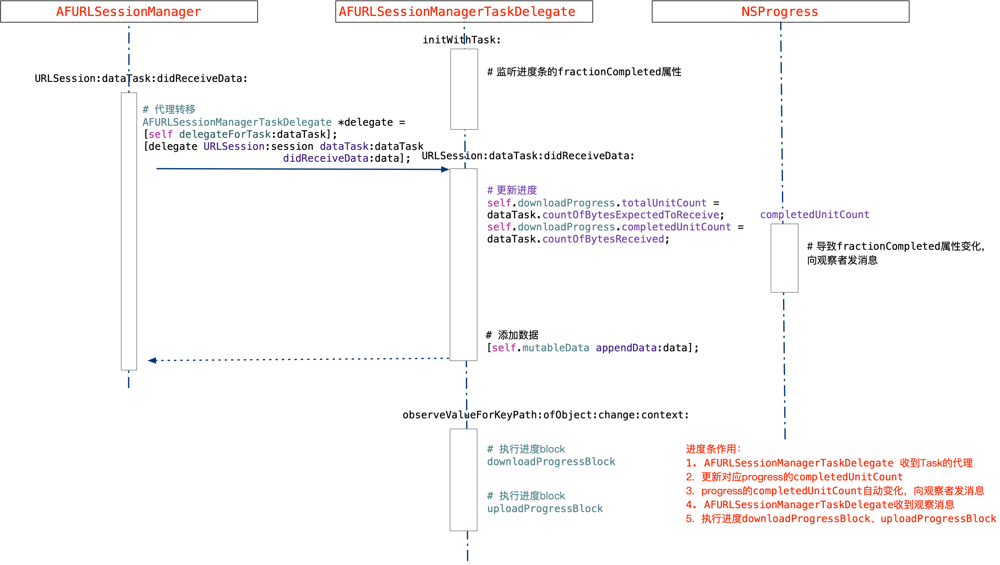
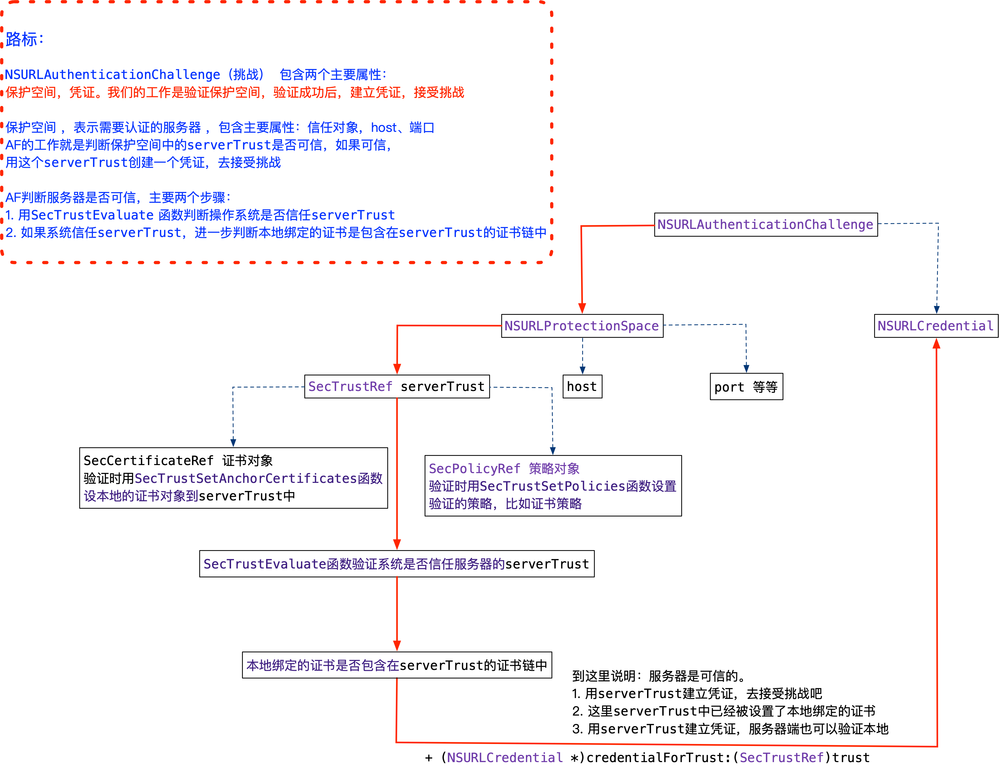

本文学习了AFNetworking，画了几个图，当做学习的成绩，留作以后复习使用。

<!--more-->

## 发送请求

## 接收到响应

## 进度条模块

## 认证模块

## 参考

1. [验证 HTTPS 请求的证书（五）](https://github.com/draveness/analyze/blob/master/contents/AFNetworking/验证%20HTTPS%20请求的证书（五）.md)
2. [11.第三方源码-AFNetworking解析](https://www.jianshu.com/p/488c1f46cedd)
