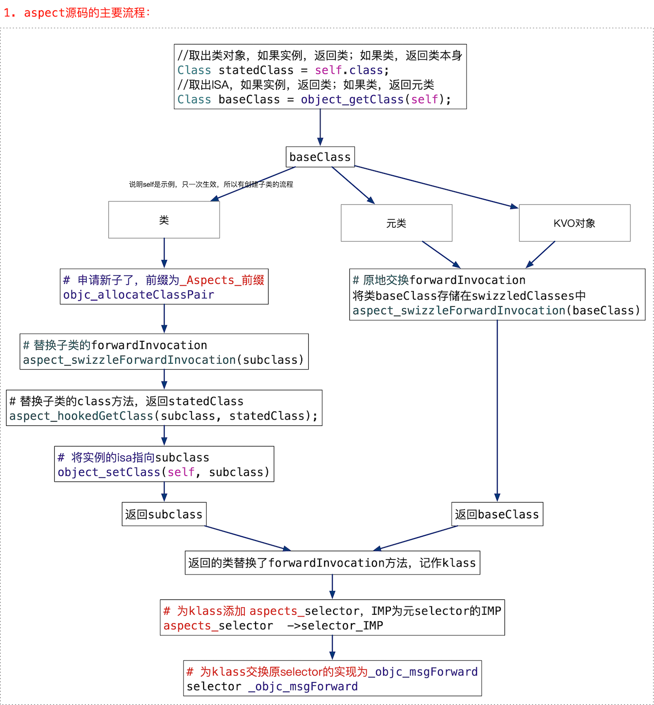
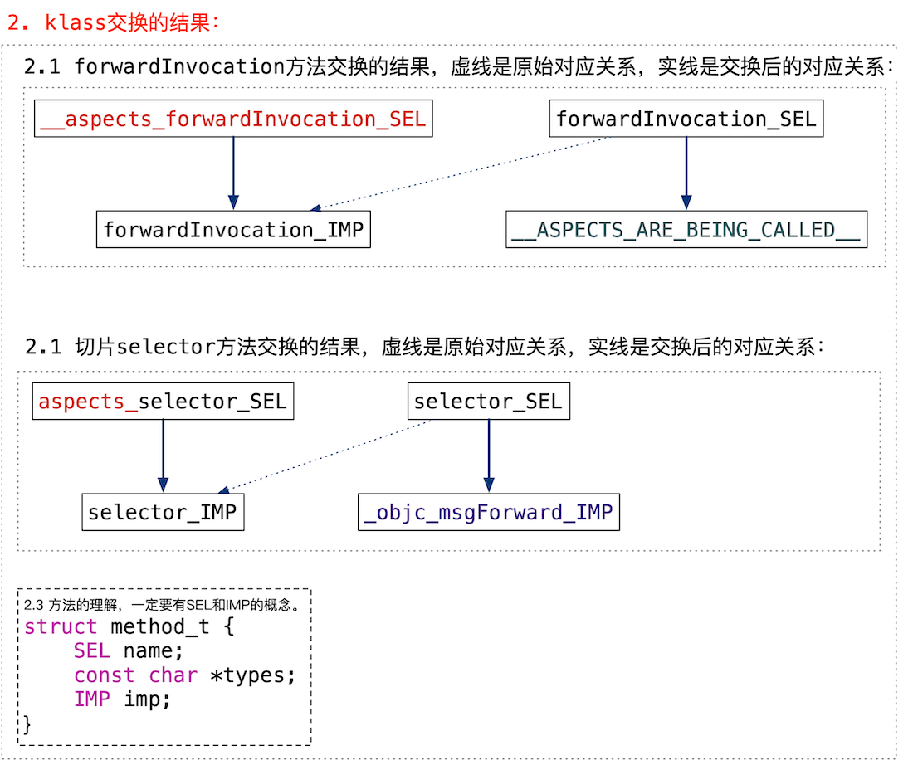
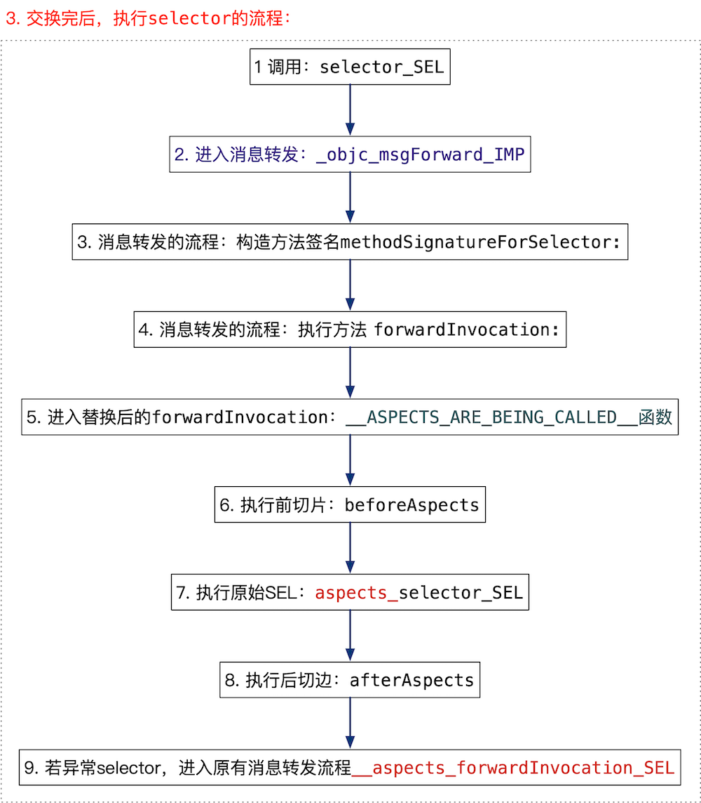
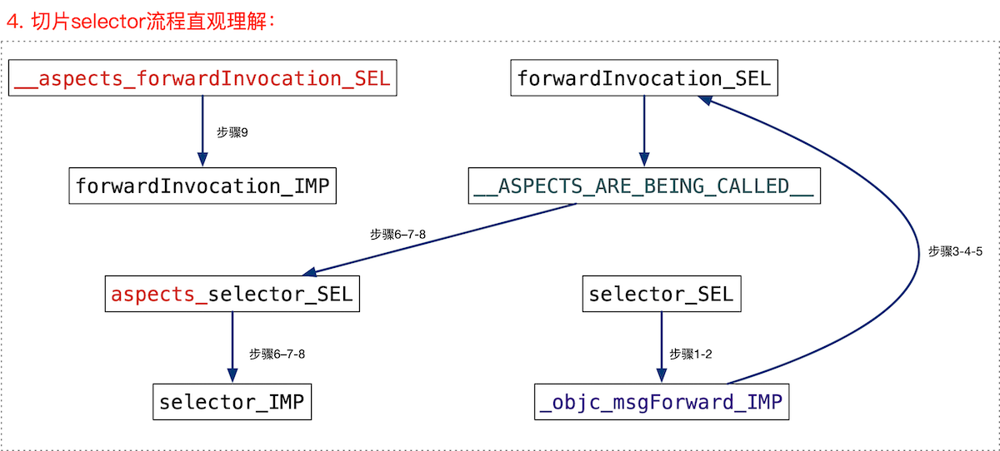

图解[aspect](https://github.com/steipete/Aspects)。

<!--more-->

## 图解aspect

aspect 切方法分为两种：

1. 为实例切方法，只实例有效，类的其他实例不受影响，类似KVO，原理是交换了isa。
2. 为类切方法： 交换了类的实例方法，所有实例都生效。

其实看过原理后，就交换了两个方法，一个是当前selector，一个是forwardInvocation。

一定要理解方法的中包含SEL、IMP，SEL理解为方法的名称，IMP是方法的代码实现，图中很多地方使用SEL、IMP后缀区分两着。

特别注意步骤9，解决的是如果向切片类发送了非切片类的方法，还走原来的消息转发流程，如不认识的方法报 not recognize selector send to instance错误。

## 参考 

无