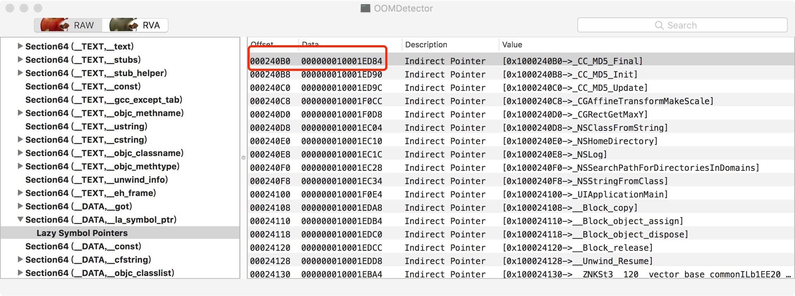
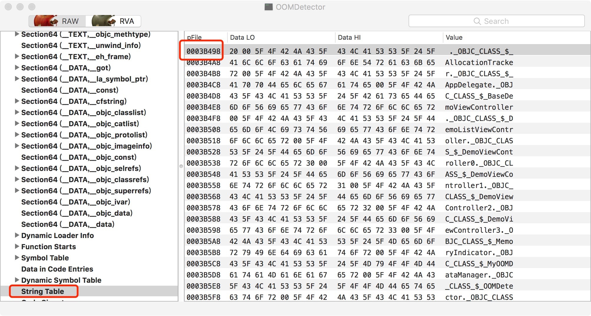

本文尝试9图片解释fishhook原理
<!--more-->

图1. load command中_DATA segement中`__la_symbol_ptr` section结构图,说明该section和动态符号表对应的起始索引是146

图2.数据区域中`__la_symbol_ptr`的结构,可以看出该section的起始地址是0x00240B0，图2和图3是为了找malloc函数指针的位置

图3.数据区域中\_\_la_symbol_ptr的结构,  偏移了一定的位置。文件0x000242B0地址出存储的是malloc函数指针。

计算偏移数量的方法：0x242B0  - 0x240B0 = 0x200
每个条目占用8个字节0x200/0x8 = 0x40  = 64  
得出：在符号表中，malloc偏移64个条目

图4 .转到数据区域中动态符号表的起始位置处，该图说明动态符号表的起始地址是0x3B0A4

图5 。 计算__la_symbol_ptr 对应的符号在动态符号表中的位置： 0x3B060 + 146*4 = 0x3B060 + 0x248 = 0x3B2A8，
地址0x0003B2A8处后面的符号和__la_symbol_ptr中的条目对应。 

图6 .  查找64个偏移后的动态符号表的地址：0x3B2A8 + 0x40*x4 = 0x3B3A8，地址0x3B3A8中存储的值是符号表中的索引，
为0xb32。由于machoviewer看不到符号表，所以用代码查看符号表中索引为0xB32 的符号信息。

查看代码：struct nlist_64 const * mallocNlist =[self getSymbol64ByIndex:0xB32];

图7 .代码查看符号表示意图。符号表的索引为0xB32的符号的信息。可以看出n_strx的值是0x2B07，
这个值指的是string表中的偏移量 

图8 .string 表，string表的起始地址是0x3B498

图9 .string 表， 偏移0x2B07 后的结果—— 0x3B498 + 0x2B07 = 0x3DF9F， 这个地址存储的字符串就是图3中

地址为0x10001ef10的函数指针的名称，名称是malloc。这个名称和我么要替换的名称一致，所以替换图3中的
0x10001ef10，替换成新指定函数指针地址。实现替换。
