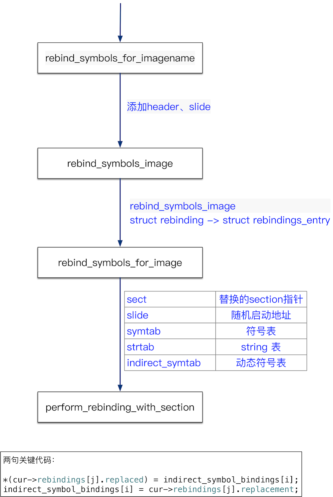
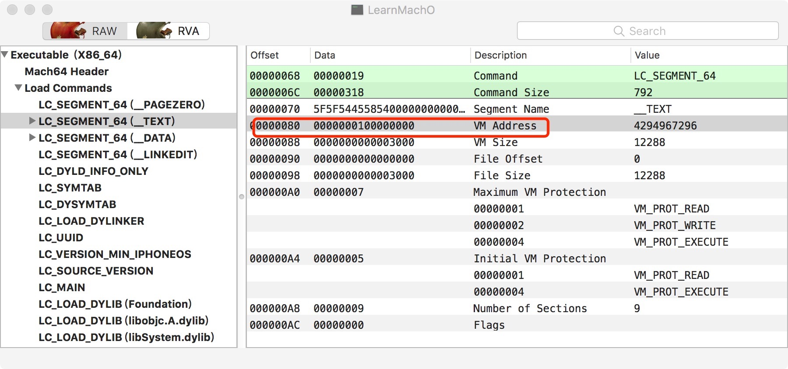
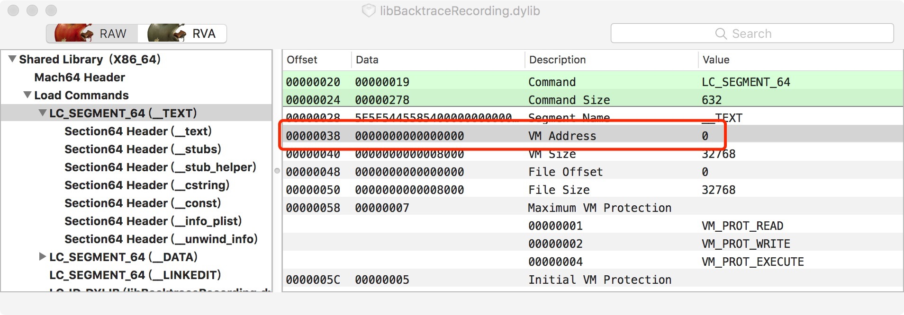

[fishhook](https://github.com/facebook/fishhook)是一个可以替换C函数的开源库，官网的readme讲解了重新绑定的原理。本文从源码的角度去学习fishhook。

<!--more-->


## 源码示意图

先给个简单的源码示意图。循序渐进理解啊。直接上源码有点懵，几个函数名称太相似了。不过呢，看图，好像就四个函数、247行代码而已。



## 源码解读

源码使用OOMDetector，OOMDetector使用fishhook替换malloc函数。使用OOMDetector的目的是顺便可以学习fishhook api的调用方式，同时也能学习fishhook源码。

首先，fishhook定义了一个结构体，存储绑定的数据。定义如下：

```
struct rebinding {
  const char *name;  //替换的函数名字
  void *replacement; //替换后的函数指针
  void **replaced;   //原始的方法
};
```

下面的替换malloc等函数的入口函数，该函数调用了fishhook的`rebind_symbols_for_imagename`函数。

```
void hookMalloc()
{
    if(!isPaused){
        beSureAllRebindingFuncBeenCalled();
        
        orig_malloc = malloc;
        orig_calloc = calloc;
        orig_valloc = valloc;
        orig_realloc = realloc;
        orig_block_copy = _Block_copy;
        
        rebind_symbols_for_imagename(
                                     (struct rebinding[5]){
                                         {"realloc",(void*)new_realloc,(void**)&orig_realloc},
                                         {"malloc", (void*)new_malloc, (void **)&orig_malloc},
                                         {"valloc",(void*)new_valloc,(void**)&orig_valloc},
                                         {"calloc",(void*)new_calloc,(void**)&orig_calloc},
                                         {"_Block_copy",(void*)new_block_copy,(void**)&orig_block_copy}},
                                     5,
                                     getImagename());
        
    }
    else{
        isPaused = false;
    }

}
```
`hookMalloc`替换了`realloc`、`malloc`、`valloc`、`calloc`、`_Block_copy`这几个函数。

下面是新的`new_malloc`函数定义：

```
void *new_malloc(size_t size)
{
    void *ptr = orig_malloc(size);
    if(!isPaused){
        global_leakChecker->recordMallocStack((vm_address_t)ptr, (uint32_t)size,"malloc",2);
    }
#ifdef __enable_malloc_logger__
    malloc_printf("malloc ptr:%p size:%lu thread:%lu\n",ptr, size,mach_thread_self());
#endif
    return ptr;
}
```

`new_malloc`函数首先会调用原来的`malloc`函数，接着会记录申请的内存的堆栈。

下面是原始函数的定义：

```
static void* (*orig_malloc)(size_t);
static void* (*orig_calloc)(size_t, size_t);
static void* (*orig_realloc)(void *, size_t);
static void* (*orig_valloc)(size_t);
static void* (*orig_block_copy)(const void *aBlock);
```


下面是rebind_symbols_for_imagename第三个入参————镜像名称的获取方式：

```
const char *getImagename(void)
{
    const char* name = _dyld_get_image_name(0);
    const char* tmp = strrchr(name, '/');
    if (tmp) {
        name = tmp + 1;
    }
    return name;
}
```
调用了`<mach-o/dyld.h>` 头文件中的`_dyld_get_image_name`函数。 `_dyld_get_image_name` 根据镜像的索引，获取镜像的名称。`strrchr`函数是反向查找第一个给定字符。返回第一次匹配到的地址指针。

下面代码进入fishhook的入口函数`rebind_symbols_for_imagename`。

```
void rebind_symbols_for_imagename(struct rebinding rebindings[],
                                  size_t rebindings_nel,
                                  const char *imagename)
{
    uint32_t count = _dyld_image_count();
    for (uint32_t i = 0; i < count; i++) {
        const mach_header_t* header = (const mach_header_t*)_dyld_get_image_header(i);
        const char* name = _dyld_get_image_name(i);
        const char* tmp = strrchr(name, '/');
        long slide = _dyld_get_image_vmaddr_slide(i);
        if (tmp) {
            name = tmp + 1;
        }
        if(strcmp(name,imagename) == 0){
            rebind_symbols_image((void *)header,
                                 slide,
                                 rebindings,
                                 rebindings_nel);
            break;
        }
    }
}
```
`rebindings`承载重新绑定的所有信息，`rebindings_nel`是`rebindings`的个数，`imagename`要替换函数指针镜像名称，也就是只替换名称为`imagename`文件中的函数指针，其他库不做替换。

`_dyld_get_image_header` 获取镜像的header头，`_dyld_get_image_vmaddr_slide`获取镜像的随机启动地址。`rebind_symbols_for_imagename`函数为重新绑定做准备，增加了两个参数，header、slide。header就是加载到内存的中二进制文件的头。slide 的是ALSR技术中的随机启动地址。这个地址的含义可以参考[iOS crash reports: atos not working as expected](https://stackoverflow.com/questions/13574933/ios-crash-reports-atos-not-working-as-expected/13576028#13576028)、<font color=red> [iOS crash log 解析 symbol address = stack address - slide 运行时获取slide的api 利用dwarfdump从dsym文件中得到symbol](https://www.cnblogs.com/feng9exe/p/7988360.html)</font> 。

下面为了理解ALSR中的slide，贴出一段测试代码：

```
void understandALSR()
{
    ///枚举所有镜像
    for (int i = 0; i < _dyld_image_count(); i++)
    {
        char *image_name = (char *)_dyld_get_image_name(i);
        const struct mach_header *mh = _dyld_get_image_header(i);
        intptr_t vmaddr_slide = _dyld_get_image_vmaddr_slide(i);
        
        printf("Image name %s ,image header 0x%llx , ASLR slide 0x%lx.\n",
               image_name, (mach_vm_address_t)mh, vmaddr_slide);
    }
}
```

输出如下：

```
Image name /Users/lijian/Library/Developer/CoreSimulator/Devices/21045765-7E1F-499B-A985-1BCCFC70B079/data/Containers/Bundle/Application/0975D79D-5079-4258-8A0F-48175818A28A/LearnMachO.app/LearnMachO ,image header 0x10dff0000 , ASLR slide 0xdff0000.
Image name /Applications/Xcode.app/Contents/Developer/Platforms/iPhoneOS.platform/Developer/Library/CoreSimulator/Profiles/Runtimes/iOS.simruntime/Contents/Resources/RuntimeRoot/usr/lib/libBacktraceRecording.dylib ,image header 0x10e07c000 , ASLR slide 0x10e07c000.
Image name /Applications/Xcode.app/Contents/Developer/Platforms/iPhoneOS.platform/Developer/Library/CoreSimulator/Profiles/Runtimes/iOS.simruntime/Contents/Resources/RuntimeRoot/usr/lib/libMainThreadChecker.dylib ,image header 0x10e08b000 , ASLR slide 0x10e08b000.
Image name /Applications/Xcode.app/Contents/Developer/Platforms/iPhoneOS.platform/Developer/Library/CoreSimulator/Profiles/Runtimes/iOS.simruntime/Contents/Resources/RuntimeRoot/Developer/Library/PrivateFrameworks/DTDDISupport.framework/libViewDebuggerSupport.dylib ,image header 0x10e27d000 , ASLR slide 0x10e27d000.
```
代码对应的二进制文件中的加载地址（链接时load address）示意图：


结合上面的示例代码和二进制内容图片，可以诠释下面的公式：

```
slide = (运行时)load address - (链接时)load address;
symble address ＝ stack address －slide；
```
其中：

1. stack address ： 程序运行时线程栈中 所有 函数调用的地址
2. symble address ： dsym文件中函数符号对应的地址，用此地址在dsym 文件中可以查出对应的符号信息。 

可以看出，没有ASLR时：

```
symble address =  stack address
```

好了，接着看`rebind_symbols_image`函数：

```
int rebind_symbols_image(void *header,
                         intptr_t slide,
                         struct rebinding rebindings[],
                         size_t rebindings_nel) {
    struct rebindings_entry *rebindings_head = NULL;
    int retval = prepend_rebindings(&rebindings_head, rebindings, rebindings_nel);
    rebind_symbols_for_image(rebindings_head, header, slide);
    free(rebindings_head);
    return retval;
}
```

`rebind_symbols_image` 主要工作是通过`prepend_rebindings`构造绑定的结构体`struct rebindings_entry`，定义如下：

```
struct rebindings_entry {
  struct rebinding *rebindings;
  size_t rebindings_nel;
  struct rebindings_entry *next;
};
```

```
static int prepend_rebindings(struct rebindings_entry **rebindings_head,
                              struct rebinding rebindings[],
                              size_t nel) 
{
  ///申请new_entry地址                  
  struct rebindings_entry *new_entry = malloc(sizeof(struct rebindings_entry));
  if (!new_entry) {
    return -1;
  }
  
  ///给new_entry->rebindings分配内存
  new_entry->rebindings = malloc(sizeof(struct rebinding) * nel);
  if (!new_entry->rebindings) {
    free(new_entry);
    return -1;
  }
  
  ///拷贝重新绑定信息到new_entry->rebindings
  memcpy(new_entry->rebindings, rebindings, sizeof(struct rebinding) * nel);
  new_entry->rebindings_nel = nel;
  new_entry->next = *rebindings_head;
  
  ///这个将创建的new_entry赋值给rebindings_head，通过二级指针返回给调用者
  *rebindings_head = new_entry;
  return 0;
}
```
prepend_rebindings 只是将绑定的struct rebinding类型参数转化为struct rebindings_entry结构，这种结构类似链表，可以方便的管理多个struct rebinding结构。下面看rebind_symbols_for_image：

```
static void rebind_symbols_for_image(struct rebindings_entry *rebindings,
                                     const struct mach_header *header,
                                     intptr_t slide) {
  Dl_info info;
  ///find the image containing a given address
  ///验证库是否存在
  if (dladdr(header, &info) == 0) {
    return;
  }

  segment_command_t *cur_seg_cmd;
  
 ///SEG_LINKEDIT commond指针
  segment_command_t *linkedit_segment = NULL;
  ///LC_SYMTAB commond指针
  struct symtab_command* symtab_cmd = NULL;
  ///LC_DYSYMTAB commond指针
  struct dysymtab_command* dysymtab_cmd = NULL;
	
	///定位linkedit_segment、symtab_cmd、dysymtab_cmd三指针
  uintptr_t cur = (uintptr_t)header + sizeof(mach_header_t);
  for (uint i = 0; i < header->ncmds; i++, cur += cur_seg_cmd->cmdsize)
  {
    cur_seg_cmd = (segment_command_t *)cur;
    if (cur_seg_cmd->cmd == LC_SEGMENT_ARCH_DEPENDENT)
    {
      if (strcmp(cur_seg_cmd->segname, SEG_LINKEDIT) == 0)
      {
        linkedit_segment = cur_seg_cmd;
      }
    }
    else if (cur_seg_cmd->cmd == LC_SYMTAB)
    {
      symtab_cmd = (struct symtab_command*)cur_seg_cmd;
    }
    else if (cur_seg_cmd->cmd == LC_DYSYMTAB)
    {
      dysymtab_cmd = (struct dysymtab_command*)cur_seg_cmd;
    }
  }

  if (!symtab_cmd || !dysymtab_cmd || !linkedit_segment ||
      !dysymtab_cmd->nindirectsyms) {
    return;
  }

  // Find base symbol/string table addresses 查找符号表和string表
  uintptr_t linkedit_base = (uintptr_t)slide + linkedit_segment->vmaddr - linkedit_segment->fileoff;
  nlist_t *symtab = (nlist_t *)(linkedit_base + symtab_cmd->symoff);
  char *strtab = (char *)(linkedit_base + symtab_cmd->stroff);

  // Get indirect symbol table (array of uint32_t indices into symbol table)
  uint32_t *indirect_symtab = (uint32_t *)(linkedit_base + dysymtab_cmd->indirectsymoff);

  cur = (uintptr_t)header + sizeof(mach_header_t);
  
  for (uint i = 0; i < header->ncmds; i++, cur += cur_seg_cmd->cmdsize) 
  {
    cur_seg_cmd = (segment_command_t *)cur;
    if (cur_seg_cmd->cmd == LC_SEGMENT_ARCH_DEPENDENT)
    {
      if (strcmp(cur_seg_cmd->segname, SEG_DATA) != 0 &&
          strcmp(cur_seg_cmd->segname, SEG_DATA_CONST) != 0) {
        continue;
      }
      //找到类型为S_LAZY_SYMBOL_POINTERS、S_NON_LAZY_SYMBOL_POINTERS类型的section
      for (uint j = 0; j < cur_seg_cmd->nsects; j++) {
        section_t *sect =
          (section_t *)(cur + sizeof(segment_command_t)) + j;
        if ((sect->flags & SECTION_TYPE) == S_LAZY_SYMBOL_POINTERS) {
          perform_rebinding_with_section(rebindings, sect, slide, symtab, strtab, indirect_symtab);
        }
        if ((sect->flags & SECTION_TYPE) == S_NON_LAZY_SYMBOL_POINTERS) {
          perform_rebinding_with_section(rebindings, sect, slide, symtab, strtab, indirect_symtab);
        }
      }
    }
  }
}
```
`rebind_symbols_for_image` 函数主要定位到三表、类型为`S_LAZY_SYMBOL_POINTERS`、`S_NON_LAZY_SYMBOL_POINTERS`类型的section。然后调用`perform_rebinding_with_section` 函数。其中部分宏定义如下。

```
#define LC_SEGMENT_ARCH_DEPENDENT LC_SEGMENT_64
#define	SEG_LINKEDIT	"__LINKEDIT"
#define	S_NON_LAZY_SYMBOL_POINTERS 0x6  /* section with only non-lazy symbol pointers */
#define	S_LAZY_SYMBOL_POINTERS 0x7     /* section with only lazy symbol
```

上面的宏定义于`<mach-o/loader.h>`文件中，位于458行。<font color=red> 在S_NON_LAZY_SYMBOL_POINTERS宏的上面有一段注释。这段注释非常的关键。说明了S_NON_LAZY_SYMBOL_POINTERS类型的section中的数据和动态符号表中的符号是顺序对应的。只有理解了这段内容。才能真正的理解fishhook。</font>

For the two types of symbol pointers sections and the symbol stubs section they have indirect symbol table entries. 

对于存储符号指针、符号存根两种类型的section，它们有间接符号表条目。 
 
For each of the entries in the section,the indirect symbol table entries, in corresponding order in the indirect symbol table, start at the index stored in the reserved1 field of the section structure. 

间接符号表条目顺序对应section中的条目，对应从section的reserved1索引开始。


Since the indirect symbol table entries correspond to the entries in the section the number of indirect symbol table entries is inferred from the size of the section divided by the size of the entries in the section. For symbol pointers sections the size of the entries  in the section is 4 bytes (看结构是8bytes，可能是64位的缘故)

由于间接符号表条目对应于section中的条目，因此间接符号表条目的数量由section的大小除以section中的条目的大小来推断。对于符号指针节，section中的条目的大小是4个字节


下面是`perform_rebinding_with_section`函数源码：

```
static void perform_rebinding_with_section(struct rebindings_entry *rebindings,
                                           section_t *section,  //section
                                           intptr_t slide,     //基址
                                           nlist_t *symtab,  //符号表
                                           char *strtab,  //sting 表
                                           uint32_t *indirect_symtab //动态符号表
                                           )
{
    ///动态符号表 对应section的地址，动态符号表的基地址+section对应的偏移量
    uint32_t *indirect_symbol_indices = indirect_symtab + section->reserved1;

    ///section加载到内存的虚拟地址（是要替换这里面的东西）
    void **indirect_symbol_bindings = (void **)((uintptr_t)slide + section->addr);
    
    ///section中替换函数指针
    for (uint i = 0; i < section->size / sizeof(void *); i++)
    {
        //由于section中条目和动态符号表中的条目对应，所以将section中的条目索引i用于动态符号表。
        ///下面目的是获取section中存储的函数指针的符号  动态符号表-> 符号表-> string表
        
        //indirect_symbol_indices[i]中存储符号表的索引。symtab_index就是符号表的索引
        uint32_t symtab_index = indirect_symbol_indices[i];
        if (symtab_index == INDIRECT_SYMBOL_ABS || symtab_index == INDIRECT_SYMBOL_LOCAL ||
            symtab_index == (INDIRECT_SYMBOL_LOCAL   | INDIRECT_SYMBOL_ABS))
        {
            continue;
        }
        ///通过nlist_t的n_strx找到String表的偏移地址，strtab_offset。
        uint32_t strtab_offset = symtab[symtab_index].n_un.n_strx;
        char *symbol_name = strtab + strtab_offset;
        if (strnlen(symbol_name, 2) < 2)
        {
            continue;
        }
        
        ///依次枚举struct rebindings_entry 结构，判断时候有和当前函数指针相等的带替换的函数。
        struct rebindings_entry *cur = rebindings;
        while (cur)
        {
            for (uint j = 0; j < cur->rebindings_nel; j++)
            {
                ///如果符号名称和替换的名称一样，进行替换
                if (strcmp(&symbol_name[1], cur->rebindings[j].name) == 0)
                {
                    if (cur->rebindings[j].replaced != NULL &&
                      indirect_symbol_bindings[i] != cur->rebindings[j].replacement)
                    {
                        ///保存原始的指针地址，只保存一次
                        *(cur->rebindings[j].replaced) = indirect_symbol_bindings[i];
                    }
                    ///在section中替换。将indirect_symbol_bindings[i]中存储的函数指针地址进行替换。   
                    indirect_symbol_bindings[i] = cur->rebindings[j].replacement;
                    goto symbol_loop;
                }
            }
            cur = cur->next;
        }
        symbol_loop:;
    }
}
```

perform_rebinding_with_section函数完成替换的关键函数。 将section中的函数指针替换为新的函数指针。

## 参考 

[Fishhook替换C函数的原理](https://blog.csdn.net/Hello_Hwc/article/details/78444203?locationNum=3&fps=1)