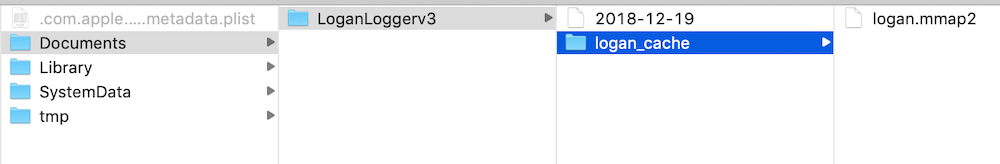
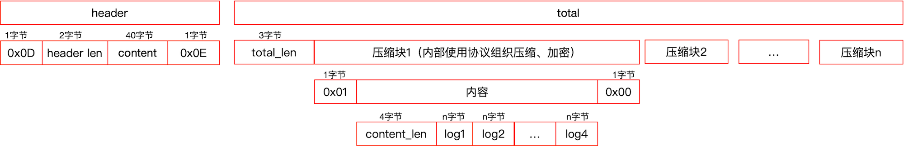
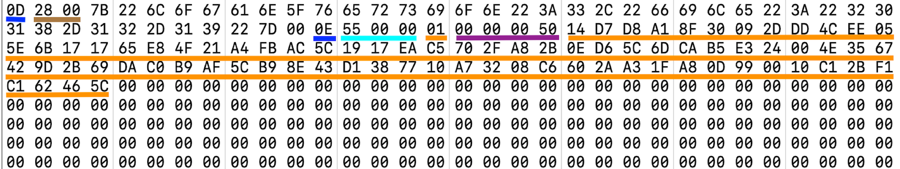
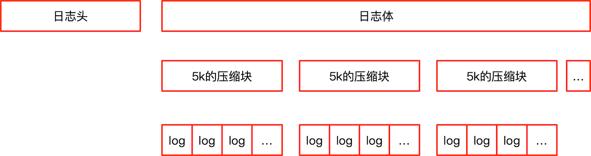
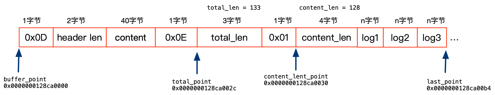
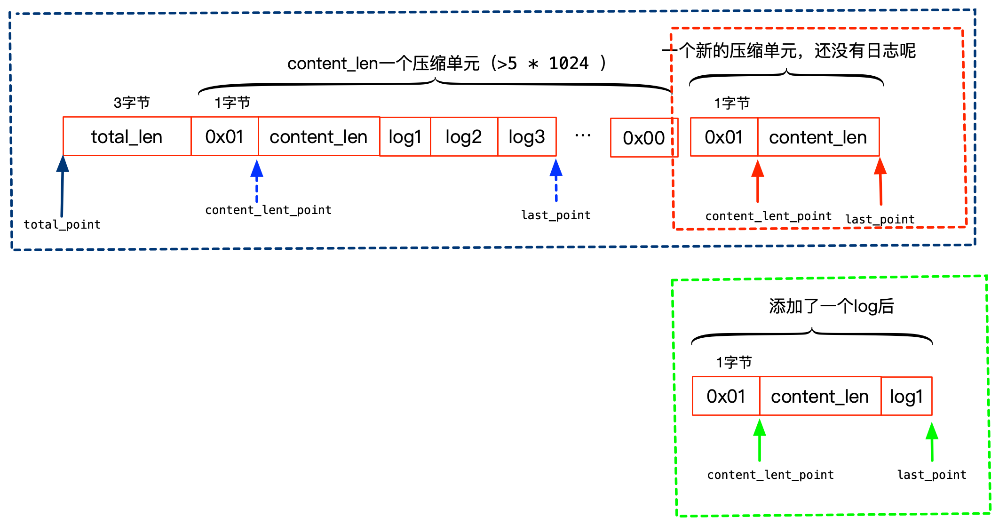
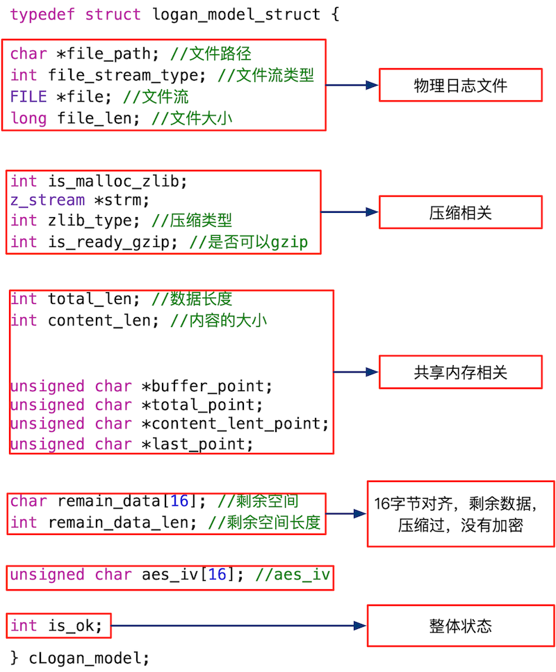
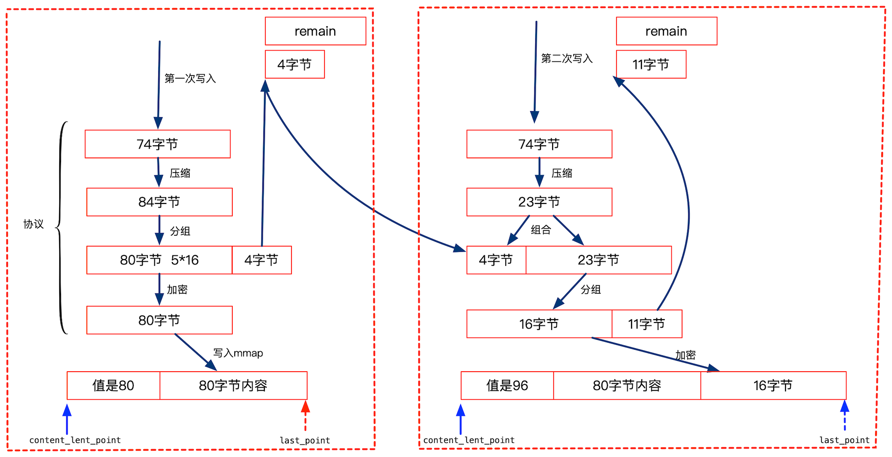
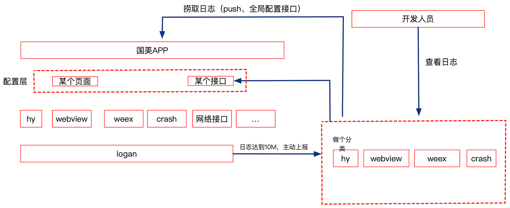

本文旨在通过logan源码，分析logan的整体结构、存储结构、内部的数据结构、主要的C接口、优点、存在的问题。

<!--more-->

> mmap 其实主要作用就是多个进程共享内存，所以本文有时候将mmap叫做共享内存
> 

## 基本使用方法


```
///初始化
NSData *keydata = [@"0123456789012345" dataUsingEncoding:NSUTF8StringEncoding];
NSData *ivdata = [@"0123456789012345" dataUsingEncoding:NSUTF8StringEncoding];
uint64_t file_max = 10 * 1024 * 1024;
loganInit(keydata, ivdata, file_max);

/// 写入日志
NSString *strLog = @"日志";
logan(LoganTypeAction, strLog);
```

使用方法非常简单 loganInit 初始化logan系统，logan 写入日志。

##  整体结构


我相信，对应任何一个三方库，你如果想了解它，第一个想知道的问题是：这个库的整体结构是什么结构？

下面来解密logan整体结构：


就画了一个非常简单的图，但是我觉得能将logan整个日志存储的机制表达出来了。

1. 当程序有日志(命名为data) 需要写入的时候，我们将data做系列处理：格式化(附加上线程、时间等有用的信息)、 压缩、DES加密、 最后追加到mmap中。
2. mmap 据说能提高写日志的效率，防止丢失，  mmap中，如果日志达到了5K，就构成一个压缩单元，如果有后续的日志，就新开始一个压缩单元。
3. 当mmap中的日志超过容量(初始指定10M)的1/3就写入日志文件中。
4. 当日志文件满了，不知道怎么处理了，上传，还是上传？  logan没实现！！！！


下面贴出了logan本地文件的结构



1. 2018-12-19 是日志文件。
2. logan.mmap2是共享内存的映射文件。


## logan本质--存储结构

如果你通过上节，了解了logan的整体结构，有没有它的感觉设计也很平凡？那么你现在有没有好奇logan到底哪里出色？值得美团去开源它？

我觉得核心的就是大量日志的组织结构，也就是如何高效的将大量日志组织在本地存储，你也可以想想。如果自己做，怎么组织？

logan用简单的方式实现了海量日志的本地存储，本质是自己设计了一套日志存储格式，它就是logan的本质，理解了本质，就理解了logan。

通过查阅源码，整理的日志格式如下 ：



> 图的阅读方式：下面部分是对上面部分的展开。分为两部分，日志头、日志体（图中左右两部分）。

### 日志头 

日志头以0x0D标志位表示header开始，紧接着用两个字节表示头内容的长度、接着是头内容、最后用0x0E标志位表示header结束。

头内容数据如下：

```
{
    "logan_version":3,
    "file":"2018-12-19"
}
```

logan_version 表示logan的版本，file字段存储日志文件的文件名。 也就是你如果拿到了共享内存，就能通过读取头信息，将共享内存中的数据写入到file表示的日志文件中。

### 日志体

日志体由长度(total_len，占用三字节、小端模式存储)、协议组成。

协议由协议起始标志位(1字节、值为0x01)、内容、协议结束标志位(1字节、值为0x00)。我自己理解，所谓协议就是一个压缩单元，超过5K开始下一个压缩单元。

内容由内容长度(4字节，大端模式存储)、各个log组成。

### 先睹为快、窥探日志数据

如果看懂了上节内容，你有没有想窥探下logan内存结构的欲望？



1. 0x0D  头起始标志  
2. 0x0028  = 40  头长度
3. 0x7B ~0x7D00  头内容
4. 0x0E  头结束标志
5. ---这里是分割线， 表示头结束，下面是日志体---
6. 0x000055  tatal_len 日志体总长度
7. 0x01 协议起始标志位
8. 0x00000050 内容长度
9. 0x14D7~0x465C  多个压缩加密后的日志    
10. 0x00  协议结束标志位

看了logan日志存储格式，我自己总结了下，其实就是一个三级结构：



你可以回头想想，所有的字段都服务于这个三级结构，如果你按照三级结构的思路理解，这里就没有多余的信息。 

> 我首次看，就觉得怎么这么多len信息，是否是多余的呢。

## 日志追加机制


### 追加机制

下面我们就可以进一步深入logan日志增加的机制了，其实，追加日志主要靠四个指针就完成了。



说明下这四个指针的作用：

1. buffer_point 标记mmap的起始地址，基本固定不变。
2. total_point日志体的起始位置指针 ，这个指针目的是当有新日志添加的时候，更新total_point后面的total_len属性。位置也不变化。
3. content_lent_point内容起始位置指针，一个压缩单元完事后，前进一次。它的主要作用是，当增加log后，更新后面的content_len的内容。其实就是指向上面三级结构中的第二级结构
4. last_point 添加日志起始指针 ,每次新的日志都追加到last_point处，追加完后，更新last_point为下一个追加位置。 


上面多次提到了压缩单元，我们用下面的图说明下压缩单元递增的思路：




上面是一个压缩单元完成后，开始新压缩单元的示意图。我们可以观察content_lent_point、last_point两个指针移动的情况。(箭头从 蓝色-> 蓝色-> 绿色 的变化过程)

### 关键节点 

通过上面我们了解了三个基本的关键节点：

1. 5k  一个压缩单元的大小
	```
	LOGAN_MAX_GZIP_UTIL 5 * 1024 //压缩单元的大小
	```
2. 容量(初始指定10M)的1/3  写文件的节点

	```
	LOGAN_WRITEPROTOCOL_DEVIDE_VALUE 3 //多少分之一写入
	buffer_length / LOGAN_WRITEPROTOCOL_DEVIDE_VALUE
	```
3. 10M 日志文件总大小

	```
	uint64_t file_max = 10 * 1024 * 1024
	```
	
### 小结 

感觉也不是很复杂，就是用四个指针标记修改的位置，有新的日志来了，就追加到last_point处。

##  核心数据结构


logan的结构、存储本质、追加日志机制都讲完了，接着看看代码是怎么实现的。logan用一个全局的数据结构管理所有的数据，这个数据结构定义如下 ：


```
typedef struct logan_model_struct {
    int total_len; //数据长度
    char *file_path; //文件路径

    int is_malloc_zlib;
    z_stream *strm;
    int zlib_type; //压缩类型
    char remain_data[16]; //剩余空间
    int remain_data_len; //剩余空间长度

    int is_ready_gzip; //是否可以gzip

    int file_stream_type; //文件流类型
    FILE *file; //文件流

    long file_len; //文件大小

    unsigned char *buffer_point; //缓存的指针 (不变)
    unsigned char *last_point; //最后写入位置的指针
    unsigned char *total_point; //总数的指针 (可能变) , 给c看,低字节
    unsigned char *content_lent_point;//协议内容长度指针 , 给java看,高字节
    int content_len; //内容的大小

    unsigned char aes_iv[16]; //aes_iv
    int is_ok;

} cLogan_model;
```

感觉定义的很乱，我整理了下 ：



1. 日志文件相关的：有日志文件的路径file_path、文件流状态file_stream_type、文件流file、文件内容的大小file_len。其中文件流状态file_stream_type可选的取值：

	```
	#define LOGAN_FILE_NONE 0
    #define LOGAN_FILE_OPEN 1
    #define LOGAN_FILE_CLOSE 2
	```
2. 压缩相关的： is_malloc_zlib 表示strm是否申请空间 ,zlib_type 压缩状态，is_ready_gzip压缩是否准备好。 zlib_type可以的取值如下：

	```
    #define LOGAN_ZLIB_NONE 0
    #define LOGAN_ZLIB_INIT 1
    #define LOGAN_ZLIB_ING  2
    #define LOGAN_ZLIB_END  3
    #define LOGAN_ZLIB_FAIL 4
  ```
3. mmap操作相关的，记录日志的长度信息、四个指针的信息。
4. 下面是加密相关的，DES加密是16字节为一个单元，如果日志压缩后，长度取余，不足16字节的内容就不参与加密了，等着下次日志，一起加密。所以remain_data、remain_data_len表示剩下的未加密的压缩过的日志数据。aes_iv 表示DES加密的初始向量。
5. is_ok 表示整个logan是否是正常状态。

我将上面的数据分类主要的5类，到了哪一步，关注哪一步就ok了。分类后，就很好理解了。


## 核心接口

下面我列举了logan C语言层的4个核心接口：

```
int clogan_init(const char *cache_dirs, const char *path_dirs, int max_file, const char *encrypt_key16, const char *encrypt_iv16)

int clogan_open(const char *pathname)

int clogan_write(int flag, char *log, long long local_time, char *thread_name, long long thread_id,int is_main)
             
int clogan_flush(void)
```

下面一一讲解下，所有的代码都是缩减代码。方便理解函数完成的主体工作。

### clogan_init 

clogan_init 主要功能是：

1. 打开映射内存
2. 如果存在上次程序结束后没有写入文件的日志，将上次日志写入到文件中。使本次以一个干净的环境开始。


```
int
clogan_init(const char *cache_dirs, const char *path_dirs, int max_file, const char *encrypt_key16,
            const char *encrypt_iv16) {

    ///保存秘钥、初始向量
    aes_init_key_iv(encrypt_key16, encrypt_iv16);

    /// 构建内存映射文件路径
    char *cache_path = malloc(total);
    if (NULL != cache_path) {
        _mmap_file_path = cache_path;
    }

    /// 构建日志目录
    if (NULL != dirs) {
        _dir_path = dirs; //日志写入的文件目录
    } 
    
    /// 打开内存映射
    if (NULL == _logan_buffer) {
        if (NULL == _cache_buffer_buffer) {
            flag = open_mmap_file_clogan(cache_path, &_logan_buffer, &_cache_buffer_buffer);
        } 

   
    ///读取内存映射中的日志，写入到文件中，准备开始一个干净的日志环境。
    if (is_init_ok) {
        if (flag == LOGAN_MMAP_MMAP) //MMAP的缓存模式,从缓存的MMAP中读取数据
            read_mmap_data_clogan(_dir_path);
    } 
}
```

### clogan_open 

clogan_open 主要工作是：

1. 初始化zlib
2. 初始化加密模块
3. 初始化全局数据logan_model

代码如下：

```
int clogan_open(const char *pathname) {

    is_open_ok = 0;
    
    ///全局的logan_model 初始化
    if (NULL != logan_model) { //回写到日志中
     
    } 
    else 
    {
        logan_model = malloc(sizeof(cLogan_model));
        if (NULL != logan_model) {
            memset(logan_model, 0, sizeof(cLogan_model));
        } 
    }
    logan_model->file_path = temp_file;
    logan_model->buffer_point = _logan_buffer;


    /// zlib 的初始化
    init_zlib_clogan(logan_model)
    
   ///添加头信息
   add_mmap_header_clogan(back_data, logan_model);

    logan_model->last_point = logan_model->total_point + LOGAN_MMAP_TOTALLEN;
    logan_model->total_point = _logan_buffer;
    logan_model->total_len = 0;
    logan_model->last_point = logan_model->total_point + LOGAN_MMAP_TOTALLEN;
    
    ///设置关键指针信息，长度信息
    restore_last_position_clogan(logan_model);
    
    /// 加密信息初始化
    init_encrypt_key_clogan(logan_model);
    logan_model->is_ok = 1;
    
    if (is_open_ok) {
        back = CLOGAN_OPEN_SUCCESS;
    } 
    return back;
}
```

clogan_open 主要完成：初始化全局的logan_model、init_zlib_clogan、init_encrypt_key_clogan 三个工作。

### clogan_write

#### 代码
clogan_write 顾名思义，就是写入日志，这里用简单的树形结构描述它的过程。

```
├── clogan_write
│   └── clogan_write_section分片写入
│       └── clogan_write2
│           ├── 1. clogan_zlib_compress
│           │   └── clogan_zlib
│           │       ├── aes_encrypt_clogan
│           │       └── deflate
│           ├── 2. update_length_clogan(logan_model);///写完日志，更新长度信息
│           ├── 3. 如果一个压缩单元完事，结束这个压缩单元
│           │   ├── clogan_zlib_end_compress(logan_model)
│           │   ├── aes_encrypt_clogan 加密剩余部分
│           │   └── update_length_clogan(logan_model)
│           ├── 4. 如果mmap的大小大于总容量的1/3
│           │   └── write_flush_clogan();写入文件
│           └── 5. 如果一个单元完事，还要做下面工作，开始下一个压缩单元
│               ├── init_encrypt_key_clogan(logan_model)
│               ├── init_zlib_clogan(logan_model)
│               ├── logan_model->content_len = 0
│               ├── logan_model->remain_data_len = 0
│               └── restore_last_position_clogan(logan_model)
```

#### 协议分析



### clogan_flush

clogan_flush 将mmap中的日志强制写入到文件中。


```
int clogan_flush(void) {
    write_flush_clogan();
}
```

clogan_flush 调用了write_flush_clogan。

```
void write_flush_clogan() 
{
    if (logan_model->total_len > LOGAN_WRITEPROTOCOL_HEAER_LENGTH) {
        unsigned char *point = logan_model->total_point;
        point += LOGAN_MMAP_TOTALLEN;
        write_dest_clogan(point, sizeof(char), logan_model->total_len, logan_model);
        clear_clogan(logan_model);
    }
}
```
write_flush_clogan调用write_dest_clogan将mmap中的数据写入到文件中，同时调用clear_clogan清空全局数据logan_model的状态。

```
//文件写入磁盘、更新文件大小
void write_dest_clogan(void *point, size_t size, size_t length, cLogan_model *loganModel) 
{
    fwrite(point, sizeof(char), logan_model->total_len, logan_model->file);//写入到文件中
    fflush(logan_model->file);
    loganModel->file_len += loganModel->total_len; //修改文件大小
}
```

## 优点 

美团的[Logan：美团点评移动端基础日志库揭秘](https://mp.weixin.qq.com/s/ojUZjT4YhUWZ3jh37UtJmg)说，有下面的缺点：

1. 卡顿，影响性能
2. 日志丢失
3. 安全性
4. 日志分散

我看了logan的源码，logan确实解决了上面的问题，反过来，logan有下面的优点：

1. 不卡顿，性能好
2. 日志不丢失
3. 安全
4. 日志集中


## 目前存在的问题  

logan主要实现了日志的本地存储功能，考虑的很多边界情况，我觉得应该可以使用，但是还存在下面的问题 ：

1. 没有日志回捞功能(没有开源，这个工作主要在服务端，客户端也没发现对应的接口)
2. 没有主动上报功能(主动上报有简单的实现，这个应该也归结为使用者的功能吧)
3. 日志大于10M的情况没有处理，需要自己完善。


没有写的证据在这里：

```
if (is_file_exist_clogan(logan_model->file_path)) 
{
    if (logan_model->file_len > max_file_len) {
        printf_clogan("clogan_write > beyond max file , cant write log\n");
        back = CLOAGN_WRITE_FAIL_MAXFILE;
        return back;
    }
}
```

如果文件的大小超过了10M，直接返回了 ，不在写入日志。


## 胡思乱想

  

## 参考 

1. [Logan：美团点评移动端基础日志库揭秘](https://mp.weixin.qq.com/s/ojUZjT4YhUWZ3jh37UtJmg)