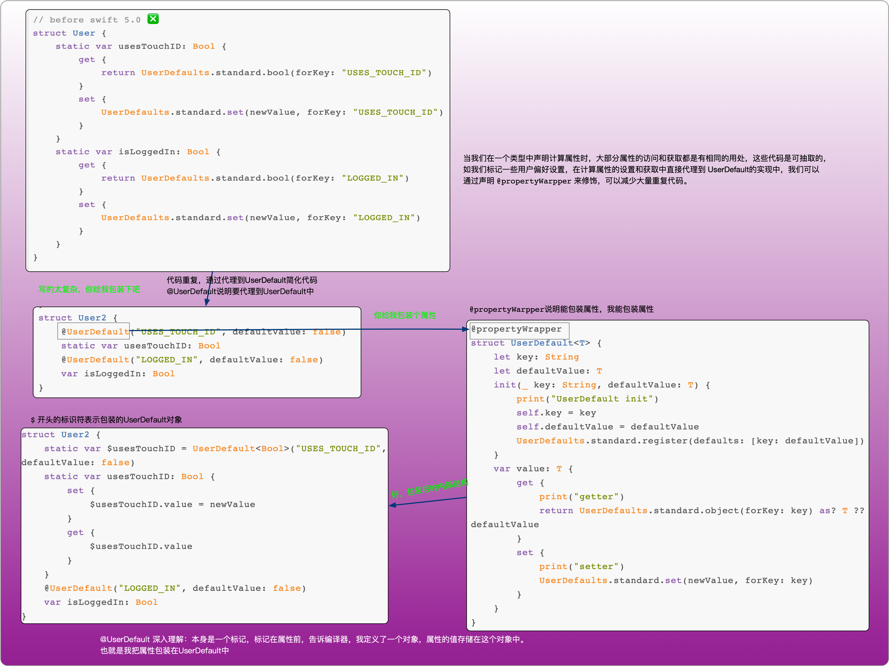
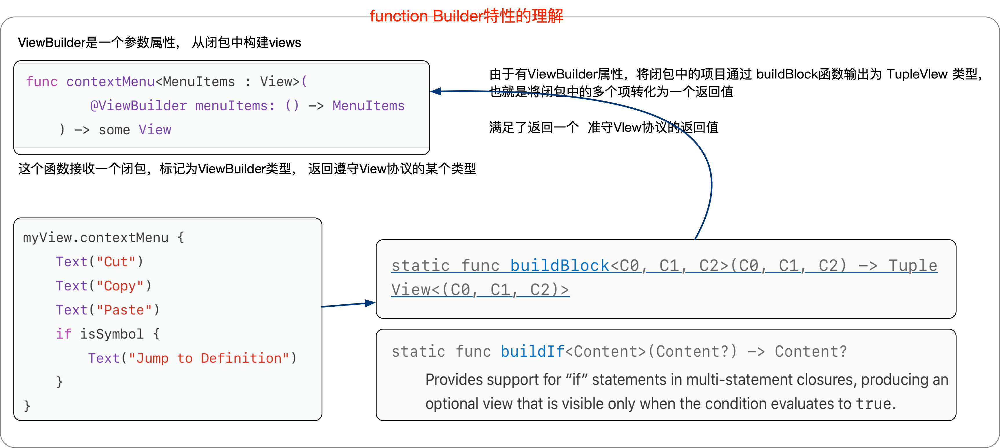
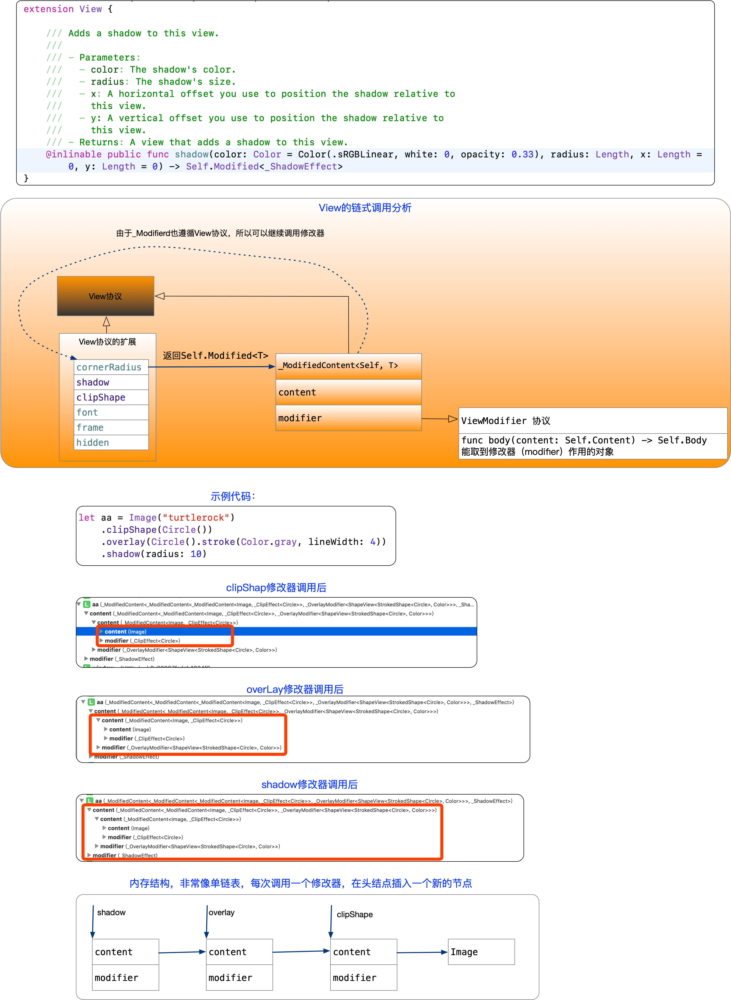

本文按照自己的思路理解swift的新特性

<!--more-->


## function Builder  新特性


## 单表达式隐式返回

计算属性、函数语句、闭包表达式，如果只有一个表达式，可以省略return关键字

```
struct Rectangle {
    var width = 0.0, height = 0.0
    var area1: Double { width * height }
    
    func area2() -> Double { width * height }
}
```

## 根据结构体默认成员合成默认初始化器

```
struct Dog {
    var name = "Generic dog name"
    var age = 0
}
let boltNewborn = Dog()
let daisyNewborn = Dog(name: "Daisy", age: 0)
// before swift 5.0 ❎
let benjiNewborn = Dog(name: "Benji")
// after switft 5.1 ✅
let benjiNewborn = Dog(name: "Benji")
```

## 属性包装器



## 不透明返回类型

协议中有关联类型，不是一个完全类型，编译时，无法推断类型，使用some 修饰协议返回值，就是不透明返回类型，使用者不知道类型， 编译器知道具体的类型。

```
// after switft 5.1 ✅
struct ContentView: View {
    var body: some View {
        Text("")
    }
}
```
## Swift Style DSL / Function Builder



## 值类型和引用类型

优先使用值类型，在栈上分配，COW 

## 协议还是泛型

使用协议时，尽量优先抽取功能，使用组合协议

## 抽象数据访问

@Binding @State @EnviromentObject @Enviroment。

## View链式调用的理解



## 参考 

1. [官方教程](https://developer.apple.com/tutorials/swiftui/building-lists-and-navigation)
2. [SwiftUI 的一些初步探索 (一)](https://onevcat.com/2019/06/swift-ui-firstlook/)
3. [系列文章深度解读|SwiftUI 背后那些事儿](https://mp.weixin.qq.com/s/ciiauLB__o-cXXfKn7lL1Q)
