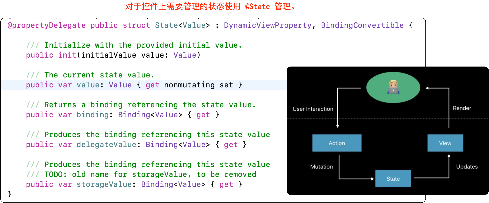
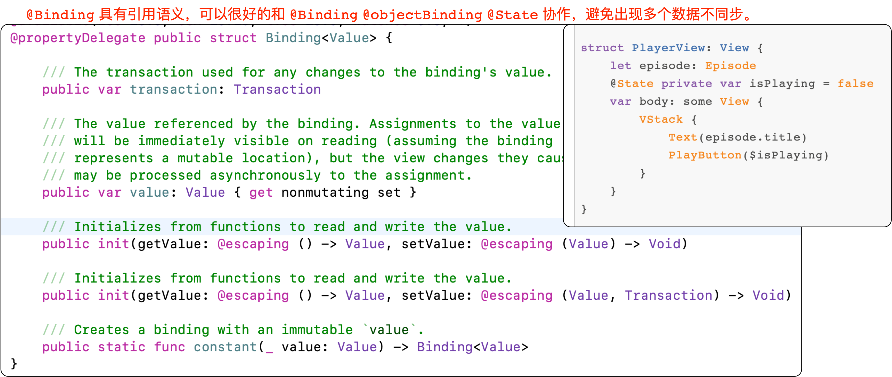
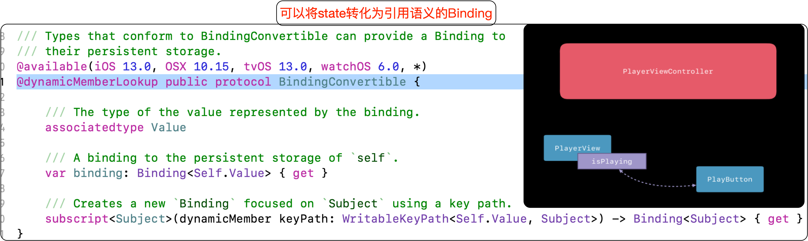
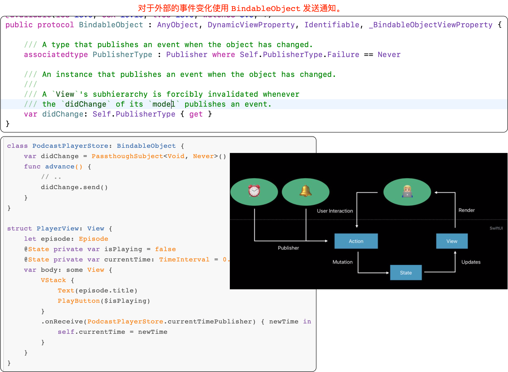
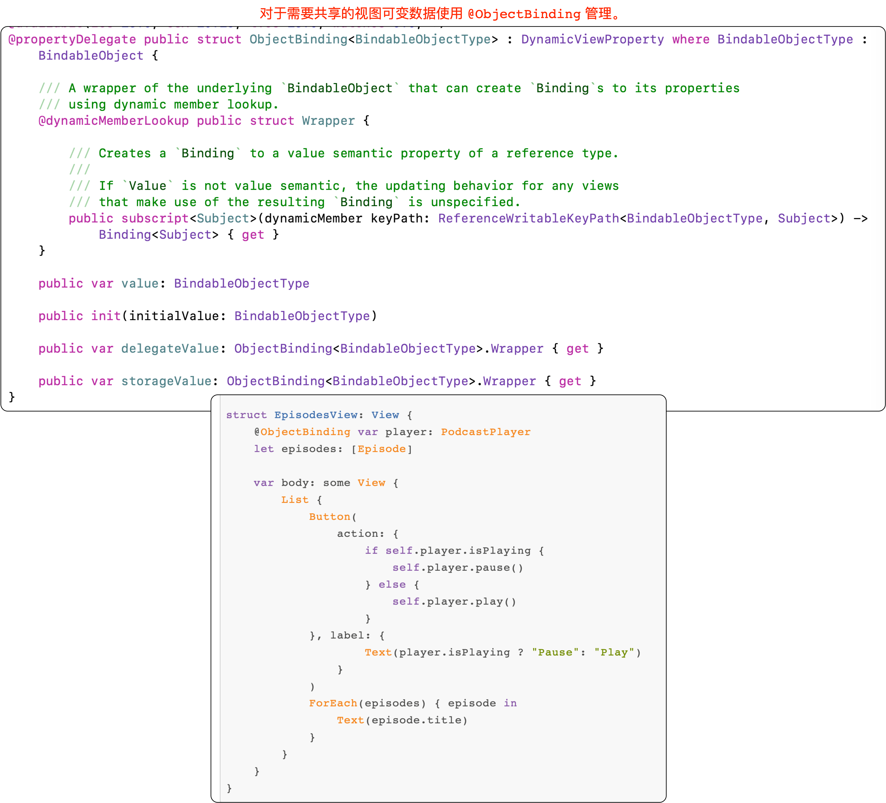
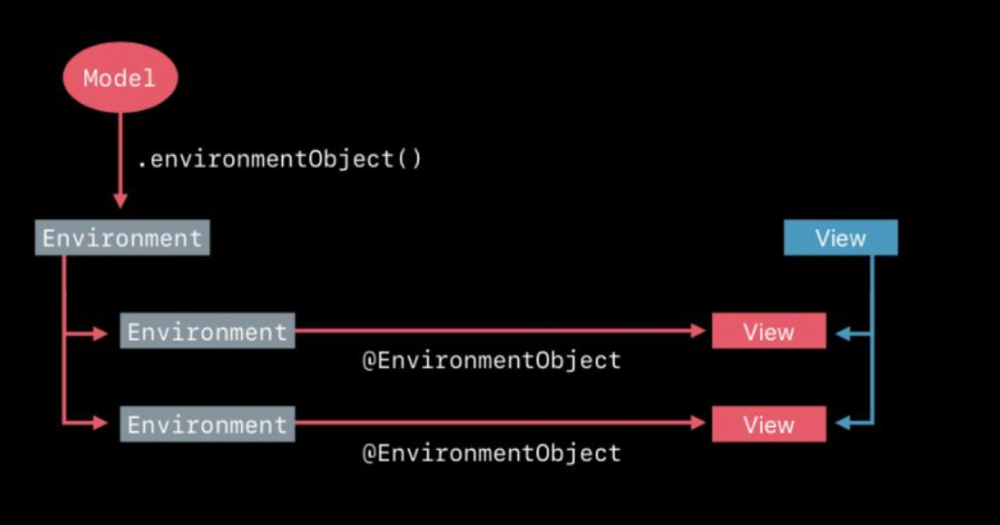

1. 对于不变的常量直接传递给 SwiftUI 即可。
2. 对于控件上需要管理的状态使用 @State 管理。
3. 对于外部的事件变化使用 BindableObject 发送通知。
4. 对于需要共享的视图可变数据使用 @ObjectBinding 管理。
5. 不要出现多个状态同步管理，使用 @Binding 共享一个 Source of truth。
6. 对于系统环境使用 @Enviroment 管理。
7. 对于需要共享的不可变数据使用 @EnviromemntObject 管理。
8. @Binding 具有引用语义，可以很好的和 @Binding @objectBinding @State 协作，避免出现多个数据不同步。

<!--more-->

## State

## Binding(引用语义)

## BindingConvertible（state转化为引用语义的Binding）

## BindableObject（接受外部通知）

## ObjectBinding(多个界面共用一个数据，内部包装多个界面)

## EnvionmentObject(环境对象)

## 参考 

1. [官方教程](https://developer.apple.com/tutorials/swiftui/building-lists-and-navigation)
2. [SwiftUI 的一些初步探索 (一)](https://onevcat.com/2019/06/swift-ui-firstlook/)
3. [系列文章深度解读|SwiftUI 背后那些事儿](https://mp.weixin.qq.com/s/ciiauLB__o-cXXfKn7lL1Q)
