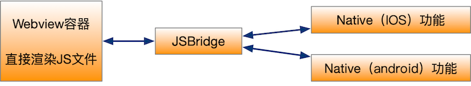
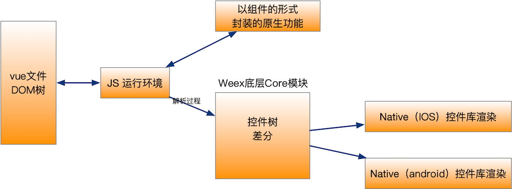
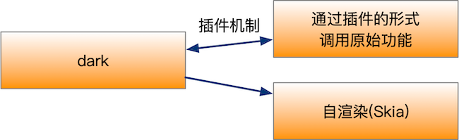
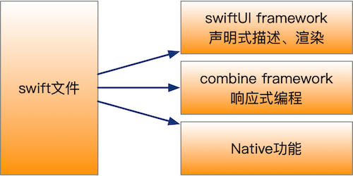
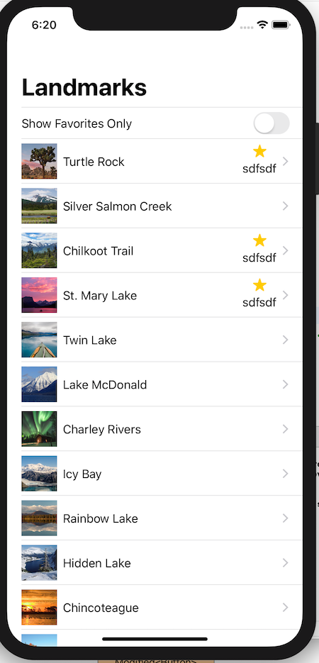
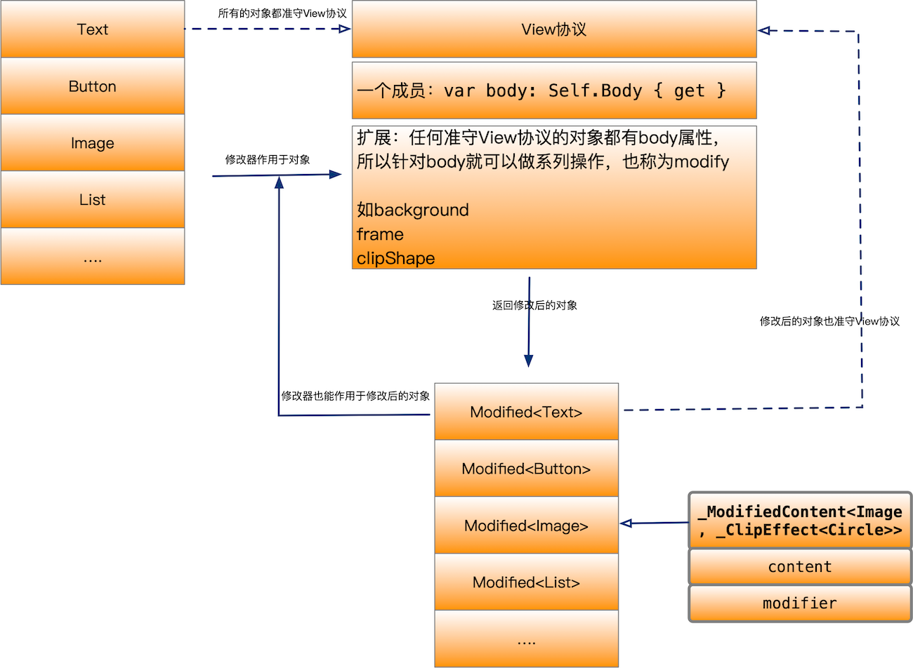
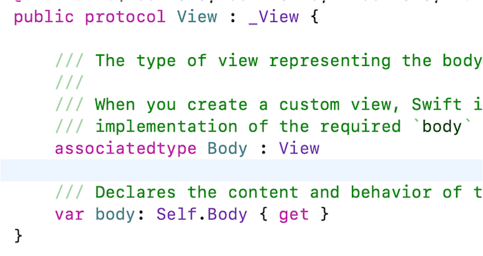
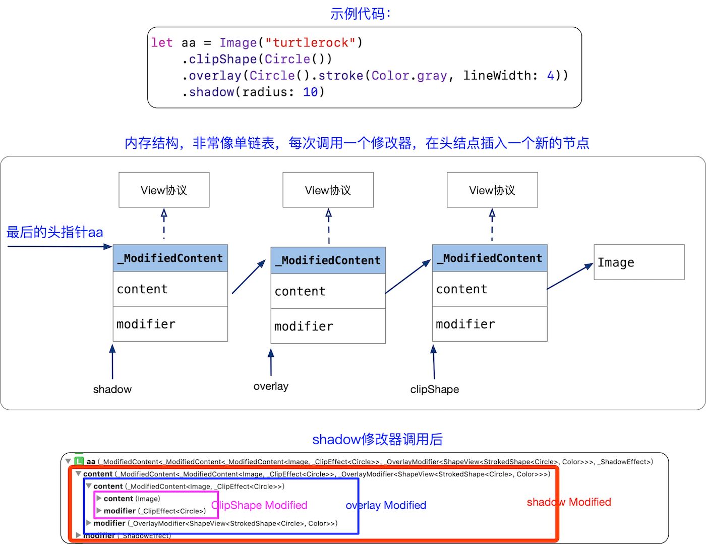
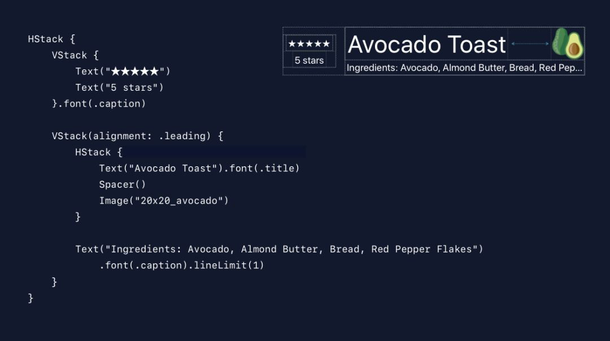

## 跨平台技术演变史

1. H5+原生（Cordova）
2. JavaScript开发+原生渲染 （React Native、Weex）
3. 自绘UI+原生功能(Flutter、SwiftUI)

### H5+原生



缺点：

1. webview渲染存在性能瓶颈、复杂任务无法胜任
2. 调用原生功能需要封装插件，麻烦

### JavaScript开发+原生渲染



分析： 

1. 解决了Webview渲染性能问题，相比较于原生，多了从Vue到原始的翻译过程。
2. 调用原生功能需要封装插件，也比较麻烦


### 自绘UI+原生功能



flutter Dart语言开发, Skia渲染。Skia是Google的一个2D图形处理函数库，包含字型、坐标转换，以及点阵图都有高效能且简洁的表现，Skia是跨平台的，并提供了非常友好的API

分析： 

1. 解决了JS到Native的翻译过程，自渲染。
2. 调用原生功能需要封装插件，也比较麻烦

## SwiftUI简介



1. 声明式语法（SwiftUI），内部黑盒完成渲染
2. 响应式编程，数据变化，监控、通知SwiftUI刷新数据
3. 无缝调用原始功能


## 一个例子---体验SwiftUI现代编程语言的魅力

代码

```
struct  LandmarkList: View {
    @EnvironmentObject var userData: UserData
    
    var body: some View {
        NavigationView {
            List {
                Toggle(isOn: $userData.showFavoritesOnly) {
                    Text("Show Favorites Only")
                }
                
                ForEach(userData.landmarks) { landmark in
                    if !self.userData.showFavoritesOnly || landmark.isFavorite {
                        NavigationButton(
                            destination: LandmarkDetail(landmark: landmark)
                                .environmentObject(self.userData)
                        ) {
                            LandmarkRow(landmark: landmark)
                        }
                    }
                }
            }
            .navigationBarTitle(Text("Landmarks"), displayMode: .large)
        }
    }
}
```


```
struct LandmarkRow: View {
    var landmark: Landmark

    var body: some View {
        HStack {
            landmark.image(forSize: 50)
            
            Text(verbatim: landmark.name)
            
            Spacer()
            
            if landmark.isFavorite {
                VStack {
                    Image(systemName: "star.fill")
                        .imageScale(.medium)
                        .foregroundColor(.yellow)
                    Text("sdfsdf")
                }
            }
        }
    }
}
```





## SwiftUI原理浅析

### View的运作原理

体会了SwiftUI的简洁用法，强大的功能后，分析下背后的原理：



定义了View的协议，所有的控件都准守View协议，View协议只定义了一个属性body，由于有了body属性，所以可以对body做对应的操作，这些操作封装在View的扩展中。这些扩展称为modifier。modifer作用于一个元素后，返回一个modified对象，这个对象也准守View协议，可以链式调用。








1. 声明了控件的样式（内存看是链式结构）， 传入渲染引擎渲染。开发者只声明，不用管复杂的渲染机制，大大简化了开发难度
2. 按需添加modifer，避免子类内存暴涨（性能）
3. 基于协议式，底层可以任意修改，底层预留可非常大的扩展空间


### HStack/ZStack


HStack 和 ZStack 的非常类似安卓的 LinerLayout，算法也同 Flex 布局比较相似。 对于如下的布局, 苹果都会在控件之间添加上符合苹果人机交互指南的间距，保证 UI 的优雅和一致性。



对于如上的 Stack 是怎么计算的？设 Stack 主轴方向长度为 W1。

1. 根据人机交互指南的预留出边距 S, 边距根据元素的排列可能有多个
2. 得到剩余的主轴宽度 W2= W1 - N * S
3. 平均分配一个预估宽度
4. 计算一些具备明确宽高的元素 如 Image 设置了 Frame的元素的等。
5. 沿主轴方向从前到后计算，，如果计算出来的宽度小于预估宽度则正常显示，不够则截断。
6. 最后的元素为剩余宽度，如果不够显示则阶段
7. 默认的交叉轴对齐方式为 Center，Stack 占据包括最大元素的边界。

默认的计算是顺序计算布局，如果某些元素比较重要，可以使用 LayoutPriority Modifier 提高布局优先级避免出现视图截断。


## 总结

1. 基于声明式，底层做了大量工作，上层开发者开发更简单
2. 响应式也简化了内部状态的维护
3. 苹果生态系统的无缝衔接，无缝调用原生功能
4. 内部人性化精细的设计，苹果的大力推广，不久的几年后，苹果开发的主要方式？

## 参考 

1. [官方教程](https://developer.apple.com/tutorials/swiftui/building-lists-and-navigation)
2. [SwiftUI 的一些初步探索 (一)](https://onevcat.com/2019/06/swift-ui-firstlook/)
3. [系列文章深度解读|SwiftUI 背后那些事儿](https://mp.weixin.qq.com/s/ciiauLB__o-cXXfKn7lL1Q)
