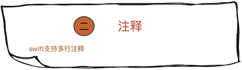
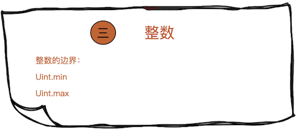
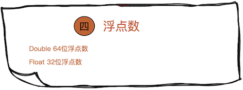
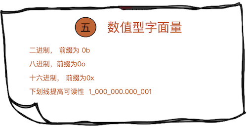
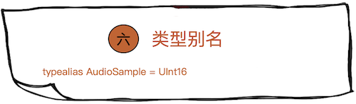
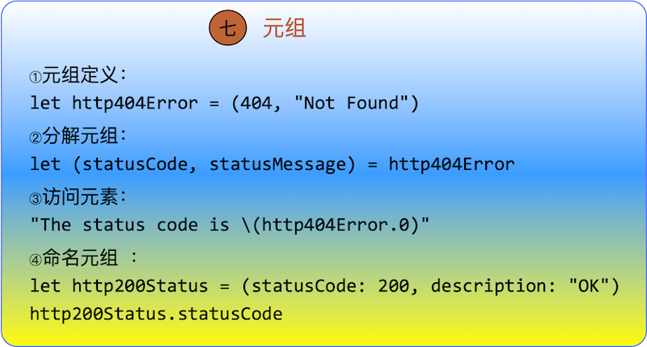
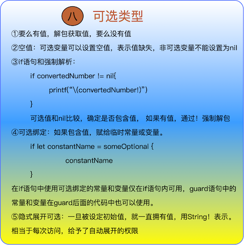
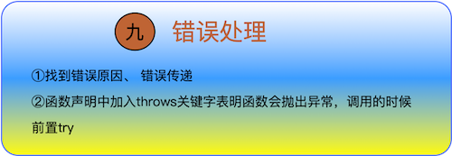
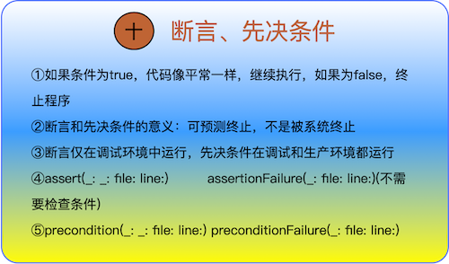

1. Constants and Variables
2. Comments
3. Semicolons
4. Integers
5. Floating-Point Numbers
6. Type Safety and Type Inference
7. Numeric Literals
8. Numeric Type Conversion
9. Type Aliases
10. Booleans
11. Tuples
12. Optionals
13. Error Handling
14. Assertions and Preconditions

<!--more-->

