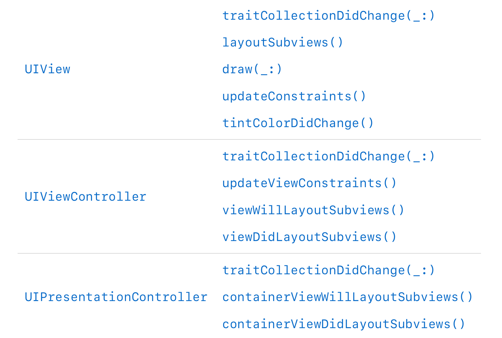

Update colors, images, and behaviors so that your app adapts automatically when Dark Mode is active.

当黑夜模式激活后，更新颜色、图片、行为，使app自动适应黑夜模式。

<!--more-->

## Overview

Standard views and controls automatically update their appearance to match the current interface style，If you already use color and image assets, you can add dark variants without changing your code.

标准view、controls自动更新界面去匹配当前界面模式。如果你使用了**color and image assets**你可以不修改代码，从而添加黑夜模式的支持。

## Choose Adaptive Colors for Your UI 为你的UI选择适合的颜色

There are two ways to create adaptive color objects:

1. Choose semantic colors instead of fixed color values. When configuring UI elements, choose colors with names like labelColor. These semantic colors convey the intended use of the color, rather than specific color values. When you use them for their intended purpose, they render with color values appropriate for the current settings. For a complete list of semantic color names, see NSColor and UIColor.
2. Define custom colors in your asset catalog. When you need a specific color, create it as a color asset. In your asset, specify different color values for both light and dark appearances. You can also specify high-contrast versions of your colors.

1. 选择UIColor类中定义的**语义color**,而不是固定的颜色
2. 将自定义color定义在asset catalog中，指定dark、light中颜色。代码中使用**UIColor(named: "customControlColor")** 加载颜色。

定义在asset catalog中的颜色自动适配dark、light模式。模式的变化，不需要重新加载。

## Create Images for All Appearances

If an image is difficult to see when changing appearances, provide a new image asset that looks good in the other appearance.

提供image asset 支持两种模式。

## Update Custom Views Using Specific Methods 使用特定方法更新自定义view。

模式敏感的操作全部放在上面的方法里面。如果不在上面的方法里面，可能不能正常响应当前的模式变化。

## Avoid Expensive Tasks During Appearance Transitions

避免模式过渡时完成复杂任务。

## 参考 

1. [Supporting Dark Mode in Your Interface](https://developer.apple.com/documentation/appkit/supporting_dark_mode_in_your_interface)
