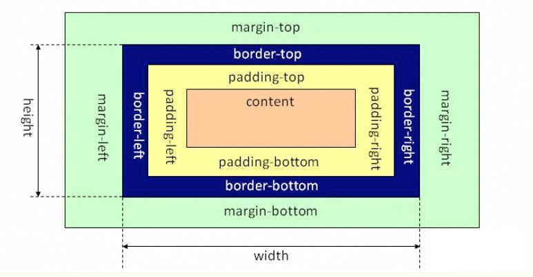
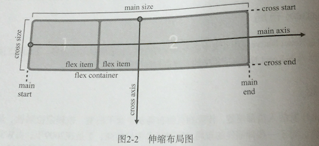
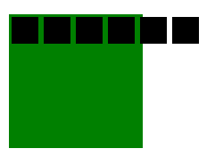
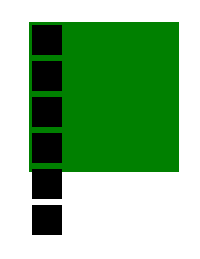
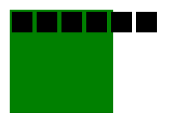
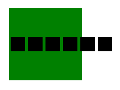
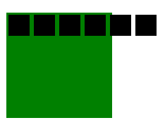
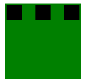

本文指在理解flexBox的各个效果，学习React Native的时候总结。


<!--more-->

##  盒子模型

### 标准盒子模型

标准的盒子模型如下图所示：



### 伸缩盒子模型

任何一个元素都可以指定为flexbox 布局，设置为display:flex或display:inline-flex的元素称为伸缩容器，伸缩容器的子元素称为伸缩项目，下面是伸缩的模型：



## 二、React Native中使用flexBox

1. flexDirection（伸缩容器）
2. alignItems（伸缩容器）
3. flexWrap（伸缩容器）
4. justifyContent（伸缩容器）
5. alignSelf（伸缩项目）
6. flex （伸缩项目）


### flexDirection 指定主轴方向

```
flexDirection:row|column
```

row、column的效果图如下：






### alignItems 

该属性用来定义伸缩项目在伸缩容器的交叉轴上的对齐方式

```
alignSelf:auto|flex-start|flex-end|center|stretch
```

flex-start、flex-end、center的效果图如下：







### flexWrap 

指定伸缩容器的主轴方向空间不足的情况下，是否换行以及如何换行

```
flexWrap:wrap|nowrap
```

wrap、nowrap的效果图如下：




### justifyContent

指定伸缩项目沿主轴线的对齐方式

```
justifyContent:flex-start|flex-end|center|space-between|space-around
```

flex-start、flex-end、center、space-between、space-around的效果图如下：





### alignSelf 

设置单独的伸缩项目在交叉轴上的对齐方式，会覆写默认的对齐方式

```
alignSelf:auto|flex-start|flex-end|center|stretch
```

lex-start、flex-end、center 的效果图如下：


### flex

```
flex:number
```

分别设置四个伸缩项目的 flex为3、2、1、4，效果图如下：


