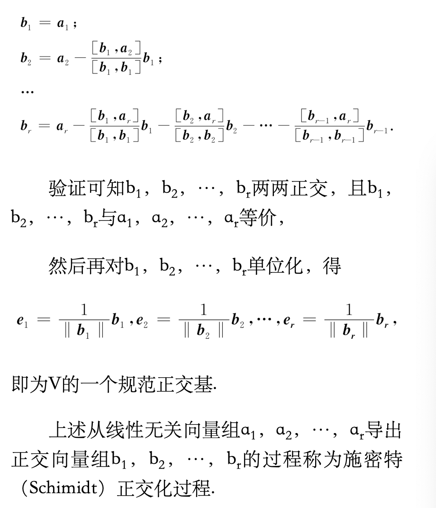
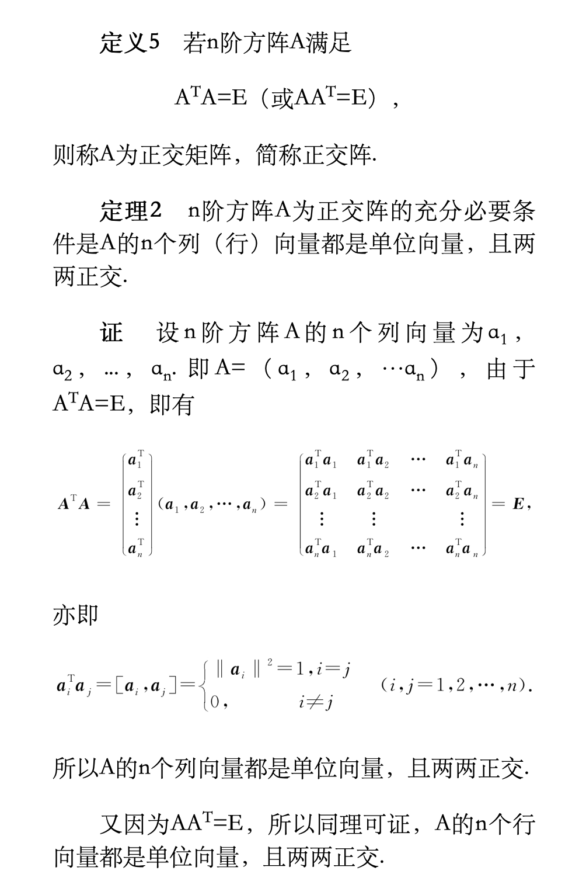
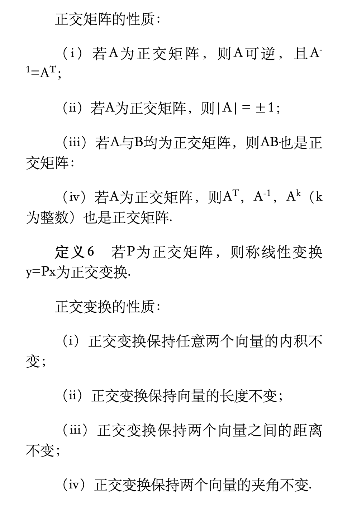

矩阵的特征值与特征向量是线性代数中十分重要的内容，是矩阵和向量理论深层次上的发展.本章主要讨论矩阵的特征值与特征向量的概念、性质与计算及矩阵的相似对角化问题，特别是对称矩阵的正交相似对角化问题.

<!--more-->

## 向量的內积和正交性

### 向量的內积

$$[x，y]=x_1y_2+x_2y_2+…+x_ny_n.$$

**内积的运算规律**（其中x，y，z为n维向量，λ为实数）：

1. [x，y]=[y，x]；
2. [λx，y]=λ[x，y]；
3. [x+y，z]=[x，z]+[y，z]；
4. [x，x]≥0，当且仅当x=0时，[x，x]=0；
5. 柯西一施瓦茨（CauchySchwarz）不等式：$[x，y]^2≤[x，x][y，y]$，当且仅当x与y线性相关时等号成立.

### 向量的长度  

定义2　设x是n维向量，称$\sqrt{[x,x]}$为向量x的长度（或范数），记作‖x‖.即若x＝（x1，x2，…，xn）T，则有
$$||x||=\sqrt{[x,x]}=\sqrt{x_1^2+x_2^2+x_n^2}$$

向量的长度具有以下**性质**：

1. 非负性　‖x‖≥0，当且仅当x=0时等号成立；
2. 齐次性　‖λx‖=|λ|‖x‖，λ为任意实数；
3. 三角不等式　‖x+y‖≤‖x‖+‖y‖.

若‖x‖=1，则称x为单位向量.

设a为任意非零向量，则向量$\frac{1}{||a||}a$为单位向量，

对于一个非零向量，用a的长度‖a‖去除a，即得到一个单位向量，这个过程称为将a单位化.

### 向量的夹角与正交向量组

**定义3**　设向量x与y均是n维非零向量，称

$$\theta=arccos\frac{[x,y]}{||x||\ ||y||}$$
为向量x与y的夹角.**当[x，y]=0时，称向量x与y正交**.显然，零向量与任何向量都正交.两两正交的非零向量组，称为正交向量组.

**定理1**　若向量组$a_1，a_2，…，a_m$是正交向量组，则$a_1，a_2，…，a_m$线性无关.

定义4　设n维向量组$e_1，e_2，…，e_r$是向量空间V的一个基，若$e_1，e_2，…，e_r$两两**正交**，且都是**单位**向量，则称$e_1，e_2，…，e_r$是V的一个规范正交基

规范正交化的步骤  :

### 正交矩阵与正交变换

**性质：**

## 方阵的特征值与特征向量 

### 特征值和特征向量的概念

定义7　设A为n阶方阵，若存在数λ和非零n维列向量x，使得$$Ax=λx（5.1）成立，$$则称数λ为方阵A的特征值，非零向量x称为A的对应于特征值λ的特征向量.式（5.1）也可写成$$（A-λE）x=0，（5.2）$$这是n个未知数n个方程的齐次线性方程组

求n阶方阵A的特征值和特征向量的步骤：

1. 第一步：求出A的特征多项式|A-λE|；
2. 第二步：求解特征方程|A-λE|=0，得到A的n个特征值λ1，λ2，…λn；
3. 第三步：对于A的每一个特征值λi，求出齐次线性方程组（A-λiE）x=0的一个基础解系ξ1，ξ2，…ξs，则A的对应于特征值λi的全部特征向量为pi=c1ξ1+c2ξ2+…+csξs，其中，c1，c2，…，cs为不全为零的任意实数.

### 方阵的特征值和特征向量的性质

**性质1**　一个特征向量只能属于一个特征值（相同的看成一个）

**性质2　**若λ是方阵A的特征值，x是属于λ的特征向量，则

1. μλ是μA的特征值，x是属于μλ的特征向量（μ是常数）：
2. λk是Ak的特征值，x是属于λk的特征向量（k是正整数）；
3. 当|A|≠0时λ1是A1的特征值，λ1|A|为$A\*$的特征值，且x为对应的特征向量.
4. φ（λ）是φ（A）的特征值（其中φ（λ）$=a_0+a_1λ+…+a_mλ^m$是λ的多项式，φ（A）=$a_0E+a_1A+…+a_mA^m$是方阵A的多项式）

**性质3**　A与AT有相同的特征值

**性质5**　设λ1，λ2，…，λm是方阵A的m个特征值，p1，p2，…，pm是依次与之对应的特征向量.若λ1，λ2，…，λm互不相等，则p1，p2，…，pm线性无关.

## 相似矩阵 

### 相似矩阵的定义

定义8　设A，B都是n阶方阵，若存在一个n阶可逆矩阵P，使$$P^1AP=B$$

则称A与B是相似的，或称B是A的相似矩阵.称$P^1AP$为对A作相似变换，可逆矩阵P称为把A变成B的相似变换矩阵

**性质1**　若A与B相似，则R（A）=R（B），且|A|=|B|.

**性质2**　若A可逆，且A与B相似，则B可逆，且A1与B1也相似.

**性质3**　若A与B相似，则$A^k$与$B^k$（k为整数）相似.

**定理3**　若n阶方阵A与B相似，则A与B的特征多项式相同，从而A与B的特征值也相同.

**推论**　若n阶方阵A与对角矩阵相似，则λ1，λ2，…，λn是A的n个特征值.

### 矩阵的对角化

定理4　n阶方阵A与对角矩阵相似的充分必要条件是A有n个线性无关的特征向量.

推论　若n阶方阵A有n个互不相同的特征值，则A与对角矩阵相似.

定理5　若对于n阶方阵A的任一k重特征值λ，有R（A-λE）=n-k，则A可对角化.

### 实对称矩阵的对角化

定理7 实对称矩阵不同特征值对象特征向量正交  

定理8　A为n阶实对称矩阵，则必存在正交矩阵P，使得$$P^1AP=P^TAP=A$$，其中A是以A的n个特征值未对角线元素的对角矩阵

推论： 设A为n阶实对称矩阵，λ是A的k重特征值，则 R（A-λE）= n-k，从而对应特征值λ恰好有k个线性无关的特征向量

