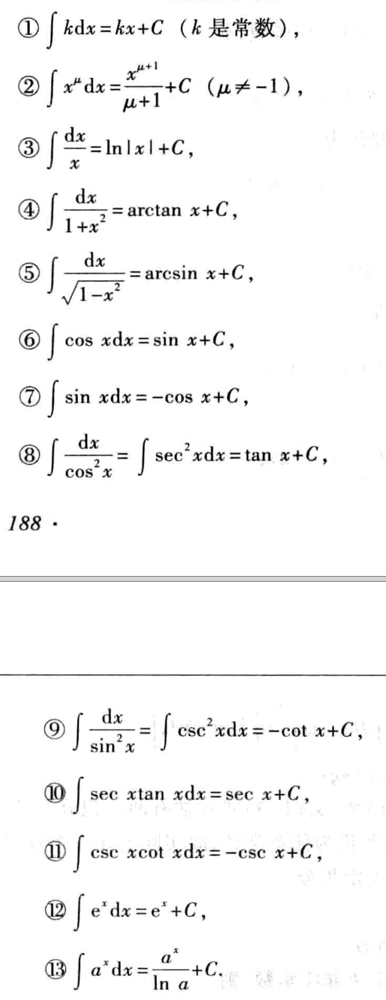

记录导数与微分的主要知识点，

<!--more-->

## 不定积分的概念和性质 

定义1：如果在区间I上，可导函数F(x)的导函数为f(x),即对任意x属于I都有：
$$F'(x)=f(x)\ 或dF(x)=f(x)dx$$
那么函数F(x)就称为f(x)（或f(x)dx）在区间I上的一个**原函数**。

原函数存在定理：如果函数f(x)在区间I上连续，那么在区间I上存在可导函数F(x),使对任一x属于I都有
$$F'(x)=f(x)$$
简单的说，连续函数一定有原函数。

表达式 F(x) + C 可以表示f(x)的任意一个原函数。

定义2 在区间I上，函数f(x)的带有任意常数项的原函数称为f(x)(或f(x)dx)在区间I上的不定积分，记作：
$$\int{f(x)dx}$$
其中记号$\int$称为积分号，f(x)称为被积函数，f(x)dx
称为被积表达式，x称为积分变量。

因而不定积分$\int{f(x)dx}$可以表达f(x)的任意一个原函数。

**基本积分表**

**不定积分的性质**

性质1 设函数f(x)及 g(x)的原函数存在，则
$$\int{[f(x)+g(x)]dx} = \int{f(x)dx} + \int{g(x)dx}$$

性质2 设函数f(x)的原函数存在，k为非零常数，则 
$$\int{kf(x)dx}=k\int{f(x)dx}$$

## 换元积分法

把复合函数的微分法反过来，用于求不定积分，利用中间变量的代换，得到符合函数的积分，称为**积分换元法**。

定理1 设f(u)具有原函数，u=$\psi$(x)可导，则有换元公式 
$$\int{f[\psi (x)]\psi '(x)dx} = [\int{f(u)du}]_{u=\psi (x)}$$

如果应用换元法求不定积分呢？设要求$\int{g(x)dx}$，如果g(x)可以化为g(x)= $f[\psi (x)]\psi '(x)$的形式，那么
$$\int {g(x)dx}= \int{f[\psi (x)]\psi '(x)dx}=\int{f(u)du}$$

 