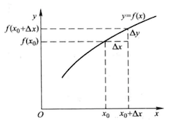

本文记录《函数与极限》章节中，比较重要的内容，以便以后复习。

<!--more-->
## 第二节 数列的极限

**定义**： 设{$x_n$}为一数列，如果存在常数a，对于任意给定的正数$\epsilon$ (不论它多么小)，总存在正整数N，使得，当n>N时，不等式
$$|x_n-a|<\epsilon$$
都成立，那么就称常数a是数列{$x_n$}的**极限**，或者称数列{$x_n$}**收敛**于a，记为：
$$\lim \limits_{n \to \infty} {x_n} = a$$

如果不存在这样的常数a，就说数列没有极限，或者说数列是**发散**的。

> 等式中的绝对值表达了两数之差，说明$x_n$无限趋近a含义,也就是两项非常的接近。

**收敛数列的性质 **

**定理一（极限的唯一性）** 如果数列{$x_n$}收敛，那么他的极限唯一

**定理二（收敛数列的有界性）**如果数列{$x_n$}收敛，那么数列{$x_n$}一定有界。

**定理三（收敛数列的保号性）**如果$\lim \limits_{n \to \infty} {x_n} = a$，且a>0，那么存在正整数N，当n>N时，都有$x_n$>0

**定理四（收敛数列与其子数列间的关系）**如果数列{$x_n$}收敛于a，那么他的任一子数列也收敛，且极限也是a。

## 第三节 函数的极限

讨论函数极限时，自变量变化的情形有两种情况：

1. 自变量x任意的接近于有限值$x_0$ ，$x \to x_0$
2. 自变量x的绝对值无限大，$x \to \infty$

**函数极限定义1** 设函数f(x)在点$x_0$的去心领域内有定义，如果存在常数A，对于任意给定的正数$\epsilon$(不论多么小)，总存在正数$\delta$,使得当x满足不等式0<|x-$x_0$|<$\delta$时，对应的函数值f(x)都满足不等式 
$$|f(x)-A|<\epsilon$$
那么常数A就叫做函数f(x)当x->$x_0$时的极限记作：
$$\lim_{x->x_0}f(x)=A$$

> 函数极限的定义就是规定了定义域，得出值域的满足的条件 。

函数极限的性质：

1. 极限的唯一性
2. 局部有界性  
3. 局部保号性
4. 函数极限和数列极限的关系（函数有极限，数列也有极限）

## 第四节 无穷小和无穷大

**定义**： 极限为零，那么称函数为当x->$x_0$时的无穷小

下面的定理说明无穷小与函数极限的关系：

**定理1** ： 在自变量的同一变化过程$x->x_0$中，函数f(x)具有极限的充分必要条件是f(x) = A + $\alpha$,其中 $\alpha$是无穷小。

下面是无穷大和无穷小的关系：

**定理2**： 在自变量的同一变化过程中，如果f(x)为无穷大，那么$\frac{1}{f(x)}$为无穷小，如果f(x)为无穷小，且f(x)!=0 .那么$\frac{1}{f(x)}$为无穷大。

> 1. 充分性：由条件推断出命题成立。
> 2. 必要性： 由命题成立推断出条件的成立。

## 第五节极限运算法则

**定理1** 两个无穷小的和是无穷小

**定理2** 有界函数与无穷小的乘积是无穷小

**推论1** 常数与无穷小的乘积是无穷小

**推论2** 有限个无穷小的乘积是无穷小

**定理3** 当$x \to x_0 （或 x \to \infty）$ 如果limf(x)=A,limg(x)=B,那么

1. lim[f(x)+g(x)]=limf(x)+limg(x)=A+B
2. lim[f(x)g(x)]=limf(x)limg(x)=AB
3. lim$\frac{f(x)}{g(x)}$=$\frac{limf(x)}{limg(x)}=\frac{A}{B}$，其中B不等于0

**定理4** 数列和函数有类似定理3的性质

**定理5** $\upsilon(x)>=\psi$(x),而lim$\upsilon(x)$=A,lim$\psi(x)$=B,那么A>=B

> 注意： 求极限时，如果分母为0，需要化为不为0

**定理6** 复合函数的极限运算法则，设函数y=f[g(x)]是由函数u=g(x)与函数y=f(u)复合而成，f[g(x)]在点$x_0$的某个去心领域内有定义，$\lim \limits_{x \to x_0}{g(x)}=u_0$ , $\lim \limits_{u \to u_0} {f(u)}=A$,且存在$\delta_0>0$，当x属于（$x_0,\delta_0$）时，有g(x)!=$u_0$,则
$$\lim \limits_{x \to x_0} {f[g(x)]} = \lim \limits_{u \to u_0} {f(u)}=A $$

## 第六节 极限存在准则、两个重要极限

**准则1** ，如果数列{$x_n$}、{$y_n$}、{$z_n$}满足下面条件：

$$y_n<=x_n<=$z_n$$

且$\lim_ \limits{n->\infty}y_n=a,\lim_ \limits{n->\infty}z_n=a$

那么数列{$x_n$}的极限存在，且$\lim \limits_{n->\infty}x_n=a$

这个准则称为**夹逼准则**。

**使用夹逼准则计算第一个重要的极限**: $\lim_{x \to 0}{\frac{\sin x}{x} }=1$

**准则2 单调有界必有极限。**

一对重要的极限公式：$$\lim \limits_{n->\infty}(1+\frac{1}{n})^n=e$$

$$\lim \limits_{n->\infty}(1-\frac{1}{n})^n= \frac{1}{e}$$

**柯西极限存在准则**  数列{$x_n$} 收敛的充分必要条件是：对于任意给定的正数$\epsilon$,存在正整数N，使得m>N, n>N时，有：

$$|x_n-x_m|<\epsilon$$

上面公式说明两项的差趋于无穷小。

## 第七节：无穷小的比较

上面的章节说明两个无穷小的和、差、商仍旧是无穷小，但是两个无穷小的商，确出现不同的结果。

无穷小定义： 如果函数f(x)当$x \to x_0 （或 x \to \infty）$时极限为零，那么称函数f(x)为当$x \to x_0 （或 x \to \infty）$时的无穷小。

定理1 在自变量的同一变化过程$x \to x_0 （或 x \to \infty）$中，函数f(x)具有极限A的充分必要条件是f(x)=A+a,其中a是无穷小。

定义(**更小的阶数更高**) ：

1.  如果$lim \frac{\beta}{\alpha}$ = 0，那么就说$\beta$是比$\alpha$高阶的无穷小，记作$\beta$=o($\alpha$)
2. 如果$lim \frac{\beta}{\alpha}$ = $\infty$，那么就说$\beta$是比$\alpha$低阶的无穷小
3. 如果$lim \frac{\beta}{\alpha}$ = c，那么就说$\beta$,$\alpha$同阶的无穷小
4. 如果$lim \frac{\beta}{\alpha^k}$ =c，那么就说$\beta$是$\alpha$的k阶的无穷小
5. 如果$lim \frac{\beta}{\alpha}$ = 1，那么就说$\beta$、$\alpha$时等阶无穷小 记作$\alpha \sim \beta$

## 第八节 函数的连续性和间断性 

定义： 设函数y=f(x)在点$x_0$的某一领域内有定义，如果：

$$\lim \limits_{\bigtriangleup x \to 0}\bigtriangleup y = \lim_{\Delta x \to 0}{[f(x_{x0})]}0$$

那么就称函数y=f(x)在点$x_0$连续。

下面是连续性定义中增量的示意图：

连续性的也可以描述为：

设函数y=f(x)在点$x_0$的某一领域内有定义，如果
$$lim_{x \to x_0} {f(x)} = f(x_0)$$
那么就称函数f(x)在点$x_0$连续。

函数的间断点：

设函数f(x)在点$x_0$的某个去心领域内有定义，在此前提下，如果函数f(x)有下列三种情形之一：

1. 在$x=x_0$没有定义
2. 虽在$x=x_0$有定义，但$\lim_{x \to x_0}{f(x)}$不存在
3. 虽在$x=x_0$有定义，且$\lim_{x \to x_0}{f(x)}$存在，但是不等于$f(x_0)$

那么函数f(x)在点$x_0$w为不连续，且点$x_0$称为函数f(x)的**不连续点**或**间断点**。

## 第九节 连续函数的运算与初等函数的连续性

一. 连续函数的和、差、积、商的连续性 

连续函数的和、差、积、商的连续性  连续函数的和、差、积、商（分母不为0）是连续的

二 反函数和复合函数的连续性 

**定理二** 如果函数f(x) 是单调增加且连续，那么反函数也单调增加且连续

**定理三** 复合函数的两个函数连续，复合后也连续。

三 初等函数的连续性

**定理四** 所有初等函数都是连续的。

一组重要的公式

* $\lim_{x \to 0}{\frac{\log_\alpha{(1+x)} }{x{ { = \lim_{x \to 0}{\log_{\alpha}{(1+x)}^{\frac{1}{x} }} = \log_{\alpha}e = \frac{1}{\ln{\alpha} }$ 
* $\lim_{x \to 0}{\frac{\alpha^x - 1}{x} }$  
   
   令 $\alpha^x - 1 = t$，则 $x=\log_{\alpha}{(1+t)}$,当x $\to$0， t $\to$0， 于是：
   
   $\lim_{x \to 0}{\frac{\alpha^x - 1}{x} }$   = $\lim_{t \to 0}{\frac{t}{\log_{\alpha}{(1+t)} }} = \log_{\alpha}{e} = \frac{1}{\ln{\alpha} }$
   
* $\lim_{x \to 0}{\frac{(1+x)^{\alpha}-1}{x} } = \alpha$

##  第十节 闭区间上连续函数的性质
**定理1** 有界性与最大值最小值定理，在闭区间上连续的函数在该区间上有界，且一定能取得他的最大值和最小值。

**零点定理**： 设函数f(x)在闭区间【a,b】上连续，且f(a)与f(b)异号，则在开区间(a,b)内至少有一点$\epsilon$， 使 $$f(\epsilon) = 0$$

**定理2（介值定理）** 设函数f(x)在闭区间【a,b】上连续，且在这区间的端点取不同的函数值，$$f(a)=A,f(b)=B$$
则对于A于B之间的任意一个数C，在开区间（a,b）内至少有一点$\epsilon$,使得

$$f(\epsilon) = C $$

## 有用的公式

1. $x^2-9=(x+3)(x-3)$
2. $1+\frac{1}{2}+\frac{1}{2^2}+...+\frac{1}{2^{n-1} }=\frac{1-\frac{1}{2^n} }{1-\frac{1}{2} }$
3. 二项式定理 $(x+y)^n = \binom {n}{0}x^ny^0 + \binom {n}{1}x^{n-1}y^1 +\binom {n}{2}x^{n-2}y^2 + ...+ \binom {n}{n-1}x^1y^{n-1} + \binom {n}{n}x^0y^n$,其中$\binom {n}{k}$为二项系数，等于$\frac{n!}{k!(n-k)!}$.
4. $\lim \limits_{n->\infty}(1+\frac{1}{n})^n=e=2.718281$ （二项式展开可证明）
5. $\lim \limits_{x \to \infty}(1-\frac{1}{x})^x = \frac{1}{e}$ 
6. $\lim_{x \to 0} {\frac{\log_a(1+x)}{x} }=\frac{1}{\ln a}$  （将 $\frac{1}{x}提到指数位置，$利用公式4、换底公式 可以证明）
7. $\lim \limits_{x \to 0}{\frac{a^x -1}{x} } = \ln a$     (替换 $a^x -1 =t $，利用公式5可证明)
8. $\lim \limits_{x \to 0}{\frac{(1+x)^a -1 }{x} } = a$
9. $\ln{(1+x)} \sim x\ (x \to 0)$(等价无穷小)
10. $e^x-1 \sim x \ (x \to 0)$(等价无穷小)
11. $(1+x)^a-1 \sim ax \ (x \to 0)$ (等价无穷小)