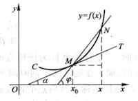
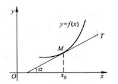
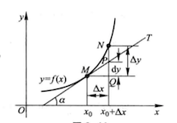

记录导数与微分的主要知识点

<!--more-->

## 第一节、导数的概念 

### 导数的引例 

* 速度问题
	$$\nu = \lim_{t \to t_0}\frac{f(t) - f(t_0)}{t-t_0}$$
	
	这时就把极限值$\nu$称为质点在时刻$t_0$的**瞬时速度**
	
* 切线问题 
	$$k = \lim_{t \to x_0}\frac{f(x) - f(x_0)}{x-x_0}$$
	
	那么k就是切线的斜率 。下面是切线的示意图：
	
	

定义： 设函数y=f(x)在点$x_0$的某个领域内有定义，当自变量x在$x_0$处取得增量$\Delta x$(点$x_0 + \Delta x$ 仍在该领域内)时，相应的，因变量取得增量$\Delta y = f(x_0 + \Delta x) - f(x_0)$；如果 $\Delta y$ 与  $\Delta x$之比（当 $\Delta x \to 0$ 时）的极限存在，那么称函数 y= f(x)在点$x_0$处可导，并称这个极限为函数y=f(x)在点$x_0$处的导数，即为f'($x_0$) ,即

$$f'(x_0) = \lim_{\Delta x \to 0}{\frac{\Delta y}{\Delta x} } = \lim_{\Delta x \to 0} \frac{f(x_0+\Delta x)-f(x_0)}{\Delta x}, 也可以记作 y', \frac{dy}{dx} 或\frac{df(x)}{dx}$$

也可以写作 ：

$$f'(x_0) = \lim_{h \to 0}{\frac{f(x_0+h)-f(x_0)}{h} }$$
或
$$f'(x_0)=\lim_{x \to x_0} \frac{f(x)- f(x_0)}{x-x_0}$$

**导数的意义**： 导数的概念就是**函数变化**率这一概念的精确描述。**因变量增量**与**自变量增量**之比$\frac{\Delta y}{\Delta x}$ 是因变量y再以$x_0$和$x_0+\Delta x$为端点的区间上的平均变化率，而导数$f'(x_0)$则是因变量y在点$x_0$处的变化率。**他反应了因变量随自变量的变化而变化的快慢程度。**

**下面是求导的示例：**

* **常数的导数**： $C' = 0$  ， 常数的导数为0

* **幂函数的导数** ：
$
(x^n)'=
\begin{cases}
0, & \text{n=1} \\
n x^{n-1}, & n>1
\end{cases}
$

* **sinx的导数** $(\sin x)'=\cos x$、 $(\cos x)' = - \sin x$

* **指数函数的导数**： $(a^x)' = \lim_{h \to 0} {\frac{ {\alpha}^{x+h} - {\alpha}^x}{h} } = {\alpha}^x \lim_{h \to 0} \frac{ {\alpha}^h - 1}{h} = a^{x} \ln{a} $

* **对数函数的导数**：$(\log_ x)' = \frac{1}{x \ln a}$
  $\begin{equation} \begin{split}
  f'(x)&=\lim_{h \to 0} \frac{\log_{\alpha}{(x+h)} - \log_{\alpha}{x} }{h}\\
  &=\lim_{h \to 0}{\frac{1}{h} } \log_{\alpha}{\frac{x+h}{x} } = \lim_{h \to 0}{\frac{1}{x} } \cdot \frac{x}{h} \log_{\alpha}{(1+\frac{h}{x})}\\
  &=\frac{1}{x} \lim_{h \to 0}{\frac{\log_{\alpha}{(1+\frac{h}{x})} }{\frac{h}{x} } }\\
  &=\frac{1}{x \cdot \ln{\alpha} }
  \end{split}\end{equation}$

**导数的几何意义**：函数y=f(x)在$x_0$处的导数表示曲线y=f(x）在点M处的切线的斜率。

1. 切线方程： $y-y_0 = f'(x_0)(x-x_0)$
2. 法线方程： $y-y_0 = - \frac{1}{f'(x_0)}(x-x_0)$ 

函数的可导性和可连续性的关系：

1. 如果y=f(x)在点x处可导，那么函数在该点x处必连续。 $\frac{\Delta y}{\Delta y} = f'(x)+\alpha \Rightarrow \Delta y = f'(x) \Delta x +\alpha \Delta x$
2. 连续不一定可导

## 第二节、函数的求导法则

一、 函数的和、差、积、商的求导法则

**定理1** 如果函数$\mu$=$\mu(x)$及$\nu(x)$=$\nu(x)$都在点x具有导数，那么它们的和、差、积、商（除分母为零的点外）都在点x具有导数，且 

1. [ $\mu(x)$ + $\nu(x)]' = \mu(x)' + \nu(x)' $
2. $[\mu(x)\nu(x)]' = \mu(x)'\nu(x) + \mu(x)\nu(x)'$
3. $[\frac{\mu(x)}{\nu(x)}]' = \frac{\mu(x)'\nu(x)- \mu(x)\nu(x)'}{\nu^2(x)}$ 其中$\nu(x)$!=0

**定理2（反函数求导法则）**:如果函数x=f(y)在区间$I_y$内单调、可导且f'(y) $\ne$ 0，那么他的反函数y=$f^{-1}(x)$在区间$I_x$内也可导，且：
$$[f^{-1}(x)]' = \frac{1}{f'(y)}或 \frac{dy}{dx}=\frac{1}{\frac{dx}{dy} }$$ 

> 简单的说：反函数的导数等于直接函数导数的倒数。

**示例：**

设x = sin y 为直接函数，则 y = arcsin x 是它的反函数。计算过程如下：

$
\begin{equation}\begin{split}
(arcsin x)'& =\frac{1}{(sin y)'} = \frac{1}{cos y}\\
&又:cos y = \sqrt {1- sin^2y} = \sqrt{1-x^2}\\
&所以:(arcsin x)' = \frac{1}{\sqrt{1- x^2} }\\
\end{split}\end{equation}
$
​	

**定理3（复合函数求导法则**）如果u=g(x)在点x可导，而y=f(u)在点u=g(x)可导，那么符合函数y=f[g(x)]在点x可导，且其导数为：
$$\frac{dy}{dx}=f'(u) \cdot g'(x) 或 \frac{dy}{dx}=\frac{dy}{du} \cdot \frac{du}{dx}$$

## 第二节求导法则总结 

一、 导数公式和基本求导法则 

|常用导数公式|常用导数公式|
|:---|:---|
|(1). $(C)' = 0 $|(2). $(x^{\mu})' = {\mu}x^{\mu -1} $|
|(3). $(\sin x)' = \cos x $|(4). $(\cos x)' = - \sin x $|
|(5). $(\tan x)' = \sec^{2} x $| (6). $(\cot x)' = - \csc^{2} x $|
|(7). $(\sec x)' = - \sec{x} \tan{x} $|(8). $(\csc x)' = - \csc{x} \cot{x} $|
|(9). $({\alpha}^x)' = {\alpha}^x \ln{\alpha} $| (10). $({e}^x)' = e^x  $|
|(11). $(\log_{\alpha}{x})' = \frac{1}{x \ln{\alpha} } $| (12). $(\log_{\alpha}{x})' = \frac{1}{x \ln{\alpha} } $|
|(13). $(\arcsin x)' = \frac{1}{\sqrt{1-x^2} } $|(14). $(\arccos x)' = - \frac{1}{\sqrt{1-x^2} } $|
|(15). $(\arctan x)' =  \frac{1}{1 + x^2} $|(16). $(arccot x)' = - \frac{1}{1 + x^2} $|

二、 函数的和、差、积、商的求导法则

设$\mu = \mu (x)$，$\nu = \nu (x)$ 都可导，则

|函数的和、差、积、商的求导法则|函数的和、差、积、商的求导法则|
|:---|:---|
|(1). $ (\mu + \nu)' = {\mu}' + {\nu}' $|(2). $ (C \mu)' = C{\mu}' $|
|(3). $ (\mu \nu)' = {\mu}' \nu + \mu {\nu}' $|(4). $ (\frac{\mu}{\nu})' = \frac{ {\mu}' \nu + \mu {\nu}'} } }\nu}^2} $|

三、 反函数求导法则 

如果函数x=f(y)在区间$I_y$内单调、可导且f'(y) $\ne$ 0，那么他的反函数y=$f^{-1}(x)$在区间$I_x$内也可导，且：
$$[f^{-1}(x)]' = \frac{1}{f'(y)}或 \frac{dy}{dx}=\frac{1}{\frac{dx}{dy} }$$ 

四、 复合函数求导法则  

如果u=g(x)在点x可导，而y=f(u)在点u=g(x)可导，那么符合函数y=f[g(x)]在点x可导，且其导数为：
$$\frac{dy}{dx}=f'(u) \cdot g'(x) 或 \frac{dy}{dx}=\frac{dy}{du} \cdot \frac{du}{dx}$$

## 第三节、高阶导数

没有学习

## 第五节、函数的微分

定义： 设函数 y= f(x)在某区间内有定义，$x_0$及$x_0 + \Delta x$在这区间内，如果函数的增量：

$$\Delta y = f(x_0 + \Delta x) - f(x_0)$$

可表示为：

$$\Delta y = A \Delta x + o(\Delta x)$$

其中A是不依赖于$\Delta x$的常数，那么称函数 y = f(x)在点 $x_0$处是可微的，而$A \Delta x$叫做函数 y = f(x)在点$x_0$相应于自变量增量$\Delta x$的微分，记作 dy 即

$$dy = A \Delta x$$

$$dy = f'(x_)) \Delta x$$

> 微分的理解：相对于自变量的增量，因变量的变化，这个变化时微小的，理解为微分。

微分和$\Delta y$的关系： 
$$ \Delta y = dy + o(dy) $$

**微分可以近视代替因变量的增量 。微分是 $\Delta y$的主部。**

通常把自变量x的增量$\Delta x$称为自变量微分（微小的数），记作dx，于是函数y=f(x)的微分又可记作 
$$dy = f'(x)dx$$

**微分的几何意义**： dy 是曲线的切线上点的众坐标的相应增量。非线性函数的局部线性化。

从图中可以看出，dy = QP。当$\Delta y$是曲线y = f（x） 上的点的众坐标的增量， dy是曲线的切线上点的众坐标的相应的增量。当$\Delta x$很小时，$\Delta y - dy$比 $\Delta x$小的多，因此在点M的邻近，我们可以使用切线段来近视代替曲线段。 这就是**非线性函数的局部线性化**。

## 微分公式总结 

暂无
