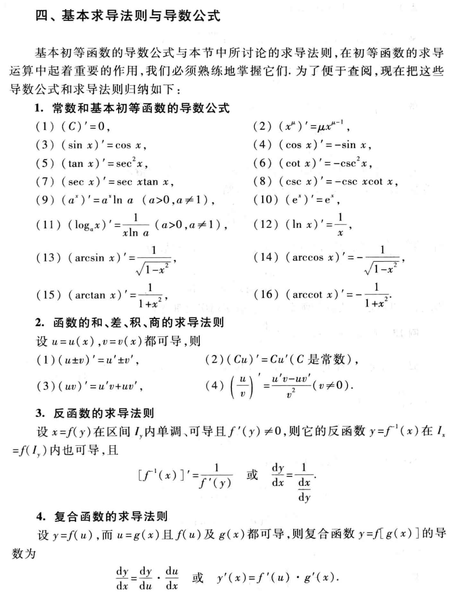
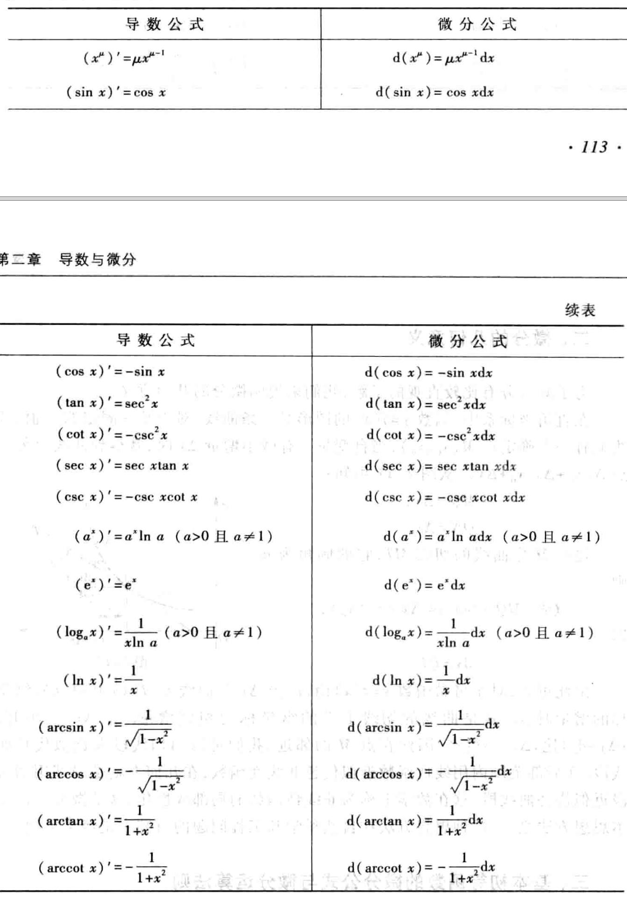
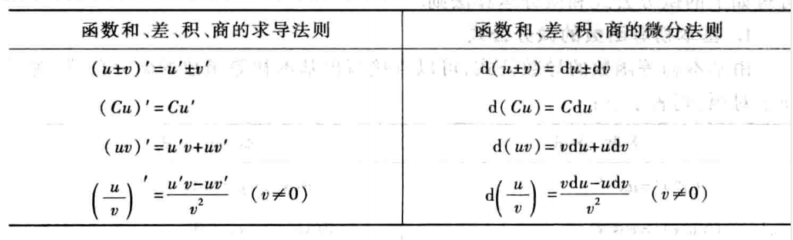

记录导数与微分的主要知识点

<!--more-->

## 第一节、导数的概念 

定义： 设函数y=f(x)在点$x_0$的某个领域内有定义，当自变量x在$x_0$处取得增量$\Delta x$(点$x_0 + \Delta x$ 仍在该领域内)时，相应的，因变量取得增量$\Delta y = f(x_0 + \Delta x) - f(x_0)$；如果 $\Delta y$ 与  $\Delta x$之比（当 $\Delta x \to 0$ 时）的极限存在，那么称函数 y= f(x)在点$x_0$处可导，并称这个极限为函数y=f(x)在点$x_0$处的导数，即为f'($x_0$) ,即

$$f'(x_0) = \lim_{\Delta x \to 0}{\frac{\Delta y}{\Delta x}} = \lim_{\Delta x \to 0} \frac{f(x_0+\Delta x)-f(x_0)}{\Delta x}, 也可以记作 y', \frac{dy}{dx} 或\frac{df(x)}{dx}$$

也可以写作 ：

$$f'(x_0) = \lim_{h \to 0}{\frac{f(x_0+h)-f(x_0)}{h}}$$
或
$$f'(x_0)=\lim_{x \to x_0} \frac{f(x)- f(x_0)}{x-x_0}$$

**导数的意义**： 导数的概念就是函数变化率这一概念的精确描述。因变量增量与自变量增量之比$\frac{\Delta y}{\Delta x}$ 是因变量y再以$x_0$和$x_0+\Delta x$为端点的区间上的平均变化率，而导数$f'(x_0)$则是因变量y在点$x_0$处的变化率。他反应了因变量随自变量的变化而变化的快慢程度。

**下面是求导的示例：**

**常数的导数**： $$C' = 0$$  常数的导数为0

**幂函数的导数** ：

$$
(x^n)'=
\begin{cases}
0, & \text{n=1} \\
n x^{n-1}, & n>1
\end{cases}
$$

**sinx的导数** $$(sinx)'=cosx$$

**指数函数的导数**： $$(a^x)' =a^{x} \ln{a} $$

**对数函数的导数**：$(\log_ x)' = \frac{1}{x \ln a}$

**导数的几何意义**：函数y=f(x)在$x_0$处的导数表示曲线y=f(x）在点M处的切线的斜率。

1. 切线方程： $y-y_0 = f'(x_0)(x-x_0)$
2. 法线方程： $y-y_0 = - \frac{1}{f'(x_0)}(x-x_0)$ 

函数的可导性和可连续性的关系：

1. 如果y=f(x)在点x处可导，那么函数在该点x处必连续。
2. 连续不一定可导

## 第二节、函数的求导法则

**定理1** 如果函数$\mu$=$\mu(x)$及$\nu(x)$=$\nu(x)$都在点x具有导数，那么它们的和、差、积、商（除分母为零的点外）都在点x具有导数，且 

1. [ $\mu(x)$ + $\nu(x)]' = \mu(x)' + \nu(x)' $
2. $[\mu(x)\nu(x)]' = \mu(x)'\nu(x) + \mu(x)\nu(x)'$
3. $[\frac{\mu(x)'}{\nu(x)}]' = \frac{\mu(x)'\nu(x)- \mu(x)\nu(x)'}{\nu^2(x)}$ 其中$\nu(x)$!=0

**定理2（反函数求导法则）**:如果函数x=f(y)在区间$I_y$内单调、可导且f'(y)!=0，那么他的反函数y=$f^{-1}(x)$在区间$I_x$内也可导，且：
$$[f^{-1}(x)]' = \frac{1}{f'(y)}或 \frac{dy}{dx}=\frac{1}{\frac{dx}{dy}}$$ 

**定理3（复合函数求导法则**）如果u=g(x)在点x可导，而y=f(u)在点u=g(x)可导，那么符合函数y=f[g(x)]在点x可导，且其导数为：
$$\frac{dy}{dx}=f'(u) \cdot g'(x) 或 \frac{dy}{dx}=\frac{dy}{du} \cdot \frac{du}{dx}$$

## 第三节、高阶导数

没有学习

## 第五节、函数的微分

定义： 设函数 y= f(x)在某区间内有定义，$x_0$及$x_0 + \Delta x$在这区间内，如果函数的增量：

$$\Delta y = f(x_0 + \Delta x) - f(x_0)$$

可表示为：

$$\Delta y = A \Delta x + o(\Delta x)$$

其中A是不依赖于$\Delta x$的常数，那么称函数 y = f(x)在点 $x_0$处是可微的，而$A \Delta x$叫做函数 y = f(x)在点$x_0$相应于自变量增量$\Delta x$的微分，记作 dy 即

$$dy = A \Delta x$$

$$dy = f'(x_)) \Delta x$$

**微分可以近视代替因变量的增量 。微分是 $\Delta y$的主部。**

通常把自变量x的增量$\Delta x$称为自变量微分（微小的数），记作dx，于是函数y=f(x)的微分又可记作 
$$dy = f'(x)dx$$

微分的几何意义： dy 是曲线的切线上点的众坐标的相应增量。非线性函数的局部线性化。

下面是微分公式：

和差化积的微分公式：

