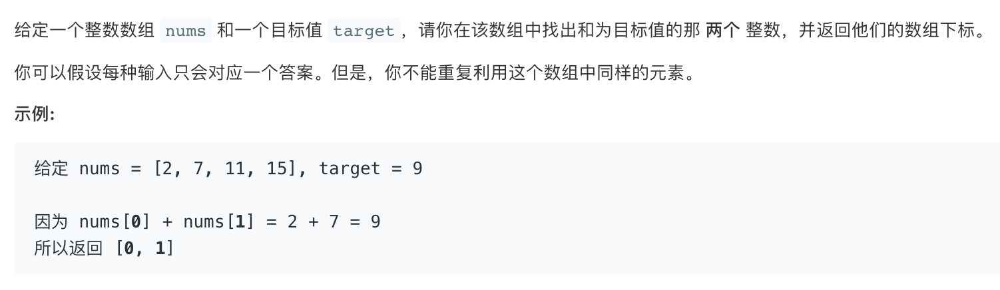

<!--more-->

## 题目



## 解法

```
func twoSum(_ nums: [Int], _ target: Int) -> [Int] {
       // num = [2, 7, 11, 15] target = 9
        var dict = [Int: Int]()
        for (i, v) in nums.enumerated() {
            // i = 0, v = 2
            if let lastIndex = dict[target - v] {
                return [lastIndex, i]
            }else {
                dict[v] = i
            }
        }
        fatalError("NO Output")
    }
```
