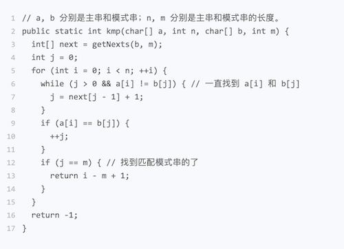
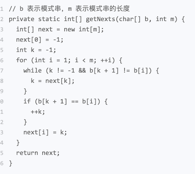

记录KMP算法的主要思想

<!--more-->

## 思想

模式串和主串匹配的过程，当遇到不匹配的字符的时候，我们希望找到一种规律，可以往后多滑动几位。

模式串和主串匹配的过程中，存在相等和不相等的可能。

不相等的处理：拿好前缀本身，在它的后缀子串中，查找最长的那个可以和好前缀的前缀子串匹配。

## 失效函数计算方法

next说明：

1. 下标：每个前缀结尾的下标
2. 值： 这个前缀的最长可以匹配的前缀子串的结尾下标

next[i-1] = k-1,则next[i] = k

查找b[0,i-1]的次长可匹配后缀子串，这个问题变成， 查找b[0,y]的最长匹配后缀子串的问题

