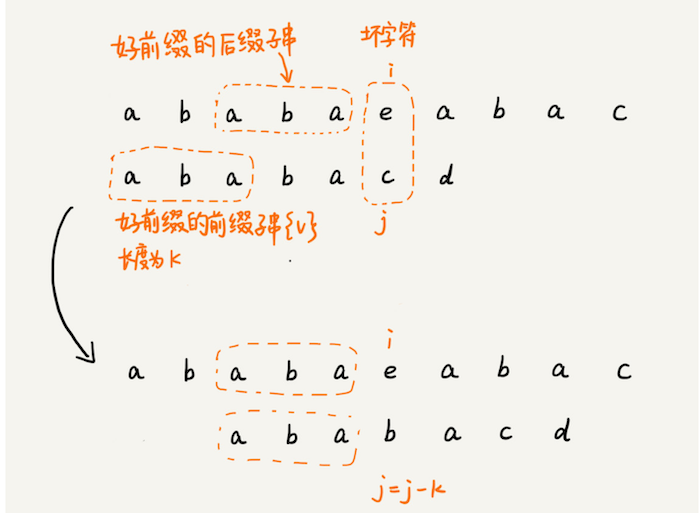
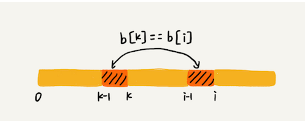
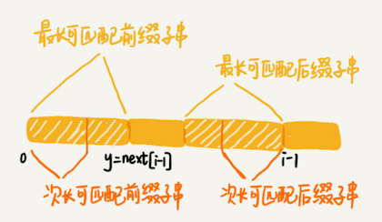

记录KMP算法的主要思想

<!--more-->

## 思想

模式串和主串匹配的过程，当遇到不匹配的字符的时候，我们希望找到一种规律，可以往后多滑动几位。

模式串和主串匹配的过程中，存在相等和不相等的可能。

不相等的处理：拿好前缀本身，在它的后缀子串中，查找最长的那个可以和好前缀的前缀子串匹配。




```
func kmp(a: String, n: Int, b: String, m:Int) -> Int {
    let next = getNexts(b: b, m: m)
    var j = 0
    for i in 0..<n {
        while j > 0 && a[a.index(a.startIndex, offsetBy: i)] != b[b.index(b.startIndex, offsetBy: j)] { //处理不等于的情况，i不动，j尽量移动多位
            j = next[j-1] + 1
        }
        
        //相等，继续往后比较
        if a[a.index(a.startIndex, offsetBy: i)] == b[b.index(b.startIndex, offsetBy: j)] {
            j += 1
        }
        
        //查找到了结果
        if j == m {
            return i - m + 1
        }
    }
    return -1;
}
```


## 失效函数计算方法

next说明：

1. 下标：每个前缀结尾的下标
2. 值： 这个前缀的最长可以匹配的前缀子串的结尾下标

next[i-1] = k-1,则next[i] = k



查找b[0,i-1]的次长可匹配后缀子串，这个问题变成， 查找b[0,y]的最长匹配后缀子串的问题



```
/*失效函数：  b 表示模式串，m表示模式串的长度*/
func getNexts(b: String, m: Int) -> [Int] {
    var next:[Int] = Array(repeating: -1, count: m)  //定义失效函数
    var k = -1
    for i in 0..<m {
        while k != -1 && b[b.index(b.startIndex, offsetBy: k+1)] != b[b.index(b.startIndex, offsetBy: i)] {
            k = next[k]
        }
        
        if b[b.index(b.startIndex, offsetBy: k+1)] == b[b.index(b.startIndex, offsetBy: i)] {
            k += 1
        }
        next[k] = k
    }
    return next
}
```


