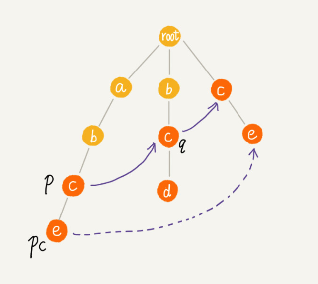

记录AC算法的主要思想

<!--more-->

## 失效指针计算

计算失效指针的过程，看起来复杂，其实，如果我们把树中深度相同的节点放到同一层，那么某个节点的失败指针只能出现在上一层。

说白了，当前点相同， 找后缀的最长前缀 



```
func buildFailurePoint() {
    var queue:[ACNode] = Array()
    root.fail = nil
    queue.append(root)
    while !queue.isEmpty {
        let p = queue.removeFirst()
        for i in 0..<26 {
            let pc = p.children[i]  //p的子节点
            if pc == nil { //如果当前节点没有值，当然没有必要求失败指针了
                continue
            }
            if p == root { //如果父节点，第二层，没必要循环了，直接设置为root
                pc!.fail = root
            } else {
                var q:ACNode? = p.fail
                while q != nil {
                    let qc = q?.children[pc!.data.toInt() - Character("a").toInt()]
                    if qc != nil { //处理相等的情况，最长后缀加长
                        pc?.fail = qc
                        break
                    }
                    q = q!.fail  //循环的根节点吧 ，退而求其，找个短的  
                }
                if q == nil {
                    pc?.fail = root
                }
            }
            queue.append(pc!)
        } //end for
    }//end while
}
```
其中ACNode定义如下：

```
class ACNode {
    var data: Character  //节点的key
    var children : [ACNode?]  // 指向子节点的数组，字符集只包含 a~z 这 26 个字符
    var isEndingChar = false //结尾字符为true
    var length = -1  //当isEndingChar= true时，记录模式串的长度
    var fail:ACNode? // 失败指针
    init(data:Character) {
        self.data = data
        self.children = Array(repeating: nil, count: childrenCount)
    }
    
    static func == (lhs: ACNode, rhs: ACNode) -> Bool {
        if lhs.data == rhs.data {
            return true
        }
        return false
    }
}
```

```
func insert(text: String) {
    var p = root
    for i in 0..<text.count {
        let index:Int = text[text.index(text.startIndex, offsetBy: i)].toInt() - Character("a").toInt()
        if p.children[index] == nil {
            let newNode = ACNode(data: text[text.index(text.startIndex, offsetBy: i)])
            p.children[index] = newNode
        }
        p = p.children[index]!
    }
    p.isEndingChar = true;
    p.length = text.count
}
```


```
func mach(text: String) {
    let n = text.count
    var p: ACNode? = root
    for i in 0..<n { //for里面p不可能为nil
        let index = text[text.index(text.startIndex, offsetBy: i)].toInt() - Character("a").toInt()
        while p?.children[index] == nil && p !== root {  //向树根节点移动，找最长后缀
            p = p?.fail!  // 失败指针发挥作用的地方
        }
        
        //下面逻辑处理匹配情况， p增加
        p = p?.children[index]
        if p == nil {
            p = root // 如果没有匹配的，从 root 开始重新匹配
        }
        
        var tmp = p!
        while tmp !== root {
            if tmp.isEndingChar == true {
                let pos = i - tmp.length + 1
                print("匹配的起始下标 \(pos) length=\(tmp.length)")
            }
            tmp = tmp.fail!;
        }
    }
}
```


