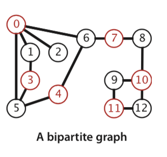
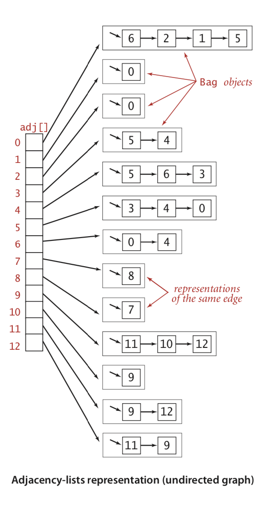
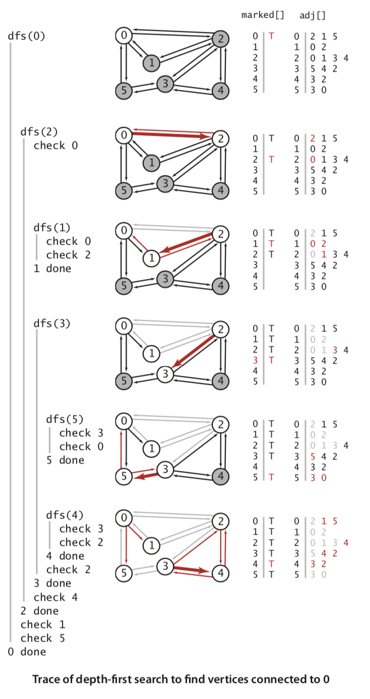

图： 由一组顶点和一组能够将两个顶点相连的边组成的

## 术语表

当两个顶点通过一条边相连时，我们称这两个顶点是**相邻的** 并称该连接依附于这两个顶点。某个顶点的**度数**即为依附于他的边的总数。

路径： 在图中，路径是由边顺序连接的一系列顶点。路径或环的长度为其中包含的边数

连通： 当两个顶点之间存在一条连接双方的路径时，我们称一个顶点和另一个顶点是连通的。

连通图： 如果顶点是物理存在的对象，如绳节，边是绳子， 任意顶点提起，连通图是一个整体。

树： 无环连通图

生成树： 连通图的生成树是它的一副子图，包含图中所有顶点，且是一颗树   

V个顶点图的树的条件：

1. G有V-1条边且不含有环
2. G有V-1条边，且是连通
3. G是连通的，但删除任何一条边，会使它不再连通
4. G是无环图，但添加任何一条边，都会产生一个环
5. G中任意一对顶点之间仅存在一条简单路径

密度： 连接顶点对占所有可能别连接的顶点对的比例。 （稀疏图、稠密图）

二分图： 每条边连接的两个顶点都分别属于不同部分,



## 表示无向图的数据类型

|接口|说明|
|---|---|
|V()->Int|顶点数|
|E()->Int|边数|
|addEdge(v: Int, w: Int)|向图中添加一个边v-w|
|adj(v: Int)|和v相邻的所有顶点|

图的表示方法：

1. 邻接矩阵 ：V*V的矩阵，当顶点V和W之间有相邻的边时，V行和W列的元素值未true
2. 邻接表数组

下图是邻接表内存图：




图的定义：

```
class Graph {
	var vertex: Int
	var adj: [[Int]]
	var edge: Int = 0
	    
	init(vertex: Int) {
	    self.vertex = vertex
	    adj = [[Int]](repeating: [Int](), count: vertex)
	}
	    
	convenience init?(inStream: ReadFile) {
	    let v = inStream.readInt()
	    if v != nil {
	        self.init(vertex: v!)
	    } else {
	        return nil
	    }
	    let edge = inStream.readInt()
	    if edge != nil {
	        for _ in 0..<edge! {
	            let v = inStream.readInt()
	            let w = inStream.readInt()
	            self.addEdge(v!, w!)
	        }
	    } else {
	        return nil
	    }
	}
	    
	func addEdge(_ v: Int, _ w: Int) {
	    self.adj[v].append(w)
	    self.adj[w].append(v)
	    self.edge += 1
	}
	    
	func V() -> Int {
	    return vertex
	}
	    
	func E() -> Int {
	    return edge
	}
	func toString() -> String {
	    var result: String  =
	    """
	    \(V) vertixes \(E) edges \n
	    """
	    for i in 0..<vertex {
	        result += "\(i) :"
	        for w in adj[i] {
	            result += "\(w) "
	        }
	        result +=
	        """
	        \n
	        """
	    }
	    return result
	}
}
```

## 深度优先搜索


图处理的一般策略：从一个顶点移动到另一个顶点




1. 因为顶点2是0的邻接表的第一个元素，且没有标记过，dfs()递归调用自己来标记并访问顶点2
2. 现在，顶点0是2的邻接表的第一个元素，且已经被标记了，因此，dfs跳过了他，接下来，顶点1是2的邻接表的第二个元素，且没有标记过，dfs递归调用自己，来标记并访问顶点1
3. 对顶点1的访问和前面有所不同：因为它的邻接表中的所有顶点（0，2）都已经被标记过了，因此，不需要再递归，方法从dfs（1）返回，下一条被检查的边是2-3，因此dfs递归调用自己，来标记并访问顶点3
4. 顶点5是3的邻接表的第一个元素且没有被标记，因此dfs递归调用自己来标记并访问顶点5
5. 顶点5邻接表中的所有顶点（3，0）都已经被标记过了，因此不需要再递归
6. 顶点4是3的邻接表的下一个元素，且没有被标记过，因此dfs递归调用自己，来标记并访问顶点4，这是最后一个需要被标记的顶点

深度优先能解决的问题： 单点路径，给定一个一副图和一个起点，回答“从s到给定目的顶点v是否存在一条路径？如果有，找出这条路径”等类似问题。


## 寻找路径 

在由v-w第一次访问任意w时，将edgeTo[w]设为v来记住这条路径  。所以edgeTo的理解如下：


1. 索引是当前节点，终止节点
2. 值是上一个节点 ，起始节点


[算法4 官网地址](https://algs4.cs.princeton.edu/code/javadoc/)

