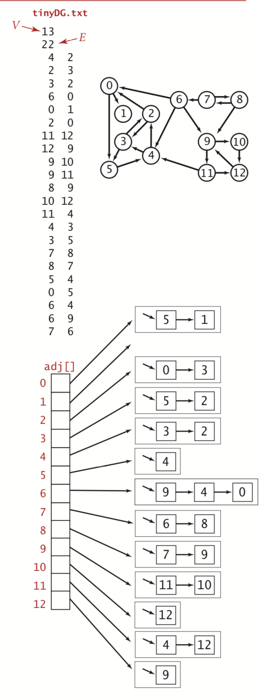
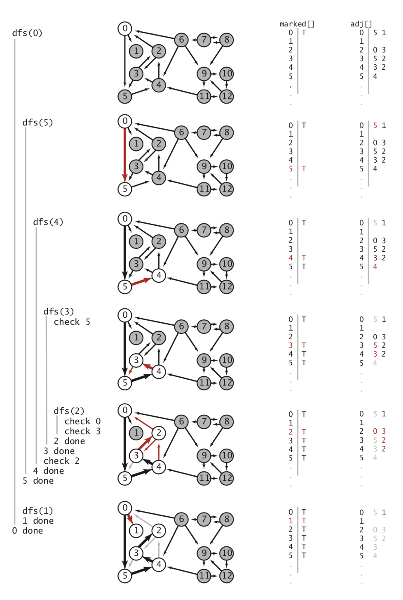
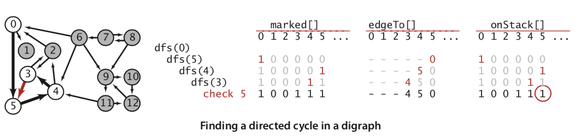
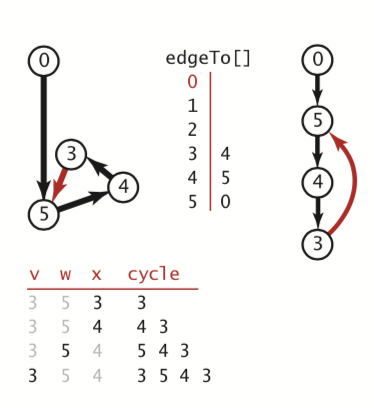
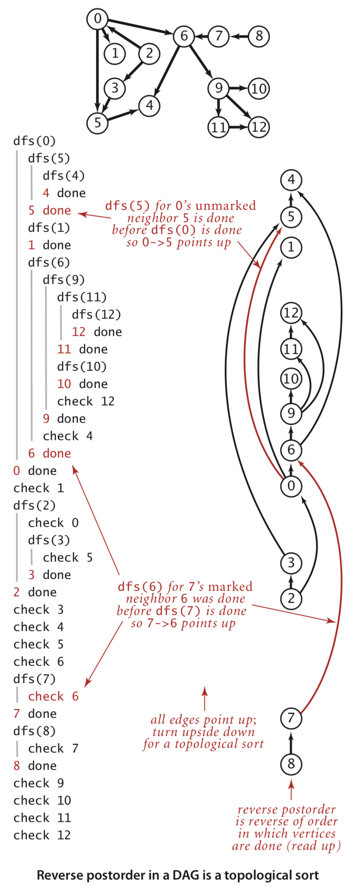
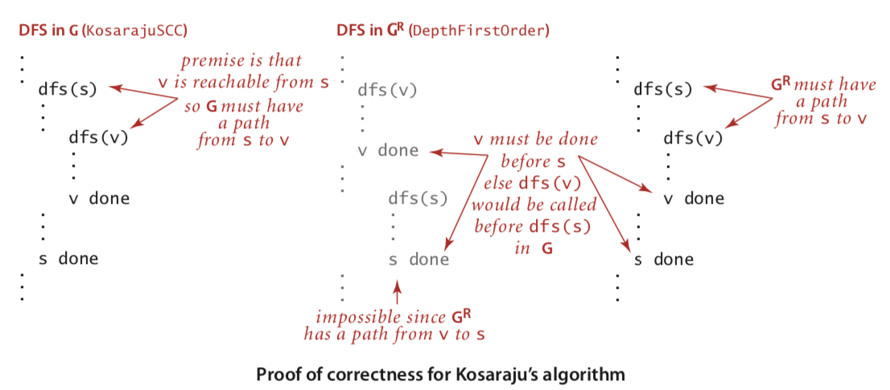
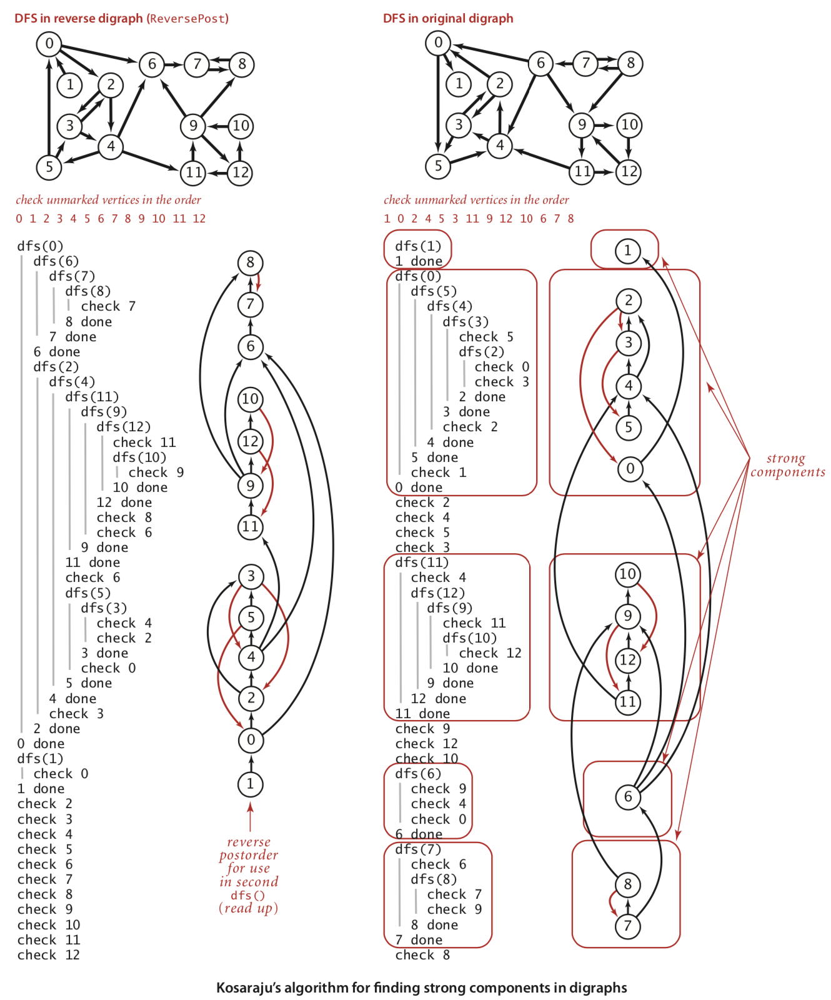

有向图学习记录

<!--more-->

## 术语

有向图： 一幅有方向性的图是由一组顶点和一组有方向的边组成，每条有方向的边都连接着有序的一对顶点。


出度： 顶点指出的边的总数

入度： 指向该顶点的边的总数

有向环： 一条至少含有一条边，且起点和终点相同的有向路径

可达性： 存在v到w的路径时，我们称顶点w能够由顶点v到达

## 有向图数据类型


有向图实现代码

```
class Digraph {
    let _vertex: Int //顶点个数
    var _edges: Int = 0  //边数
    var _adj:[[Int]] //邻接表二维数组
    init(v: Int) {
        self._vertex = v
        self._adj = [[Int]](repeating: [Int](), count: v)
    }

    func v() -> Int {  //返回顶点的个数
        return self._vertex
    }
    
    func e() -> Int {  //返回边的个数
        return self._edges
    }
    
    func addEdge(_ v: Int, _ w:Int )  {  //添加v->w的边
        self._adj[v].insert(w, at: 0)
        self._edges += 1
    }
    
    func adj(_ v: Int) -> [Int] {  //返回顶点v的邻接表
        return self._adj[v]
    }
    
    func reverse() -> Digraph {
        let r = Digraph(v: self.v())
        for v in 0..<self.v() {
            for w in self.adj(v)  {
                r.addEdge(v, w)
            }
        }
        return r
    }
    
    func toString() -> String {
        var result: String  =
        """
        \(self.v()) vertixes \(self.e()) edges \n
        """
        for i in 0..<self.v() {
            result += "\(i) :"
            for w in self.adj(i) {
                result += "\(w) "
            }
            result +=
            """
            \n
            """
        }
        return result
    }
}
```

对应的邻接表如下图所示：




## 有向图的可达性


代码：

```
class DirectedDFS {
    var _marked: [Bool]  // 标记节点是否调用过dfs， 索引是顶点
    
    init(graph: Digraph, s: Int) {
        self._marked = [Bool](repeating: false, count: graph.v())
        dfs(graph, s)
    }
    
    init(graph: Digraph, sources: [Int]) {
        self._marked = [Bool](repeating: false, count: graph.v())
        for s in sources {
            if !self._marked[s] {
                dfs(graph, s)
            }
        }
    }
    
    func dfs(_ graph: Digraph,_ v: Int)  {
        self._marked[v] = true
        for w in graph.adj(v) {
            if !self._marked[w] {
                dfs(graph, w)
            }
        }
    }
    
    func marked(_ v: Int) -> Bool {
        return self._marked[v]
    }
}
```



## 环和有向无环图

一幅有向图有环吗？ 深度优先搜索也能解决这个问题

由系统维护的递归调用的栈表示的真是“当前” 正在遍历的有向路径，一旦我们找到了一条边，v->w且w已经存在于栈中，就找到了一个环，因为栈比欧式的是一条w->v 的有向路径，而v->w正好补全了这个环。






下面是检测是否有环的检测代码：

```
class DirectedCycle {
    var _marked: [Bool]
    var _edgeTo: [Int]
    var _cycle: Stack<Int>?
    var _onStack: [Bool]
    init(graph: Digraph) {
        let vertexCount = graph.v()
        self._marked = [Bool](repeating: false, count: vertexCount)
        self._edgeTo = [Int](repeating: 0, count: vertexCount)
        self._onStack = [Bool](repeating: false, count: vertexCount)
        
        for v in 0..<vertexCount {
            if !self._marked[v] {
                dfs(graph, v)
            }
        }
    }
    
    func dfs(_ graph: Digraph, _ v: Int)  {
        self._onStack[v] = true
        self._marked[v] = true
        for w in graph.adj(v) {
            if !self._marked[w] {  //如果没有标记，递归标记（这里不需要判断换，没有标记过，肯定不在调用栈上）
                self._edgeTo[w] = v
                dfs(graph, w)
            } else { //标记过了，可以判断这个顶点是否在栈上
                if self._onStack[w] { //有环
                    self._cycle = Stack<Int>()
                    var x = v
                    repeat {
                        self._cycle?.push(x)
                        x = self._edgeTo[x]
                    } while x != w
                    
                    self._cycle?.push(w)
                    self._cycle?.push(v)
                }
            }
        }
        self._onStack[v] = false
    }
    
    func hasCycle() -> Bool {
        return self._cycle != nil
    }
    
    func cycle() -> [Int] {
        if self.hasCycle() {
            return self._cycle!.iterater()
        } else {
            return [Int]()
        }
    }
}
```

输出深度优先搜索的遍历顺序

```
class DepthFirstOrder {
    var _marked:[Bool]
    var _pre: Queue<Int>
    var _post: Queue<Int>
    var _reversePost: Stack<Int>
    
    init(graph: Digraph) {
        _pre = Queue<Int>()
        _post = Queue<Int>()
        _reversePost = Stack<Int>()
        let vertexCount = graph.v()
        _marked = [Bool](repeating: false, count: vertexCount)
        for v in 0..<vertexCount {
            if !self._marked[v] {
                dfs(graph, v)
            }
        }
    }
    
    func dfs(_ graph: Digraph,_ v: Int)  {
        self._pre.enqueue(v)
        self._marked[v] = true
        for w in graph.adj(v) {
            if !self._marked[w] {
                dfs(graph, w)
            }
        }
        self._post.enqueue(v)
        self._reversePost.push(v)
    }
    
    func pre() -> [Int] {
        return self._pre.iterater()
    }
    
    func post() -> [Int] {
        return self._post.iterater()
    }
    
    func reversePost() -> [Int] {
        return self._reversePost.iterater()
    }
}
```

拓扑顺序

```
class Topological {
    var _order: [Int]?
    init(graph: Digraph) {
        let cycle = DirectedCycle(graph: graph)
        if !cycle.hasCycle() {
            let dfs = DepthFirstOrder(graph: graph)
            self._order = dfs.reversePost()
        }
    }
    
    func order() -> [Int]? {
        return self._order
    }
    
    func isDAG() -> Bool {
        return self._order != nil
    }
}
```
<font color = blue>
命题F： 一幅有向无环图的拓扑排序即为所有顶点的逆后序排序

证明： 对于任意边 v->w，在调用dfs(v)时，下面三种情况必有一种成立

1. dfs(w) 已经被调用过，且已经返回了(w已经标记了)
2. dfs(w) 还没有被调用(w还未被标记)，因此v->w会直接或间接调用并返回dfs(w) ，且dfs(w) 会在dfs(v) 返回之前返回
3. dfs(w) 已经被调用，但还没有返回，证明的关键在于此，在有向无环图中，这种情况是不可能出现的，这是由于递归调用链意味着存在w到v的路径，但存在v->w的表示存在一个环
</font>
在两种可能的情况中，dfs(w) 都会在dfs(v) 之前完成，因此在后续排列中w排列在v之前，而在逆后序中，w排在v之后，因此任意一条边v->w都如我们所愿从排名较前的顶点指向排名较后的顶点。

命题G： 使用深度优先搜索，对有向无环图进行拓扑排序，所需的时间和V+E成正比




## 有向图中的强连通性

强连通性： 如果两个顶点v和w是相互可达的，则，他们是强连通的。

强连通分量的定义是基于顶点的，是由于： 有些边的两个顶点都在同一个连通分量中，而有限边连接的顶点在不同的强连通分量中。

kosarajuCC算法：

1. 在给定一幅有向图G中，使用DepthFirstOrder来计算它的反向图$$G^R$$的逆后序排列
2. 在G中进行标准的深度优先搜索，但是，要按照刚才计算得到的顺序来访问所有未标记的顶点
3. 在构造函数中，所有在同一个递归dfs() 调用中被访问到的顶点都在同一个连通分量中，将他们按照和CC相同的方式识别出来



实现代码：

```
class KosarajuCC {
    var _marked: [Bool]  //已达顶点
    var _id: [Int]  //分量标识，索引顶点，值是连通分量标识
    var _count = 0  //分量个数
    init(graph: Digraph) {
        let vertexCount = graph.v()
        self._marked = [Bool](repeating: false, count: vertexCount)
        self._id = [Int](repeating: 0, count: vertexCount)
        
        let order = DepthFirstOrder(graph: graph.reverse())
        for s in order.reversePost() {
            if !_marked[s] {
                dfs(graph, s)
                self._count += 1
            }
        }
    }
    
    func dfs(_ G: Digraph, _ v: Int)  {
        self._marked[v] = true
        self._id[v] = self._count
        for w in G.adj(v) {
            if !self._marked[w] {
                dfs(G, w)
            }
        }
    }
    
    func stronglyConnected(_ v: Int, _ w: Int) -> Bool { //判断两个顶点是否连通
        return self._id[v] == self._id[w]
    }
    
    func id(_ v: Int) -> Int { //返回顶点属于的连通分量
        return self._id[v]
    }
    
    func count() -> Int { //返回连通分量的个数
        return self._count
    }
}
```



## 参考

1. [算法4 官网地址](https://algs4.cs.princeton.edu/code/javadoc/)