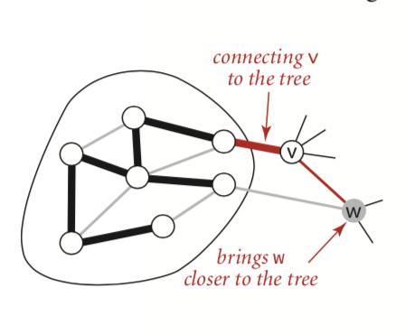

图的生成树是它的一棵含有所有顶点的无环连通子图，一幅加权无向图的最小生成树(MST)是它的一棵权值(树中所有边的权值之后)最小的生成树

最小生成树的解决方法有： prim算法、kruskal算法


<!--more-->

## 原理

树的性质：

1. 用一条边连接树中的任意两个顶点都会产生一个新的环
2. 从树中删去一条边会得到两棵独立的树

切分定理： 图的一种切分是将图的所有顶点分为两个非空且不重复的两个集合，横切边是一条连接两个属于不同集合的顶点的边

命题j： 在一幅加权图中，给定任意的切分，它的横切边中权重最小者必然属于图的最小生成树

证明： 令e为权重最小的横切边，T为图的最小生成树，我们采用反证法：假设T不包含e，那么如果将e假如T，得到的图必要包含一条经过e的环，且这个环至少包含另一条横切边，设为f ，f的权重必然大于e，那么我们删除调f，而保留e就可以得到一颗权重更小的生成树。和我们的假设矛盾。


命题K(最小生成树的贪心算法) 下面这种方法会将含有V个顶点的任意加权连通图中属于最小生成树的边标记为黑色：初始状态下，所有边均为灰色，找到一种切分，它产生的横切边均不为黑色，将它的权重最小的横切边标记为黑色，反复，知道标记了V-1条黑色的边为止。


## 加权无向图的数据类型

边的代码实现如下：

```
enum EdgeError: Error {
    case invalidEdge(egdg: Int)
}
class Edge :Comparable {
    let _v: Int
    let _w: Int
    let _weight: Double
    
    init(v: Int, w: Int, weight: Double) {
        self._v = v
        self._w = w
        self._weight = weight
    }
    
    func weight() -> Double {  //返回权重
        return self._weight
    }
    
    func either() -> Int { //返回任意一个顶点
        return self._v
    }
    
    func other(_ v: Int) throws -> Int { //返回另一个顶点
        if self._v == v {
            return self._w
        } else if (self._w == v) {
            return self._v
        } else {
            print("取顶点错误")
            throw EdgeError.invalidEdge(egdg: v)
        }
    }
    
    static func < (lhs: Edge, rhs: Edge) -> Bool {
        if lhs._weight < rhs._weight {
            return true
        }
        return false
    }
    
    static func == (lhs: Edge, rhs: Edge) -> Bool {
        if  lhs._weight == rhs._weight {
            return true
        }
        return false
    }
    
    func toString() -> String {
        return String.init(format: "%d,%d,%.2f", self._v, self._w, self._weight)
    }
}
```

加权图的实现如下：

```
class EdgeWeightedGraph {
    var _vertex: Int  //顶点的个数
    var _edges: Int //边的个数
    var _adj: [[Edge]] //邻接表
    init(vertex: Int) {
        self._vertex = vertex
        self._edges = 0
        self._adj = [[Edge]](repeating: [Edge](), count: vertex)
    }
    
    convenience init?(inStream: ReadFile) {
        let v = inStream.readInt()
        if v != nil {
            self.init(vertex: v!)
        } else {
            return nil
        }
        let edge = inStream.readInt()
        if edge != nil {
            for _ in 0..<edge! {
                let v = inStream.readInt()
                let w = inStream.readInt()
                let weight = inStream.readDouble()
                if v != nil && w != nil && weight != nil {
                    let edge = Edge(v: v!, w: w!, weight: weight!)
                    self.addEdge(edge)
                } else {
                    return nil
                }
            }
        } else {
            return nil
        }
    }
    
    func v() -> Int { //返回顶点数
        return self._vertex
    }
    
    func e() -> Int {  //返回边数
        return self._edges
    }
    func addEdge(_ edge: Edge) {
        let v = edge.either()
        let w = try! edge.other(v)
        self._adj[v].insert(edge, at: 0)
        self._adj[w].insert(edge, at: 0)
        self._edges += 1
    }
    
    func adj(_ v: Int) -> [Edge] {
        return self._adj[v]
    }
    
    func edges() -> [Edge] { //枚举所有的边
        var result = [Edge]()
        for v in 0..<self._vertex {
            for e in self.adj(v) {
                if try! e.other(v) > v {
                    result.insert(e, at: 0)
                }
            }
        }
        return result
    }
    
    func toString() -> String {
        var result: String  =
        """
        \(self.v()) vertixes \(self.e()) edges \n
        """
        for i in 0..<self.v() {
            result += "\(i) :"
            for w in self.adj(i) {
                result += "\(w.toString())   "
            }
            result +=
            """
            \n
            """
        }
        return result
    }
    
    static func test() {
        let path = TinyEWG
        let file = ReadFile(fileName: path)
        guard  file != nil else {
            print("建立文件失败！！！")
            return
        }
        
        let edgeGraph = EdgeWeightedGraph(inStream: file!)
        guard edgeGraph != nil else {
            print("建立图失败")
            return
        }
        
        let result = edgeGraph!.toString()
        print(result)
    }
}
```
## 最小生成树的API 和测试用例

最小生成树的表示方法：

1. 一组边的列表
2. 一幅加权无向图
3. 一个以顶点为索引且包含父节点链接的数组

## Prim 算法

思路： 一开始，这棵树只有一个顶点，然后会向它添加V-1条边，每次总是将下一条连接树中顶点与不在树中的顶点，且权重最小的边假如树中（即由树中顶点所定义的切分中的一条横切边）。

每当我们向树中添加一条边之后，也向树中添加一个顶点。 就要将连接这个顶点和其他所有不在树中的顶点加入到优先队列中，用marked[]来标识， 但是还有一点，连接新加入树中的顶点，与其他已经在树中的顶点的所有边都失效了。


源码如下：

```
class LazyPrimMST {
    var _marked: [Bool]  //标记是否加入最小生成树中
    var _mst: Queue<Edge>
    var _pq: MinPQ<Edge>
    
    init(graph: EdgeWeightedGraph) {
        let vertexCount = graph.v()
        self._marked = [Bool](repeating: false, count: vertexCount)
        self._mst = Queue<Edge>()
        self._pq = MinPQ<Edge>(priorityFunction: {  //优先队列，小的优先级高
            return $0 < $1
        })
        
        //第二阶段了 ，自定义操作
        visit(graph, 0) //将顶点0的邻接表添加到优先队列中
        
        while !self._pq.isEmpty {
            let e = self._pq.dequeue()!  //从优先队列中取出一条边
            let v = e.either()
            let w = try! e.other(v)
            if self._marked[v] && self._marked[w] { //如果两个顶点都在树上，那么边是失效的
                continue
            }
            
            self._mst.enqueue(e)
            if !self._marked[v] {
                self.visit(graph, v)
            }
            
            if !self._marked[w] {
                self.visit(graph, w)
            }
        }
    }
    
    func visit(_ graph: EdgeWeightedGraph, _ v: Int) {
        self._marked[v] = true
        for edge in graph.adj(v) {
            if !self._marked[try! edge.other(v)] {
                _pq.equeue(edge)
            }
        }
    }
    
    func edges() -> [Edge] {  //返回最小生成树的边的列表
        return self._mst.iterater()
    }
}
```


## Prim算法的即时实现

思路： 我们感兴趣的只有连接树顶点和非树顶点中权重最小的边，当我们将点点v添加到树中时，对于每个非树顶点w产生的变化只可能使得w到最小生成树的距离更近了，简而言之，我们不需要在优先队列中保存所有从w到树顶点的边-----而只需要保存其中权重最小的边，在将v添加到树中后，检测是否需要更新这条权重最小的边，因为，v-w可能权重更小，我们只需要遍历v的邻接表就可以完成这个任务。

核心： 我们只会在优先队列中保存每个非树顶点w的一条边，将它与树中的顶点连接起来权重最小的那条边。

上面思路理解可以参考下图：



edgeTo[] 和distTo[] 的理解：

1. 如果顶点v不在树中，但至少还有一条边和树相连，那么edgeTo[v] 是将v和树相连的最短边，distTo[v]  是这条边的权重
2. 所有这类顶点v都保存在一条优先队列中。
3. 每次从优先队列中出最小的边，更新其他还在优先队列中的边
4. 已经出优先队列的，就是最小生成树的边。


图中颜色的说明：

1. 黑色： 最小生成树中的顶点
2. 灰色： 非最小生成树中的顶点
3. 黑色： 最小生成树的边
4. 红色： 优先队列中的索引对
5. 红色： 非最小生成树顶点连接到最小生成树的最短边


实现代码如下：

```
extension Double: RequireInit {}
//Prim算法的即时版本
class PrimMST {
    var edgeTo: [Edge] //保存最小生成树的顶点列表，索引顶点，值到该顶点的边
    var distTo: [Double] //保存边的距离
    var marked: [Bool]  //if true on tree
    var pq: IndexMinPQ<Double>
    
    init(graph: EdgeWeightedGraph) {
        let vertexCount = graph.v()
        edgeTo = [Edge](repeating: Edge(), count: vertexCount)
        distTo = [Double](repeating: Double(Int.max), count: vertexCount)
        marked = [Bool](repeating: false, count: vertexCount)
        pq = IndexMinPQ<Double>(maxN: vertexCount)!
        distTo[0] = 0.0
        try! pq.insert(index: 0, forKey: 0.0)
        while !pq.isEmpty() {
            visit(graph: graph, v: try! pq.delMin())
        }
    }
    
    func visit(graph: EdgeWeightedGraph, v:Int)  {
        marked[v] = true
        for edge in graph.adj(v) {
            let w = try! edge.other(v)
            if marked[w] { continue } //跳过失效的边
            if edge.weight() < distTo[w] {
                edgeTo[w] = edge // Edge e is new best connection from tree to w.
                distTo[w] = edge.weight()
                
                if pq.contains(w) {
                    try! pq.changeKey(index: w, forKey: distTo[w])
                } else {
                    try! pq.insert(index: w, forKey: distTo[w])
                }
            }
        }
    }
    
    func edges() -> [Edge] {
        return edgeTo
    }
}
```

## Kruskal


思路： 按照边的权重顺序(从小到大)处理他们，将加入最小生成树中，加入的边不会和已经加入的边构成环，直到树中有V-1条边为止。


正确性证明（Kruskal能够计算任意加权无向图的最小生成树）：如果下一条被加入最小生成树的边不会和已有的黑色边构成换，那么它就跨越了由所有和树顶点相邻的顶点组成的集合  以及他们的补集构成的一个切分


## 参考


1. [算法4 官网地址](https://algs4.cs.princeton.edu/code/javadoc/)

