记录最短路径相关的主要内容

<!--more-->

最短路径： 在一幅加权有向图中，从顶点s到顶点t的最短路径是所有从s到t的路径中权重最小者

最短路径树： 包含了顶点s到所有可达的顶点的最短路径


## 加权有向图的数据结构


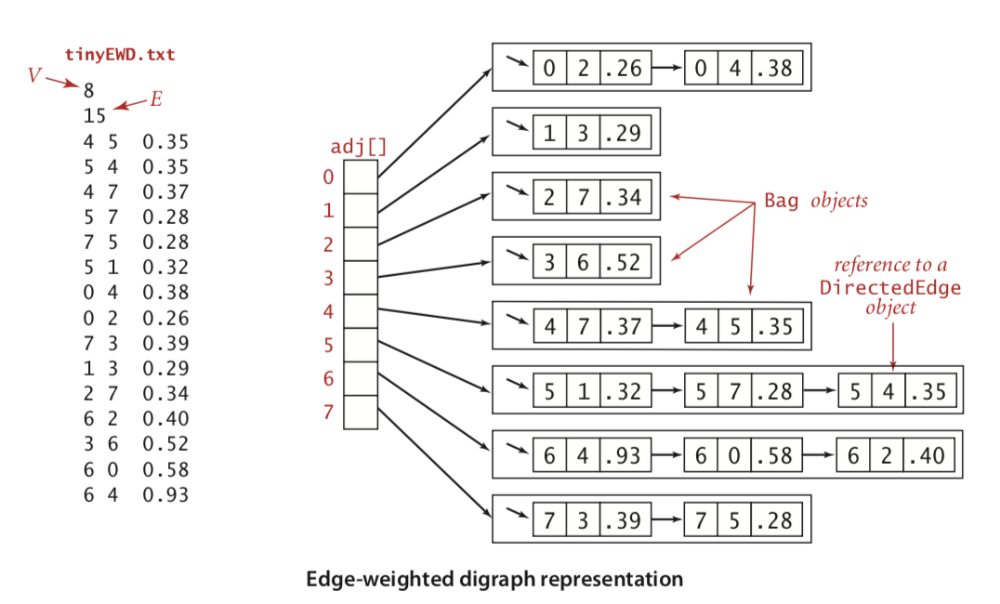

下面是实现的代码：

```
class EdgeWeightedDigraph {
    var _vertex: Int  //顶点的个数
    var _edges: Int //边的个数
    var _adj: [[DirectedEdge]] //邻接表
    init(vertex: Int) {
        self._vertex = vertex
        self._edges = 0
        self._adj = [[DirectedEdge]](repeating: [DirectedEdge](), count: vertex)
    }
    
    convenience init?(inStream: ReadFile) {
        let v = inStream.readInt()
        if v != nil {
            self.init(vertex: v!)
        } else {
            return nil
        }
        let edge = inStream.readInt()  //读取边数
        guard edge != nil else {
            return nil
        }
        for _ in 0..<edge! {
            let v = inStream.readInt()
            let w = inStream.readInt()
            let weight = inStream.readDouble()
            if v != nil && w != nil && weight != nil {
                let edge = DirectedEdge(v: v!, w: w!, weight: weight!)
                self.addEdge(edge)
            } else {
                return nil
            }
        }
    }
    
    func v() -> Int { //返回顶点数
        return self._vertex
    }
    
    func e() -> Int {  //返回边数
        return self._edges
    }
    func addEdge(_ edge: DirectedEdge) {
        self._adj[edge.form()].insert(edge, at: 0)
        self._edges += 1
    }
    
    func adj(_ v: Int) -> [DirectedEdge] {
        return self._adj[v]
    }
    
    func edges() -> [DirectedEdge] { //枚举所有的边
        var result = [DirectedEdge]()
        for v in 0..<self._vertex {
            for e in self.adj(v) {
                result.insert(e, at: 0)
            }
        }
        return result
    }
}
```

### 最短路径的数据结构

1. 最短路径树中的边，由定点索引的DerectedEdge对象的数组edgeTpo[],其中edge[v]的值未树中连接v和它的父节点的边，也是从s到v的最短路径上的最后一条边
2. 到达起点的距离： 由定点索引的数据distTo[]，其中distTo[v]为从s到v的已知最短路径的长度

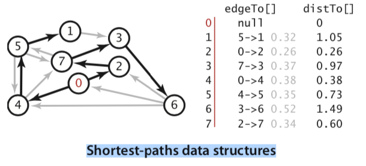

### 边的松弛

放松边v->w意味着检测从s到w的最短路径是否先从s到v，然后再由v到w，如果是，则根据这个情况，更新数据结构的内容

放松一条边，意味着将橡皮筋移到一条更短的路径上，从而缓解了橡皮筋的压力

如果relax改变了边e相关的顶点distTo[e.to()]的值，称为e的放松是成功的。

下图是松弛的示意图

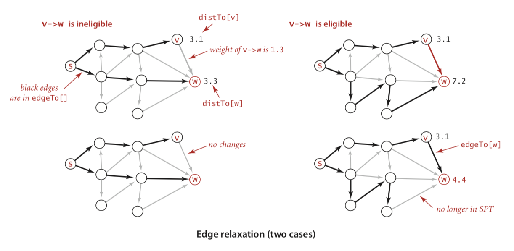

下面是边的松弛代码

```
func relax(_ edge: DirectedEdge)  {  //边的松弛
    let v = edge.form()
    let w = edge.to()
    if distTo[w] > distTo[v] + edge.weight() {
        distTo[w] = distTo[v] + edge.weight()
        edgeTo[w] = edge
    }
}
```

### 顶点松弛

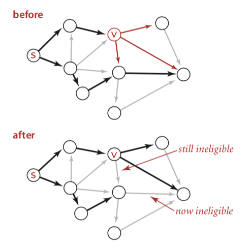

顶点松弛代码：

```
func relax(_ graph: EdgeWeightedDigraph, v: Int)  {
    for edge in graph.adj(v) {
        let w = edge.to()
        if distTo[w] > distTo[v] + edge.weight() {
            distTo[w] = distTo[v] + edge.weight()
            edgeTo[w] = edge
        }
    }
}
```

## 最短路径算法的理论基础

### 最优性条件

命题P：令G为一幅加权有向图，顶点s是G的起点，distTo[] 是一个由顶点索引的数组，保存的是G中路径的长度，对于从s可达的所有顶点v，distTo[v]的值是从s到v的某条路径的长度，对于从s不可达的顶点v，该值是无穷大。 当且仅当对于从v到w的任意一条边e，这些值满足distTo[w] <= distTo[v] + e.weight()

命题J： distTo[s] 的初始值为0. 其他distTo[] 元素初始化为无穷大，继续如下操作：

放松G中的任意边，知道不存在有效的边为止，这里有效的含义是没有被放松过。

## Dijkstra 算法

思路： 首先将distTo[s] 初始化为0. distTo[] 中的其他元素初始化为无穷大，然后将distTo最小的非树顶点放松，并加入树中。

命题R： Dijkstra算法能够解决边权重非负的加权有向图的单起点最短路径问题。

Prim算法每次添加的都是离树最近的顶点，Dijkstra算法每次添加的都是离起点最近的顶点。

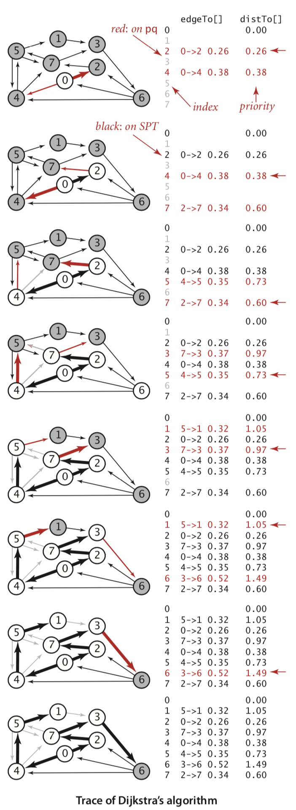

实现代码：

```
class DijkstraSP {
    var edgeTo: [DirectedEdge] //保存路径树，只是和索引顶点连接的父节点对象
    var distTo: [Double] //所以是顶点， 顶点到起点的距离
    var pq: IndexMinPQ<Double>
    let s: Int
    
    init(graph: EdgeWeightedDigraph, s: Int) {
        let vertexCount = graph.v()
        self.edgeTo = [DirectedEdge](repeating: DirectedEdge(), count: vertexCount)
        self.distTo = [Double](repeating: Double(Int.max), count: vertexCount)
        pq = IndexMinPQ<Double>(maxN: vertexCount)!
        self.s = s
        //第二阶段构造
        distTo[s] = 0.0
        try! pq.insert(index: s, forKey: 0.0)
        while !pq.isEmpty() {
            relax(graph,try! pq.delMin())
        }
    }
    
    func relax(_ edge: DirectedEdge)  {  //边的松弛
        let v = edge.form()
        let w = edge.to()
        if distTo[w] > distTo[v] + edge.weight() {
            distTo[w] = distTo[v] + edge.weight()
            edgeTo[w] = edge
        }
    }
    
    func relax(_ graph: EdgeWeightedDigraph, _ v: Int)  { //顶点的松弛
        for edge in graph.adj(v) {
            let w = edge.to()
            if distTo[w] > distTo[v] + edge.weight() {
                distTo[w] = distTo[v] + edge.weight()
                edgeTo[w] = edge
                if pq.contains(w) {
                    try! pq.changeKey(index: w, forKey: distTo[w])
                } else {
                    try! pq.insert(index: w, forKey: distTo[w])
                }
            }
        }
    }
    
    func distTo(_ v: Int) -> Double {
        return distTo[v]
    }
    
    func hasPathTo(_ v: Int) -> Bool {
        return distTo[v] < Double(Int.max)
    }
    
    func pathTo(_ v: Int) -> [DirectedEdge]? {
        if !hasPathTo(v) {
            return nil
        }
        let path = Stack<DirectedEdge>()
        var x = edgeTo[v]
        repeat {
            path.push(x)
            x =  edgeTo[x.form()]
        } while x.form() != self.s
        path.push(x)  //添加第一条路径
        return path.iterater()
    }
}
```

## 无环加权图中最短路径算法


无环图处理更快，按照拓扑顺序遍历 ，不需要自己维护优先队列了

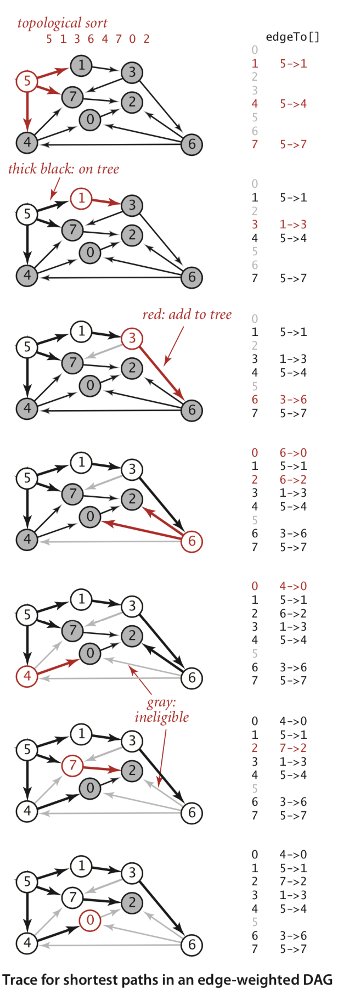

1. 用深度优先搜索得到图的顶点的拓扑顺序5  1  3  6  4  7  0  2
2. 将顶点5 和从他指出的所有边添加到树中
3. 将顶点1 和边1->3 添加到树中
4. 将顶点3和边3->6添加到树中，边3->7失效
5. 将顶点6和6->2 6-0添加到树中，边6->4失效
6. 将顶点4和4->0添加到树中，边4->7和6->0 已经失效
7. 将顶点7和边7->2添加到树中， 边6->2失效
8. 将顶底0 添加到树中，边0->2失效
9. 将顶点2添加到树中


命题S： 按照拓扑顺序放松顶点，就能在E+V成正比的时间内解决无环加权有向图的单点最短路径问题。


### 最长路径

命题T： 解决无环加权有向图中最长路径问题所需的事件与V+E成正比。

证明： 给定一个最长路径问题，复制原始无环加权有向图得到一个副本，并将副本中的所有权重变为负值，这样，副本中的最短路径即为原图中的最长路径，要将最短路径问题的答案转化为最长路径问题的答案，只需要将方案中权重变为正值即可。 根据命题S可得到算法的时间复杂度为E+V

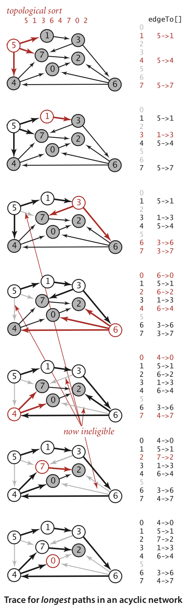


最长路径的应用： 优先级限制下的并行任务调度。 也叫关键路径法

### 优先级限制下的并行任务调度

任务如下：

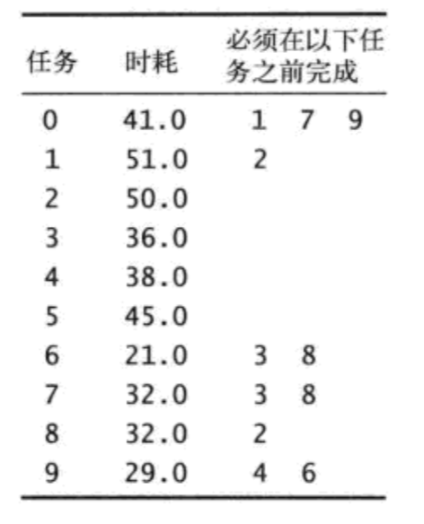

解决并行任务调度问题的关键路径方法的步骤如下： 创建一幅无环加权有向图，其中包括一个起点s和一个重点t，且每个任务都对应着两个顶点，一个起始顶点和一个结束顶点。对于每个任务都有一条从他的起始顶点指向结束顶点的边，边的权重为任务所需的时间。对于每个优先级限制v->w，添加一条从v的结束顶点指向w的起始顶点的权重为0的边。我们还需要为每个任务添加一条从起点指向该任务的起始顶点的权重为0的边，以及一条从该任务的结束顶点到终点的权重为0的边。这样一个任务预计的开始时间即为从起点到它的起始顶点的最长距离。

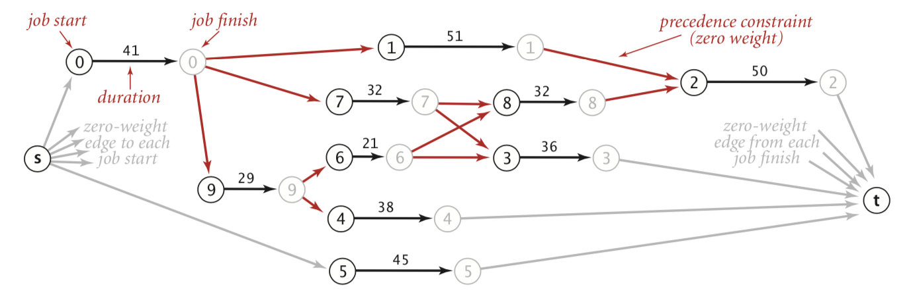

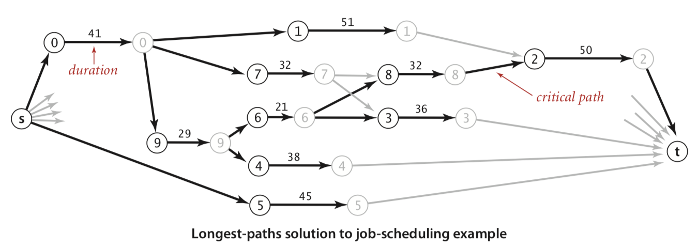

下面讲了一个最后期限下的并行任务调度，引出了负权重可能在实际中的用处，进入下一节

## 一般加权有向图中的最短路径问题


### 负权重环

加权有向图中的负权重环是一个总权重为负的有向环

负权重环存在的情况下，可以构建任意小的路径，所以研究最短路径没啥意义

命题X（Bellman-ford算法）：在任意含有V个顶点的加权有向图中给定起点s ，从s无法到达任何负权重环，以下算法能够解决其中的单点点最短路径问题： 将diatTo[s]初始化为0，其他distTo[]元素初始化为无穷大，以任意顺序放松有向图中的所有边，重复V轮。证明使用归纳法


Dellman-ford： 只有上一轮中的distTo[]值发送变化的顶点指出的边才能改变其他distTo[]元素的值，为了记住这样的顶点，使用FIFO优先队列。


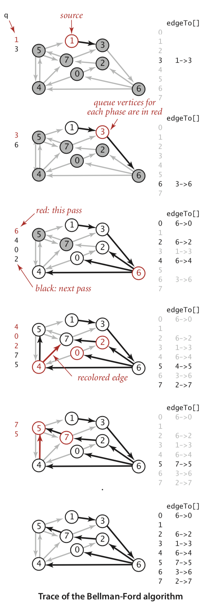


说明：

1. 放松边1-3  将顶点3加入队列中
2. 放松边3-6 将顶点6加入队列中
3. 放松边6-4 6-0 6-2，将顶点4 0 2 加入队列中
4. 放松边4-7 4-5 将顶点7 4 加入队列中，放松已经失效的边0-4 0 -2 软后再放松2-7 并重新为4 -7着色
5. 放松7 -5 并重新为4-5着色，办不将顶点5加入队列中，他已经在队列中了，放松已经失效的边7-3 然后放松已经失效的边5-1 5-4 5-7 此时队列为空


## 参考：


[算法4 官网地址](https://algs4.cs.princeton.edu/code/javadoc/)
