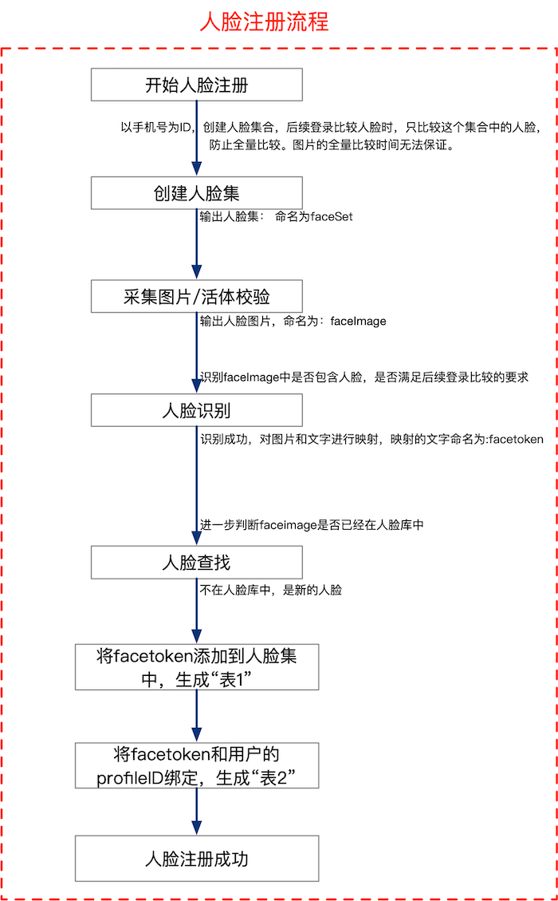
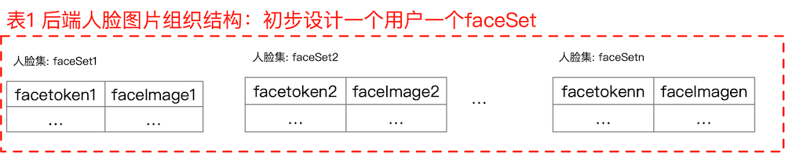
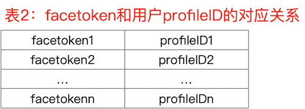
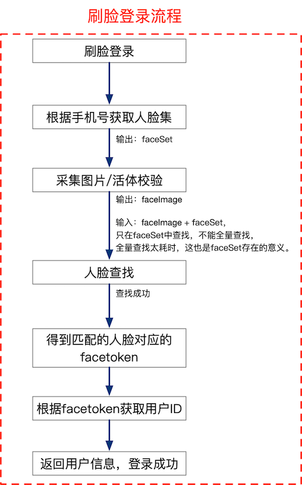

本文调研人脸登录的实现思路。

<!--more-->

##  概述

人脸登录包括两个流程：人脸注册、人脸查找。

## 人脸注册

## 刷脸登录（查找人脸的过程）

## 思考

1. 非常像的双胞胎能识别出来吗？

## 参考资料

 - [微信小程序使用face++实现人脸识别登录注册](https://blog.csdn.net/zzqaaasss/article/details/89194437)
 - [face++文档中心](https://console.faceplusplus.com.cn/documents/4888373)
 - [使用 face++ API 实现人脸识别，刷脸登陆和活体检测（张张嘴，眨眨眼）](https://blog.csdn.net/qq_23412263/article/details/86232682)

